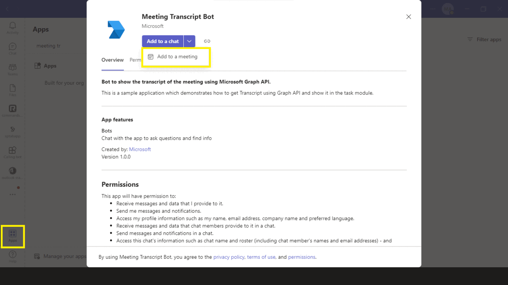
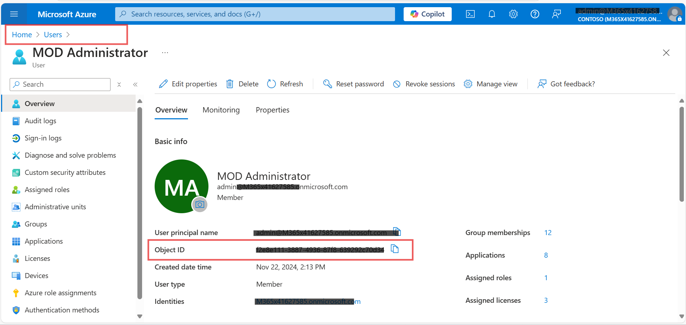
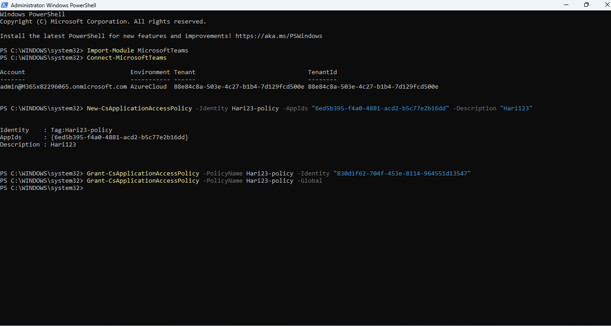
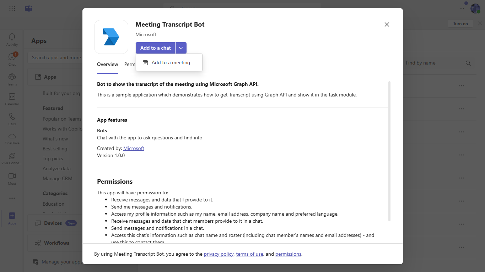
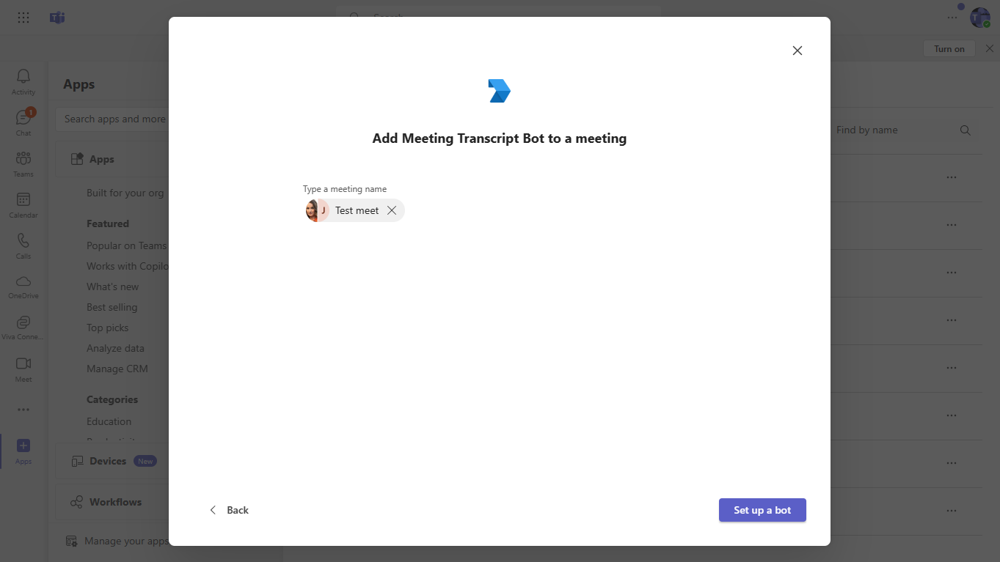
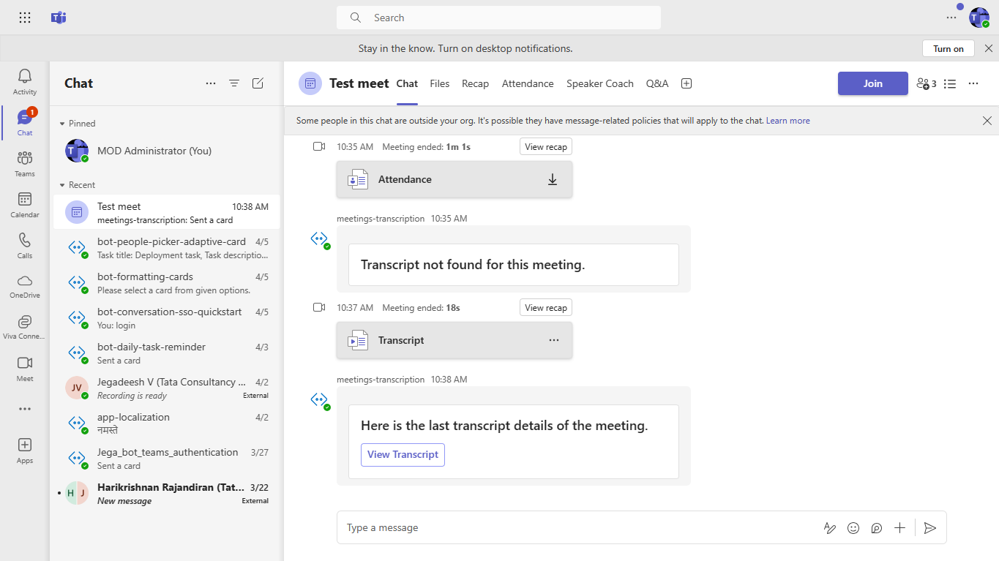
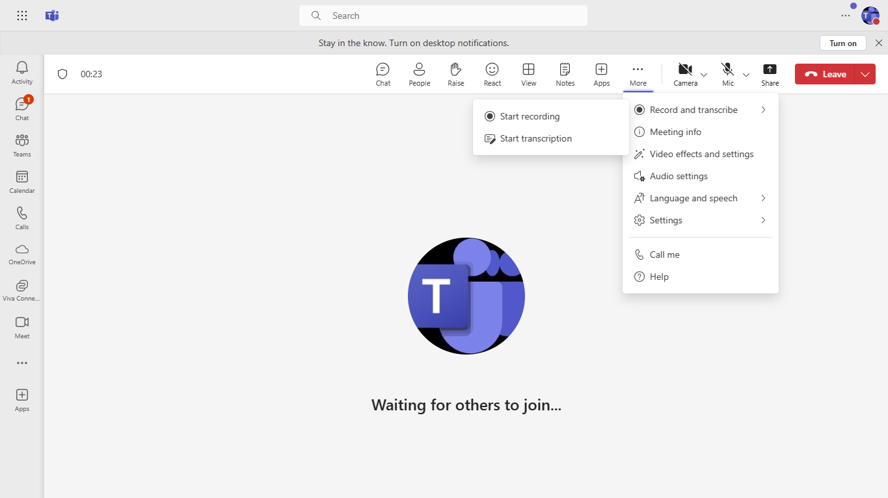
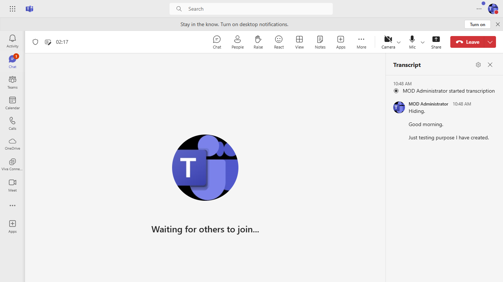
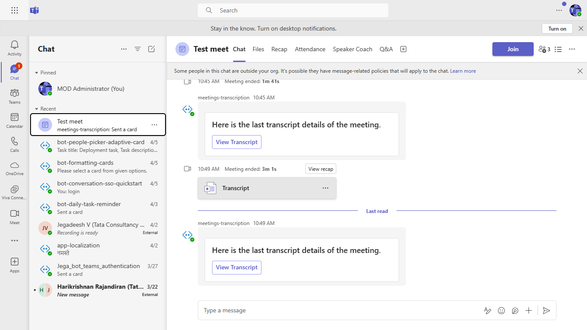
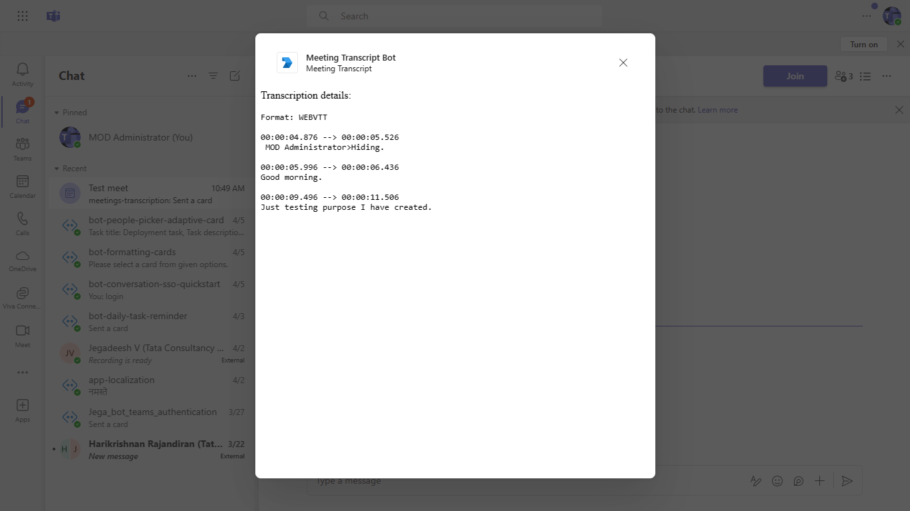

# Bot to show the transcript of the meeting using Microsoft Graph API.

The Meeting Transcript Bot utilizes Microsoft Graph API to fetch meeting transcripts and present them within a Teams task module. It supports adaptive cards and bot interactions to enhance the user experience during meetings.

## Included Features
* Bots
* Adaptive Cards
* Task Modules
* RSC Permissions

## Interaction with app



## Try it yourself - experience the App in your Microsoft Teams client
Please find below demo manifest which is deployed on Microsoft Azure and you can try it yourself by uploading the app manifest (.zip file link below) to your teams and/or as a personal app. (Sideloading must be enabled for your tenant, [see steps here](https://docs.microsoft.com/microsoftteams/platform/concepts/build-and-test/prepare-your-o365-tenant#enable-custom-teams-apps-and-turn-on-custom-app-uploading)).

**Meeting Transcript Bot uses Microsoft Graph API:** [Manifest](/samples/meetings-transcription/csharp/demo-manifest/meetings-transcription.zip)


## Prerequisites

- Microsoft Teams is installed and you have an account (not a guest account)
-  [NodeJS](https://nodejs.org/en/)
-  [dev tunnel](https://learn.microsoft.com/en-us/azure/developer/dev-tunnels/get-started?tabs=windows) or [ngrok](https://ngrok.com/download) latest version or equivalent tunneling solution
-  [M365 developer account](https://docs.microsoft.com/en-us/microsoftteams/platform/concepts/build-and-test/prepare-your-o365-tenant) or access to a Teams account with the appropriate permissions to install an app.
- [Microsoft 365 Agents Toolkit for VS Code](https://marketplace.visualstudio.com/items?itemName=TeamsDevApp.ms-teams-vscode-extension) or [TeamsFx CLI](https://learn.microsoft.com/microsoftteams/platform/toolkit/teamsfx-cli?pivots=version-one)

## Run the app (Using Microsoft 365 Agents Toolkit for Visual Studio Code)

The simplest way to run this sample in Teams is to use Microsoft 365 Agents Toolkit for Visual Studio Code.

1. Ensure you have downloaded and installed [Visual Studio Code](https://code.visualstudio.com/docs/setup/setup-overview)
1. Install the [Microsoft 365 Agents Toolkit extension](https://marketplace.visualstudio.com/items?itemName=TeamsDevApp.ms-teams-vscode-extension)
1. Select **File > Open Folder** in VS Code and choose this samples directory from the repo
1. Using the extension, sign in with your Microsoft 365 account where you have permissions to upload custom apps
1. Manually update the `.env` configuration only for `UserId` at line 5: `UserId=<<Granting-Policy-User-Id>>`. The screenshot below shows that ObjectId corresponds to UserId.

1. Select **Debug > Start Debugging** or **F5** to run the app in a Teams web client.
1. In the browser that launches, select the **Add** button to install the app to Teams.

> If you do not have permission to upload custom apps (uploading), Microsoft 365 Agents Toolkit will recommend creating and using a Microsoft 365 Developer Program account - a free program to get your own dev environment sandbox that includes Teams.

## Setup
 1. Register a new application in the [Microsoft Entra ID – App Registrations](https://go.microsoft.com/fwlink/?linkid=2083908) portal.
    -  Log in to the Azure portal from your subscription, and go to the "App registrations" blade  [here](https://portal.azure.com/#blade/Microsoft_AAD_IAM/ActiveDirectoryMenuBlade/RegisteredApps). Ensure that you use a tenant where admin consent for API permissions can be provided.

  - Click on "New registration", and create an Azure AD application.

  -  **Name:**  The name of your Teams app - if you are following the template for a default deployment, we recommend "App catalog lifecycle".

  -  **Supported account types:**  Select "Accounts in any organizational directory"

  -  Leave the "Redirect URL" field blank.   

  - Click on the "Register" button.

  -  When the app is registered, you'll be taken to the app's "Overview" page. Copy the  **Application (client) ID**; we will need it later. Verify that the "Supported account types" is set to  **Multiple organizations**.

  - Navigate to **API Permissions**, and make sure to add the follow permissions:
    * Select Add a permission
    * Select Microsoft Graph -> Delegated permissions.
    * `User.Read` (enabled by default)
    * Click on Add permissions. Please make sure to grant the admin consent for the required permissions.


  - On the side rail in the Manage section, navigate to the "Certificates & secrets" section. In the Client secrets section, click on "+ New client secret". Add a description for the secret and select Expires as "Never". Click "Add".

 - Once the client secret is created, copy its  **Value**, please take a note of the secret as it will be required later.


- At this point you have 3 unique values:
    -   Application (client) ID which will be later used during Azure bot creation
    -   Client secret for the bot which will be later used during Azure bot creation
    -   Directory (tenant) ID
We recommend that you copy these values into a text file, using an application like Notepad. We will need these values later.

-  Under left menu, navigate to  **API Permissions**, and make sure to add the following permissions of Microsoft Graph API > Application permissions:
    -  OnlineMeetings.Read.All
    -  OnlineMeetingTranscript.Read.All

Click on Add Permissions to commit your changes.

- If you are logged in as the Global Administrator, click on the Grant admin consent for %tenant-name% button to grant admin consent else, inform your admin to do the same through the portal or follow the steps provided here to create a link and send it to your admin for consent.

- Global Administrator can grant consent using following link:  [https://login.microsoftonline.com/common/adminconsent?client_id=](https://login.microsoftonline.com/common/adminconsent?client_id=)<%appId%> 

 
2. Setup for Bot
   - In Azure portal, create a [Azure Bot resource](https://docs.microsoft.com/en-us/azure/bot-service/bot-builder-authentication?view=azure-bot-service-4.0&tabs=csharp%2Caadv2).
   - Ensure that you've [enabled the Teams Channel](https://docs.microsoft.com/en-us/azure/bot-service/channel-connect-teams?view=azure-bot-service-4.0)
   - While registering the bot, use `https://<your_tunnel_domain>/api/messages` as the messaging endpoint.
   
   - Create new Azure Bot resource in Azure.
   - Select Type of App as "Multi Tenant"
   -  Select Creation type as "Use existing app registration"
   - Use the copied App Id and Client secret from above step and fill in App Id and App secret respectively.
   - Click on Create on the Azure bot.   
   - Go to the created resource, navigate to channels and add "Microsoft Teams".
   - Ensure that you've [enabled the Teams Channel](https://docs.microsoft.com/en-us/azure/bot-service/channel-connect-teams?view=azure-bot-service-4.0)
   **NOTE:** When you create app registration, you will create an App ID and App password - make sure you keep these for later.

3. Setup NGROK
1) Run ngrok - point to port 3978

   ```bash
   ngrok http 3978 --host-header="localhost:3978"
   ```  

   Alternatively, you can also use the `dev tunnels`. Please follow [Create and host a dev tunnel](https://learn.microsoft.com/en-us/azure/developer/dev-tunnels/get-started?tabs=windows) and host the tunnel with anonymous user access command as shown below:

   ```bash
   devtunnel host -p 3978 --allow-anonymous
   ```

4. Setup for code

  - Clone the repository

    ```bash
    git clone https://github.com/OfficeDev/Microsoft-Teams-Samples.git
    ```

   - Update the `.env` configuration for the bot to use the `MicrosoftAppId` and `MicrosoftAppPassword` and `MicrosoftAppTenantId` and `AppBaseUrl` and `UserId` (Note that the MicrosoftAppId is the AppId created in step 1 , the MicrosoftAppPassword is referred to as the "client secret" in step 1 and you can always create a new client secret anytime., MicrosoftAppTenantId is reffered to as Directory tenant Id in step 1, AppBaseUrl is the URL that you get in step 3 after running the tunnel, UserId of the user used while granting the policy in step 5).

   - Update UserId `UserId=<<Granting-Policy-User-Id>>`. The screenshot below shows that ObjectId corresponds to UserId.

   

  - In a terminal, navigate to `samples/meetings-transcription/nodejs`

  - Install modules

     ```bash
     npm install
     ``` 

  - Run your bot at the command line:

     ```bash
     npm start
     ```

5. Allow applications to access online meetings on behalf of a user
   - Follow this link- [Configure application access policy](https://docs.microsoft.com/en-us/graph/cloud-communication-online-meeting-application-access-policy)
  - **Note**: Copy the User Id you used to granting the policy. You need while configuring the .env file.
  

6. Setup Manifest for Teams
- __*This step is specific to Teams.*__
    - **Edit** the `manifest.json` contained in the ./appManifest folder to replace your Microsoft App Id (that was created when you registered your app registration earlier) *everywhere* you see the place holder string `{{Microsoft-App-Id}}` (depending on the scenario the Microsoft App Id may occur multiple times in the `manifest.json`)
    - **Edit** the `manifest.json` for `validDomains` and replace `{{domain-name}}` with base Url of your domain. E.g. if you are using ngrok it would be `https://1234.ngrok-free.app` then your domain-name will be `1234.ngrok-free.app` and if you are using dev tunnels then your domain will be like: `12345.devtunnels.ms`.
    - **Zip** up the contents of the `appManifest` folder to create a `manifest.zip` (Make sure that zip file does not contains any subfolder otherwise you will get error while uploading your .zip package)

- Upload the manifest.zip to Teams (in the Apps view click "Upload a custom app")
   - Go to Microsoft Teams. From the lower left corner, select Apps
   - From the lower left corner, choose Upload a custom App
   - Go to your project directory, the ./appManifest folder, select the zip folder, and choose Open.
   - Select Add in the pop-up dialog box. Your app is uploaded to Teams.

**Note**: If you are facing any issue in your app, please uncomment [this](https://github.com/OfficeDev/Microsoft-Teams-Samples/blob/main/samples/meetings-transcription/nodejs/index.js#L50) line and put your debugger for local debug.
    
**NOTE: If you are not getting option to start transcript. Make sure it is enabled from [Teams Admin center](https://admin.teams.microsoft.com). Under `Meetings -> Meeting Policies -> Applied policy(Default is Global)-> Recording & Transcription -> Transcription`**

## Running the sample.

1. Schedule the meeting and add Meeting Transcript Bot from `Apps` section in that particular scheduled meeting.






2. Once meeting started, start the Transcript for the meeting.


3. Once the transcription has started, you can see the live transcription it the meeting UI.


4. Once the Meeting ended, Meeting Transcript Bot will sent a card having a button to open task module.


5. After clicking on `View Transcript` button, you will see the recorded Transcript in the opened Task Module.


## Interacting with the bot.
- After uploading the manifest add the bot into meeting.
- Join meeting and `Start Transcript`
- Once done, leave the meeting.
- You will get the card to open task module and see the latest transcript created.

## Further Reading.

[Meeting Transcript](https://support.microsoft.com/en-us/office/view-live-transcription-in-a-teams-meeting-dc1a8f23-2e20-4684-885e-2152e06a4a8b)


