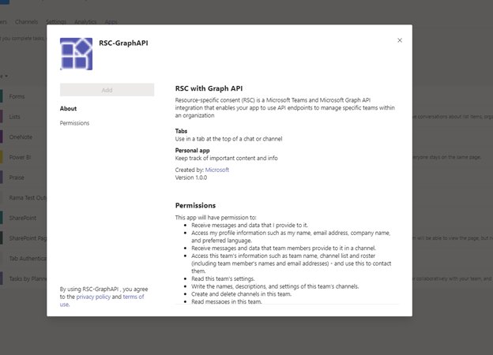
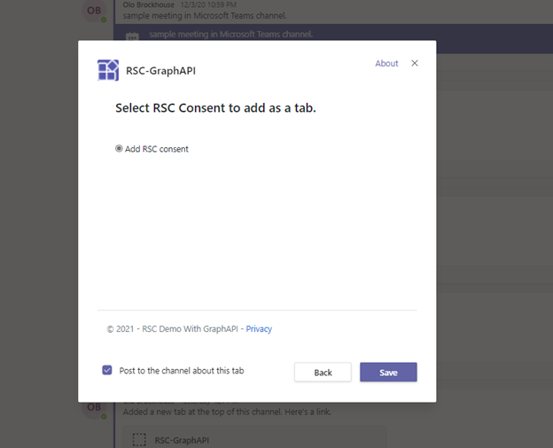
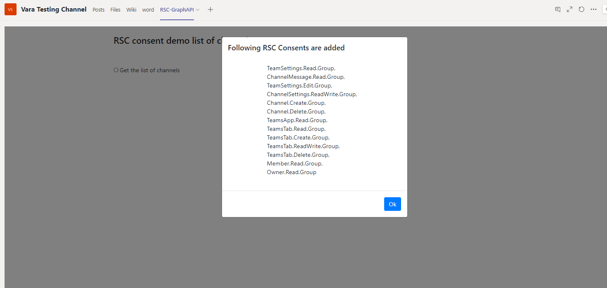
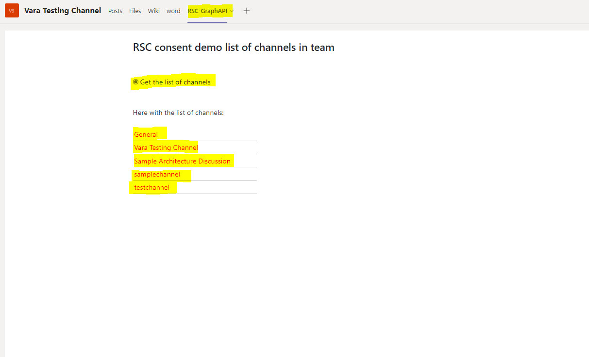

# RSC With Graph API

This sample illustrates how to grant consent through app manifest 

## Prerequisites

- [.NET Core SDK](https://dotnet.microsoft.com/download) version 3.1

  ```bash
  # determine dotnet version
  dotnet --version
  ```
- [Graph Explorer](https://developer.microsoft.com/en-us/graph/graph-explorer)

- [ngrok](https://ngrok.com/) or equivalent tunnelling solution

## To try this sample

- Clone the repository 
   ```bash
   git clone https://github.com/OfficeDev/Microsoft-Teams-Samples.git
   ```

- If you are using Visual Studio

  - Launch Visual Studio
  - File -> Open -> Project/Solution
  - Navigate to `RSCWithGraphAPI` folder
  - Select `RSCWithGraphAPI.csproj` file
  - Press `F5` to run the project

- Run ngrok - point to port 3978
  ```bash
  ngrok http -host-header=rewrite 3978
  ```

- Configure group owner consent settings in the Azure AD portal
  - Sign in to the Azure portal as a Global Administrator/Company Administrator.
  - Allow group owner consent for all group owners. For a team owner to install an app using RSC, group owner consent must be enabled for that user.

- Register your app with Microsoft identity platform via the Azure AD portal
  - Your app must be registered in the Azure AD portal to integrate with the Microsoft identity platform and call Microsoft Graph APIs. See [Register an application with the Microsoft identity platform](https://docs.microsoft.com/en-us/graph/auth-register-app-v2). 
  - Add your client id, client secret,tenant id and team id  in appsettings.json

- Update the ngrok in manifest along with the client id, client secret and team id and upload.
  
  
  
  
  
  
  Select Add RSC consent and click on Save
  
   
   
   Message will be displayed with the added consents details. 
   
      
   
   Click on Ok.
   
   Now, You see that RSC-Graph API Tab is added and select the Get the list of channels.
   It will displays the list of channels created under this team.
   
    
   

## Also
 - Once the app has been installed to a team, you can use [Graph Explorer](https://developer.microsoft.com/en-us/graph/graph-explorer) to view the permissions that have been granted to the app in a team:

   - Get the team's groupId from the Teams client.
   - In the Teams client, select Teams from the far left nav bar.
   - Select the team where the app is installed from the drop-down menu.
   - Select the More options icon (⋯).
   - Select Get link to team.
   - Copy and save the groupId value from the string.
   - Log into Graph Explorer.
   - Make a GET call to the following endpoint: https://graph.microsoft.com/beta/groups/{teamGroupId}/permissionGrants. The clientAppId field in the response will map to the           appId specified in the Teams app manifest.
   
    


