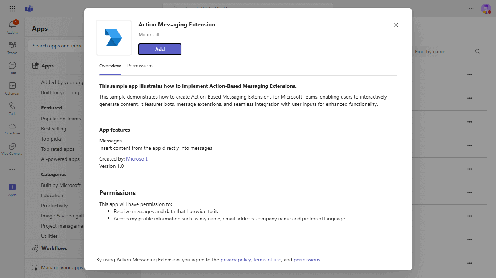

# Teams Messaging Extensions Action

[Messaging Extensions](https://docs.microsoft.com/microsoftteams/platform/messaging-extensions/what-are-messaging-extensions) are a special kind of Microsoft Teams application that is support by the [Bot Framework](https://dev.botframework.com) v4.

There are two basic types of Messaging Extension in Teams: [Search-based](https://docs.microsoft.com/microsoftteams/platform/messaging-extensions/how-to/search-commands/define-search-command) and [Action-based](https://docs.microsoft.com/microsoftteams/platform/messaging-extensions/how-to/action-commands/define-action-command). This sample illustrates how to
build an Action-based Messaging Extension.

## Included Features
* Bots
* Message Extensions
* Action Commands

- **Interaction with Messaging Extension**


## Try it yourself - experience the App in your Microsoft Teams client
Please find below demo manifest which is deployed on Microsoft Azure and you can try it yourself by uploading the app package (.zip file link below) to your teams and/or as a personal app. (Sideloading must be enabled for your tenant, [see steps here](https://docs.microsoft.com/microsoftteams/platform/concepts/build-and-test/prepare-your-o365-tenant#enable-custom-teams-apps-and-turn-on-custom-app-uploading)).

**Teams Messaging Extensions Action:** [Manifest](/samples/msgext-action/csharp/demo-manifest/msgext-action.zip)

## Prerequisites

- Microsoft Teams is installed and you have an account
- [Python SDK](https://www.python.org/downloads/) version 3.7
- [ngrok](https://ngrok.com/) or equivalent tunnelling solution

## To try this sample

> Note these instructions are for running the sample on your local machine, the tunnelling solution is required because
the Teams service needs to call into the bot.

1) Clone the repository

    ```bash
    git clone https://github.com/OfficeDev/Microsoft-Teams-Samples.git
    ```

1) Run ngrok - point to port 3978

    ```bash
    ngrok http 3978 --host-header="localhost:3978"
    ```

1) Create [Bot Framework registration resource](https://docs.microsoft.com/azure/bot-service/bot-service-quickstart-registration) in Azure
    - Use the current `https` URL you were given by running ngrok. Append with the path `/api/messages` used by this sample
    - Ensure that you've [enabled the Teams Channel](https://docs.microsoft.com/azure/bot-service/channel-connect-teams?view=azure-bot-service-4.0)
    - __*If you don't have an Azure account*__ you can use this [Bot Framework registration](https://docs.microsoft.com/microsoftteams/platform/bots/how-to/create-a-bot-for-teams#register-your-web-service-with-the-bot-framework)

1) Bring up a terminal, navigate to `Microsoft-Teams-Samples\samples\msgext-action\python` folder

1) Activate your desired virtual environment

1) Install dependencies by running ```pip install -r requirements.txt``` in the project folder.

1) Update the `config.py` configuration for the bot to use the Microsoft App Id and App Password from the Bot Framework registration. (Note the App Password is referred to as the "client secret" in the azure portal and you can always create a new client secret anytime.)

1) __*This step is specific to Teams.*__
    - **Edit** the `manifest.json` contained in the `teamsAppManifest` folder to replace your Microsoft App Id (that was created when you registered your bot earlier) *everywhere* you see the place holder string `<<YOUR-MICROSOFT-APP-ID>>` (depending on the scenario the Microsoft App Id may occur multiple times in the `manifest.json`)
    - **Zip** up the contents of the `teamsAppManifest` folder to create a `manifest.zip`
    - **Upload** the `manifest.zip` to Teams (in the Apps view click "Upload a custom app")

1) Run your bot with `python app.py`

## Interacting with the bot in Teams

> Note this `manifest.json` specified that the bot will be called from both the `compose` and `message` areas of Teams. Please refer to Teams documentation for more details.  Also note this bot does not process incoming Messages, but responds only to Messaging Extension commands. 

1) Selecting the **Create Card** command from the Compose Box command list. The parameters dialog will be displayed and can be submitted to initiate the card creation within the Messaging Extension code. 

or

2) Selecting the **Share Message** command from the Message command list.  


## Deploy the bot to Azure

To learn more about deploying a bot to Azure, see [Deploy your bot to Azure](https://aka.ms/azuredeployment) for a complete list of deployment instructions.

# Further reading

- [Messaging extension action](https://learn.microsoft.com/microsoftteams/platform/messaging-extensions/how-to/action-commands/define-action-command)
- [Bot Framework Documentation](https://docs.botframework.com)
- [Bot Basics](https://docs.microsoft.com/azure/bot-service/bot-builder-basics?view=azure-bot-service-4.0)
- [Azure Bot Service Introduction](https://docs.microsoft.com/azure/bot-service/bot-service-overview-introduction?view=azure-bot-service-4.0)
- [Azure Bot Service Documentation](https://docs.microsoft.com/azure/bot-service/?view=azure-bot-service-4.0)

