# Compliance Checker using Azure Open AI

Explore this sample application that integrates Azure Open AI into a Teams message extension, enabling users to evaluate contract proposals for compliance with specific policy guidelines stored in Azure Blob Storage. 

The solution not only presents results as interactive adaptive cards but is also compatible with Microsoft 365 Copilot, offering seamless compliance checks in your workflow.


## Interaction with app

 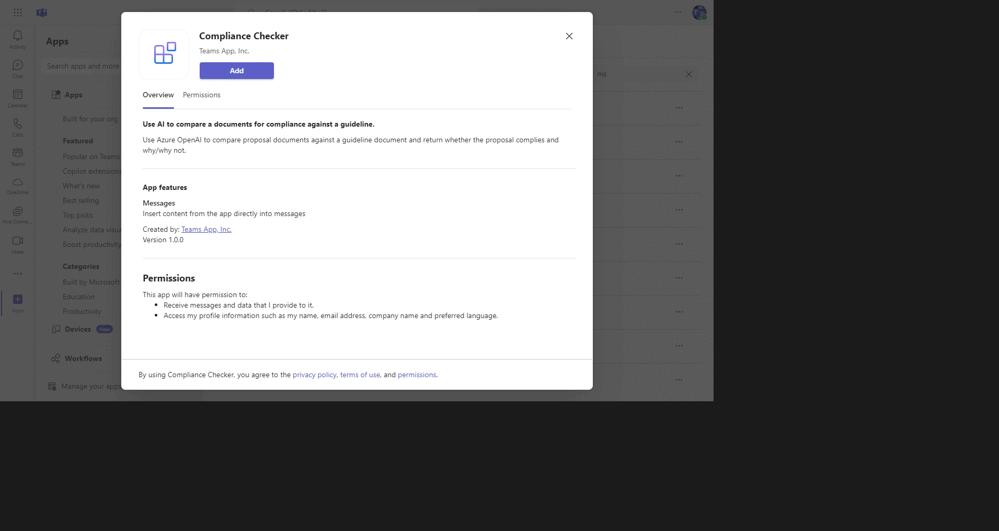

## Try It Yourself - Experience the app in your Microsoft Teams and Copilot client
Please find below demo manifest which is deployed on Microsoft Azure and you can try it yourself by uploading the app package (.zip file link below) to your teams and/or as a personal app. (Uploading must be enabled for your tenant, [see steps here](https://docs.microsoft.com/microsoftteams/platform/concepts/build-and-test/prepare-your-o365-tenant#enable-custom-teams-apps-and-turn-on-custom-app-uploading)).

**Compliance Checker sample app:** [Manifest](/samples/msgext-ai-doc-compliance-checker/demo-manifest/AIComplianceChecker.zip)

## Prerequisites

- [Node.js 18.x](https://nodejs.org/download/release/v18.18.2/)
- [Visual Studio Code](https://code.visualstudio.com/)
- [Blob Storage](https://learn.microsoft.com/en-us/azure/storage/blobs/storage-quickstart-blobs-portal)
- [Microsoft 365 Agents Toolkit](https://marketplace.visualstudio.com/items?itemName=TeamsDevApp.ms-teams-vscode-extension)
- You will need a Microsoft work or school account with [permissions to upload custom Teams applications](https://learn.microsoft.com/microsoftteams/platform/concepts/build-and-test/prepare-your-o365-tenant#enable-custom-teams-apps-and-turn-on-custom-app-uploading). The account will also need a Microsoft Copilot for Microsoft 365 license to use the extension in Copilot.
- [Azure Open AI](https://learn.microsoft.com/en-us/azure/ai-services/openai/quickstart?tabs=command-line&pivots=programming-language-studio)

## Create an Azure Open AI service

- In Azure portal, create an [Azure Open AI service](https://learn.microsoft.com/en-us/azure/ai-services/openai/how-to/create-resource?pivots=web-portal).
- **Deploy Azure Open AI model:** Deploy the `gpt-35-turbo` model in your created Azure Open AI service for the application to perform translation.
- Collect `AzureOpenAIEndpoint`, `AzureOpenAIApiKey`, `AzureOpenAIDeploymentId` values and save these values to update in `.env` file later.

## App Registration

### Register your application with Azure AD

1. Register a new application in the [Microsoft Entra ID – App Registrations](https://go.microsoft.com/fwlink/?linkid=2083908) portal.
2. Select **New Registration** and on the *register an application page*, set following values:
    * Set **name** to your app name.
    * Choose the **supported account types** (any account type will work)
    * Leave **Redirect URI** empty.
    * Choose **Register**.
3. On the overview page, copy and save the **Application (client) ID, Directory (tenant) ID**. You'll need those later when updating your Teams application manifest and in the appsettings.json.
4. Navigate to **API Permissions**, and make sure to add the follow permissions:
    * Select Add a permission
    * Select Microsoft Graph -> Delegated permissions.
    * `User.Read` (enabled by default)
    * Click on Add permissions. Please make sure to grant the admin consent for the required permissions.

## Setup and use the sample

1) **Create Azure Blob Storage:**
Refer to the Create Blob Storage documentation [Blob Storage](https://learn.microsoft.com/en-us/azure/storage/blobs/storage-quickstart-blobs-portal) to create a blob storage in Azure.

1) **Add the files to be checked for compliance:**
Upload the policy guideline document (keep the file-name handy for adding into the .localConfigs file) and also the proposal documents to compare against the guideline.

1) Clone the repository

    ```bash
    git clone https://github.com/OfficeDev/Microsoft-Teams-Samples.git
    ```
1) Navigate to the `samples/msgext-ai-doc-compliance-checker` folder and open with Visual Studio Code.

1) Navigate to the `samples/msgext-ai-doc-compliance-checker/.localConfigs` directory and update the values below.

   When running the sample using the toolkit, the BOT_ID and BOT_PASSWORD are automatically generated for you. You do not need to manually configure these credentials
    ```bash
      BOT_ID={{Azure_Bot_Id}} 
      BOT_PASSWORD={{Azure_Bot_Password}}
      END_POINT={{AzureOpenAIEndpoint}}
      API_KEY={{AzureOpenAIApiKey}}
      DEPLOYMENT_ID={{AzureOpenAIDeploymentId}}
      AZURE_STORAGE_CONNECTION_STRING={{Azure_Storage_Connection_String}}
      AZURE_CONTAINER_NAME={{Azure_Container_Name}}
      CHECKLIST_NAME={{The name of the Policy Guideline document uploaded in Azure Blob should include the file extension. Supported file formats are: .pdf , .docx, .txt}}
   ```

## Run the app (Using Microsoft 365 Agents Toolkit for Visual Studio Code)

The simplest way to run this sample in Teams is to use Microsoft 365 Agents Toolkit for Visual Studio Code.

1. Ensure you have downloaded and installed [Visual Studio Code](https://code.visualstudio.com/docs/setup/setup-overview)
1. Install the [Microsoft 365 Agents Toolkit extension](https://marketplace.visualstudio.com/items?itemName=TeamsDevApp.ms-teams-vscode-extension)
1. Select **File > Open Folder** in VS Code and choose this samples directory from the repo
1. Using the extension, sign in with your Microsoft 365 account where you have permissions to upload custom apps
1. Select **Debug > Start Debugging** or **F5** to run the app in a Teams web client.
1. In the browser that launches, select the **Add** button to install the app to Teams.

> If you do not have permission to upload custom apps (uploading), Microsoft 365 Agents Toolkit will recommend creating and using a Microsoft 365 Developer Program account - a free program to get your own dev environment sandbox that includes Teams.

## Running the sample

1) **Add Compliance Checker App:**
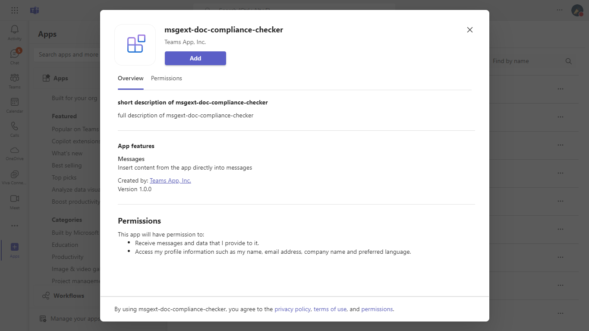

1) **Search for the Compliance Checker app from the Messaging Extensions:**
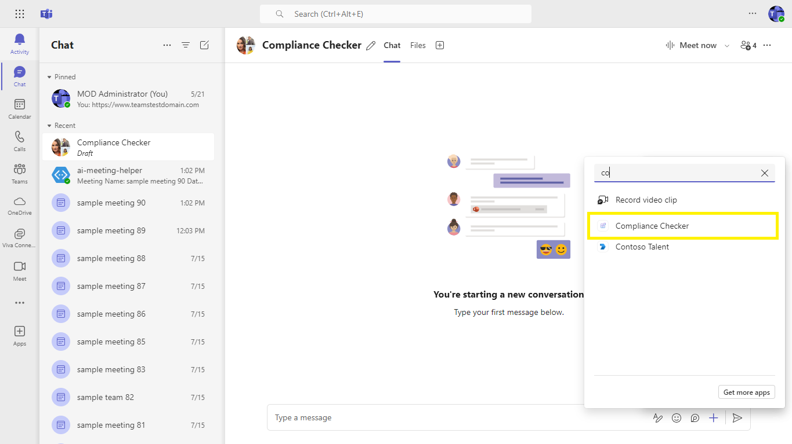

1) **Select and add the Compliance Checker App:**
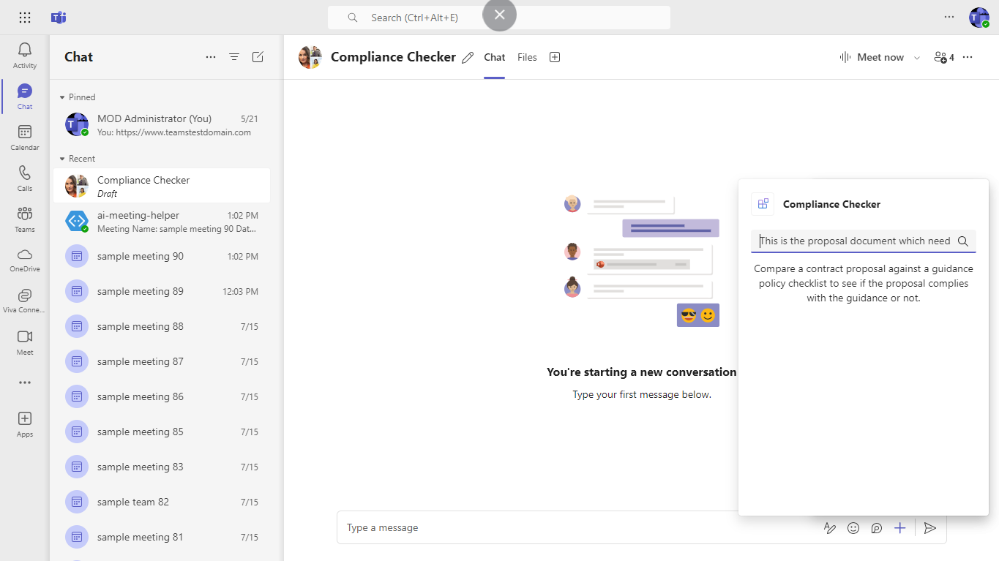

1) **Search for the file name of the proposal document to compare against the policy document:**
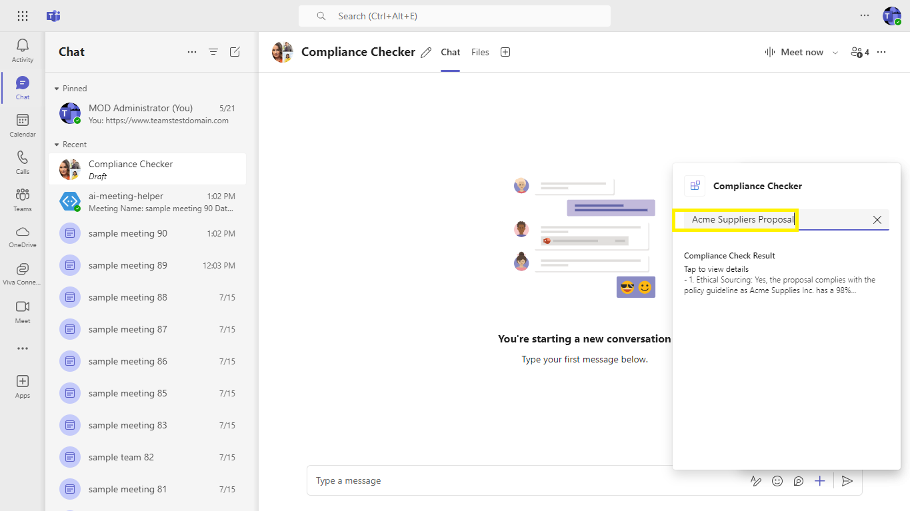

1) **Compliance Assessment Result. The proposal document is checked against the guideline document and the results are shown in an adaptive card:**
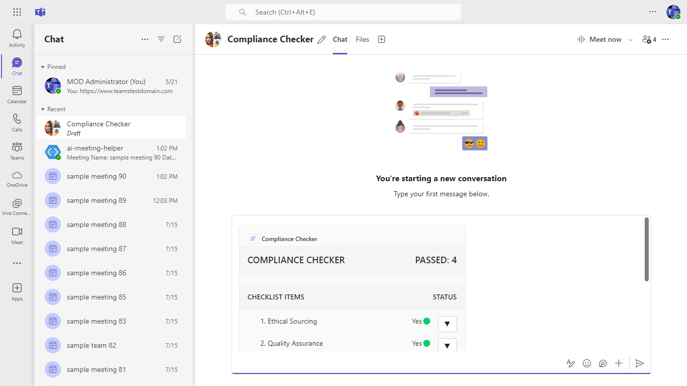

1) **Compliance Checker Results:**
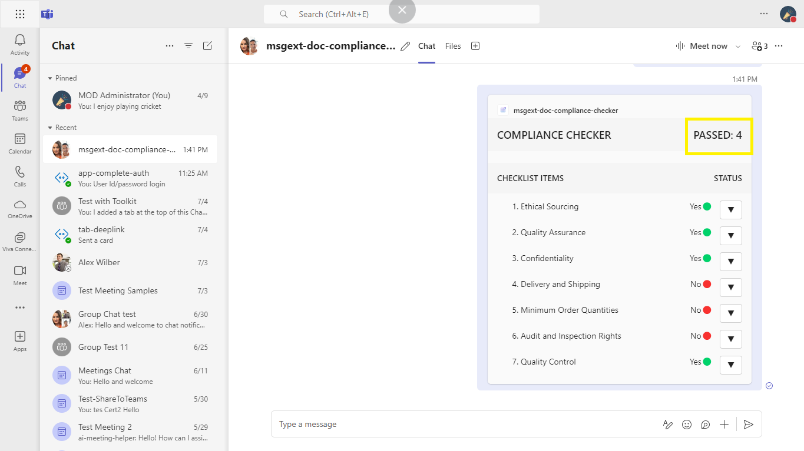

1) **Click on the arrow to expand the card and get contextual reasoning for the complaince status being Yes or No:**
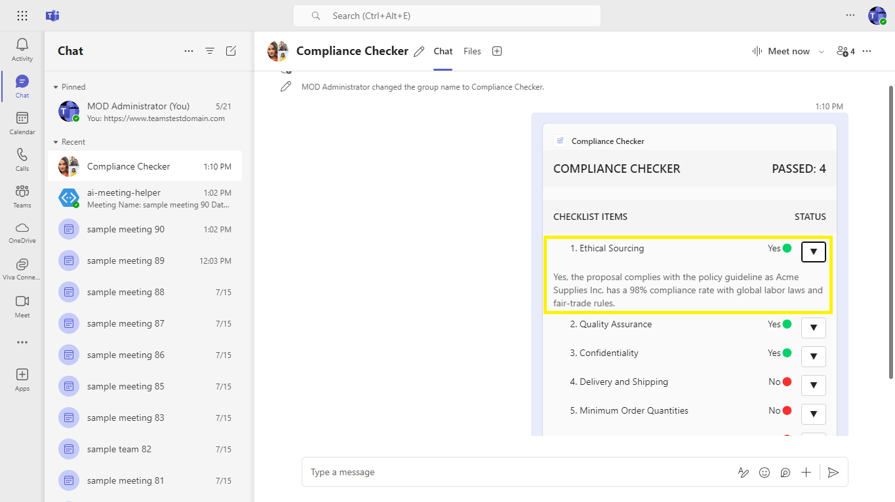

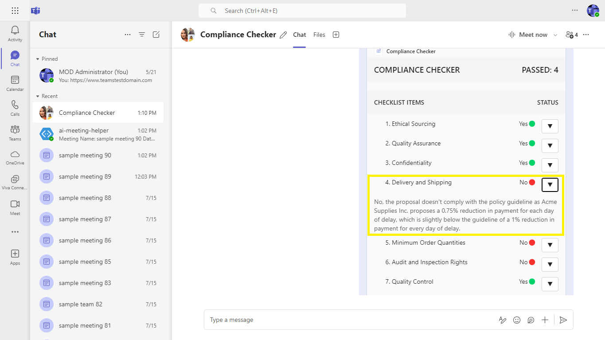

### Test the app in Copilot for Microsoft 365

1) **Open Microsoft Teams, navigate to the Copilot section from the left-hand menu, look for the "Plug-ins" section on the right side of the screen, and use the search bar within the Plug-ins menu to search for "Compliance Checker":**
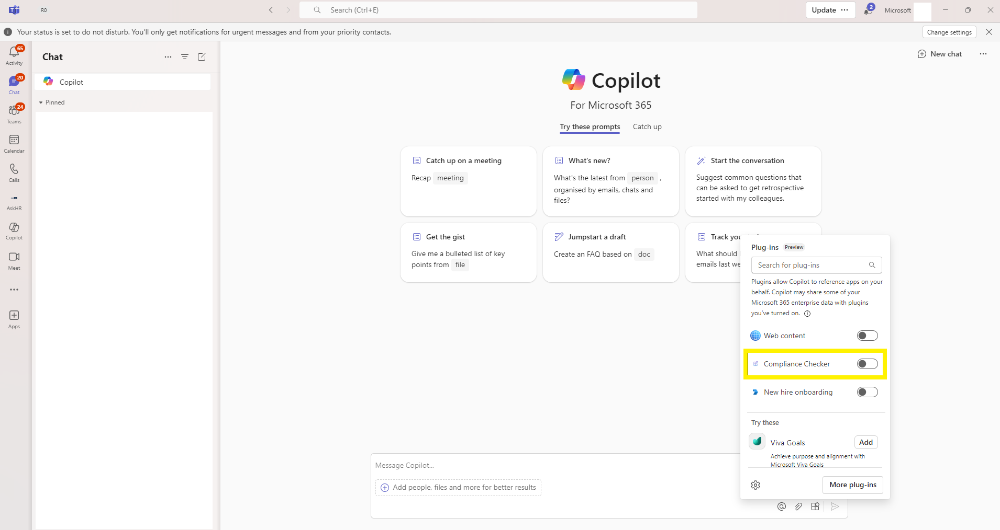

1) **Enable Compliance Checker app:**
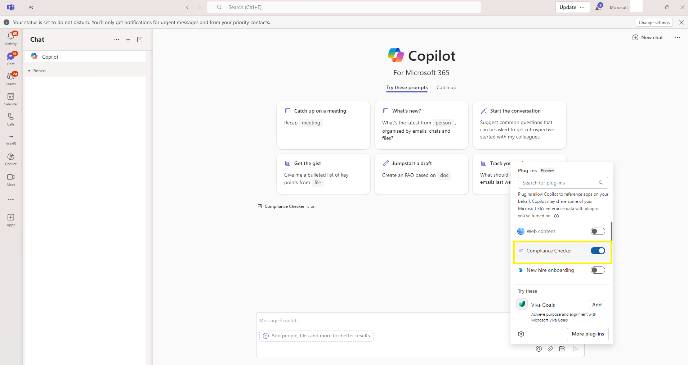

1) **Using Compliance Checker, evaluate Acme Suppliers Proposal for compliance**
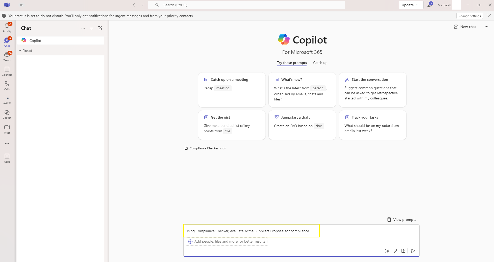

1) **Compliance checker results are being generating:**
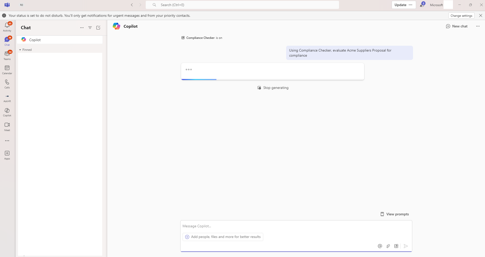

1) **The Compliance Checker has evaluated the Acme Suppliers Proposal and here are the results:**
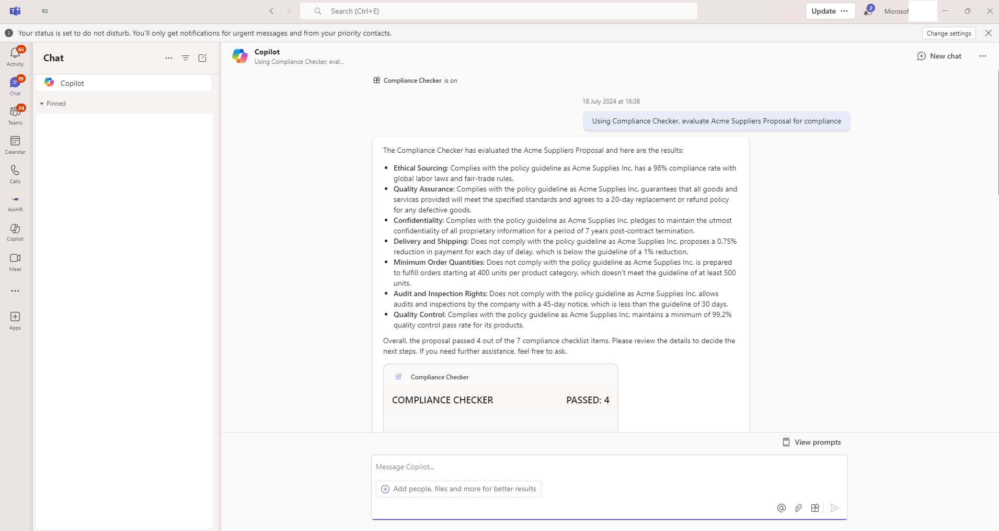

1) **Click on the arrow to expand the card and get contextual reasoning for the complaince status being Yes or No:**
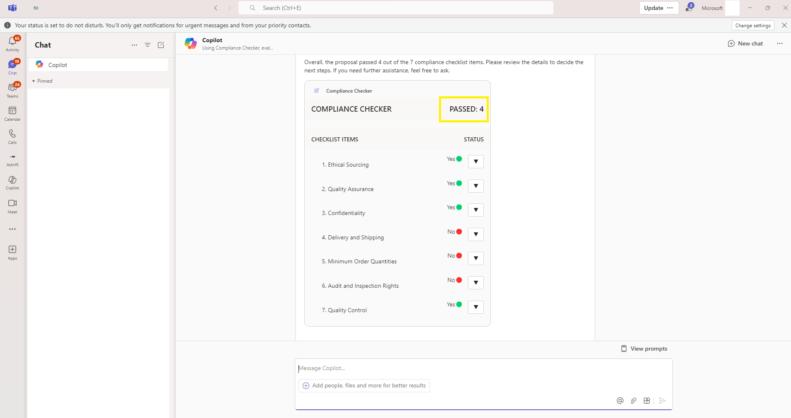

## Deploy/Host your app on Azure
If you want to deploy the app to Azure, you can follow the below steps:
- [Provision cloud resources](https://learn.microsoft.com/en-us/microsoftteams/platform/toolkit/provision)
- [Deploy Microsoft Teams app to the cloud using Microsoft Visual Studio Code](https://learn.microsoft.com/en-us/microsoftteams/platform/toolkit/deploy)

## Further reading

### Azure Open AI Service, Message Extensions And Azure Blob Storage.

- [Message extensions for Microsoft Copilot for Microsoft 365](https://learn.microsoft.com/en-us/microsoft-365-copilot/extensibility/overview-message-extension-bot)
- [Azure OpenAI Service](https://learn.microsoft.com/azure/ai-services/openai/overview)
- [Quickstart: Azure Blob Storage](https://learn.microsoft.com/azure/storage/blobs/storage-quickstart-blobs-nodejs?tabs=managed-identity%2Croles-azure-portal%2Csign-in-azure-cli)

