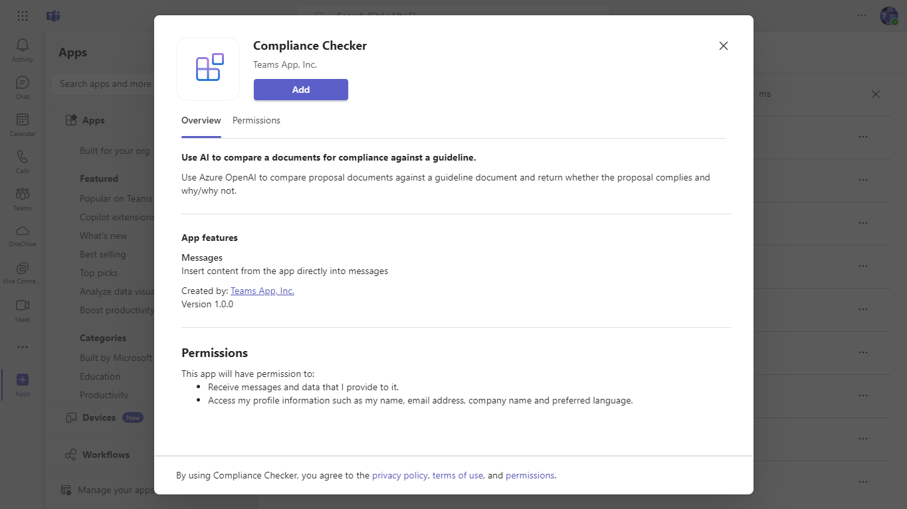
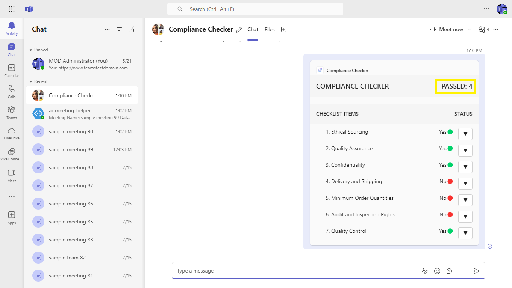

# Compliance Checker using Azure Open AI

This sample uses Azure Open AI to compare proposal documents uploaded to an Azure Blob storage with a policy guideline that is also uploaded in the blob.
 
The solution makes calls to Azure Open AI to assess compliance against each of the line items mentioned in the policy guideline, and returns a result that is formatted and displayed as an adaptive card. 
 
The sample can also be used as a Copilot Plug-in.

## Interaction with app

 

## Try It Yourself - Experience the app in your Microsoft Teams and Copilot client
Please find below demo manifest which is deployed on Microsoft Azure and you can try it yourself by uploading the app package (.zip file link below) to your teams and/or as a personal app. (Sideloading must be enabled for your tenant, [see steps here](https://docs.microsoft.com/microsoftteams/platform/concepts/build-and-test/prepare-your-o365-tenant#enable-custom-teams-apps-and-turn-on-custom-app-uploading)).

**Compliance Checker sample app:** [Manifest](/samples/msgext-ai-doc-compliance-checker/demo-manifest/AIComplianceChecker.zip)

## Prerequisites

- [Node.js 18.x](https://nodejs.org/download/release/v18.18.2/)
- [Visual Studio Code](https://code.visualstudio.com/)
- [Blob Storage](https://learn.microsoft.com/en-us/azure/storage/blobs/storage-quickstart-blobs-portal)
- [Teams Toolkit](https://marketplace.visualstudio.com/items?itemName=TeamsDevApp.ms-teams-vscode-extension)
- You will need a Microsoft work or school account with [permissions to upload custom Teams applications](https://learn.microsoft.com/microsoftteams/platform/concepts/build-and-test/prepare-your-o365-tenant#enable-custom-teams-apps-and-turn-on-custom-app-uploading). The account will also need a Microsoft Copilot for Microsoft 365 license to use the extension in Copilot.
- [Azure Open AI](https://learn.microsoft.com/en-us/azure/ai-services/openai/quickstart?tabs=command-line&pivots=programming-language-studio)

## Setup and use the sample

1) **Create Azure Blob Storage:**
Refer to the Create Blob Storage documentation [Blob Storage](https://learn.microsoft.com/en-us/azure/storage/blobs/storage-quickstart-blobs-portal) to create a blob storage in Azure.

1) **Add the files to be checked for compliance:**
Upload the policy guideline document (keep the file-name handy for adding into the .localConfigs file) and also the proposal documents to compare against the guideline.

1) Clone the repository

    ```bash
    git clone https://github.com/OfficeDev/Microsoft-Teams-Samples.git
    ```
1) Navigate to the `samples/msgext-ai-doc-compliance-checker` folder and open with Visual Studio Code.

1) Navigate to the `samples/msgext-ai-doc-compliance-checker/.localConfigs` directory and update the values below.

   ```txt
      END_POINT={{Azure_End_Point}}
      API_KEY={{Azure_Api_Key}}
      DEPLOYMENT_ID={{Azure_Deployment_Id}}
      AZURE_STORAGE_CONNECTION_STRING={{Azure_Storage_Connection_String}}
      AZURE_CONTAINER_NAME={{Azure_Container_Name}}
      CHECKLIST_NAME={{Name of the Policy Guideline document uploaded in Azure Blob}}
   ```

## Run the app (Using Teams Toolkit for Visual Studio Code)

The simplest way to run this sample in Teams is to use Teams Toolkit for Visual Studio Code.

1. Ensure you have downloaded and installed [Visual Studio Code](https://code.visualstudio.com/docs/setup/setup-overview)
1. Install the [Teams Toolkit extension](https://marketplace.visualstudio.com/items?itemName=TeamsDevApp.ms-teams-vscode-extension)
1. Select **File > Open Folder** in VS Code and choose this samples directory from the repo
1. Using the extension, sign in with your Microsoft 365 account where you have permissions to upload custom apps
1. Select **Debug > Start Debugging** or **F5** to run the app in a Teams web client.
1. In the browser that launches, select the **Add** button to install the app to Teams.

> If you do not have permission to upload custom apps (sideloading), Teams Toolkit will recommend creating and using a Microsoft 365 Developer Program account - a free program to get your own dev environment sandbox that includes Teams.

## Running the sample

1) **Add Compliance Checker App:**


1) **Search for the Compliance Checker app from the Messaging Extensions:**


1) **Select and add the Compliance Checker App:**


1) **Search for the file name of the proposal document to compare against the policy document:**


1) **Compliance Assessment Result. The proposal document is checked against the guideline document and the results are shown in an adaptive card:**


1) **Compliance Checker Results:**


1) **Click on the arrow to expand the card and get contextual reasoning for the complaince status being Yes or No:**


### Test the app in Copilot for Microsoft 365

1) **Open Microsoft Teams, navigate to the Copilot section from the left-hand menu, look for the "Plug-ins" section on the right side of the screen, and use the search bar within the Plug-ins menu to search for "Compliance Checker":**


1) **Enable Compliance Checker app:**


1) **Type Prompt: "Using Compliance Checker, evaluate Acme Suppliers Proposal for compliance" and click the send icon:**


1) **Compliance checker results are being generating:**


1) **The Compliance Checker has evaluated the Acme Suppliers Proposal and here are the results:**


1) **Click on the arrow to expand the card and get contextual reasoning for the complaince status being Yes or No:**


## Further reading

### Azure Open AI Service, Message Extensions And Azure Blob Storage.

- [Message extensions for Microsoft Copilot for Microsoft 365](https://learn.microsoft.com/en-us/microsoft-365-copilot/extensibility/overview-message-extension-bot)
- [Azure OpenAI Service](https://learn.microsoft.com/azure/ai-services/openai/overview)
- [Quickstart: Azure Blob Storage](https://learn.microsoft.com/azure/storage/blobs/storage-quickstart-blobs-nodejs?tabs=managed-identity%2Croles-azure-portal%2Csign-in-azure-cli)

