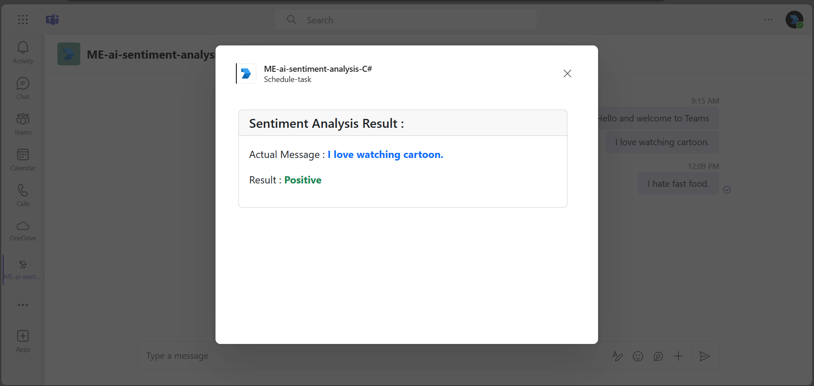

# Sentiment Analysis for Teams chat messages using Azure Open AI and messaging extension.

This sample shows a feature where user can analyze sentiments for messages posted in Teams chat using messaging extension and Azure Open AI.

## Included Features
* ME
* Azure Open AI For Sentiment Analysis

## Interaction with app


## Prerequisites

- Microsoft Teams is installed and you have an account (not a guest account)
- [csharp](https://csharp.org/en/)
- [dev tunnel](https://learn.microsoft.com/en-us/azure/developer/dev-tunnels/get-started?tabs=windows) or [ngrok](https://ngrok.com/download) (For local environment testing) latest version (any other tunneling software can also be used).
- [M365 developer account](https://docs.microsoft.com/microsoftteams/platform/concepts/build-and-test/prepare-your-o365-tenant) or access to a Teams account with the appropriate permissions to install an app.


`SECRET_AZURE_OPENAPI_KEY=<Azure OpenAI Service Key>`

`CHAT_COMPLETION_MODEL_NAME=gpt-3.5-turbo`

> Note: If you are deploying the code, make sure that above mentioned values are properly updated at `env/.env.dev` or `env/.env.dev.user` wherever required.

1. Select **Debug > Start Debugging** or **F5** to run the app in a Teams web client.
1. In the browser that launches, select the **Add** button to install the app to Teams.
> If you do not have permission to upload custom apps (sideloading), Teams Toolkit will recommend creating and using a Microsoft 365 Developer Program account - a free program to get your own dev environment sandbox that includes Teams.

## Setup

> Note these instructions are for running the sample on your local machine, the tunnelling solution is required because
the Teams service needs to call into the bot.

1) Run ngrok - point to port 3978

   ```bash
   ngrok http 3978 --host-header="localhost:3978"
   ```  

   Alternatively, you can also use the `dev tunnels`. Please follow [Create and host a dev tunnel](https://learn.microsoft.com/en-us/azure/developer/dev-tunnels/get-started?tabs=windows) and host the tunnel with anonymous user access command as shown below:

   ```bash
   devtunnel host -p 3978 --allow-anonymous
   ```


### 3. Setup for Bot

   In Azure portal, create a [Azure Bot resource](https://docs.microsoft.com/azure/bot-service/bot-service-quickstart-registration).
    - For bot handle, make up a name.
    - Select "Use existing app registration" (Create the app registration in Microsoft Entra ID beforehand.)
    - Choose "Accounts in any organizational directory (Any Azure AD directory - Multitenant)" in Authentication section in your App Registration to run this sample smoothly.
    - __*If you don't have an Azure account*__ create an [Azure free account here](https://azure.microsoft.com/free/)
    - In the new Azure Bot resource in the Portal, Ensure that you've [enabled the Teams Channel](https://learn.microsoft.com/azure/bot-service/channel-connect-teams?view=azure-bot-service-4.0)
    - In Settings/Configuration/Messaging endpoint, enter the current `https` URL you were given by running the tunnelling application. Append with the path `/api/messages`


### 3. Setup for code
  
1. Clone the repository
   ```bash
   git clone https://github.com/OfficeDev/Microsoft-Teams-Samples.git
   ```

2. Open the code in Visual Studio
   - File -> Open -> Project/Solution
   - Navigate to folder where repository is cloned then `samples/msgext-ai-sentiment-analysis/csharp/MEAISentimentAnalysis.sln`
   

1) Update the `appSettings.json` configuration for the bot to use the `MicrosoftAppId`, `SECRET_OPENAI_API_KEY` and `ApplicationBaseUrl`  with application base url. For e.g., your ngrok or dev tunnels url. (Note the MicrosoftAppId is the AppId created in step 1 (Setup for Bot), the MicrosoftAppPassword is referred to as the "client secret" in step 1 (Setup for Bot) and you can always create a new client secret anytime.)

> Note: If you dont have access to Azure Open Api Key then use `Open Api key`. 

- Press `F5` to run the project.

5. Setup Manifest for Teams
- __*This step is specific to Teams.*__
    - **Edit** the `manifest.json` contained in the ./AppManifest folder to replace your Microsoft App Id (that was created when you registered your app registration earlier) *everywhere* you see the place holder string `{{Microsoft-App-Id}}` (depending on the scenario the Microsoft App Id may occur multiple times in the `manifest.json`)
    - **Edit** the `manifest.json` for `validDomains` and replace `{{domain-name}}` with base Url of your domain. E.g. if you are using ngrok it would be `https://1234.ngrok-free.app` then your domain-name will be `1234.ngrok-free.app` and if you are using dev tunnels then your domain will be like: `12345.devtunnels.ms`.
    - **Zip** up the contents of the `AppManifest` folder to create a `manifest.zip` (Make sure that zip file does not contains any subfolder otherwise you will get error while uploading your .zip package)


## Running the sample

Install Sample to Teams


Welcome Message then click on 3 dots navigate to ME sentiment analysis


Its shows Sentiment like(positive/negative/neutral) for messages posted in Teams chat.


Showing Sentiment Analysis `Positive` depending on Teams chat message


Showing Sentiment Analysis `Negative` depending on Teams chat message


## Further reading
- [Azure OpenAI Service](https://learn.microsoft.com/azure/ai-services/openai/overview)
- [Messaging Extension](https://learn.microsoft.com/microsoftteams/platform/messaging-extensions/how-to/action-commands/define-action-command)


