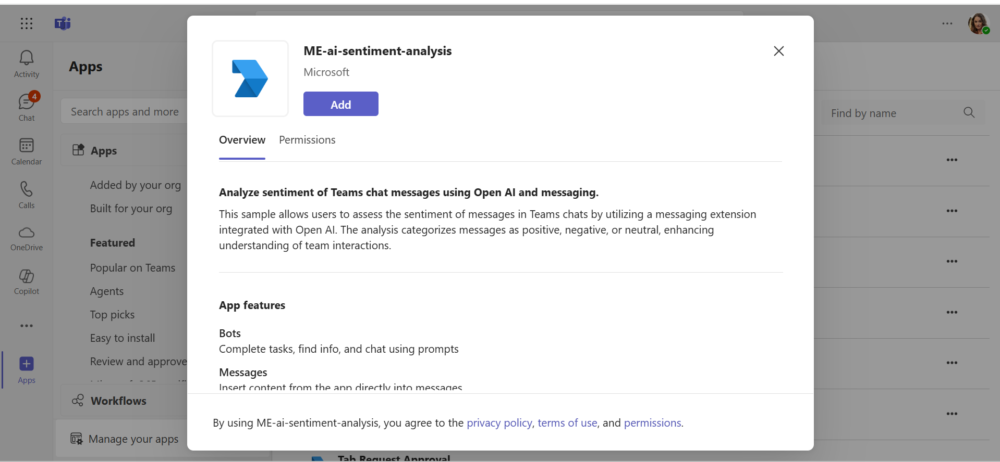
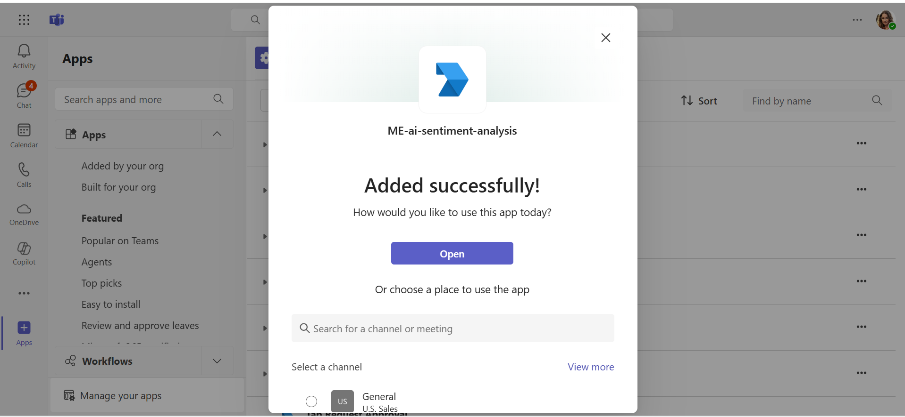
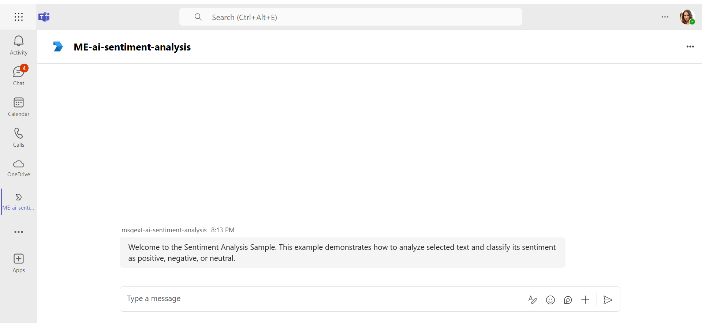
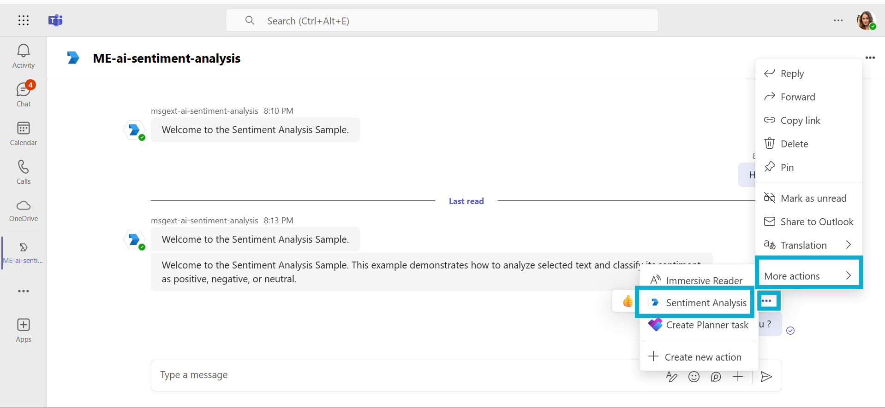
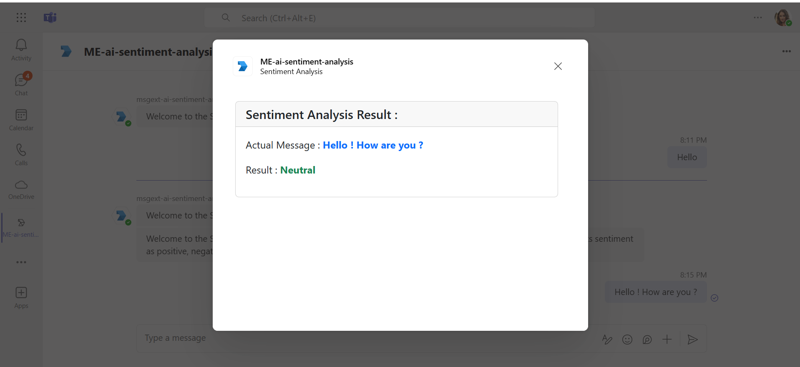
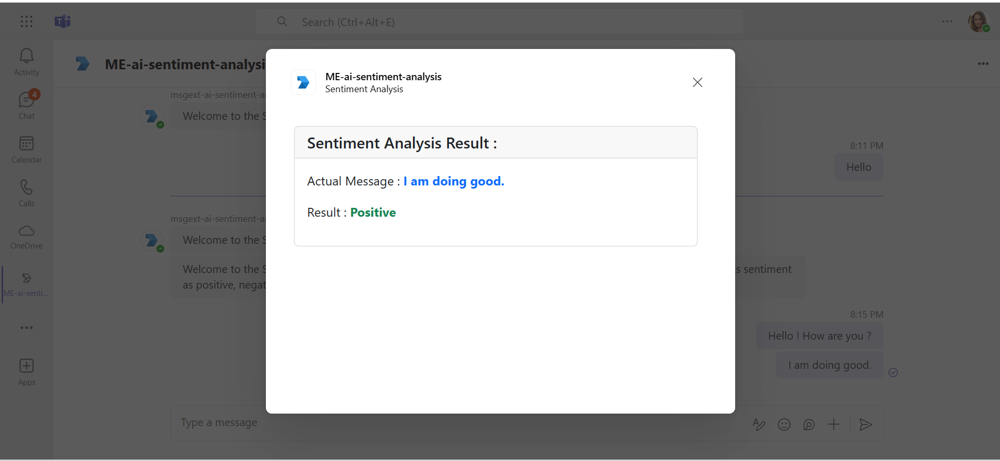
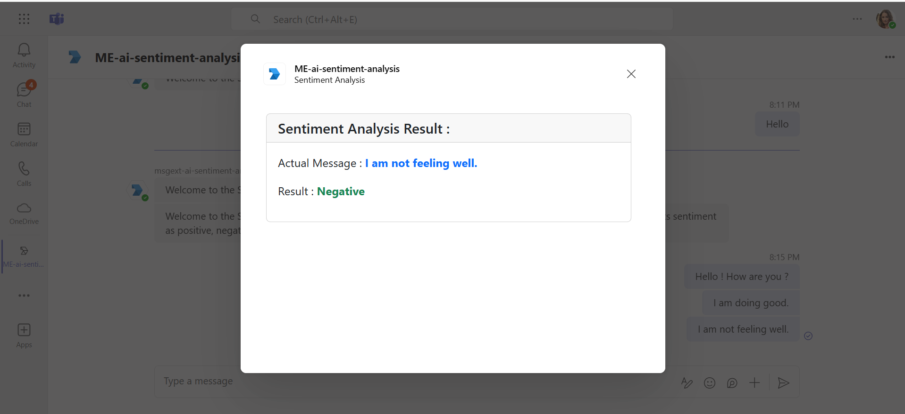
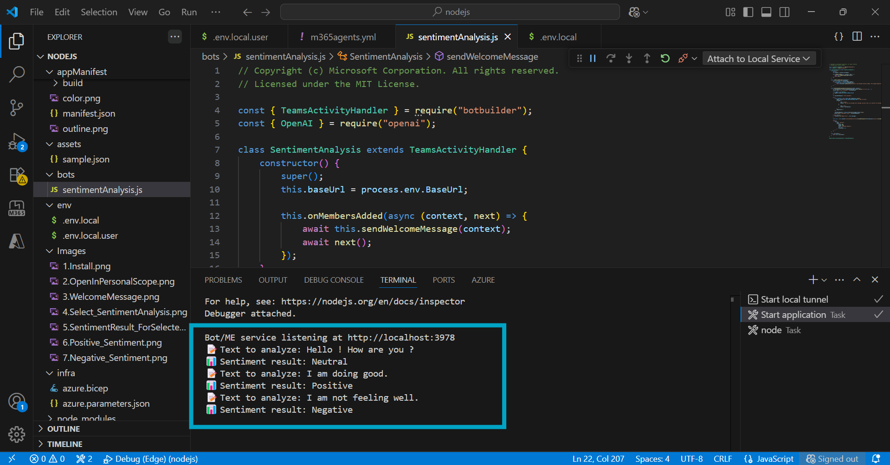

# Sentiment Analysis for Teams chat messages using Azure Open AI and messaging extension.

Explore this sample application that integrates Azure Open AI with a Teams messaging extension, enabling real-time sentiment analysis of chat messages. It categorizes sentiments as positive, negative, or neutral, providing valuable insights into team interactions and enhancing overall communication effectiveness.

## Included Features
* Bot
* ME
* Azure Open AI For Sentiment Analysis

## Interaction with app


## Prerequisites

- Microsoft Teams is installed and you have an account (not a guest account)
- [NodeJS](https://nodejs.org/en/)
- [dev tunnel](https://learn.microsoft.com/en-us/azure/developer/dev-tunnels/get-started?tabs=windows) or [ngrok](https://ngrok.com/download) (For local environment testing) latest version (any other tunneling software can also be used).
- [M365 developer account](https://docs.microsoft.com/microsoftteams/platform/concepts/build-and-test/prepare-your-o365-tenant) or access to a Teams account with the appropriate permissions to install an app.
- [Microsoft 365 Agents Toolkit for VS Code](https://marketplace.visualstudio.com/items?itemName=TeamsDevApp.ms-teams-vscode-extension) or [TeamsFx CLI](https://learn.microsoft.com/microsoftteams/platform/toolkit/teamsfx-cli?pivots=version-one)

## Run the app (Using Microsoft 365 Agents Toolkit for Visual Studio Code)

The simplest way to run this sample in Teams is to use Microsoft 365 Agents Toolkit for Visual Studio Code.
1. Ensure you have downloaded and installed [Visual Studio Code](https://code.visualstudio.com/docs/setup/setup-overview)
1. Install the [Microsoft 365 Agents Toolkit extension](https://marketplace.visualstudio.com/items?itemName=TeamsDevApp.ms-teams-vscode-extension)
1. Select **File > Open Folder** in VS Code and choose this samples directory from the repo
1. Using the extension, sign in with your Microsoft 365 account where you have permissions to upload custom apps
1. In the `env/.env.local` file, fill all the required values for below and other values will be generated automatically once you debug/start the app.

`SECRET_OPENAI_API_KEY=<<SECRET_OPENAI_API_KEY>>` 

> Note: `Open Api key` is optional, if you dont have access to Azure Open Api Key. 

`CHAT_COMPLETION_MODEL_NAME=gpt-3.5-turbo`

> Note: If you are deploying the code, make sure that above mentioned values are properly updated at `env/.env.dev` or `env/.env.dev.user` wherever required.

1. Select **Debug > Start Debugging** or **F5** to run the app in a Teams web client.
1. In the browser that launches, select the **Add** button to install the app to Teams.
> If you do not have permission to upload custom apps (uploading), Microsoft 365 Agents Toolkit will recommend creating and using a Microsoft 365 Developer Program account - a free program to get your own dev environment sandbox that includes Teams.

## Setup

> Note these instructions are for running the sample on your local machine, the tunnelling solution is required because
the Teams service needs to call into the bot.

1) Run ngrok - point to port 3978

   ```bash
   ngrok http 3978 --host-header="localhost:3978"
   ```  

   Alternatively, you can also use the `dev tunnels`. Please follow [Create and host a dev tunnel](https://learn.microsoft.com/en-us/azure/developer/dev-tunnels/get-started?tabs=windows) and host the tunnel with anonymous user access command as shown below:

   ```bash
   devtunnel host -p 3978 --allow-anonymous
   ```

2) App Registration

### Register your application with Azure AD

1. Register a new application in the [Microsoft Entra ID – App Registrations](https://go.microsoft.com/fwlink/?linkid=2083908) portal.
2. Select **New Registration** and on the *register an application page*, set following values:
    * Set **name** to your app name.
    * Choose the **supported account types** (any account type will work)
    * Leave **Redirect URI** empty.
    * Choose **Register**.
3. On the overview page, copy and save the **Application (client) ID, Directory (tenant) ID**. You'll need those later when updating your Teams application manifest and in the appsettings.json.
4. Navigate to **API Permissions**, and make sure to add the follow permissions:
    * Select Add a permission
    * Select Microsoft Graph -> Delegated permissions.
    * `User.Read` (enabled by default)
    * Click on Add permissions. Please make sure to grant the admin consent for the required permissions.

3) Setup for Bot

   In Azure portal, create a [Azure Bot resource](https://docs.microsoft.com/azure/bot-service/bot-service-quickstart-registration).
    - For bot handle, make up a name.
    - Select "Use existing app registration" (Create the app registration in Microsoft Entra ID beforehand.)
    - Choose "Accounts in any organizational directory (Any Azure AD directory - Multitenant)" in Authentication section in your App Registration to run this sample smoothly.
    - __*If you don't have an Azure account*__ create an [Azure free account here](https://azure.microsoft.com/free/)
    - In the new Azure Bot resource in the Portal, Ensure that you've [enabled the Teams Channel](https://learn.microsoft.com/azure/bot-service/channel-connect-teams?view=azure-bot-service-4.0)
    - In Settings/Configuration/Messaging endpoint, enter the current `https` URL you were given by running the tunnelling application. Append with the path `/api/messages`

1) Clone the repository

    ```bash
    git clone https://github.com/OfficeDev/Microsoft-Teams-Samples.git
    ```

1) In a terminal, navigate to `samples/msgext-ai-sentiment-analysis/nodejs`

1) Install modules

    ```bash
    npm install
    ```
1) Update the `.env` configuration for the bot to use the `MicrosoftAppId`, `MicrosoftAppPassword`,`AzureOpenAPIKey` and `BaseUrl`  with application base url. For e.g., your ngrok or dev tunnels url. (Note the MicrosoftAppId is the AppId created in step 1 (Setup for Bot), the MicrosoftAppPassword is referred to as the "client secret" in step 1 (Setup for Bot) and you can always create a new client secret anytime.)

1) Run your app

    ```bash
    npm start
    ```

1) __*This step is specific to Teams.*__
    - **Edit** the `manifest.json` contained in the `AppManifest` folder to replace your Microsoft App Id (that was created when you registered your bot earlier) *everywhere* you see the place holder string `<BOT_ID>` (depending on the scenario the Microsoft App Id may occur multiple times in the `manifest.json`)
    - Also, update the <TEAMS_APP_ID> with unique Guid in `manifest.json` stored in (`AppManifest`).

    - **Edit** the `manifest.json` for `validDomains` with base Url domain. E.g. if you are using ngrok it would be `https://1234.ngrok-free.app` then your domain-name will be `1234.ngrok-free.app`and if you are using dev tunnels then your domain will be `12345.devtunnels.ms`.
    - **Zip** up the contents of the `AppManifest` folder (AppManifest.admin and AppManifest.user folders separately) to create a `manifest.zip` (Make sure that zip file does not contains any subfolder otherwise you will get error while uploading your .zip package)
    - **Upload** the `manifest.zip` to Teams (In Teams Apps/Manage your apps click "Upload an app". Browse to and Open the .zip file. At the next dialog, click the Add button.)

**Note**: If you are facing any issue in your app, please uncomment [this](https://github.com/OfficeDev/Microsoft-Teams-Samples/blob/main/samples/msgext-ai-sentiment-analysis/nodejs/index.js#L44) line and put your debugger for local debug.

## Running the sample

Install Sample to Teams






Welcome Message then click on 3 dots navigate to ME sentiment analysis


Showing Sentiment Analysis `Neutral` depending on Teams chat message


Showing Sentiment Analysis `Positive` depending on Teams chat message


Showing Sentiment Analysis `Negative` depending on Teams chat message


Showing Sentiment Analysis `On Terminal` depending on Teams chat message


## Deploy to Azure

Deploy your project to Azure by following these steps:

| From Visual Studio Code                                                                                                                                                                                                                                                                                                                                                  | From TeamsFx CLI                                                                                                                                                                                                                    |
| :----------------------------------------------------------------------------------------------------------------------------------------------------------------------------------------------------------------------------------------------------------------------------------------------------------------------------------------------------------------------- | :---------------------------------------------------------------------------------------------------------------------------------------------------------------------------------------------------------------------------------- |
| <ul><li>Open Microsoft 365 Agents Toolkit, and sign into Azure by clicking the `Sign in to Azure` under the `ACCOUNTS` section from sidebar.</li> <li>After you signed in, select a subscription under your account.</li><li>Open the Microsoft 365 Agents Toolkit and click `Provision` from DEPLOYMENT section or open the command palette and select: `Teams: Provision`.</li><li>Open the Microsoft 365 Agents Toolkit and click `Deploy` or open the command palette and select: `Teams: Deploy`.</li></ul> | <ul> <li>Run command `teamsfx account login azure`.</li> <li>Run command `teamsfx provision --env dev`.</li> <li>Run command: `teamsfx deploy --env dev`. </li></ul> |

> Note: Provisioning and deployment may incur charges to your Azure Subscription.

**Note:** Once the provisioning and deployment steps are finished please update the `manifest.json` contained in the `AppManifest` folders (`AppManifest.admin` and `AppManifest.user` folders) for `validDomains` with base Url domain. E.g. if your deployed web app service URL is: `https://botaxxxxx.azurewebsites.net/` then your domain-name will be `botaxxxxx.azurewebsites.net`.


Also, make sure that below key/values are properly added to the configuration section of web app after code deployement.

`"name": "AZURE_STORAGE_CONNECTION_STRING", "value": 'DefaultEndpointsProtocol=https;AccountName=<Storage Account Name>;AccountKey=<Your Account Key>;EndpointSuffix=core.windows.net'`

`"name": "MicrosoftAppId", "value": "<BOT_ID>"`

`"name": "MicrosoftAppPassword", "value": "<BOT_PASSWORD>"`

`"name": "CHAT_COMPLETION_MODEL_NAME", "value": "gpt-3.5-turbo"`

`"name": "WEBSITE_NODE_DEFAULT_VERSION", "value": "~18"`

`"name": "WEBSITE_RUN_FROM_PACKAGE", "value": "1"`

## Preview

Once the provisioning and deployment steps are finished, you can upload your app.

**Note:** Please refer above `Setup` section for manifest configurations and upload your packages in Teams.

## Further reading
- [Azure OpenAI Service](https://learn.microsoft.com/azure/ai-services/openai/overview)
- [Messaging Extension](https://learn.microsoft.com/microsoftteams/platform/messaging-extensions/how-to/action-commands/define-action-command)


