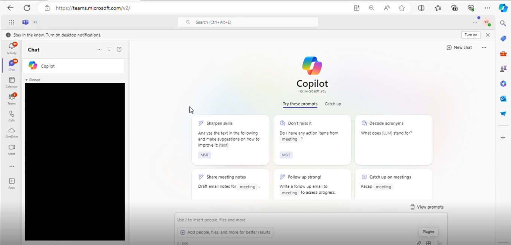
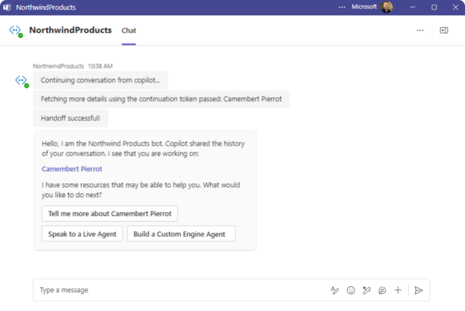

# Northwind inventory message extension sample

This sample demonstrates a Teams message extension that integrates with Microsoft Copilot, allowing users to query the [Northwind Database](https://learn.microsoft.com/dotnet/framework/data/adonet/sql/linq/downloading-sample-databases) efficiently. It supports copilot handoffs for a smooth transition to custom bot interactions, enhancing the user experience.

## Prerequisites

- [Node.js 18.x](https://nodejs.org/download/release/v18.18.2/)
- [Visual Studio Code](https://code.visualstudio.com/)
- [Microsoft 365 Agents Toolkit](https://marketplace.visualstudio.com/items?itemName=TeamsDevApp.ms-teams-vscode-extension)
- You will need a Microsoft work or school account with [permissions to upload custom Teams applications](https://learn.microsoft.com/microsoftteams/platform/concepts/build-and-test/prepare-your-o365-tenant#enable-custom-teams-apps-and-turn-on-custom-app-uploading). The account will also need a Microsoft Copilot for Microsoft 365 license to use the extension in Copilot.

## Setup and use the sample

For instructions on setting up and running the sample, see the [lab exercises](./lab/Exercise%2000%20-%20Welcome.md).

## Example prompts for Copilot

Here are some ideas for prompts to try. If you don't get the result you expect, try typing "new chat" and then trying again.

### Single parameter prompts

- *Find Chai in Northwind Inventory*

- *Who supplies discounted produce to Northwind?*

- *Find high revenue products in Northwind. Have there been any ad campaigns for these products?*

  > [!NOTE]
  > The ad campaign details are in the [sample documents](./sampleDocs/).

### Multi-parameter prompts

- *Find northwind dairy products that are low on stock. Show me a table with the product, supplier, units in stock and on order. Reference the details for each product.*

  (then)

  *OK can you draft an email to our procurement team asking them if we've had any delivery issues with these suppliers?*

- *Find Northwind beverages with more than 100 units in stock*

  (then)

  *What are the payment terms for these suppliers?*

  > [!NOTE]
  > The answer to the 2nd question is in the [sample documents](./sampleDocs/).

- *We’ve been receiving partial orders for Tofu. Find the supplier in Northwind and draft an email summarizing our inventory and reminding them they should stop sending partial orders per our MOQ policy.*

  > [!NOTE]
  > The MOQ policy is in one of the [sample documents](./sampleDocs/).

- *Northwind will have a booth at Microsoft Community Days  in London. Find products with local suppliers and write a LinkedIn post to promote the booth and products.*

  (then)

  *Emphasize how delicious the products are and encourage people to visit our booth at the conference*

- *What beverage is high in demand due to social media that is low stock in Northwind in London. Reference the product details to update stock.*

  > [!NOTE]
  > There is a document that discusses a social media campaign for one of the products in the [sample documents](./sampleDocs/).

### Copilot handoff to bot

This sample has a copilot agent handoff to enable users to transition from Copilot for Microsoft 365 to a custom engine agent or other Teams bot when needed. To try a copilot agent handoff when running the sample, follow the instructions below. Also, see the copilot agent handoff section at the end of [lab Exercise 05](./lab/Exercise%2005%20-%20Code%20tour.md) - Code tour to explore the copilot handoff code in depth. 

- Copilot welcome screen

- Select the handoff to bot button

- A new chat opens with the NorthwindProduct bot in Teams, seemlessly continuing the conversation with context

## 2) App Registration

### Register your application with Azure AD

1. Register a new application in the [Microsoft Entra ID – App Registrations](https://go.microsoft.com/fwlink/?linkid=2083908) portal.
2. Select **New Registration** and on the *register an application page*, set following values:
  * Set **name** to your app name.
  * Choose the **supported account types** (any account type will work)
  * Leave **Redirect URI** empty.
  * Choose **Register**.
3. On the overview page, copy and save the **Application (client) ID, Directory (tenant) ID**. You'll need those later when updating your Teams application manifest and in the appsettings.json.
4. Navigate to **API Permissions**, and make sure to add the follow permissions:
  * Select Add a permission
  * Select Microsoft Graph -> Delegated permissions.
  * `User.Read` (enabled by default)
  * Click on Add permissions. Please make sure to grant the admin consent for the required permissions.
