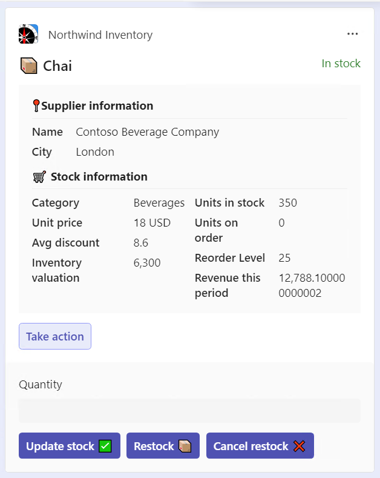

# Building Message Extensions for Microsoft Copilot for Microsoft 365

## Lab Instructions

In this lab, you'll learn to use Teams Message Extensions as plugins in Microsoft Copilot for Microsoft 365. The lab is based on the "Northwind Inventory" sample contained in this same [Github repository](https://github.com/OfficeDev/Copilot-for-M365-Plugins-Samples/tree/main/samples/msgext-northwind-inventory-ts). By using the venerable [Northwind Database](https://learn.microsoft.com/dotnet/framework/data/adonet/sql/linq/downloading-sample-databases), you'll have plenty of simulated enterprise data to work with.

Northwind operates a specialty foods e-commerce business out of Walla Walla, Washington. In this lab, you will be working with the Northwind Inventory application, which provides access to product inventory and financial information.

In **Exercise 1**, you'll set up your development environment and get the application running.

Then, in **Exercise 2**, you'll run the application as a plugin for Copilot for Microsoft 365. You will experiment with various prompts and you will observe how the plugin gets invoked using different parameters. As you chat with Copilot, you can watch the developer console to see queries it's making.

In **Exercise 3**, you will learn how to add a new command to the application, so that you can expand the plugin capabilities and perform more tasks.

Then in **Exercise 4** you'll run the same application as a [message extension](https://learn.microsoft.com/microsoftteams/platform/messaging-extensions/what-are-messaging-extensions) in Microsoft Teams and Outlook.
The message extension allows users to find products and share them in conversations using adaptive cards. These cards allow users in the conversation to take actions such as updating the stock level or restocking a product; this is a huge convenience as people collaborate at work.

Finally, **in Exercise 5** you'll go on a tour of the code to see how it works in more depth. This lab is open source, so you can try it at home! If you don't yet have Copilot, everything else will still work.

TABLE OF CONTENTS

* Welcome (THIS PAGE)
* [Exercise 1](./Exercise%2001%20-%20Set%20up.md) - Set up your development Environment
* [Exercise 2](./Exercise%2002%20-%20Run%20sample%20app.md) - Run the sample as Message Extension
* [Exercise 3](./Exercise%2003%20-%20Run%20in%20Copilot.md) - Run the sample as a Copilot plugin
* [Exercise 4](./Exercise%2004%20-%20Add%20a%20new%20command.md) - Add a new command
* [Exercise 5](./Exercise%2004%20-%20Code%20tour.md) - Code tour
