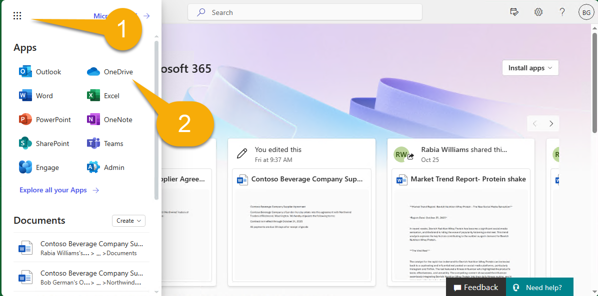
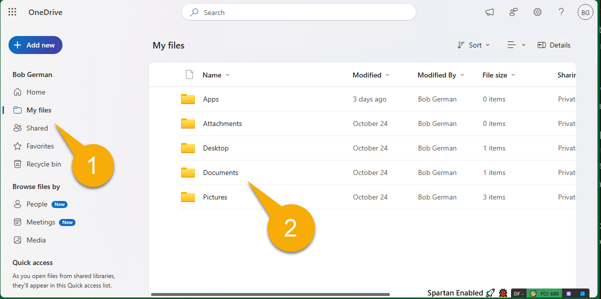
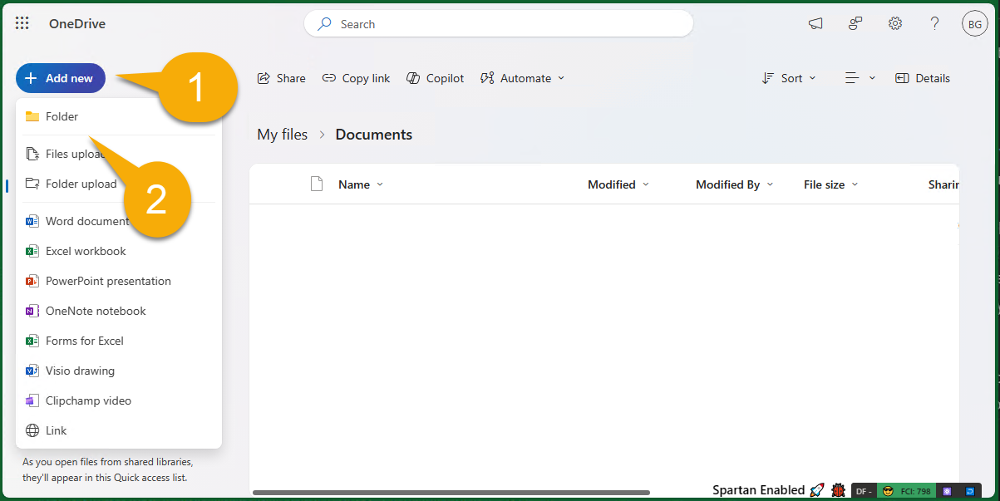
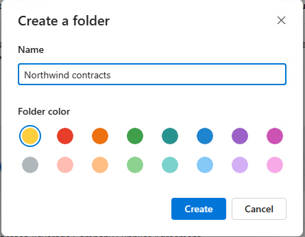
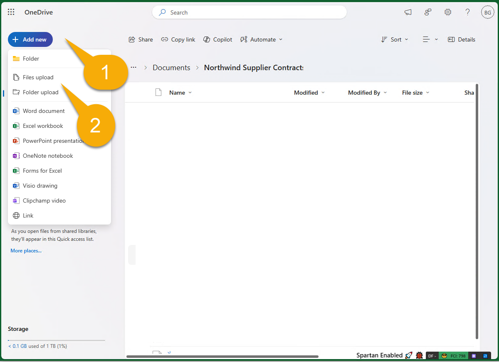
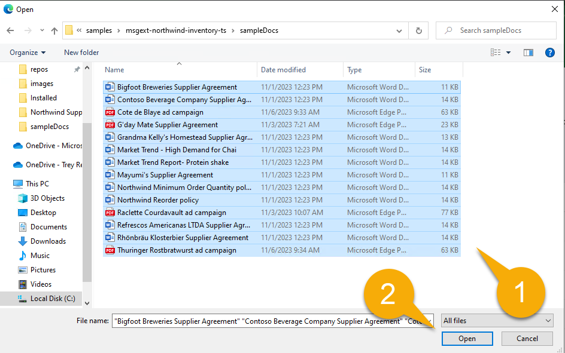
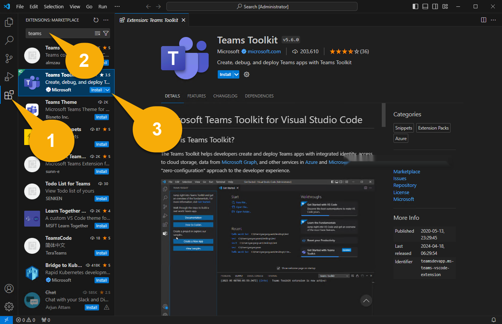
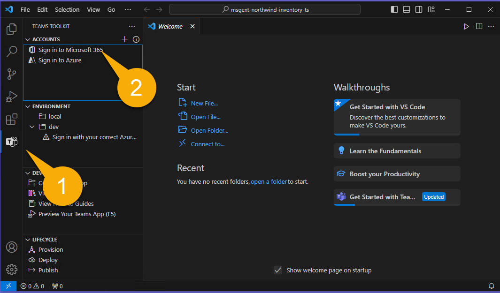
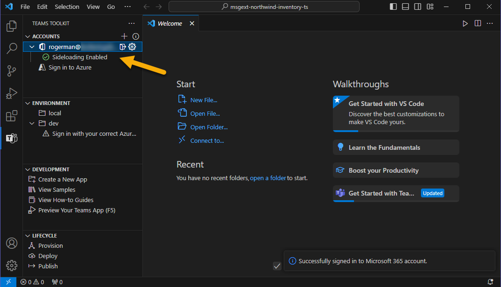

# Building Message Extensions for Microsoft Copilot for Microsoft 365

TABLE OF CONTENTS

* [Welcome](./Exercise%2000%20-%20Welcome.md) 
* Exercise 1 - Set up your development Environment **(THIS PAGE)**
* [Exercise 2](./Exercise%2002%20-%20Run%20sample%20app.md) - Run the sample as a Message Extension
* [Exercise 3](./Exercise%2003%20-%20Run%20in%20Copilot.md) - Run the sample as a Copilot plugin
* [Exercise 4](./Exercise%2003%20-%20Add%20a%20new%20command.md) - Add a new command
* [Exercise 5](./Exercise%2005%20-%20Code%20tour.md) - Code tour

## Exercise 1 - Set up your development environment

## Step 1 - Install prerequisites

**To complete these exercises, you will need a login to a Microsoft 365 subscription with permission to upload applications. The following instructions will explain how to get one.**

**To complete Exercise 3, the account must also be licensed for Microsoft Copilot for Microsoft 365.**

If this is a new tenant, it's a good idea to log into the [Microsoft 365 page](https://office.com) at [https://office.com](https://office.com) before beginning. Depending on how the tenant is configured, you may be asked to set up multi-factor authentication. Ensure you can access Microsoft Teams and Microsoft Outlook before proceeding.

Please install the following on your computer:

1. [Visual Studio Code](https://code.visualstudio.com/) (latest version)

2. [NodeJS version 18.x](https://nodejs.org/download/release/v18.18.2/) - You may want to first install [Node Version Manager](https://github.com/nvm-sh/nvm) or [Node Version Manager for Windows](https://github.com/coreybutler/nvm-windows) so you can change NodeJS versions in the future; if you do, use these commands to install NodeJS version 18.x.

    ~~~sh
    nvm install 18.18
    nvm use 18.18
    ~~~

3. [Azure Storage Explorer](https://azure.microsoft.com/products/storage/storage-explorer/) (OPTIONAL) - Download this if you want to view and edit the Northwind database used in this sample

## Step 2 - Download the sample code

Please [clone](https://github.com/OfficeDev/Copilot-for-M365-Plugins-Samples.git) or [download](https://github.com/OfficeDev/Copilot-for-M365-Plugins-Samples.git) the sample repository: [https://github.com/OfficeDev/Copilot-for-M365-Plugins-Samples/](https://github.com/OfficeDev/Copilot-for-M365-Plugins-Samples/).

Within the cloned or downloaded repository, navigate to the **samples/msgext-northwind-inventory-ts** folder. These labs will refer to this as your "working folder" since this is where you'll be working.

## Step 3 - Copy sample documents to your test user's OneDrive

The sample application includes some documents for Copilot to reference during the labs. In this step you will copy these files to your user's OneDrive so Copilot can find them. Depending on how the tenant is set up, you may be asked to set up multi-factor authentication as part of this process.

Open your browser and browse to Microsoft 365 ([https://www.office.com/](https://www.office.com/)). Log in using the Microsoft 365 account you will be using throughout the lab. You may be asked to set up multi-factor authentication.

Using the "waffle" menu in the upper left corner of the page 1️⃣ , navigate to the OneDrive application within Microsoft 365 2️⃣ .

Within OneDrive, navigate to "My Files" 1️⃣ . If there's a documents folder, click into that as well. If not, you can work directly within the "My Files" location.

Now click "Add new" 1️⃣ and "Folder" 2️⃣ to create a new folder.

Name the folder "Northwind contracts" and click "Create".

Now, from within this new folder, click "Add new" 1️⃣  again but this time click "Files upload" 2️⃣ .

Now browse to the **sampleDocs** folder within your working folder. Highlight all the files 1️⃣ and click "OK" 2️⃣  to upload them all.

By doing this step early, there's a good chance that the Microsoft 365 search engine will have discovered them by the time you're ready for them.

## Step 4 - Install and set up Teams Toolkit for Visual Studio Code

In this step, you'll install the current version of [Teams Toolkit for Visual Studio Code](https://learn.microsoft.com/microsoftteams/platform/toolkit/teams-toolkit-fundamentals?pivots=visual-studio-code-v5). The easiest way to do this is from right inside of Visual Studio Code.

> NOTE: Do not install the pre-release version as it hasn't been tested with this lab

Open your working folder in Visual Studio Code. You may be asked to trust the authors of this folder; if so, please do.

In the left sidebar, select the Extensions icon1️⃣. Enter the word "teams" into the search box 2️⃣ and locate "Teams Toolkit" in the search results. Click "Install" 3️⃣.

Now select the Teams Toolkit icon in the left 1️⃣ . If it offers options to create a new project, you're probably in the wrong folder. In the Visual Studio Code file menu select "Open Folder" and directly open the **msgext-northwind-inventory-ts** folder. You should see sections for Accounts, Environment, etc. as shown below.

Under "Accounts" click "Sign in to Microsoft 365"2️⃣ and log in with your own Microsoft 365 account. You can get a free Microsoft 365 subscription for development purposes by joining the [Microsoft 365 Developer Program](https://developer.microsoft.com/microsoft-365/dev-program).

> [!NOTE]
> The Microsoft 365 Developer Program doesn't include Copilot for Microsoft 365 licenses. As such, if you decide to use a developer tenant, you will be able to test the sample only as a Message Extension.

A browser window will pop up and offer to log into Microsoft 365. When it says "You are signed in now and close this page", please do so.

Now verify that the "Sideloading enabled" checker has a green checkmark. If it doesn't, that means that your user account doesn't have permission to upload Teams applications. This permission is "off" by default; here are [instructions for enabling users to upload custom apps](https://learn.microsoft.com/microsoftteams/teams-custom-app-policies-and-settings#allow-users-to-upload-custom-apps)

## Congratulations

You have completed Exercise 1.
Please proceed to [Exercise 2](./Exercise%2002%20-%20Run%20sample%20app.md) in which you will run the sample application as a message extension.
