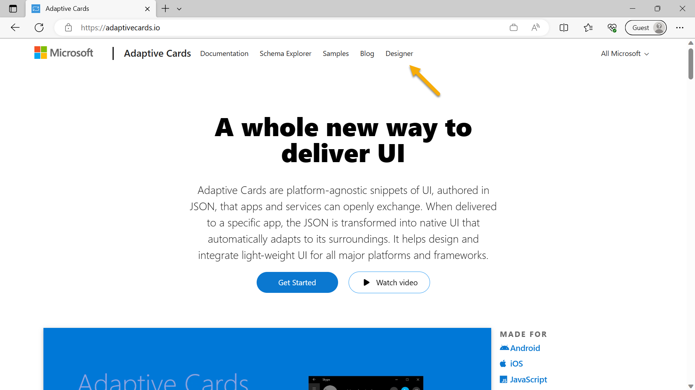
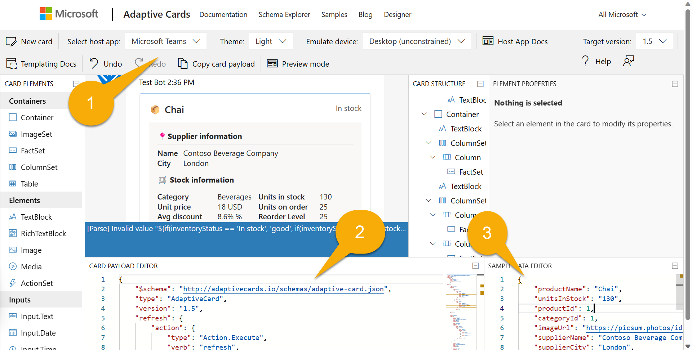

# Building Message Extensions for Microsoft Copilot for Microsoft 365

TABLE OF CONTENTS

* [Welcome](./Exercise%2000%20-%20Welcome.md) 
* [Exercise 1](./Exercise%2001%20-%20Set%20up.md) - Set up your development Environment 
* [Exercise 2](./Exercise%2002%20-%20Run%20sample%20app.md) - Run the sample as a Message Extension
* [Exercise 3](./Exercise%2003%20-%20Run%20in%20Copilot.md) - Run the sample as a Copilot plugin
* [Exercise 4](./Exercise%2003%20-%20Add%20a%20new%20command.md) - Add a new command
* Exercise 5 - Code tour **(THIS PAGE)**

## Exercise 5 - Code tour

In this exercise, you'll review the application code so that you can understand how a Message Extension works.

## Step 1 - Examine the manifest

The core of any Microsoft 365 application is its application manifest. This is where you provide the information Microsoft 365 needs to access your application.

In your working directory, open the [manifest.json](https://github.com/OfficeDev/Copilot-for-M365-Plugins-Samples/blob/main/samples/msgext-northwind-inventory-ts/appPackage/manifest.json) file. This JSON file is placed in a zip archive with two icon files to create the application package. The "icons" property includes paths to these icons.

~~~json
"icons": {
    "color": "Northwind-Logo3-192${{APP_NAME_SUFFIX}}.png",
    "outline": "Northwind-Logo3-32.png"
},
~~~

Notice the token `${{TEAMSFX_ENV}}` in one of the icon names. Teams Toolkit will replace this token with your environment name, such as "local" or "dev" (for an Azure deployment in development). Thus, the icon color will change depending on the environment.

Now have a look at the "name" and "description". Notice that the description is quite long! This is important so both users and Copilot can learn what your application does and when to use it.

~~~json
    "name": {
        "short": "Northwind Inventory",
        "full": "Northwind Inventory App"
    },
    "description": {
        "short": "App allows you to find and update product inventory information",
        "full": "Northwind Inventory is the ultimate tool for managing your product inventory. With its intuitive interface and powerful features, you'll be able to easily find your products by name, category, inventory status, and supplier city. You can also update inventory information with the app. \n\n **Why Choose Northwind Inventory:** \n\n Northwind Inventory is the perfect solution for businesses of all sizes that need to keep track of their inventory. Whether you're a small business owner or a large corporation, Northwind Inventory can help you stay on top of your inventory management needs. \n\n **Features and Benefits:** \n\n - Easy Product Search through Microsoft Copilot. Simply start by saying, 'Find northwind dairy products that are low on stock' \r - Real-Time Inventory Updates: Keep track of inventory levels in real-time and update them as needed \r  - User-Friendly Interface: Northwind Inventory's intuitive interface makes it easy to navigate and use \n\n **Availability:** \n\n To use Northwind Inventory, you'll need an active Microsoft 365 account . Ensure that your administrator enables the app for your Microsoft 365 account."
    },
~~~

Scroll down a bit to "composeExtensions". Compose extension is the historical term for message extension; this is where the app's message extensions are defined.

Within this is a bot, with the ID supplied by Teams Toolkit.

~~~json
    "composeExtensions": [
        {
            "botId": "${{BOT_ID}}",
            "commands": [
                {
                    ...
~~~

Message extensions communicate using the Azure Bot Framework; this provides a fast and secure communication channel between Microsoft 365 and your application. When you first ran your project, Teams Toolkit registered a bot, and will place its bot ID here.

This message extension has two commands, which are defined in the `commands` array. If you have completed [Exercise 4](./Exercise%2004%20-%20Add%20a%20new%20command.md), there will be also a third one. Let's skip the first command for a moment since it's the most complex one. The second command looks like this

~~~json
{
    "id": "discountSearch",
    "context": [
        "compose",
        "commandBox"
    ],
    "description": "Search for discounted products by category",
    "title": "Discounts",
    "type": "query",
    "parameters": [
        {
            "name": "categoryName",
            "title": "Category name",
            "description": "Enter the category to find discounted products",
            "inputType": "text"
        }
    ]
},
~~~

This allows Copilot (or a user) to search for discounted products within a Northwind category. This command accepts a single parameter, "categoryName". 

OK now let's move back to the first command, "inventorySearch". It has 5 parameters, which allows for much more sophisticated queries.

~~~json
{
    "id": "inventorySearch",
    "context": [
        "compose",
        "commandBox"
    ],
    "description": "Search products by name, category, inventory status, supplier location, stock level",
    "title": "Product inventory",
    "type": "query",
    "parameters": [
        {
            "name": "productName",
            "title": "Product name",
            "description": "Enter a product name here",
            "inputType": "text"
        },
        {
            "name": "categoryName",
            "title": "Category name",
            "description": "Enter the category of the product",
            "inputType": "text"
        },
        {
            "name": "inventoryStatus",
            "title": "Inventory status",
            "description": "Enter what status of the product inventory. Possible values are 'in stock', 'low stock', 'on order', or 'out of stock'",
            "inputType": "text"
        },
        {
            "name": "supplierCity",
            "title": "Supplier city",
            "description": "Enter the supplier city of product",
            "inputType": "text"
        },
        {
            "name": "stockQuery",
            "title": "Stock level",
            "description": "Enter a range of integers such as 0-42 or 100- (for >100 items). Only use if you need an exact numeric range.",
            "inputType": "text"
        }
    ]
},
~~~

Copilot is able to fill these in, again based on the descriptions, and the message extension will return a list of products filtered by all the non-blank parameters.

## Step 2 - Examine the "Bot" code

Now open the file **src/searchApp.ts**. This application contains the "bot" code, which communicates with the Azure Bot Framework using the [Bot Builder SDK](https://learn.microsoft.com/azure/bot-service/index-bf-sdk?view=azure-bot-service-4.0).

Notice that the bot extends an SDK class **TeamsActivityHandler**.

~~~typescript
export class SearchApp extends TeamsActivityHandler {
  constructor() {
    super();
  }

  ...
~~~

By overriding the methods of the **TeamsActivityHandler**, the application is able to handle messages (called "activities") coming from Microsoft 365.

The first of these is a Messaging Extension Query activity ("messaging extension" is another historical name for a message extension). This function is called when a user types into a message extension or when Copilot calls it.

~~~typescript
  // Handle search message extension
  public async handleTeamsMessagingExtensionQuery(
    context: TurnContext,
    query: MessagingExtensionQuery
  ): Promise<MessagingExtensionResponse> {

    switch (query.commandId) {
      case productSearchCommand.COMMAND_ID: {
        return productSearchCommand.handleTeamsMessagingExtensionQuery(context, query);
      }
      case discountedSearchCommand.COMMAND_ID: {
        return discountedSearchCommand.handleTeamsMessagingExtensionQuery(context, query);
      }
    }
  }
~~~

All it's doing is dispatching the query to the based on the command ID. These are the same command ID's used in the manifest above.

The other type of activity our app needs to handle is the adaptive card actions, such as when a user clicks on "Update stock" or "Reorder" on an adaptive card. Since there is no specific method for an adaptive card action, the code overrides `onInvokeActivity()`, which is a much broader class of activity that includes message extension queries. For that reason, the code manually checks the activity name, and dispatches to the appropriate handler. If the activity name isn't for an adaptive card action, the `else` clause runs the base implementation of `onInvokeActivity()` which, among other things, will call our `handleTeamsMessagingExtensionQuery()` method if the Invoke activity is a query.

~~~typescript
import {
  TeamsActivityHandler,
  TurnContext,
  MessagingExtensionQuery,
  MessagingExtensionResponse,
  InvokeResponse
} from "botbuilder";
import productSearchCommand from "./messageExtensions/productSearchCommand";
import discountedSearchCommand from "./messageExtensions/discountSearchCommand";
import revenueSearchCommand from "./messageExtensions/revenueSearchCommand";
import actionHandler from "./adaptiveCards/cardHandler";

export class SearchApp extends TeamsActivityHandler {
  constructor() {
    super();
  }

  // Handle search message extension
  public async handleTeamsMessagingExtensionQuery(
    context: TurnContext,
    query: MessagingExtensionQuery
  ): Promise<MessagingExtensionResponse> {

    switch (query.commandId) {
      case productSearchCommand.COMMAND_ID: {
        return productSearchCommand.handleTeamsMessagingExtensionQuery(context, query);
      }
      case discountedSearchCommand.COMMAND_ID: {
        return discountedSearchCommand.handleTeamsMessagingExtensionQuery(context, query);
      }
    }

  }

  // Handle adaptive card actions
  public async onInvokeActivity(context: TurnContext): Promise<InvokeResponse> {
    let runEvents = true;
    // console.log (`🎬 Invoke activity received: ${context.activity.name}`);
    try {
      if(context.activity.name==='adaptiveCard/action'){
        switch (context.activity.value.action.verb) {
          case 'ok': {
            return actionHandler.handleTeamsCardActionUpdateStock(context);
          }
          case 'restock': {
            return actionHandler.handleTeamsCardActionRestock(context);
          }
          case 'cancel': {
            return actionHandler.handleTeamsCardActionCancelRestock(context);
          }
          default:
            runEvents = false;
            return super.onInvokeActivity(context);
        }
      } else {
          runEvents = false;
          return super.onInvokeActivity(context);
      }
    } ...
~~~

## Step 3 - Examine the message extension command code

In an effort to make the code more modular, readable, and reusable, each message extension command has been placed in its own TypeScript module. Have a look at **src/messageExtensions/discountSearchCommand.ts** as an example.

First, note that the module exports a constant `COMMAND_ID`, which contains the same command ID found in the app manifest, and allows the switch statement in **searchApp.ts** to work properly.

Then it provides a function, `handleTeamsMessagingExtensionQuery()`, to handle incoming queries for discounted products by category.

~~~json
async function handleTeamsMessagingExtensionQuery(
    context: TurnContext,
    query: MessagingExtensionQuery
): Promise<MessagingExtensionResponse> {

    // Seek the parameter by name, don't assume it's in element 0 of the array
    let categoryName = cleanupParam(query.parameters.find((element) => element.name === "categoryName")?.value);
    console.log(`💰 Discount query #${++queryCount}: Discounted products with categoryName=${categoryName}`);

    const products = await getDiscountedProductsByCategory(categoryName);

    console.log(`Found ${products.length} products in the Northwind database`)
    const attachments = [];
    products.forEach((product) => {
        const preview = CardFactory.heroCard(product.ProductName,
            `Avg discount ${product.AverageDiscount}% Supplied by ${product.SupplierName} of ${product.SupplierCity}`,
            [product.ImageUrl]);

        const resultCard = cardHandler.getEditCard(product);
        const attachment = { ...resultCard, preview };
        attachments.push(attachment);
    });
    return {
        composeExtension: {
            type: "result",
            attachmentLayout: "list",
            attachments: attachments,
        },
    };
}
~~~

Notice that the index in the `query.parameters` array may not correspond to the parameter's position in the manifest. While this is generally only an issue for a multi-parameter command, the code will still get the value based on the parameter name rather than hard coding an index.
After cleaning up the parameter (trimming it, and handling the fact that sometimes Copilot assumes "*" is a wildcard that matches everything), the code calls the Northwind data access layer to `getDiscountedProductsByCategory()`.

Then it iterates through the products and creates two cards for each:

* a _preview_ card, which is implemented as a "hero" card (these predate adaptive cards and are very simple). This is what's displayed in the search results in the user interface and in some citations in Copilot.
* a _result_ card, which is implemented as an "adaptive" card that includes all the details.

In the next step, we'll review the adaptive card code and check out the Adaptive Card designer.

## Step 4 - Examine the adaptive cards and related code

The project's adaptive cards are in the **src/adaptiveCards** folder. There are 3 cards, each implemented as a JSON file.

* **editCard.json** - This is the initial card that's displayed by the message extension or a Copilot reference
* **successCard.json** - When a user takes action, this card is displayed to indicate success. It's mostly the same as the edit card except it includes a message to the user.
* **errorCard.json** - If an action fails, this card is displayed.

Let's take a look at the edit card in the Adaptive Card Designer. Open your web browser to [https://adaptivecards.io](https://adaptivecards.io) and click the "Designer" option at the top.

Notice the data binding expressions such as `"text": "📦 ${productName}",`. This binds the `productName` property in the data to the text on the card.

Now select "Microsoft Teams" as the host application 1️⃣ . Paste the entire contents of **editCard.json** into the Card Payload Editor 2️⃣ , and the contents of **sampleData.json** into the Sample Data Editor 3️⃣ . The sample data is identical to a product as provided in the code.

You should see the card as rendered, except for a small error which arises due to the designer's inability to display one of the adaptive card formats.

Near the top of the page, try changing the Theme and Emulated Device to see how the card would look in dark theme or on a mobile device. This is the tool that was used to build adaptive cards for the sample application.

Now, back in Visual Studio Code, open **cardHandler.ts**. The function `getEditCard()` is called from each of the message extension commands to obtain a result card. The code reads the adaptive card JSON - which is considered a template - and then binds it to product data. The result is more JSON - the same card as the template, with the data binding expressions all filled in. Finally, the `CardFactory` module is used to convert the final JSON into an adaptive card object for rendering.

~~~typescript
function getEditCard(product: ProductEx): any {

    var template = new ACData.Template(editCard);
    var card = template.expand({
        $root: {
            productName: product.ProductName,
            unitsInStock: product.UnitsInStock,
            productId: product.ProductID,
            categoryId: product.CategoryID,
            imageUrl: product.ImageUrl,
            supplierName: product.SupplierName,
            supplierCity: product.SupplierCity,
            categoryName: product.CategoryName,
            inventoryStatus: product.InventoryStatus,
            unitPrice: product.UnitPrice,
            quantityPerUnit: product.QuantityPerUnit,
            unitsOnOrder: product.UnitsOnOrder,
            reorderLevel: product.ReorderLevel,
            unitSales: product.UnitSales,
            inventoryValue: product.InventoryValue,
            revenue: product.Revenue,
            averageDiscount: product.AverageDiscount
        }
    });
    return CardFactory.adaptiveCard(card);
}
~~~

Scrolling down, you'll see the handler for each of the action buttons on the card. The card submits data when an action button is clicked - specifically `data.txtStock`, which is the "Quantity" input box on the card, and `data.productId`, which is sent in each card action to let the code know what product to update.

~~~typescript
async function handleTeamsCardActionUpdateStock(context: TurnContext) {

    const request = context.activity.value;
    const data = request.action.data;
    console.log(`🎬 Handling update stock action, quantity=${data.txtStock}`);

    if (data.txtStock && data.productId) {

        const product = await getProductEx(data.productId);
        product.UnitsInStock = Number(data.txtStock);
        await updateProduct(product);

        var template = new ACData.Template(successCard);
        var card = template.expand({
            $root: {
                productName: product.ProductName,
                unitsInStock: product.UnitsInStock,
                productId: product.ProductID,
                categoryId: product.CategoryID,
                imageUrl: product.ImageUrl,
                ...
~~~

As you can see, the code obtains these two values, updates the database, and then sends a new card that contains a message and the updated data.

## Step 5 - Examine the copilot handoff code

When running the Northwind inventory message extension in Copilot for Microsoft 365, users are able to transfer from the Northwind experience in Copilot for Microsoft 365 to a Northwind Products bot in Teams via a copilot handoff.

### The copilot handoff 
Users of the Northwind inventory message extension can transfer from their chat with the copilot plugin in Microsoft for Copilot 365 to a chat with the Northwind Inventory bot in Teams via a copilot handoff.

The copilot handoff is accomplished in two primary steps by: 
1) Creating a deep link URL

2) Handling the `onInvokeActivity` handler in the bot code.

### Creating a deep link URL

The deep link contains the BotID of the Teamsbot the user is transferred to and a continuationtoken to pass the context from the chat with Copilot for Microsoft 365 to the new chat in Teams. Users can access this deeplink via the `Action.OpenURL` added into the adaptive card in the message extension as seen in the **editCard.json** adaptive card. 

~~~typescript
  {
      "type": "Action.OpenUrl",
      "title": "Handoff to bot",
      "url": "https://teams.microsoft.com/l/chat/0/0?users=${botId}&continuation=${continuationToken}"
  }
~~~

This creates the clickable “handoff to bot button” seen in the adaptive card

In this example, the botID is automatically populated via `=${botId}`. You can choose to specify a different bot by following the botID format `28:<botId>`. For example if the botId is `68935e91-ff09-4a33-a675-0fe09f015706`, then url above would be: 

`https://teams.microsoft.com/l/chat/0/0?users28:68935e91-ff09-4a33-a675-0fe09f015706&continuation=${continuationToken}`

The `Action.OpenUrl` property allows the user to hand off the conversation to the NorthwindProducts bot. When a user selects the action button, the deep link is activated and opens a new chat window with the bot in Teams. The bot receives an invoke call with a payload, which contains the continuation token from the URL and uses the token to maintain the context of the conversation as shown below.

When the bot receives the handoff/action invoke activity, it uses the continuation token to look up any necessary information to continue the conversation seamlessly. This involves retrieving conversation history, user preferences, or any other context needed to provide a consistent experience.

### Handling the invoke Type in the bot code

For the bot to handle the invoke call, override onInvokeActivity method as seen in the **searchApp.ts** file.

~~~typescript
// Handle invoke activities
  
  public async onInvokeActivity(context: TurnContext): Promise<InvokeResponse> {
    try {
      switch (context.activity.name) {
        case "handoff/action": {
          this.addOrUpdateContinuationParameters(context);
          setTimeout(async () => await this.notifyContinuationActivity(), 10);
          return { status: 200 }; // return just the http status 
        }
        case "composeExtension/query":
          return {
            status: 200,
            body: await this.handleTeamsMessagingExtensionQuery(
              context,
              context.activity.value
            ),
          };

        default:
          return {
            status: 200,
            body: `Unknown invoke activity handled as default- ${context.activity.name}`,
          };
      }
    } catch (err) {
      console.log(`Error in onInvokeActivity: ${err}`);
      return {
        status: 500,
        body: `Invoke activity received- ${context.activity.name}`,
      };
    }
  }
~~~

The response to this invoke call can only be a http status code 200 for success or anything in the range of 400-500 for error. Any text or card response intended to be delivered to the user based on processing the continuation token received in the invoke call must be asynchronously notified to the user.

Now, when bot receives the invoke call, `context.activity.value.continuation` will contain the continuationToken that was set in the deeplink url.

### Notifying Users in the New Chat (Recommended)

To help manage expectations if there is some delay in returning a continuation response from bot due to network latency and processing time, NorthwindProducts sends a series of activities to keep the user informed as seen in the **index.ts** file. 

~~~typescript
          await context.sendActivities([
            {
              type: ActivityTypes.Message,
              text: "Continuing conversation from copilot...",
            },
            { type: ActivityTypes.Typing },
            { type: "delay", value: 1000 },
            {
              type: ActivityTypes.Message,
              text: `Fetching more details using the continuation token passed: ${continuationToken}`,
            },
            { type: ActivityTypes.Typing },
            { type: "delay", value: 4000 },
            {
              type: ActivityTypes.Message,
              text: `Handoff successful!`,
              attachments: [(continuationParameter as any).cardAttachment],
            },
          ]);
~~~

The user sees these messages upon entering in the new Teams chat letting them know this chat is being continued from copilot and the user can continue the chat with context when the continuation token is received moments later. 

The final message shown in the sequence of messages sent utilizes an adaptive card defined in the **src\adaptiveCards\successCardHandoff.json** file, which can be customized including establishing the context by including the continuationToken in the welcome textblock and further guiding the conversation with the user by utilizing the continuationToken in the action buttons at the bottom of the adaptive card, allowing users to select the best option to address their needs.

### Managing Adapter Cards with the ContinuationToken

As this sample utilizes many adaptive cards, the **cardHandler.ts** file is used to manage the several different cards being utilized including the **successCardHandoff.json** adaptive card. 

For each adaptive card in the sample the continuationToken is defined to include the `product.ProductName` as the chosen context to share to the bot during a handoff. You can adjust this to include different data to be shared with the user following the handoff.  

~~~typescript
function getEditCard(product: ProductEx, context: TurnContext): any {

    var template = new ACData.Template(editCard);
    var card = template.expand({
        $root: {
            productName: product.ProductName,
            unitsInStock: product.UnitsInStock,
            productId: product.ProductID,
            categoryId: product.CategoryID,
            imageUrl: product.ImageUrl,
            supplierName: product.SupplierName,
            supplierCity: product.SupplierCity,
            categoryName: product.CategoryName,
            inventoryStatus: product.InventoryStatus,
            unitPrice: product.UnitPrice,
            quantityPerUnit: product.QuantityPerUnit,
            unitsOnOrder: product.UnitsOnOrder,
            reorderLevel: product.ReorderLevel,
            unitSales: product.UnitSales,
            inventoryValue: product.InventoryValue,
            revenue: product.Revenue,
            averageDiscount: product.AverageDiscount,
            botId: getBotMri(context),
            continuationToken: product.ProductName,
        }
    });
    return CardFactory.adaptiveCard(card);
}
~~~

At the bottom of the **cardHandler.ts** file, the code specifies the successCardHandoff as the adaptive card template to be used when the continuationToken is present, and it populates the adaptive card with the corresponding data from the continuationToken.

~~~typescript
  async function handleTeamsCardActionHandOff(context: TurnContext) {
    const request = context.activity.value;
    const data = request.action.data;
    console.log(
      `🎬 Handling copilot handoff case, continuationToken=${data.continuationToken}`
    );
  
    if (data.continuationToken) {
      var template = new ACData.Template(successCardHandoff);
      var card = template.expand({
        $root: {
          continuationToken: data.continuationToken,
        },
      });
  
      return CreateAdaptiveCardInvokeResponse(200, card);
    } else {
      return CreateActionErrorResponse(400, 0, "Invalid request");
    }
  }

  function handleTeamsCardActionHandOffWithContinuation(
    continuationToken: string
  ) {
    console.log(
      `🎬 Handling copilot handoff case, continuationToken=${continuationToken}`
    );
  
    var template = new ACData.Template(successCardHandoff);
    var card = template.expand({
      $root: {
        continuationToken,
      },
    });
  
    return CardFactory.adaptiveCard(card);
  }
~~~

Now, the full handoff experience has been set up. Next, you can create your own copilot handoff tailored for your users.

## Congratulations

You have completed Exercise 5 and the Copilot for Microsoft 365 Message Extensions plugin lab. Thanks very much for doing these labs!
