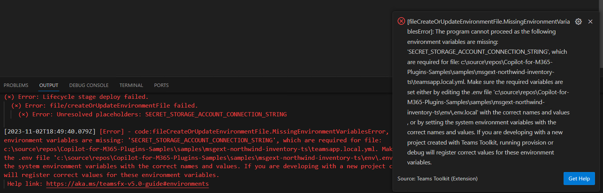
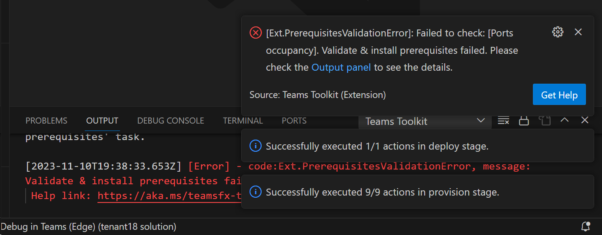
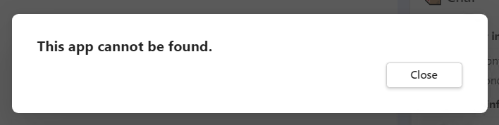
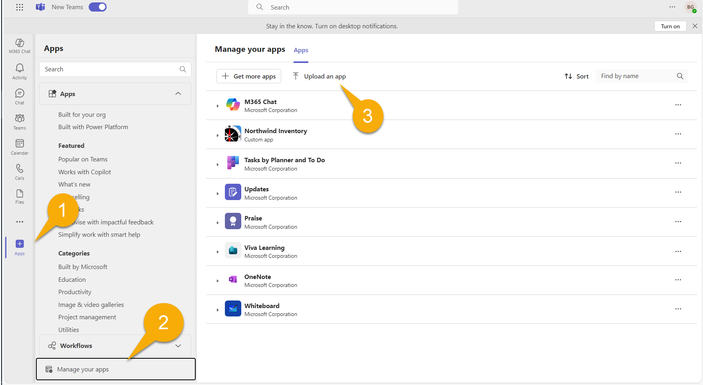

# Building Message Extensions for Microsoft Copilot for Microsoft 365

TABLE OF CONTENTS

* [Welcome](./Exercise%2000%20-%20Welcome.md)
* [Exercise 1](./Exercise%2001%20-%20Set%20up.md) - Set up your development Environment
* [Exercise 2](./Exercise%2002%20-%20Run%20sample%20app.md) - Run the sample Message Extension
* [Exercise 3](./Exercise%2003%20-%20Run%20in%20Copilot.md) - Run the sample as a Copilot plugin
* [Exercise 4](./Exercise%2004%20-%20Code%20tour.md) - Code tour

## Common errors and how to fix them

### App won't start first time

This happens when the environment variable `SECRET_STORAGE_ACCOUNT_CONNECTION_STRING` is missing from **.env.local.user**.
See Exercise 2 Step 1 or just add this text to **.env.local.user**:

~~~text
SECRET_STORAGE_ACCOUNT_CONNECTION_STRING=UseDevelopmentStorage=true
~~~

### Ports occupied error

This happens if you shut down the debugger and then immediately start your app again. It takes a moment for your app to stop running and release its TCP ports. Just close the error and try again.

### The app takes a long time to start after pressing F5 or the debug button

The first time, it's normal for this to take several minutes as Teams Toolkit will be downloading a bunch of npm packages. However it should be faster on subsequent startups. If it doesn't seem to be doing anything and the browser doesn't open to install your app, please close and re-open Visual Studio Code and try again.

### Start debugger with Teams v2

If you've switched to Teams v2 and you (re)start the debugger, the application upload will fail. This is a known issue. If you previously uploaded the same application (since you made any manifest changes), just click Close; your app is still installed from before and should work normally. If you need to re-upload the applicaiton, either switch back to Teams v1 or upload it manually.

To manually upload, click "Apps" in the left sidebar 1️⃣ , then "Manage your apps" 2️⃣ . From there, click "Upload an app" 3️⃣ and upload the application package, which is a file in your working directory at **appPackage/build/appPackage.local.zip**.

