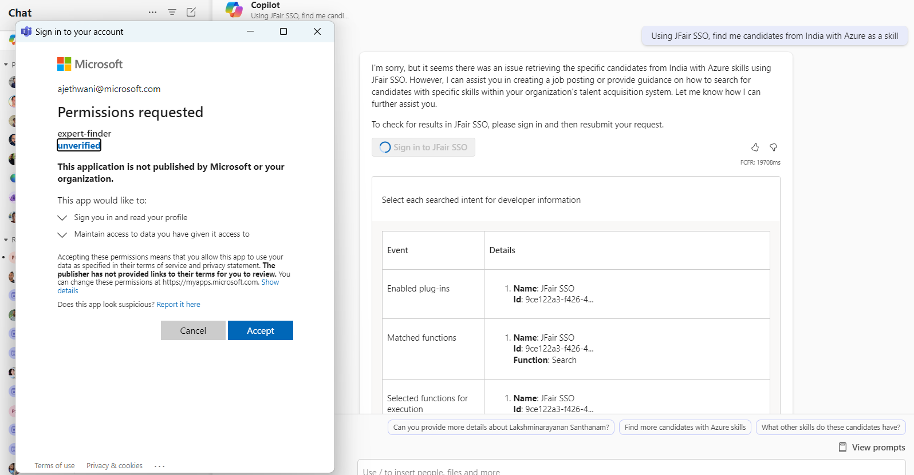
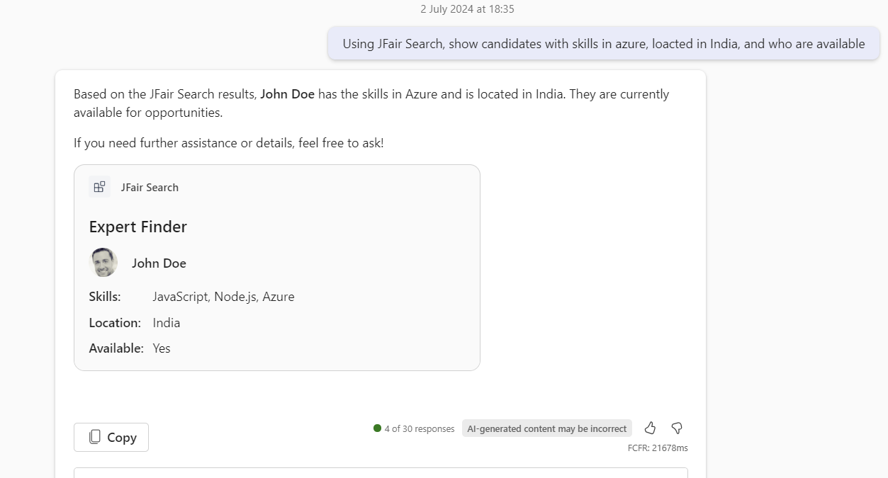

# Expert Finder message extension sample

## Interaction with app

 

## Try it yourself - experience the App in your Microsoft Teams client
Please find below demo manifest which is deployed on Microsoft Azure and you can try it yourself by uploading the app package (.zip file link below) to your teams and/or as a personal app. (Sideloading must be enabled for your tenant, [see steps here](https://docs.microsoft.com/microsoftteams/platform/concepts/build-and-test/prepare-your-o365-tenant#enable-custom-teams-apps-and-turn-on-custom-app-uploading)).

**Microsoft Teams Expert Finder sample app:** [Manifest](/samples/msgext-epert-finder-js/demo-manifest/expert-finder.zip)

## Prerequisites

- [Node.js 18.x](https://nodejs.org/download/release/v18.18.2/)
- [Visual Studio Code](https://code.visualstudio.com/)
- [Blob Storage](https://learn.microsoft.com/en-us/azure/storage/blobs/storage-quickstart-blobs-portal)
- [Teams Toolkit](https://marketplace.visualstudio.com/items?itemName=TeamsDevApp.ms-teams-vscode-extension)
- You will need a Microsoft work or school account with [permissions to upload custom Teams applications](https://learn.microsoft.com/microsoftteams/platform/concepts/build-and-test/prepare-your-o365-tenant#enable-custom-teams-apps-and-turn-on-custom-app-uploading). The account will also need a Microsoft Copilot for Microsoft 365 license to use the extension in Copilot.


## Setup and use the sample

1) Create azure storage account
   Refer the document [Create storage account]("https://learn.microsoft.com/en-us/azure/storage/common/storage-account-create?tabs=azure-portal") and create a storage account in azure.

2) Follow the steps mentioned to [Create azure table storage]("https://learn.microsoft.com/en-us/azure/storage/tables/table-storage-quickstart-portal") inside storage account.

3) Follow schema as given in below image while creating azure table.
   

4) Clone the repository

    ```bash
    git clone https://github.com/OfficeDev/Microsoft-Teams-Samples.git
    ```
5) Navigate to the `samples/msgext-expert-finder-js` folder and open with Visual Studio Code.

6) Navigate to the `samples/msgext-expert-finder-js/.localConfigs` directory and update the values below.

   ```txt
      CONNECTION_STRING=<table storage connection string> (Created in step 2)
      TABLE_NAME=<table name> (Created in step 2)
   ```

## Run the app (Using Teams Toolkit for Visual Studio Code)

- Note : Make sure you have followed all the earlier steps of setting up the sample and creating table storage. Make sure all connection string values are added in ebv files before running the sample in toolkit.

The simplest way to run this sample in Teams is to use Teams Toolkit for Visual Studio Code.

1. Ensure you have downloaded and installed [Visual Studio Code](https://code.visualstudio.com/docs/setup/setup-overview)
1. Install the [Teams Toolkit extension](https://marketplace.visualstudio.com/items?itemName=TeamsDevApp.ms-teams-vscode-extension)
1. Select **File > Open Folder** in VS Code and choose this samples directory from the repo
1. Using the extension, sign in with your Microsoft 365 account where you have permissions to upload custom apps
1. Select **Debug > Start Debugging** or **F5** to run the app in a Teams web client.
1. In the browser that launches, select the **Add** button to install the app to Teams.

> If you do not have permission to upload custom apps (sideloading), Teams Toolkit will recommend creating and using a Microsoft 365 Developer Program account - a free program to get your own dev environment sandbox that includes Teams.

### Test the app in Copilot for Microsoft 365
Navigate to the Microsoft Copilot for Microsoft 365 chat. Check the lower left of the chat user interface, below the compose box. You should see a plugin icon. Click this and enable theExpert-finder plugin.


- Use a basic prompts like : 
1) `Find candidates with skill in Azure.`
2) `Find candidates with skill in React and which are from India.`
3) `Find candidates with skill in Azure and available for interview.`

## Running the sample

**SSO auth**


**Search based on skills**


**Search based on skills and country**


**Search based on multiple parameters**


## Further reading

- [Message extensions for Microsoft Copilot for Microsoft 365](https://learn.microsoft.com/en-us/microsoft-365-copilot/extensibility/overview-message-extension-bot)
- [Azure table storage]("https://learn.microsoft.com/en-us/azure/storage/tables/table-storage-quickstart-portal")


