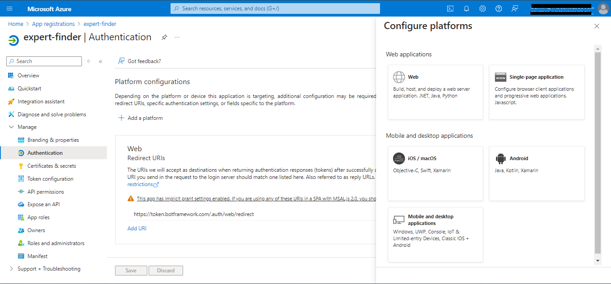

# Expert Finder message extension sample with SSO

This sample demonstrates a Teams message extension integrated with Microsoft Copilot, enabling users to efficiently search a database of candidates based on their skills, location, and availability. The extension features Single Sign-On (SSO) for enhanced user experience and authentication.

> Compared to the [original repository](https://github.com/OfficeDev/Microsoft-Teams-Samples/tree/main/samples/msgext-expert-finder-js), I have added several notes to this repository for debugging. For easier identification, my notes will be prefixed with the emoji‼️.

## Table of Contents
1. [Interaction with app](#interaction-with-app)
2. [Try it yourself - experience the App in your Microsoft Teams client](#try-it-yourself---experience-the-app-in-your-microsoft-teams-client)
3. [Prerequisites](#prerequisites)
1. [Setup resources and environment via Teams Toolkit for Visual Studio Code)](#setup-resources-and-environment-via-teams-toolkit-for-visual-studio-code)
2. [Setup Single Sign-On (SSO)](#setup-single-sign-on-sso)
4. [Upload the app package to teams](#upload-the-app-package-to-teams)
5. [Test the app in Copilot for Microsoft 365](#test-the-app-in-copilot-for-microsoft-365)
6. [Running the sample](#running-the-sample)
7. [Further reading](#further-reading)

## Interaction with app

Using this messaging extension sample, we demonstrate two capabilities of Copilot for M365:
1) To search across a database of candidates to find a relevant "expert" based on multiple parameters such as their skill, location and availability.
2) Single Sign-On (SSO)

On first use, a window requesting for Sign In pops-up and once SSO is completed, the user flow continues as usual. 

The database of candidates is hosted in an Azure Table storage, and the app itself is a messaging extension that can be used as a plug-in within Copilot for M365.

 

## Try it yourself - experience the App in your Microsoft Teams client
Please find below demo manifest which is deployed on Microsoft Azure and you can try it yourself by uploading the app package (.zip file link below) to your teams and/or as a personal app. (Sideloading must be enabled for your tenant, [see steps here](https://docs.microsoft.com/microsoftteams/platform/concepts/build-and-test/prepare-your-o365-tenant#enable-custom-teams-apps-and-turn-on-custom-app-uploading)).

**Microsoft Teams Expert Finder sample app:** [Manifest](/samples/msgext-expert-finder-js/demo-manifest/expert-finder.zip)

## Prerequisites

- [Node.js 18.x](https://nodejs.org/download/release/v18.18.2/)
- [Visual Studio Code](https://code.visualstudio.com/)
- [Table Storage](https://learn.microsoft.com/en-us/azure/storage/tables/table-storage-quickstart-portal)
- [Teams Toolkit](https://marketplace.visualstudio.com/items?itemName=TeamsDevApp.ms-teams-vscode-extension)
- You will need a Microsoft work or school account with [permissions to upload custom Teams applications](https://learn.microsoft.com/microsoftteams/platform/concepts/build-and-test/prepare-your-o365-tenant#enable-custom-teams-apps-and-turn-on-custom-app-uploading). The account will also need a Microsoft Copilot for Microsoft 365 license to use the extension in Copilot.


## Setup resources and environment via Teams Toolkit for Visual Studio Code

### Setup table storage
1) Create Azure storage account: Refer to the [Create azure storage account documentation](https://learn.microsoft.com/en-us/azure/storage/common/storage-account-create?tabs=azure-portal) to create a storage account in Azure.

2) Follow the steps mentioned to [Create azure table storage](https://learn.microsoft.com/en-us/azure/storage/tables/table-storage-quickstart-portal) inside the storage account.

3) Follow the schema as given in the below image while creating the azure table. \


5) Clone the repository

    ```bash
    git clone https://github.com/OfficeDev/Microsoft-Teams-Samples.git
    ```
6) Navigate to the `samples/msgext-expert-finder-js` folder and open with Visual Studio Code.

7) Navigate to the `.localConfigs` directory and update the values below.

   ```txt
      AZURE_TABLE_STORAGE_CONNECTION_STRING=<azure storage account connection string> (Created in step 1)
      AZURE_TABLE_TABLE_NAME=<azure table name> (Created in step 2)
   ```
‼️Note : Remember to update the values in `.localConfigs` with single quotation marks. For example, ```AZURE_TABLE_TABLE_NAME='sampleTable'```.

### Run the sample

Make sure you have followed all the earlier steps of setting up the sample and creating table storage. Make sure all connection string values are added in `samples/msgext-expert-finder-js/.localConfigs` file before running the sample in toolkit.

The simplest way to run this sample in Teams is to use Teams Toolkit for Visual Studio Code.

1. Ensure you have downloaded and installed [Visual Studio Code](https://code.visualstudio.com/docs/setup/setup-overview)
1. Install the [Teams Toolkit extension](https://marketplace.visualstudio.com/items?itemName=TeamsDevApp.ms-teams-vscode-extension)
1. Select **File > Open Folder** in VS Code and choose this samples directory from the repo
1. Using the extension, sign in with your Microsoft 365 account where you have permissions to upload custom apps
1. ‼️Note : Navigate to `src/searchApp.js` and change `tableName` into `storageTableName` which corresponds to `.localConfigs`. \
   
1. Select **Debug > Start Debugging** or **F5** to run the app in a Teams web client. \
   

‼️Note : When provisioning, if `botAadApp/create.MissingServiceManagementReference` occurs, please create the Microsoft Entra App in App registrations manually. After that add `BOT_ID` in `env/.env.local` and `SECRET_BOT_PASSWORD` in `env/.env.local.user`.


‼️Note : Navigate to `.localConfigs`, make sure that `BOT_ID` and `BOT_PASSWORD`, which are identical to `BOT_ID` in `env/.env.local` and `SECRET_BOT_PASSWORD` in `env/.env.local.user`, are filled. If not, please add them manually.

‼️Note : When provisioning, if an error related to `teamsApp/validateManifest` occurs, you can check out `appPackage/manifest.json` to see if a comma is missing between `validDomains` and `webApplicationInfo`.


‼️Note : When provisioning, if you get the Port Occupancy error, you can open Task Manager and end Node.js runtime with right click.
 \


## Setup Single Sign-On (SSO)

### Setup app registration
The app registrations in azure portal and search for the app registration will be created by toolkit automatically. You will get the resource suffix inside `env/.env.local` with key as `APP_NAME_SUFFIX`. This resource suffix should be used to search the created azure resources. For example, you can search the app registration with name like `expert-finder-local` 

1) Navigate to app registrations in Azure portal
 
2) Under Manage > Authentication > Platform Configurations > Add a Platform > Web > Redirect URIs
    - Add the URI `https://token.botframework.com/.auth/web/redirect`
    - Under implicit grant flow, make sure `Access token` and `Id token` both options are selected. 
    - Select Configure
 
   
3) Under Manage > Expose an API
    - Set your Application ID URI to include your bot id in the following format - `api://botid-<app-id>`, where `<app-id>` is the id of the bot that will be making the SSO request and can be found in `env/.env.local` file in your sample solution.
    
    - Click "_Add a scope_"
        - "_access_as_user_" as the Scope name.
        - Set Who can consent? to "_Admins and users_"
        - Fill in the fields for configuring the admin and user consent prompts with values that are appropriate for the access_as_user scope.
            - Admin consent display name: _Teams can access the user’s profile_
            - Admin consent description: _Allows Teams to call the app’s web APIs as the current user._
            - User consent display name: _Teams can access your user profile and make requests on your behalf_
            - User consent description: _Enable Teams to call this app’s APIs with the same rights that you have_
        - Ensure that State is set to _Enabled_
        - Click on Add scope button (Note: The domain part of the Scope name displayed just below the text field should automatically match the Application ID URI set in the previous step, with /access_as_user appended to the end)
        
     - Authorize client applications by adding the following Ids as authorized clients for your application
         - `1fec8e78-bce4-4aaf-ab1b-5451cc387264` (Teams mobile/desktop application)
         - `5e3ce6c0-2b1f-4285-8d4b-75ee78787346` (Teams web application)
     

### Setup Azure Bot Service Connection (TokenStore)
Azure bot will be created automatically in the selected subscription and resource group while running the sample using Toolkit. \
‼️Note : If the Azure bot isn't created automactically, please go to the [Bot portal](https://dev.botframework.com) > My bots page. Choose the bot you create and click the "migrate" button.


1. In the Azure Portal, go to the resource group selected while running the sample using toolkit and navigate to the Azure Bot resource
2. Switch to Settings and Configuration section and click on `Add OAuth Connection Settings`
    
3. Fill out the Connection Setting form
    - Enter a name for your new Connection setting. Keep the name as `authbot`.
    - In the Service Provider dropdown, select `Azure Active Directory V2`
    - Enter the client id and client secret generated automatically while running the sample using Toolkit.
    - For client secret, navigate to `env/.env.local.user` and select the `Decrypt secret` option to get the decrypted client secret.
    - For client id, navigate to `env/.env.local` and select the `BOT_ID` option to get the client id.
    - For the Token Exchange URL use the Application ID URI obtained in step 3. (Uri in format `api://botid-<app-id>`)
    - Specify `common` as the Tenant ID. If you are using Single Tenant app registration then set your tenant Id where the bot is registered.
    - Add `User.Read` as scope
    - Click "Save"
   


### Update source code
‼️Add `token.botframework.com` to the `validDomains` in `appPackage/manifest.json`.

## Upload the app package to teams
1. Go to app store in teams -> Upload an app -> Upload custom/store app
1. Navigate to `appPackage/build` and select `appPackage.local.zip` for uploading.
1. Add the app and test the app as a messaging extension.
 
‼️Note: Remember to keep the program running in Teams Toolkit when you want to use this extension.


 

## Test the app in Copilot for Microsoft 365
Navigate to the Microsoft Copilot for Microsoft 365 chat. Check the lower left of the chat user interface, below the compose box. You should see a plugin icon. Click this and enable the Expert-finder plugin. Here are some sample prompts you can try : 
1) `Find candidates with skill in Azure.`
2) `Find candidates with skill in React and who are from India.`
3) `Find candidates with skill in Azure and available for interview.`


## Running the sample

**SSO auth with consent popup when sign in button is clicked**


**Search based on skills and country**


**Note: You can search candidates based on multiple parameters like skills, location, availability etc.**

## Further reading

- [Message extensions for Microsoft Copilot for Microsoft 365](https://learn.microsoft.com/en-us/microsoft-365-copilot/extensibility/overview-message-extension-bot)
- [Azure table storage](https://learn.microsoft.com/en-us/azure/storage/tables/table-storage-quickstart-portal)


