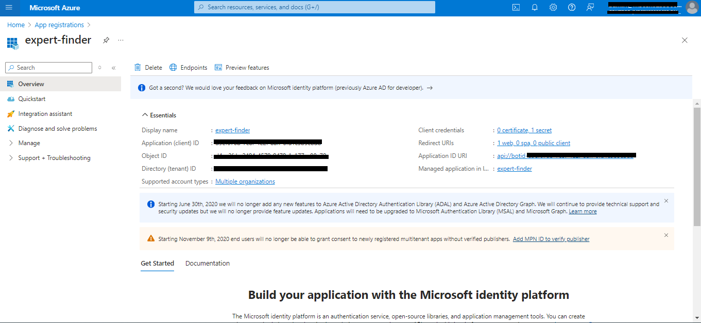

# Expert Finder message extension sample with SSO

This sample demonstrates a Teams message extension integrated with Microsoft Copilot, enabling users to efficiently search a database of candidates based on their skills, location, and availability. The extension features Single Sign-On (SSO) for enhanced user experience and authentication.


## Interaction with app

Using this messaging extension sample, we demonstrate two capabilities of Copilot for M365:
1) To search across a database of candidates to find a relevant "expert" based on multiple parameters such as their skill, location and availability.
2) Single Sign On (SSO)

On first use, a window requesting for Sign In pops-up and once SSO is completed, the user flow continues as usual. 

The database of candidates is hosted in an Azure Table storage, and the app itself is a messaging extension that can be used as a plug-in within Copilot for M365.

 

## Try it yourself - experience the App in your Microsoft Teams client
Please find below demo manifest which is deployed on Microsoft Azure and you can try it yourself by uploading the app package (.zip file link below) to your teams and/or as a personal app. (Uploading must be enabled for your tenant, [see steps here](https://docs.microsoft.com/microsoftteams/platform/concepts/build-and-test/prepare-your-o365-tenant#enable-custom-teams-apps-and-turn-on-custom-app-uploading)).

**Microsoft Teams Expert Finder sample app:** [Manifest](/samples/msgext-expert-finder-js/demo-manifest/expert-finder.zip)

## Prerequisites

- [Node.js 18.x](https://nodejs.org/download/release/v18.18.2/)
- [Visual Studio Code](https://code.visualstudio.com/)
- [Table Storage](https://learn.microsoft.com/en-us/azure/storage/tables/table-storage-quickstart-portal)
- [Microsoft 365 Agents Toolkit](https://marketplace.visualstudio.com/items?itemName=TeamsDevApp.ms-teams-vscode-extension)
- You will need a Microsoft work or school account with [permissions to upload custom Teams applications](https://learn.microsoft.com/microsoftteams/platform/concepts/build-and-test/prepare-your-o365-tenant#enable-custom-teams-apps-and-turn-on-custom-app-uploading). The account will also need a Microsoft Copilot for Microsoft 365 license to use the extension in Copilot.


## Setup and use the sample

1) Create Azure storage account: Refer to the [Create azure storage account documentation](https://learn.microsoft.com/en-us/azure/storage/common/storage-account-create?tabs=azure-portal) to create a storage account in Azure.

2) App Registration

### Register your application with Azure AD

1. Register a new application in the [Microsoft Entra ID – App Registrations](https://go.microsoft.com/fwlink/?linkid=2083908) portal.
2. Select **New Registration** and on the *register an application page*, set following values:
    * Set **name** to your app name.
    * Choose the **supported account types** (any account type will work)
    * Leave **Redirect URI** empty.
    * Choose **Register**.
3. On the overview page, copy and save the **Application (client) ID, Directory (tenant) ID**. You'll need those later when updating your Teams application manifest and in the appsettings.json.
4. Navigate to **API Permissions**, and make sure to add the follow permissions:
    * Select Add a permission
    * Select Microsoft Graph -> Delegated permissions.
    * `User.Read` (enabled by default)
    * Click on Add permissions. Please make sure to grant the admin consent for the required permissions.

3) Follow the steps mentioned to [Create azure table storage](https://learn.microsoft.com/en-us/azure/storage/tables/table-storage-quickstart-portal) inside the storage account.

3) Follow the schema as given in the below image while creating the azure table.
  - 

5) Clone the repository

    ```bash
    git clone https://github.com/OfficeDev/Microsoft-Teams-Samples.git
    ```
6) Navigate to the `samples/msgext-expert-finder-js` folder and open with Visual Studio Code.

7) Navigate to the `samples/msgext-expert-finder-js/.localConfigs` directory and update the values below.

   ```txt
      AZURE_TABLE_STORAGE_CONNECTION_STRING=<azure storage account connection string> (Created in step 1)
      AZURE_TABLE_TABLE_NAME=<azure table name> (Created in step 2)
   ```

## Setup resources (Using Microsoft 365 Agents Toolkit for Visual Studio Code)

- Note : Make sure you have followed all the earlier steps of setting up the sample and creating table storage. Make sure all connection string values are added in `samples/msgext-expert-finder-js/.localConfigs` file before running the sample in toolkit.

The simplest way to run this sample in Teams is to use Microsoft 365 Agents Toolkit for Visual Studio Code.

1. Ensure you have downloaded and installed [Visual Studio Code](https://code.visualstudio.com/docs/setup/setup-overview)
1. Install the [Microsoft 365 Agents Toolkit extension](https://marketplace.visualstudio.com/items?itemName=TeamsDevApp.ms-teams-vscode-extension)
1. Select **File > Open Folder** in VS Code and choose this samples directory from the repo
1. Using the extension, sign in with your Microsoft 365 account where you have permissions to upload custom apps
1. Select **Debug > Start Debugging** or **F5** to run the app in a Teams web client.

## Setup SSO for Expert finder.
1) Go to app registrations in azure portal and search for the app registration created by toolkit automatically. You will get the resource suffix inside `samples/msgext-expert-finder-js/env/.env.local` with key as `APP_NAME_SUFFIX`. This resource suffix should be used to search the created azure resources. For eg you can search the app registration with name like `expert-finder-local` 
 
2) Under Manage > Authentication > Platform Configurations > Add a Platform > Web > Redirect URIs > Add the below URI
 - `https://token.botframework.com/.auth/web/redirect`
 - Under implicit grant flow make sure Access token and Id token both options are selected. 
 - Select Configure.
 
   
3) Expose API endpoint
- Click "_Expose an API_" in the left rail

    - Set your Application ID URI to include your bot id in the following format - `api://botid-<AppId>`, where `<AppId>` is the id of the bot that will be making the SSO request and can be found in `.env.local` file in your sample solution.
    

   - Click "_Add a scope_"

        - access_as_user as the Scope name.

        - Set Who can consent? to Admins and users

        - Fill in the fields for configuring the admin and user consent prompts with values that are appropriate for the access_as_user scope. Suggestions:

            - Admin consent display name: Teams can access the user’s profile

            - Admin consent description: Allows Teams to call the app’s web APIs as the current user.

            - User consent display name: Teams can access your user profile and make requests on your behalf

            - User consent description: Enable Teams to call this app’s APIs with the same rights that you have

        - Ensure that State is set to Enabled

        - Click on Add scope button (Note: The domain part of the Scope name displayed just below the text field should automatically match the Application ID URI set in the previous step, with /access_as_user appended to the end)

        

4) Authorize client applications

Add the following Ids as authorized clients for your application

- 1fec8e78-bce4-4aaf-ab1b-5451cc387264 (Teams mobile/desktop application)

- 5e3ce6c0-2b1f-4285-8d4b-75ee78787346 (Teams web application)

    

5) Setup Azure Bot Service Connection (TokenStore)
Note> Azure bot will be created automatically in the selected subscription and resource group while running the sample using Toolkit.

- In the Azure Portal, go to the resource group selected while running the sample using toolkit and navigate to the Azure Bot resource
   
- Switch to the "Settings" and Configuration section and click on `Add OAuth Connection Settings`

    

- Fill out the Connection Setting form

    - Enter a name for your new Connection setting. Keep the name as `authbot`.

    - In the Service Provider dropdown, select `Azure Active Directory V2`

    - Enter the client id and client secret generated automatically while running the sample using Toolkit.
    - For client secret navigate to `samples/msgext-expert-finder-js/env/.env.local.user` and select the `Decrypt secret` option to get the decrypted client secret.
     
    - For client id, navigate to `samples/msgext-expert-finder-js/env/.env.local` and select the `APP_ID` option to get the client id.

    - For the Token Exchange URL use the Application ID URI obtained in step 3. (Uri in format `api://botid-<app-id>)`

    - Specify "common" as the Tenant ID. If you are using Single Tenant app registration then set your tenant Id where the bot is registered.

    - Add `User.Read` as scope

    - Click "Save"

    

## Upload the app package to teams.
1) Go to app store in teams -> Upload an app -> Upload custom/store app
2) Navigate to `samples/msgext-expert-finder-js/appPackage/build` and select `appPackage.local.zip` for uploading.
3) Add the app and test the app as a messaging extension.

 

### Test the app in Copilot for Microsoft 365
Navigate to the Microsoft Copilot for Microsoft 365 chat. Check the lower left of the chat user interface, below the compose box. You should see a plugin icon. Click this and enable the Expert-finder plugin.


- Here are some sample prompts you can try : 
1) `Find candidates with skill in Azure.`
2) `Find candidates with skill in React and who are from India.`
3) `Find candidates with skill in Azure and available for interview.`

## Running the sample

**SSO auth with consent popup when sign in button is clicked**


**Search based on skills and country**


**Note: You can search candidates based on multiple parameters like skills, location, availability etc.**

## Further reading

- [Message extensions for Microsoft Copilot for Microsoft 365](https://learn.microsoft.com/en-us/microsoft-365-copilot/extensibility/overview-message-extension-bot)
- [Azure table storage](https://learn.microsoft.com/en-us/azure/storage/tables/table-storage-quickstart-portal)

