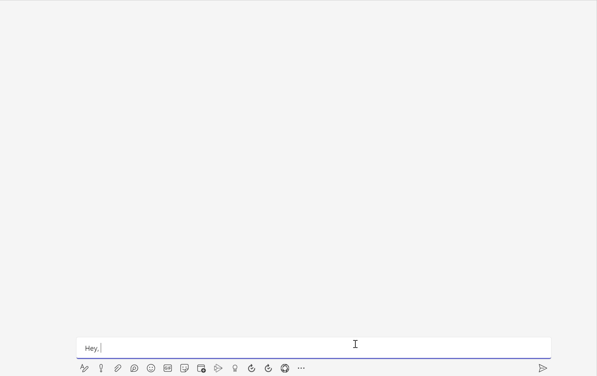
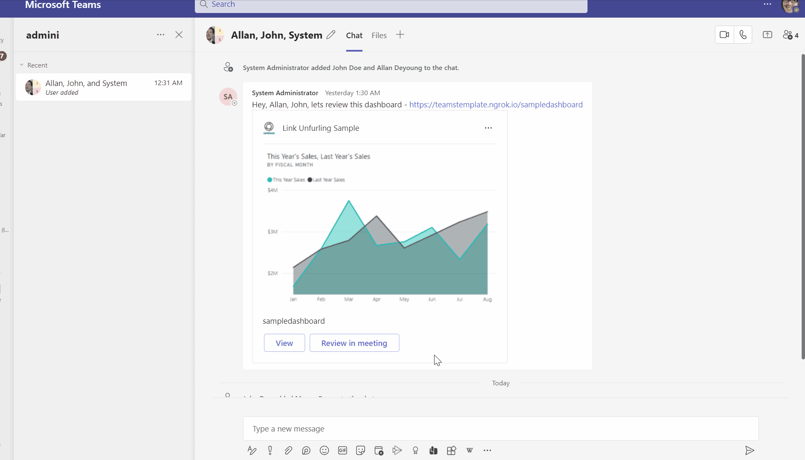

# Link unfurling meeting sample

#### About
This sample illustrates a common scenario where a user shares a link to a resource (dashboard in this sample) with a group of users, and they collaborate to review it in a meeting.

#### Unfurl a link to a dashboard

##### Workflow:
* User shares a link to a dashboard with a group of users.
* Teams app unfurls the link to an adaptive card with actions to view it in a stage tab or review it in a meeting.


#### Review in meeting

##### Workflow:
* Other user in the group chooses to review the dashboard in a meeting.
* Teams app creates a new meeting, adds a tab (that points to the dashboard originally shared) to a meeting.
* User automatically joins the meeting and reviews the tab.
* User shares the tab to meeting stage view with other users.


#### Prerequisites
* Make sure you have an active [Azure subscription](https://azure.microsoft.com/en-us/free/).
* Make sure [Publish to organization's app store](https://docs.microsoft.com/en-us/MicrosoftTeams/manage-apps?toc=%2Fmicrosoftteams%2Fplatform%2Ftoc.json&bc=%2Fmicrosoftteams%2Fplatform%2Fbreadcrumb%2Ftoc.json#publish-a-custom-app-to-your-organizations-app-store)  is available in Teams.
* Install [Visual Studio](https://docs.microsoft.com/en-us/visualstudio/install/install-visual-studio?view=vs-2022) or [Visual Studio Code](https://code.visualstudio.com/download) to run and debug the sample code.
  * [.NET Core SDK](https://dotnet.microsoft.com/download) version 3.1
* Install [ngrok](https://ngrok.com/download) for local setup. (or any other tunneling solution)

#### Setup

##### Bot setup
* [Register a bot with Azure](https://docs.microsoft.com/en-us/azure/bot-service/bot-service-quickstart-registration?view=azure-bot-service-4.0&tabs=userassigned).
  * Make sure to copy and save the Azure Bot resource app ID and password.
* [Connect the bot to Microsoft Teams](https://docs.microsoft.com/en-us/azure/bot-service/channel-connect-teams?view=azure-bot-service-4.0).
* Run ngrok and point it to port: 3978.
    ```
    ngrok http -host-header=rewrite 3978 
    ```
    * Make sure to copy and save the `https` url (it should look like `https://<randomsubdomain>.ngrok.io`).
* Follow steps to setup tab SSO on [this page](https://docs.microsoft.com/en-us/microsoftteams/platform/tabs/how-to/authentication/auth-aad-sso?tabs=dotnet#develop-an-sso-microsoft-teams-tab)
  * Go to bot application registered in step 1.
  * Follow the steps 1.5 (expose an API) -1.14 (navigate to Authentication) in the Tab SSO link.
    * `fully-qualified-domain-name.com` is ngrok url domain saved earlier. (ex. `<randomsubdomain.ngrok.io`)
    * `appId` - is the app ID saved earlier.
    * In step 1.13 (Navigate to API Permissions), add the following delegated graph permissions
      * `TeamsAppInstallation.ReadWriteSelfForChat`, `TeamsTab.ReadWriteForChat`, `Chat.ReadBasic` and `OnlineMeetings.ReadWrite`.
    * In step 1.14 (Navigate to Authentication):
      * Add another re-direct URI `https://token.botframework.com/.auth/web/redirect` (for Bot authentication)
      * Select the Access tokens and ID tokens checkboxes.

* Follow steps to add OAuth connection setting on [this page](https://docs.microsoft.com/en-us/microsoftteams/platform/bots/how-to/authentication/add-authentication?tabs=dotnet%2Cdotnet-sample#azure-ad-v2)
  * Use App ID and app secrets saved earlier.
  * Make sure to copy and save OAuth connection name.
  * For `Scopes`, enter all the delegated graph permissions configured in the app.
* Update Bot messaging endpoint to ngrok url with messaging endpoint. (ex. `https://<randomsubdomain>.ngrok.io/api/messages`

##### Publish AppPackage to App Catalog
* Update the following in the manifest.json.
  * `{Bot App Id}` - Replace with app ID saved earlier.
  * `{BaseUrl}` - Replace with ngrok url saved earlier.
  * `{WebsiteUrl}` - Replace with ngrok url saved earlier.
  * `{domain}` - Replace with ngrok domain. (ex. `<randomsubdomain>.ngrok.io`)
  * `description`, `developer` - Update these fields with relevant information.
* Zip the manifest and app icons. (say `sample.zip`)
* Publish the app package to organization's app store.
  * Make sure to copy and save app's ID in organization's app store.
* Grant admin conset - `https://login.microsoftonline.com/{tenant-id}/adminconsent?client_id={client-id}` where
  * `{client-id}` is the app ID saved earlier.
  * `{tenant-id}` is your organization's tenant ID.
##### Project setup
* Clone the repo or download the sample code to your machine.
* Update the following settings in `appsettings.json`
  * `MicrosoftAppId` - App ID saved earlier.
  * `ClientId` - App ID saved earlier.
  * `TeamsBot:AppId` - App ID saved earlier.
  * `MicrosoftAppPassword` - App secret saved earlier.
  * `ClientSecret` - App secret saved earlier.
  * `ConnectionName` - Connection name 
  * `BaseUrl` - ngrok url saved earlier.
  * `TenantId` - Tenant ID where you wll run the Teams application.
  * `CatalogAppId` - App ID in organization's app store saved earlier.
* Update the following in `.env` under ClientApp.
  * `REACT_APP_BASE_URL` - ngrok url saved earlier.
  * `REACT_APP_AZURE_APP_REGISTRATION_ID` - App ID saved earlier.
* Build and run the sample code in Visual studio / Visual studio code.

#### Basic Tests
* You should be able to install the application to personal scope, group chats and Teams.
* Share a link say `https://<randomdomain>.ngrok.io/dashboard1` and application should prompt the user to sign-in and unfurl it to an adaptive card post sign-in.
* You should be able to open stage tab view from adaptive card.
* You should be able to setup a meeting with everything configured.


#### Project Structure
* The sample contains 3 projects
  * `Web` - Exposes REST APIs (including Bot messaging endpoint) for clients to consume and contains ClientApp logic.
  * `Domain` - Contains the business logic to setup online meetings based on where the resource is shared.
  * `Infrastructure` - Fulfills `Domain`'s dependencies. Example - resource service, card factory to prepare card etc. If you want to change AC, or connect to a resource service, this is where you would make the changes.

#### Troubleshooting
* If the web application fails to load, run `npm install` and `npm run build` under ClientApp folder.
* If the meeting setup fails with 403 (Not authorized), make sure you grant admin consent on behalf of all the users.
  * Grant admin conset - `https://login.microsoftonline.com/{tenant-id}/adminconsent?client_id={client-id}` where
  * `{client-id}` is the app ID saved earlier.
  * `{tenant-id}` is your organization's tenant ID.
