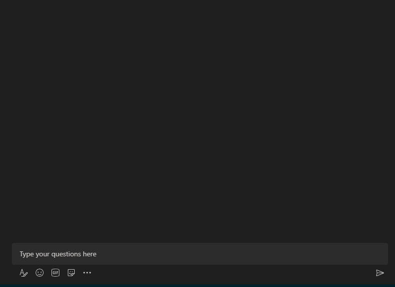

# Link Unfurling for Reddit Links

This repository is a full implementation of [link unfurling](https://docs.microsoft.com/en-us/microsoftteams/platform/messaging-extensions/how-to/link-unfurling?tabs=dotnet) for [Reddit](https://reddit.com) links in dotnet.

This sample demonstrates the following concepts: 
- Link Unfurling
- Bot Token Service & User Authentication
- Message Extension settings page
- Message Extension logout

## Setup
You will need to complete the following before running the code

### Create Messaging Extension
Follow the directions for [creating a messaging extension](https://docs.microsoft.com/en-us/microsoftteams/platform/messaging-extensions/how-to/create-messaging-extension).
- Register a bot with Azure Bot Service, following the instructions [here](https://docs.microsoft.com/en-us/azure/bot-service/bot-service-quickstart-registration?view=azure-bot-service-3.0).
- Ensure that you've [enabled the Teams Channel](https://docs.microsoft.com/en-us/azure/bot-service/channel-connect-teams?view=azure-bot-service-4.0)
- While registering the bot, use `https://<your_ngrok_url>/api/messages` as the messaging endpoint.
    > NOTE: When you create your bot you will create an App ID and App password - make sure you keep these for later.

1. You __must__ use the 'Bot Channel Registration' so Bot Framework token service can be registered to manage tokens. 
2. The `reddit.com` and `www.reddit.com` domains should be registered in the 'messageHandlers' for the Teams App. If these are not included, the extension will not trigger for reddit links!

Make sure to note the app id and password for later. 

### Configure Reddit App
Go To The [Reddit App Preferences](https://www.reddit.com/prefs/apps/) and register a new app for Reddit using the following parameters. 

| Parameter        | Value                      |
|------------------|:---------------------------|
| __Type__         | `web app`                  |
| __redirect uri__ | Not required               |
| Description      | Your own description       |
| About Url        | Url to your own about page |

Afterwards be sure to save the `client id` and the `secret` for the next step. 

### Configure Bot Framework Authentication
In the Azure portal, navigate to the Bot Channels Registration for the app and select the `Settings` menu under `Bot management`

At the bottom of the blade press `Add Setting`, this will open the `New Connection Setting` Blade. 

| Parameter         | Value                                                               |
|-------------------|---------------------------------------------------------------------|
| Name              | `reddit`                                                            |
| Service Provider  | `Generic Oauth 2`                                                   |
| Client Id         | Reddit Client Id from [Configure Reddit App](#configure-reddit-app) |
| Client Secret     | Reddit Secret from [Configure Reddit App](#configure-reddit-app)    |
| Authorization Url | `https://www.reddit.com/api/v1/authorize.compact`                   |
| Refresh Url       | `https://www.reddit.com/api/v1/access_token`                        |
| Scopes            | `read`                                                              |

<!-- ## Architecture -->
<!--insert an architecture diagram -->

## Directory Structure
- `/dotnet` the ASP.NET Core implementation which uses 2 legged OAuth for Reddit API calls
- `/dotnet_user_auth` the ASP.NET Core implementation which uses the 3 legged OAuth for Reddit API calls on behalf of the user.

## References

- [Link Unfurling BotBuilder Sample](https://github.com/microsoft/BotBuilder-Samples/tree/master/samples/csharp_dotnetcore/55.teams-link-unfurling)

