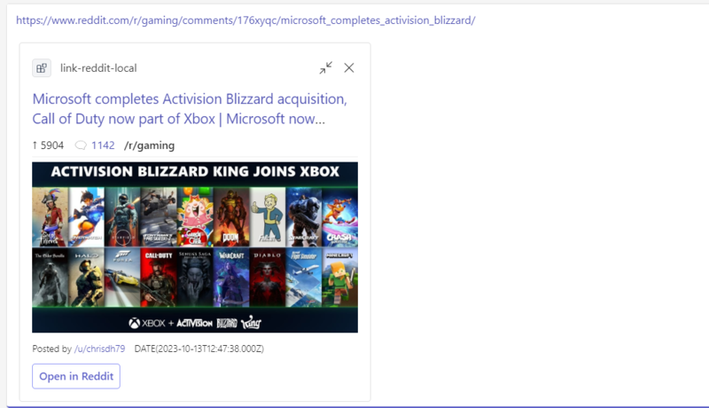

# Link Unfurling for Reddit Links

This comprehensive Node.js sample illustrates how to implement a Messaging Extension for [Reddit](https://reddit.com) links in Microsoft Teams, featuring robust [link unfurling](https://docs.microsoft.com/en-us/microsoftteams/platform/messaging-extensions/how-to/link-unfurling?tabs=dotnet) capabilities. With easy configuration and user authentication, the extension enhances the sharing and interaction with Reddit content directly in Teams.

This sample demonstrates the following concepts: 
- Link Unfurling

### Configure Reddit App
Go To The [Reddit App Preferences](https://www.reddit.com/prefs/apps/) and register a new app for Reddit using the following parameters. 

| Parameter        | Value                      |
|------------------|:---------------------------|
| __Type__         | `web app`                  |
| __redirect uri__ | Not required               |
| Description      | Your own description       |
| About Url        | Url to your own about page |

Afterwards be sure to save the `client id` and the `secret` for the next step. 

## 1) App Registration

### Register your application with Azure AD

1. Register a new application in the [Microsoft Entra ID – App Registrations](https://go.microsoft.com/fwlink/?linkid=2083908) portal.
2. Select **New Registration** and on the *register an application page*, set following values:
    * Set **name** to your app name.
    * Choose the **supported account types** (any account type will work)
    * Leave **Redirect URI** empty.
    * Choose **Register**.
3. On the overview page, copy and save the **Application (client) ID, Directory (tenant) ID**. You'll need those later when updating your Teams application manifest and in the appsettings.json.
4. Navigate to **API Permissions**, and make sure to add the follow permissions:
    * Select Add a permission
    * Select Microsoft Graph -> Delegated permissions.
    * `User.Read` (enabled by default)
    * Click on Add permissions. Please make sure to grant the admin consent for the required permissions.

## Run the app (Using Microsoft 365 Agents Toolkit for Visual Studio Code)

The simplest way to run this sample in Teams is to use Microsoft 365 Agents Toolkit for Visual Studio Code.

1. Ensure you have downloaded and installed [Visual Studio Code](https://code.visualstudio.com/docs/setup/setup-overview)
1. Install the [Microsoft 365 Agents Toolkit extension](https://marketplace.visualstudio.com/items?itemName=TeamsDevApp.ms-teams-vscode-extension)
1. Select **File > Open Folder** in VS Code and choose this samples directory from the repo
1. Using the extension, sign in with your Microsoft 365 account where you have permissions to upload custom apps
1. In "env/.env.local" and "env/.env.local.user" file, set values for `REDDIT_ID` and `SECRET_REDDIT_PASSWORD` that are gained in the last step
1. Select **Debug > Start Debugging** or **F5** to run the app in a Teams web client.
1. In the browser that launches, select the **Add** button to install the app to Teams.

> If you do not have permission to upload custom apps (uploading), Microsoft 365 Agents Toolkit will recommend creating and using a Microsoft 365 Developer Program account - a free program to get your own dev environment sandbox that includes Teams.
