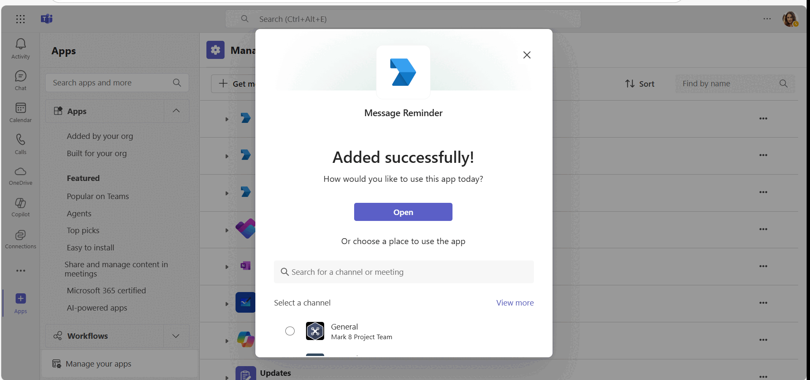
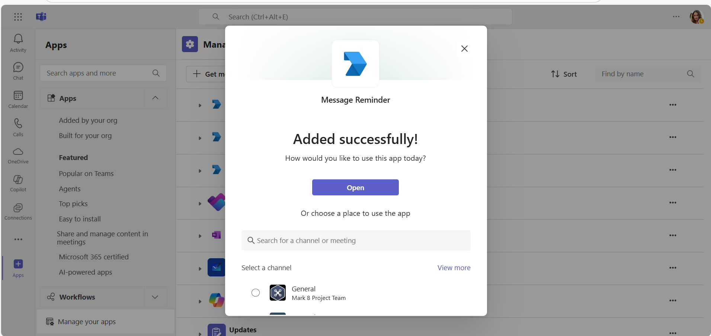
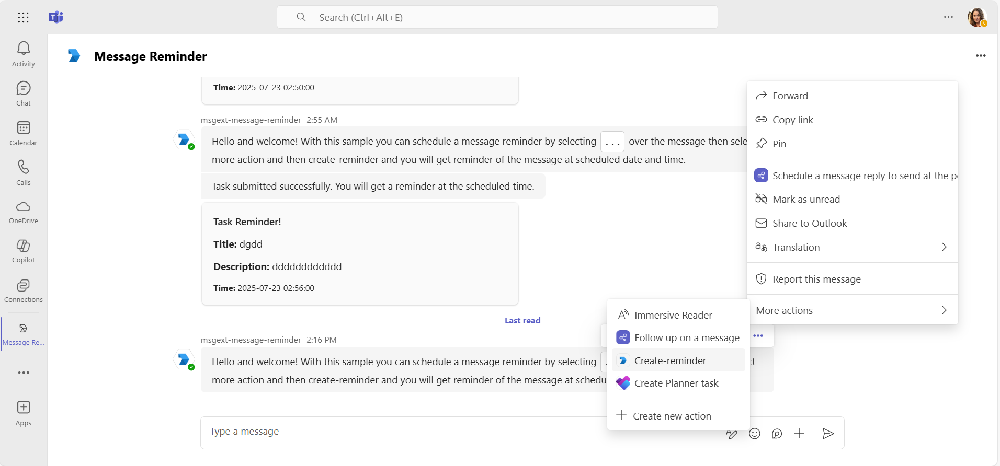
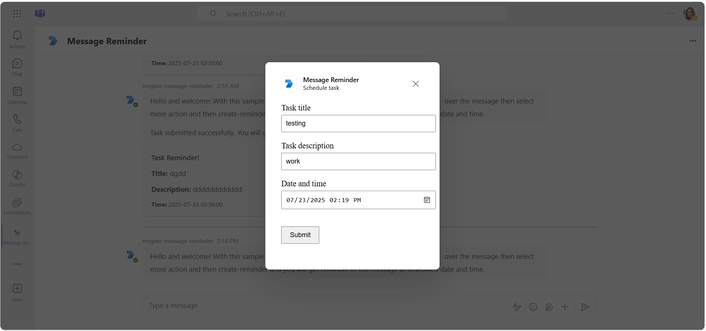
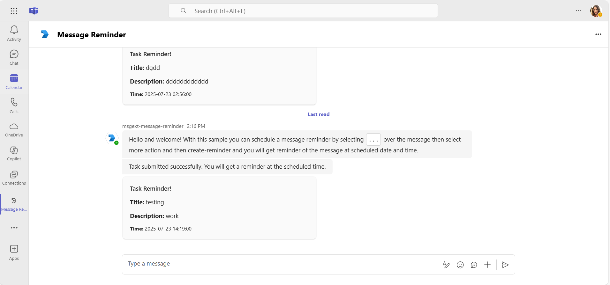
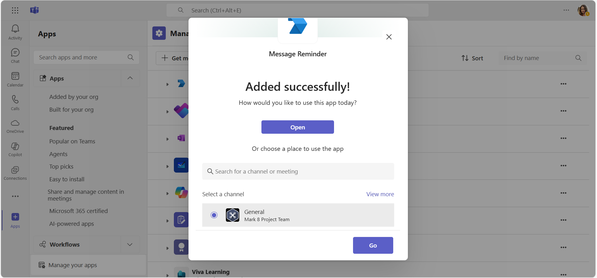
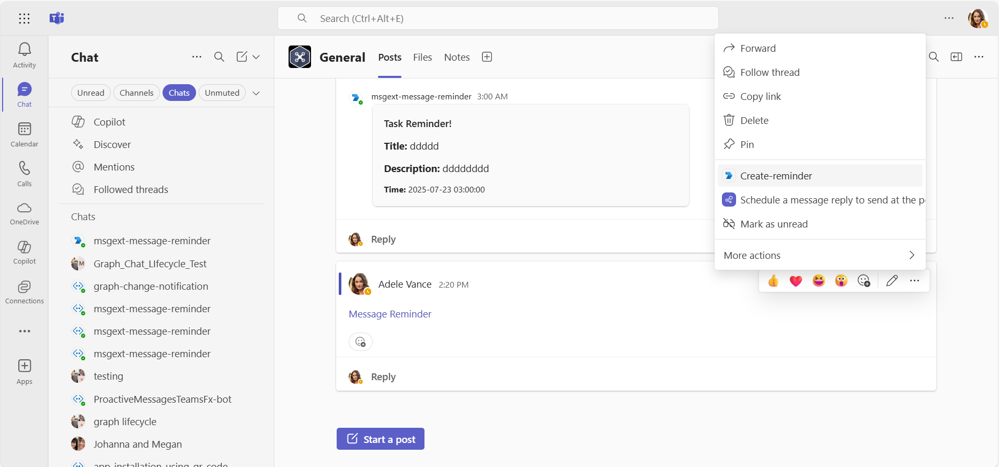
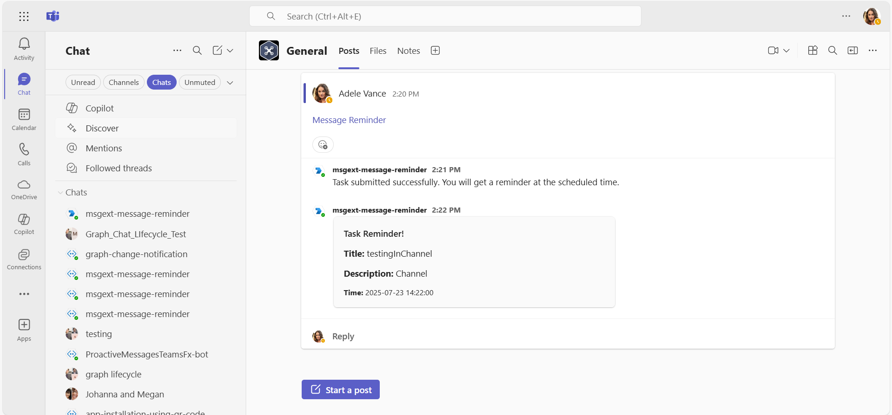

# Message reminder with messaging extension action (Python)

This comprehensive Python sample illustrates how to create a Messaging Extension that enables users to schedule tasks from within Microsoft Teams, complete with reminder cards sent at the scheduled times. With straightforward setup and seamless integration, this extension enhances productivity by allowing users to efficiently manage their tasks and reminders directly within Teams conversations.

## Included Features
* Messaging Extensions
* Bots
* Adaptive Cards

## Interaction with app



## Try it yourself - experience the App in your Microsoft Teams client

Please find below demo manifest which is deployed on Microsoft Azure and you can try it yourself by uploading the app package (.zip file link below) to your Teams and/or as a personal app. (Sideloading must be enabled for your tenant, [see steps here](https://docs.microsoft.com/microsoftteams/platform/concepts/build-and-test/prepare-your-o365-tenant#enable-custom-teams-apps-and-turn-on-custom-app-uploading)).

**Message reminder with messaging extension action:** [Manifest](/samples/msgext-message-reminder/python/appManifest/appManifest.local.zip)

## Prerequisites

- Microsoft Teams is installed and you have an account (not a guest account)
- [Python SDK](https://www.python.org/downloads/) min version 3.8
- [dev tunnel](https://learn.microsoft.com/en-us/azure/developer/dev-tunnels/get-started?tabs=windows) or [ngrok](https://ngrok.com/download) latest version or equivalent tunneling solution
- [M365 developer account](https://docs.microsoft.com/microsoftteams/platform/concepts/build-and-test/prepare-your-o365-tenant) or access to a Teams account with the appropriate permissions to install an app.
- [Microsoft 365 Agents Toolkit for VS Code](https://marketplace.visualstudio.com/items?itemName=TeamsDevApp.ms-teams-vscode-extension) or [TeamsFx CLI](https://learn.microsoft.com/microsoftteams/platform/toolkit/teamsfx-cli?pivots=version-one).

## Run the app (Using Microsoft 365 Agents Toolkit for Visual Studio Code)

The simplest way to run this sample in Teams is to use Microsoft 365 Agents Toolkit for Visual Studio Code.

1. Ensure you have downloaded and installed [Visual Studio Code](https://code.visualstudio.com/docs/setup/setup-overview)
2. Install the [Microsoft 365 Agents Toolkit extension](https://marketplace.visualstudio.com/items?itemName=TeamsDevApp.ms-teams-vscode-extension) and [Python Extension](https://marketplace.visualstudio.com/items?itemName=ms-python.python)
3. Select **File > Open Folder** in VS Code and choose this sample's directory from the repo
4. Press **CTRL+Shift+P** and enter **Python: Create Environment** to create and activate your virtual environment. Select `requirements.txt` as dependencies to install.
5. Using the extension, sign in with your Microsoft 365 account where you have permissions to upload custom apps
6. Select **Debug > Start Debugging** or **F5** to run the app in a Teams web client.
7. In the browser that launches, select the **Add** button to install the app to Teams.

> If you do not have permission to upload custom apps (sideloading), Microsoft 365 Agents Toolkit will recommend creating and using a Microsoft 365 Developer Program account.

## Setup

> Note: These instructions are for running the sample on your local machine. The tunneling solution is required because Teams needs to call into your bot.

1) **Setup for Bot**
- In Azure portal, create Microsoft Entra ID app registration and it will generate MicrosoftAppId and MicrosoftAppPassword for you.
- In Azure portal, create an [Azure Bot resource](https://docs.microsoft.com/azure/bot-service/bot-builder-authentication?view=azure-bot-service-4.0&tabs=python).
- Ensure that you've [enabled the Teams Channel](https://docs.microsoft.com/azure/bot-service/channel-connect-teams?view=azure-bot-service-4.0)
- While registering the bot, use `https://<your_tunnel_domain>/api/messages` as the messaging endpoint.

    > NOTE: When you create your app registration in Azure portal, you will create an App ID and App password - make sure you keep these for later.

2) **Run ngrok** - point to port 3978

   ```bash
   ngrok http 3978 --host-header="localhost:3978"
   ```

   Alternatively, you can also use the `dev tunnels`:

   ```bash
   devtunnel host -p 3978 --allow-anonymous
   ```

3) **Setup for code**
- Clone the repository

    ```bash
    git clone https://github.com/OfficeDev/Microsoft-Teams-Samples.git
    ```

- In the folder where the repository is cloned, navigate to `samples/msgext-message-reminder/python`

- Create and activate your Python virtual environment

    ```bash
    python -m venv venv
    source venv/bin/activate  # On Windows: venv\Scripts\activate
    ```

- Install dependencies

    ```bash
    pip install -r requirements.txt
    ```

- Update the `config.py` file in your project folder for the bot to use the `MicrosoftAppId`, `MicrosoftAppPassword` (the AppId and client secret from your Azure registration), and `BaseUrl` (your ngrok or dev tunnel URL).

- Run your app

    ```bash
    python app.py
    ```

4) **Setup Manifest for Teams**

    - Edit the `manifest.json` contained in the `appManifest/` folder to replace with your MicrosoftAppId (that was created in step 1 and is the same value in `config.py`) *everywhere* you see the place holder string `{{Microsoft-App-Id}}`
    - Replace `{{domain-name}}` with your base URL domain (e.g., `1234.ngrok-free.app` or `12345.devtunnels.ms`).
    - Zip up the contents of the `appManifest/` folder to create a `manifest.zip`
    - Upload the `manifest.zip` to Teams (in the left-bottom *Apps* view, click "Upload a custom app")

## Running the sample

**Personal scope scenario**
- Add app in personal scope



- select `...` over the message then select `more action` and then `create-reminder` for scheduling task.



- Create Reminder



- Reminder card of task at scheduled date and time.



**Channel scope scenario**
- Add app in channel



- select `...` over the post then select `more action` and then `create-reminder` for scheduling task.



- Create Reminder


- Reminder card of task at scheduled date and time.



## Deploy the bot to Azure

To learn more about deploying a bot to Azure, see [Deploy your bot to Azure](https://aka.ms/azuredeployment) for a complete list of deployment instructions.

## Further reading

- [Messaging Extension](https://learn.microsoft.com/microsoftteams/platform/messaging-extensions/how-to/action-commands/define-action-command)
- [Bot Framework Documentation](https://docs.botframework.com)
- [Bot Basics](https://docs.microsoft.com/azure/bot-service/bot-builder-basics?view=azure-bot-service-4.0)
- [Activity processing](https://docs.microsoft.com/azure/bot-service/bot-builder-concept-activity-processing?view=azure-bot-service-4.0)
- [Azure Bot Service Introduction](https://docs.microsoft.com/azure/bot-service/bot-service-overview-introduction?view=azure-bot-service-4.0)
- [Azure Bot Service Documentation](https://docs.microsoft.com/azure/bot-service/?view=azure-bot-service-4.0)

