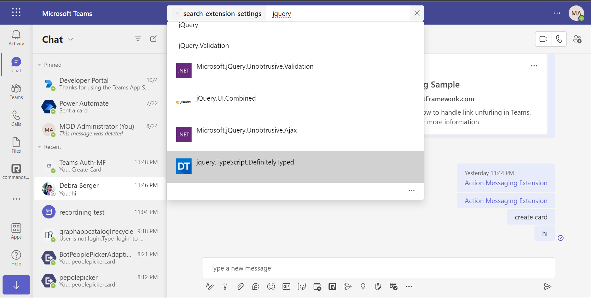
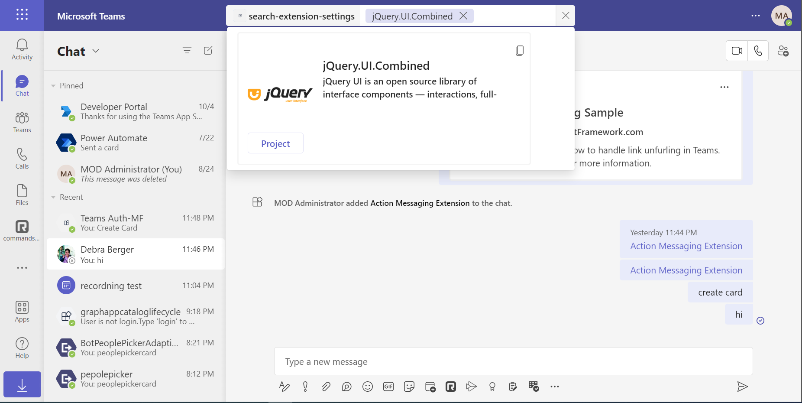

# Teams Search Auth Config

[Messaging Extensions](https://docs.microsoft.com/microsoftteams/platform/messaging-extensions/what-are-messaging-extensions) are a special kind of Microsoft Teams application that is support by the [Bot Framework](https://dev.botframework.com) v4.

There are two basic types of Messaging Extension in Teams: [Search-based](https://docs.microsoft.com/microsoftteams/platform/messaging-extensions/how-to/search-commands/define-search-command) and [Action-based](https://docs.microsoft.com/microsoftteams/platform/messaging-extensions/how-to/action-commands/define-action-command). This sample is built on sample 50.teams-messaging-extension-search, and illustrates how to build a Search-based Messaging Extension with a configuration page, as well as how to sign in from a search Messaging Extension.

## Included Features
* Bots
* Message Extensions (with teams sso)
* Search Commands

## Interaction with app


## Try it yourself - experience the App in your Microsoft Teams client
Please find below demo manifest which is deployed on Microsoft Azure and you can try it yourself by uploading the app package (.zip file link below) to your teams and/or as a personal app. (Sideloading must be enabled for your tenant, [see steps here](https://docs.microsoft.com/microsoftteams/platform/concepts/build-and-test/prepare-your-o365-tenant#enable-custom-teams-apps-and-turn-on-custom-app-uploading)).

**Messaging Extension Auth:** [Manifest](/samples/msgext-search-auth-config/csharp/demo-manifest/msgext-search-auth-config.zip)

## Prerequisites

- Microsoft Teams is installed and you have an account
- [Python SDK](https://www.python.org/downloads/) version 3.7
- [ngrok](https://ngrok.com/download) or equivalent tunnelling solution

## Setup

> Note these instructions are for running the sample on your local machine, the tunnelling solution is required because
the Teams service needs to call into the bot.

1. Register a new application in the [Azure Active Directory – App Registrations](https://go.microsoft.com/fwlink/?linkid=2083908) portal.

2. Create [Bot Framework registration resource](https://docs.microsoft.com/azure/bot-service/bot-service-quickstart-registration) in Azure
    - Use the current `https` URL you were given by running ngrok. Append with the path `/api/messages` used by this sample
    - Ensure that you've [enabled the Teams Channel](https://docs.microsoft.com/azure/bot-service/channel-connect-teams?view=azure-bot-service-4.0)
    - __*If you don't have an Azure account*__ you can use this [Bot Framework registration](https://docs.microsoft.com/microsoftteams/platform/bots/how-to/create-a-bot-for-teams#register-your-web-service-with-the-bot-framework)
    - Add an AAD OAuth Connection Setting to the bot. [Add authentication to your bot](https://docs.microsoft.com/azure/bot-service/bot-builder-authentication)  The name of this connection setting will be added to config.py as CONNECTION_NAME.
    
3. Run ngrok - point to port 3978

    ```bash
    ngrok http 3978 --host-header="localhost:3978"
    ```
    
4. Clone the repository

    ```bash
    git clone https://github.com/OfficeDev/Microsoft-Teams-Samples.git
    ```
  - In a terminal, go to `Microsoft-Teams-Samples\samples\msgext-search-auth-config\python` folder

  - Update the `config.py` configuration for the bot to use the Microsoft App Id and App Password from the Bot Framework registration. (Note the App Password is referred to as the "client secret" in the azure portal and you can always create a new client secret anytime.)  Also add the OAuth Connection Setting name to config.py as CONNECTION_NAME and the ngrok endpoint url as SITE_URL.

5. Setup Manifest for Teams
- __*This step is specific to Teams.*__
    - **Edit** the `manifest.json` contained in the ./teams_app_manifest folder to replace your Microsoft App Id (that was created when you registered your app registration earlier) *everywhere* you see the place holder string `{{Microsoft-App-Id}}` (depending on the scenario the Microsoft App Id may occur multiple times in the `manifest.json`)
    - **Edit** the `manifest.json` for `validDomains` and replace `{{domain-name}}` with base Url of your domain. E.g. if you are using ngrok it would be `https://1234.ngrok-free.app` then your domain-name will be `1234.ngrok-free.app`.
    - **Zip** up the contents of the `teams_app_manifest` folder to create a `manifest.zip` (Make sure that zip file does not contains any subfolder otherwise you will get error while uploading your .zip package)

- Upload the manifest.zip to Teams (in the Apps view click "Upload a custom app")
   - Go to Microsoft Teams. From the lower left corner, select Apps
   - From the lower left corner, choose Upload a custom App
   - Go to your project directory, the ./teams_app_manifest folder, select the zip folder, and choose Open.
   - Select Add in the pop-up dialog box. Your app is uploaded to Teams.


- Activate your desired virtual environment
- Install dependencies by running ```pip install -r requirements.txt``` in the project folder.
 - Run your bot, either from Visual Studio or terminal with `python app.py`.

> Note this `manifest.json` specified that the feature will be available from both the `compose`, `message` and `commandBox` areas of Teams. Please refer to Teams documentation for more details.

## Running the sample

Once the Messaging Extension is installed, click the icon for **Config Auth Search** in the Compose Box's Messaging Extension menu to display the search window.  Right click to choose **Settings** and view the Config page.  The default search is Pypi, and can be changed to Email from the Config page.

**Adding bot UI:**







## Deploy the bot to Azure

To learn more about deploying a bot to Azure, see [Deploy your bot to Azure](https://aka.ms/azuredeployment) for a complete list of deployment instructions.

## Further reading

- [Search based messaging extension](https://learn.microsoft.com/microsoftteams/platform/messaging-extensions/how-to/search-commands/define-search-command)
- [Bot Framework Documentation](https://docs.botframework.com)
- [Bot Basics](https://docs.microsoft.com/azure/bot-service/bot-builder-basics?view=azure-bot-service-4.0)
- [Azure Bot Service Introduction](https://docs.microsoft.com/azure/bot-service/bot-service-overview-introduction?view=azure-bot-service-4.0)
- [Azure Bot Service Documentation](https://docs.microsoft.com/azure/bot-service/?view=azure-bot-service-4.0)


