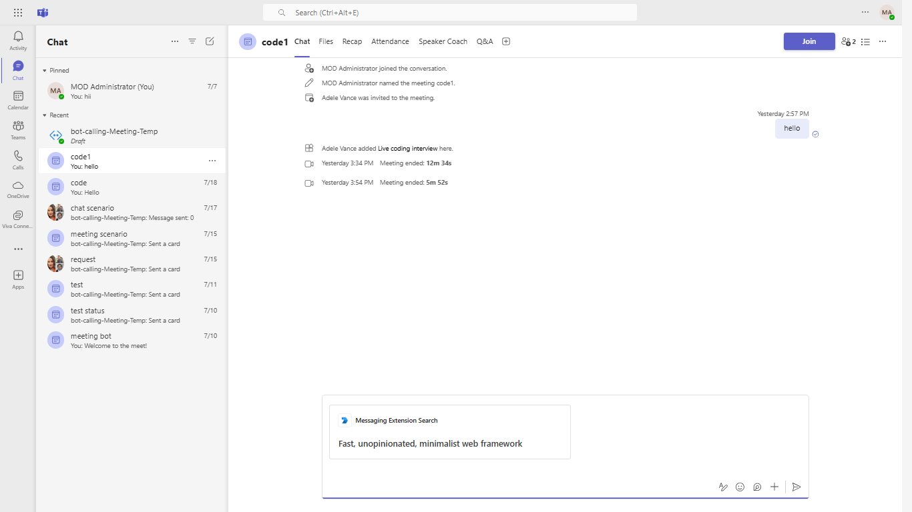

# Messaging Extension quick start

*Bots* allow users to interact with your web service through text, interactive cards, and task modules. *Messaging extensions* allow users to interact with your web service through buttons and forms in the Microsoft Teams client. They can search, or initiate actions, in an external system from the compose message area, the command box, or directly from a message.

## Interaction with app.

## Prerequisites

**Dependencies**
-  [NodeJS](https://nodejs.org/en/)
-  [ngrok](https://ngrok.com/) or equivalent tunneling solution
-  [M365 developer account](https://docs.microsoft.com/en-us/microsoftteams/platform/concepts/build-and-test/prepare-your-o365-tenant) or access to a Teams account with the appropriate permissions to install an app.

## Setup.

**Configure Ngrok**

Your app will be run from a localhost server. You will need to setup Ngrok in order to tunnel from the Teams client to localhost. 

**Run Ngrok**

Run ngrok - point to port 3978

`ngrok http -host-header=rewrite 3978`

**Update Bot Framework Messaging Endpoint**

  Note: You can also do this with the Manifest Editor in App Studio if you are familiar with the process.
  
  1. Register a new application in the [Azure Active Directory – App Registrations](https://go.microsoft.com/fwlink/?linkid=2083908) portal.
  2. Select **New Registration** and on the *register an application page*, set following values:
    * Set **name** to your app name.
    * Choose the **supported account types** (any account type will work)
    * Leave **Redirect URI** empty.
    * Choose **Register**.
    
   3. Azure Bot [Azure Bot] (https://learn.microsoft.com/en-us/azure/bot-service/abs-quickstart?view=azure-bot-service-4.0&tabs=userassigned)

- For the Messaging endpoint URL, use the current `https` URL you were given by running ngrok and append it with the path `/api/messages`. It should like something work `https://{subdomain}.ngrok.io/api/messages`.

- Click on the `Bots` menu item from the toolkit and select the bot you are using for this project.  Update the messaging endpoint and press enter to save the value in the Bot Framework.

- Ensure that you've [enabled the Teams Channel](https://docs.microsoft.com/en-us/azure/bot-service/channel-connect-teams?view=azure-bot-service-4.0)

- **Manually update the manifest.json**
    - Edit the `manifest.json` contained in the  `appPackage/` and update BOT_ID with your Microsoft-App-Id or Client-Id created from Azure Bot service.
    Also Update <valid-domain>> with your application's domain e.g. *.ngrok.io if you are using ngrok.
    - Zip up the contents of the `appPackage/` folder to create a `manifest.zip`
    - Upload the `manifest.zip` to Teams (in the left-bottom *Apps* view, click "Upload a custom app")

- **Manually update the env file**
    - Update the env file with Microsoft-App-Id(or Client Id) and Microsoft-App-Password(or Client Secret)
## Build and run

### `npm install`

### `npm start`

## Running the sample.

## Deploy to Teams
Start debugging the project by hitting the `F5` key or click the debug icon in Visual Studio Code and click the `Start Debugging` green arrow button.

