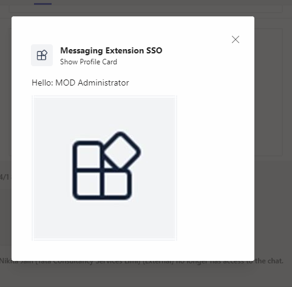
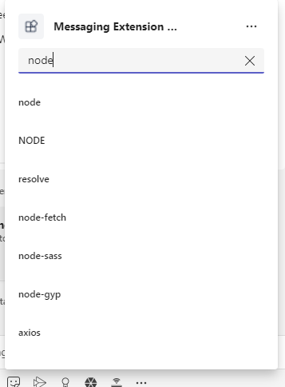
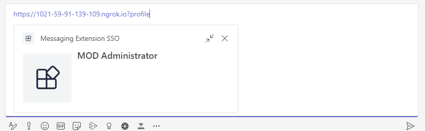

# Messaging Extension SSO Config Bot

Bot Framework v4 sample for Teams expands the [52.teams-messaging-extensions-search-auth-config](https://github.com/microsoft/BotBuilder-Samples/tree/main/samples/javascript_nodejs/52.teams-messaging-extensions-search-auth-config) sample to include a configuration page and Bot Service SSO authentication.

This bot has been created using [Bot Framework](https://dev.botframework.com), it shows how to use a Messaging Extension configuration page, as well as how to sign in from a search Messaging Extension.

- Ensure that you've [enabled the Teams Channel](https://docs.microsoft.com/en-us/azure/bot-service/channel-connect-teams?view=azure-bot-service-4.0)

## Prerequisites

- Microsoft Teams is installed and you have an account
- [NodeJS](https://nodejs.org/en/)
- [ngrok](https://ngrok.com/) or equivalent tunnelling solution

## To try this sample

> Note these instructions are for running the sample on your local machine, the tunnelling solution is required because
the Teams service needs to call into the bot.

### 1. Setup for Bot SSO
Refer to [Bot SSO Setup document](BotSSOSetup.md).

### 2. Configure this sample

   Update the `.env` configuration for the bot to use the Microsoft App Id and App Password from the Bot Framework registration. The `SiteUrl` is the URL that generated by ngrok and start with "https". (Note the MicrosoftAppId is the AppId created in step 1.1, the MicrosoftAppPassword is referred to as the "client secret" in step1.2 and you can always create a new client secret anytime.)
    - Set "MicrosoftAppType" in the `.env`. (**Allowed values are: MultiTenant(default), SingleTenant, UserAssignedMSI**)
    - Set "ConnectionName" in the `.env`. The AAD ConnectionName from the OAuth Connection Settings on Azure Bot registration

### 3. Run your bot sample
Under the root of this sample folder, build and run by commands:
- `npm install`
- `npm start`

1) __*This step is specific to Teams.*__
    - **Edit** the `manifest.json` contained in the  `appPackage` folder to replace your Microsoft App Id (that was created when you registered your bot earlier) *everywhere* you see the place holder string `<<YOUR-MICROSOFT-APP-ID>>` (depending on the scenario the MicrosoftAppId may occur multiple times in the `manifest.json`)
    - **Edit** the `manifest.json` for `validDomains` with base Url domain. E.g. if you are using ngrok it would be `https://1234.ngrok.io` then your domain-name will be `1234.ngrok.io`.
    - **Zip** up the contents of the `appPackage` folder to create a `manifest.zip` (Make sure that zip file does not contains any subfolder otherwise you will get error while uploading your .zip package)
    - **Upload** the `manifest.zip` to Teams (In Teams Apps/Manage your apps click "Upload an app". Browse to and Open the .zip file. At the next dialog, click the Add button.)

## Deploy the bot to Azure

To learn more about deploying a bot to Azure, see [Deploy your bot to Azure](https://aka.ms/azuredeployment) for a complete list of deployment instructions.

## Further reading

- [How Microsoft Teams bots work](https://docs.microsoft.com/en-us/azure/bot-service/bot-builder-basics-teams?view=azure-bot-service-4.0&tabs=javascript)

