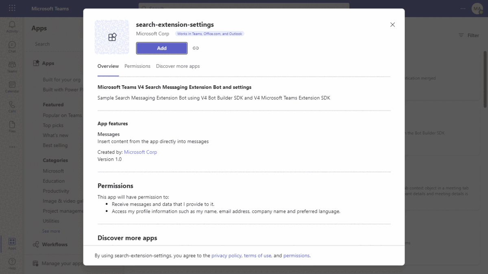
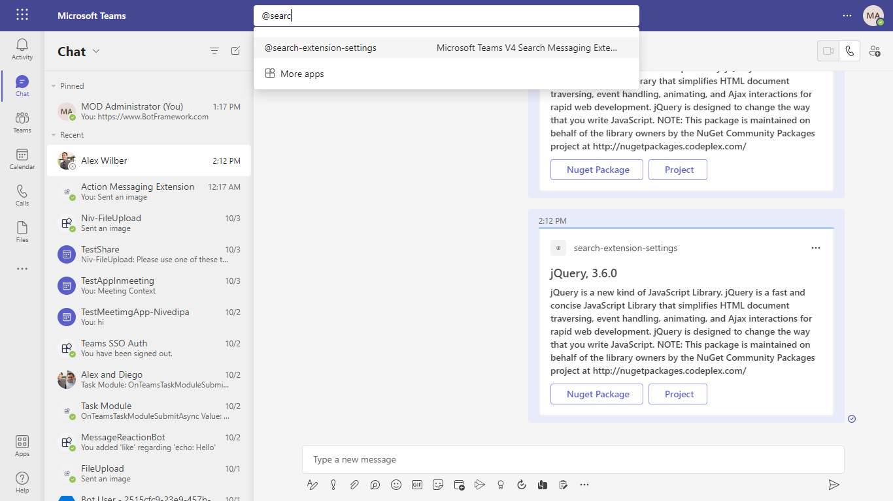
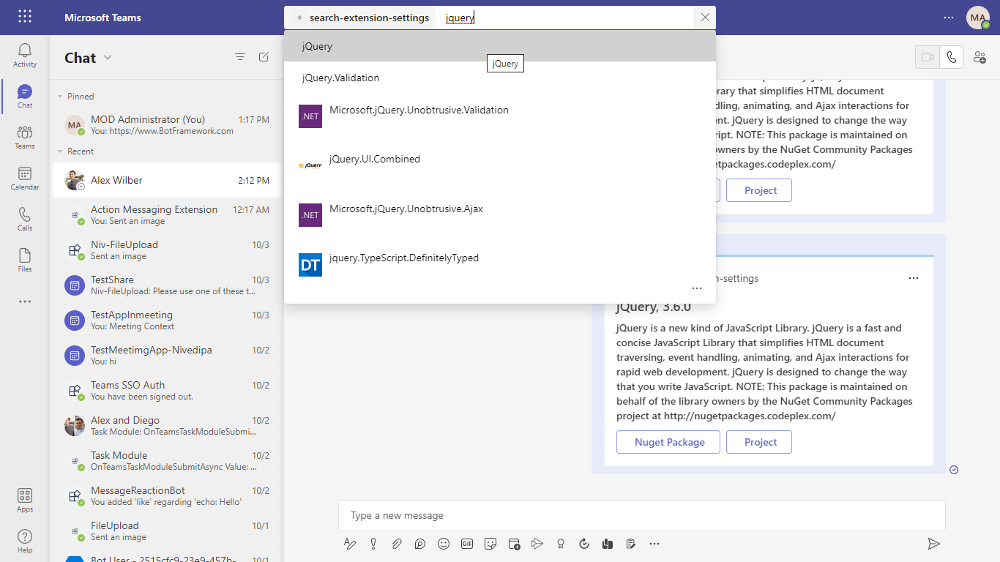
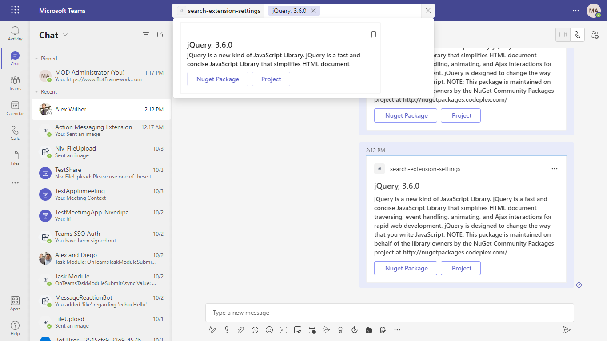

# Teams Messaging Extensions Search

[Messaging Extensions](https://docs.microsoft.com/microsoftteams/platform/messaging-extensions/what-are-messaging-extensions) are a special kind of Microsoft Teams application that is support by the [Bot Framework](https://dev.botframework.com) v4.

There are two basic types of Messaging Extension in Teams: [Search-based](https://docs.microsoft.com/microsoftteams/platform/messaging-extensions/how-to/search-commands/define-search-command) and [Action-based](https://docs.microsoft.com/microsoftteams/platform/messaging-extensions/how-to/action-commands/define-action-command). This sample illustrates how to
build a Search-based Messaging Extension.

## Prerequisites
- Intall Java 1.8+ [Java](https://www.oracle.com/java/technologies/downloads/#java8-windows)
- Install [Maven](https://maven.apache.org/)
- Setup for Java and Maven [Setup](Setup.md)
- An account on [Azure](https://azure.microsoft.com) if you want to deploy to Azure.
- Microsoft Teams is installed and you have an account
- [ngrok](https://ngrok.com/) or equivalent tunnelling solution

## Included Features
* Bots
* Message Extensions
* Search Commands

## Interaction with Messaging Extension search functionality


## Try it yourself - experience the App in your Microsoft Teams client
Please find below demo manifest which is deployed on Microsoft Azure and you can try it yourself by uploading the app package (.zip file link below) to your teams and/or as a personal app. (Sideloading must be enabled for your tenant, [see steps here](https://docs.microsoft.com/microsoftteams/platform/concepts/build-and-test/prepare-your-o365-tenant#enable-custom-teams-apps-and-turn-on-custom-app-uploading)).

**Teams Messaging Extensions Search:** [Manifest](/samples/msgext-search/csharp/demo-manifest/msgext-search.zip)


## Setup

> Note these instructions are for running the sample on your local machine, the tunnelling solution is required because
the Teams service needs to call into the bot.

1) Run ngrok - point to port 3978

    ```bash
    ngrok http 3978 --host-header="localhost:3978"
    ```

1) Setup for Bot

   In Azure portal, create a [Azure Bot resource](https://docs.microsoft.com/azure/bot-service/bot-service-quickstart-registration).
    - For bot handle, make up a name.
    - Select "Use existing app registration" (Create the app registration in Azure Active Directory beforehand.)
    - __*If you don't have an Azure account*__ create an [Azure free account here](https://azure.microsoft.com/free/)

   In the new Azure Bot resource in the Portal, 
    - Ensure that you've [enabled the Teams Channel](https://learn.microsoft.com/azure/bot-service/channel-connect-teams?view=azure-bot-service-4.0)
    - In Settings/Configuration/Messaging endpoint, enter the current `https` URL you were given by running ngrok. Append with the path `/api/messages`

1) Clone the repository

    ```bash
    git clone https://github.com/OfficeDev/Microsoft-Teams-Samples.git
    ```

1) Update the `resources/application.properties` file configuration in your project, for the bot to use the Microsoft App Id and App Password from the Bot Framework registration. (Note the App Password is referred to as the "client secret" in the azure portal and you can always create a new client secret anytime.)

1) From the root of this project folder: (`samples/msgext-search/java`)
    - Open a terminal and build the sample using `mvn package` command
    - Install the packages in the local cache by using `mvn install` command in a terminal
    - Run it by using `java -jar .\target\bot-teams-message-extensions-search-sample.jar` command in a terminal
     
1) __*This step is specific to Teams.*__
    - **Edit** the `manifest.json` contained in the  `TeamsAppManifest` folder to replace your Microsoft App Id (that was created when you registered your bot earlier) *everywhere* you see the place holder string `<<YOUR-MICROSOFT-APP-ID>>` (depending on the scenario the Microsoft App Id may occur multiple times in the `manifest.json`)
    - **Edit** the `manifest.json` for `validDomains` with base Url domain. E.g. if you are using ngrok it would be `https://1234.ngrok-free.app` then your domain-name will be `1234.ngrok-free.app`.
    - **Zip** up the contents of the `TeamsAppManifest` folder to create a `manifest.zip`
    - **Upload** the `manifest.zip` to Teams (In Teams Apps/Manage your apps click "Upload an app". Browse to and Open the .zip file. At the next dialog, click the Add button.)

## Running the sample

> Note this `manifest.json` specified that the feature will be available from both the `compose` and `commandBox` areas of Teams. Please refer to Teams documentation for more details.

In Teams, the command bar is located at the top of the window. When you at mention the bot what you type is forwarded (as you type) to the bot for processing. By way of illustration, this sample uses the text it receives to query the NuGet package store.

**Mention In Search CommandBar:**
  

**Search Result:**
   

**Selected Item:**
  

There is a secondary, drill down, event illustrated in this sample: clicking on the results from the initial query will result in the bot receiving another event.

### Avoiding Permission-Related Errors

You may encounter permission-related errors when sending a proactive message. This can often be mitigated by using `MicrosoftAppCredentials.TrustServiceUrl()`. See [the documentation](https://docs.microsoft.com/azure/bot-service/bot-builder-howto-proactive-message?view=azure-bot-service-4.0&tabs=csharp#avoiding-401-unauthorized-errors) for more information.

## Deploy the bot to Azure

To learn more about deploying a bot to Azure, see [Deploy your bot to Azure](https://aka.ms/azuredeployment) for a complete list of deployment instructions.

## Further reading

- [Search based messaging extension](https://learn.microsoft.com/microsoftteams/platform/messaging-extensions/how-to/search-commands/define-search-command)
- [Spring Boot](https://spring.io/projects/spring-boot)
- [Maven Plugin for Azure App Service](https://github.com/microsoft/azure-maven-plugins/tree/develop/azure-webapp-maven-plugin)
- [Bot Framework Documentation](https://docs.botframework.com)
- [Bot Basics](https://docs.microsoft.com/azure/bot-service/bot-builder-basics?view=azure-bot-service-4.0)
- [Azure Bot Service Introduction](https://docs.microsoft.com/azure/bot-service/bot-service-overview-introduction?view=azure-bot-service-4.0)
- [Azure Bot Service Documentation](https://docs.microsoft.com/azure/bot-service/?view=azure-bot-service-4.0)
- [Azure for Java cloud developers](https://docs.microsoft.com/azure/java/?view=azure-java-stable)


