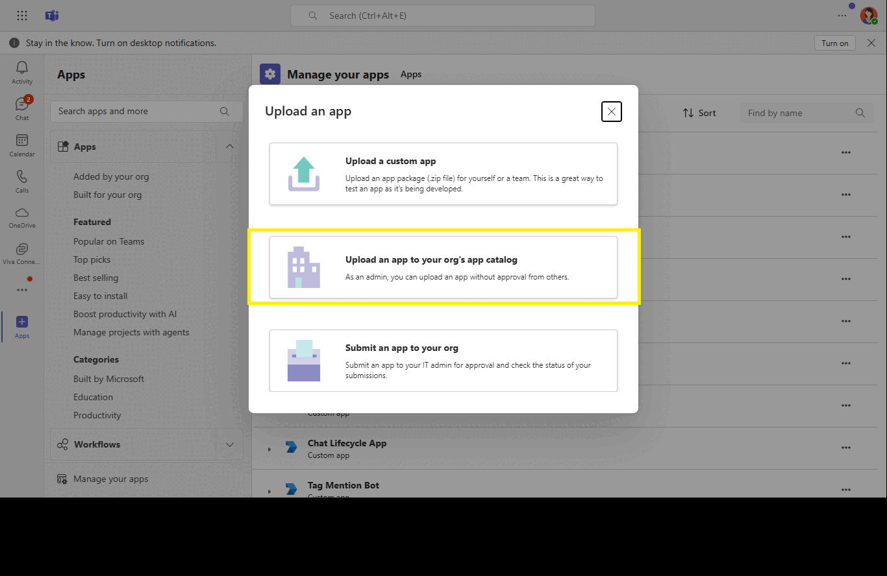

# Third-Party Storage Integration in Microsoft Teams
Microsoft Teams allows users to integrate third-party cloud storage providers by modifying the default storage options from OneDrive and SharePoint. This capability enables files that are dragged and dropped into the Teams chat or message compose area to be stored in a third-party storage service. Using the Microsoft Teams JavaScript client library (TeamsJS), third-party apps can capture these files through the getDragAndDropFiles API and then upload them to their own cloud storage.

To enable this feature, the latest version of the TeamsJS SDK is required, along with a properly configured app manifest and the app ID of the third-party storage provider. When a file is dragged and dropped, it is temporarily cached in Teams before being fetched by the third-party app and uploaded to its storage. This seamless integration enhances flexibility for businesses using external storage solutions within the Teams environment.

## Included Features
* Bots
* Message Extensions

## Interaction with Messaging Extension


## Prerequisites

- Microsoft Teams is installed and you have an account
- [.NET SDK](https://dotnet.microsoft.com/download) version 6.0
- [dev tunnel](https://learn.microsoft.com/en-us/azure/developer/dev-tunnels/get-started?tabs=windows) or [ngrok](https://ngrok.com/) latest version or equivalent tunnelling solution

## Run the app (Using Microsoft 365 Agents Toolkit for Visual Studio)

The simplest way to run this sample in Teams is to use Microsoft 365 Agents Toolkit for Visual Studio.
1. Install Visual Studio 2022 **Version 17.14 or higher** [Visual Studio](https://visualstudio.microsoft.com/downloads/)
1. Install Microsoft 365 Agents Toolkit for Visual Studio [Microsoft 365 Agents Toolkit extension](https://learn.microsoft.com/en-us/microsoftteams/platform/toolkit/toolkit-v4/install-teams-toolkit-vs?pivots=visual-studio-v17-7)
1. In the debug dropdown menu of Visual Studio, select Dev Tunnels > Create A Tunnel (set authentication type to Public) or select an existing public dev tunnel.
1. In the debug dropdown menu of Visual Studio, select default startup project > **Microsoft Teams (browser)**
1. Right-click the 'M365Agent' project in Solution Explorer and select **Microsoft 365 Agents Toolkit > Select Microsoft 365 Account**
1. Sign in to Microsoft 365 Agents Toolkit with a **Microsoft 365 work or school account**
1. Set `Startup Item` as `Microsoft Teams (browser)`.
1. Press F5, or select Debug > Start Debugging menu in Visual Studio to start your app
    </br>
1. In the opened web browser, select Add button to install the app in Teams
> If you do not have permission to upload custom apps (uploading), Microsoft 365 Agents Toolkit will recommend creating and using a Microsoft 365 Developer Program account - a free program to get your own dev environment sandbox that includes Teams.

## Setup

> Note these instructions are for running the sample on your local machine, the tunnelling solution is required because
the Teams service needs to call into the bot.

1) Run ngrok - point to port 3978

   ```bash
   ngrok http 3978 --host-header="localhost:3978"
   ```  

   Alternatively, you can also use the `dev tunnels`. Please follow [Create and host a dev tunnel](https://learn.microsoft.com/en-us/azure/developer/dev-tunnels/get-started?tabs=windows) and host the tunnel with anonymous user access command as shown below:

   ```bash
   devtunnel host -p 3978 --allow-anonymous
   ```

2) App Registration

### Register your application with Azure AD

1. Register a new application in the [Microsoft Entra ID – App Registrations](https://go.microsoft.com/fwlink/?linkid=2083908) portal.
2. Select **New Registration** and on the *register an application page*, set following values:
    * Set **name** to your app name.
    * Choose the **supported account types** (any account type will work)
    * Leave **Redirect URI** empty.
    * Choose **Register**.
3. On the overview page, copy and save the **Application (client) ID, Directory (tenant) ID**. You'll need those later when updating your Teams application manifest and in the appsettings.json.
4. Navigate to **API Permissions**, and make sure to add the follow permissions:
    * Select Add a permission
    * Select Microsoft Graph -> Delegated permissions.
    * `User.Read` (enabled by default)
    * Click on Add permissions. Please make sure to grant the admin consent for the required permissions.

3) Setup for Bot

   In Azure portal, create a [Azure Bot resource](https://docs.microsoft.com/azure/bot-service/bot-service-quickstart-registration).
    - For bot handle, make up a name.
    - Select "Use existing app registration" (Create the app registration in Microsoft Entra ID beforehand.)
    - __*If you don't have an Azure account*__ create an [Azure free account here](https://azure.microsoft.com/free/)
    
   In the new Azure Bot resource in the Portal, 
    - Ensure that you've [enabled the Teams Channel](https://learn.microsoft.com/azure/bot-service/channel-connect-teams?view=azure-bot-service-4.0)
    - In Settings/Configuration/Messaging endpoint, enter the current `https` URL you were given by running the tunnelling application. Append with the path `/api/messages`

1) Clone the repository

    ```bash
    git clone https://github.com/OfficeDev/Microsoft-Teams-Samples.git
    ```

1) If you are using Visual Studio
   - Launch Visual Studio
   - File -> Open -> Project/Solution
   - Navigate to `samples/msgext-thirdparty-storage/csharp` folder
   - Select `TeamsMsgextThirdpartyStorage.csproj` or `TeamsMsgextThirdpartyStorage.sln`file

1) Update the `appsettings.json` configuration for the bot to use the MicrosoftAppId, MicrosoftAppPassword, MicrosoftAppTenantId generated in Step 1 (App Registration creation). (Note the App Password is referred to as the "client secret" in the azure portal and you can always create a new client secret anytime.)
   - Set "MicrosoftAppType" in the `appsettings.json`. (**Allowed values are: MultiTenant(default), SingleTenant, UserAssignedMSI**)

   - Set "BaseUrl" in the `appsettings.json` as per your application like the ngrok forwarding url (ie `https://xxxx.ngrok-free.app`) after starting ngrok and if you are using dev tunnels, your URL will be like: https://12345.devtunnels.ms.

1) Run your bot, either from Visual Studio with `F5` or using `dotnet run` in the appropriate folder.

1) __*This step is specific to Teams.*__
    - **Edit** the `manifest.json` contained in the `appPackage` folder to replace your Microsoft App Id (that was created when you registered your bot earlier) *everywhere* you see the place holder string `<<YOUR-MICROSOFT-APP-ID>>` (depending on the scenario the Microsoft App Id may occur multiple times in the `manifest.json`)
    - **Edit** the `manifest.json` for `validDomains` with base Url domain. E.g. if you are using ngrok it would be `https://1234.ngrok-free.app` then your domain-name will be `1234.ngrok-free.app` and if you are using dev tunnels then your domain will be like: `12345.devtunnels.ms`.
    - **Zip** up the contents of the `appPackage` folder to create a `manifest.zip` (Make sure that zip file does not contains any subfolder otherwise you will get error while uploading your .zip package)
    - **Upload** the `manifest.zip` to Teams (In Teams Apps/Manage your apps click "Upload an app to your org's app catalog". Browse to and Open the .zip file. At the next dialog, click the Add button.)
    - Add the bot to personal/team/groupChat scope (Supported scopes)

**Note**: If you are facing any issue in your app, please uncomment [this](https://github.com/OfficeDev/Microsoft-Teams-Samples/blob/main/samples/msgext-thirdparty-storage/csharp/AdapterWithErrorHandler.cs#L25) line and put your debugger for local debug.

## Running the sample

**Upload an Application to Teams**


**Select the Build for Your Organization**


**Log in to Admin Center and Copy App ID**


**Admin Settings for File Drag-and-Drop to Third-Party Storage** 
- [Admin settings for file drag-drop to third-party storage](https://review.learn.microsoft.com/en-us/microsoftteams/admin-settings-for-file-drag-drop-to-third-party-storage?branch=main&branchFallbackFrom=pr-en-us-11741)


**Install the Application in Teams**


**Select a Channel for File Upload**


**Open the Channels to Access Files**


**Drag and Drop All Files into Teams**


**Files Successfully Dragged and Dropped**


**All Files Loaded in Task Module**


**Files Loaded into the Compose Area**


**Send All Dragged and Dropped Files**


**Drag and Drop Files in Chat**


**Drop Files in the Chat Window**


**Load All Files in the Task Module**


**Upload All Files in the Chat**


**Send Files in the Chat**


## Deploy the bot to Azure

To learn more about deploying a bot to Azure, see [Deploy your bot to Azure](https://aka.ms/azuredeployment) for a complete list of deployment instructions.

## Further reading

- [Third-party storage capability](https://learn.microsoft.com/en-us/microsoftteams/platform/concepts/device-capabilities/third-party-storage-capability?branch=pr-en-us-11741)
- [Turn off Teams Native File Upload policy](https://learn.microsoft.com/en-us/microsoftteams/turn-off-teams-native-file-upload-policy)
- [Admin settings for file drag-drop to third-party storage](https://learn.microsoft.com/en-us/microsoftteams/admin-settings-for-file-drag-drop-to-third-party-storage?branch=main&branchFallbackFrom=pr-en-us-11741)
- [App manifest](https://learn.microsoft.com/en-us/microsoftteams/platform/resources/schema/manifest-schema?branch=main)

