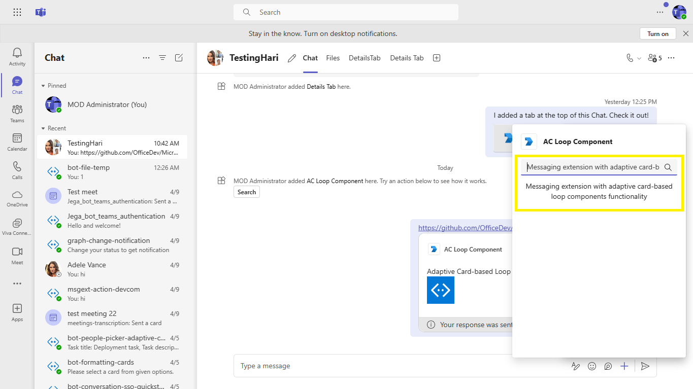
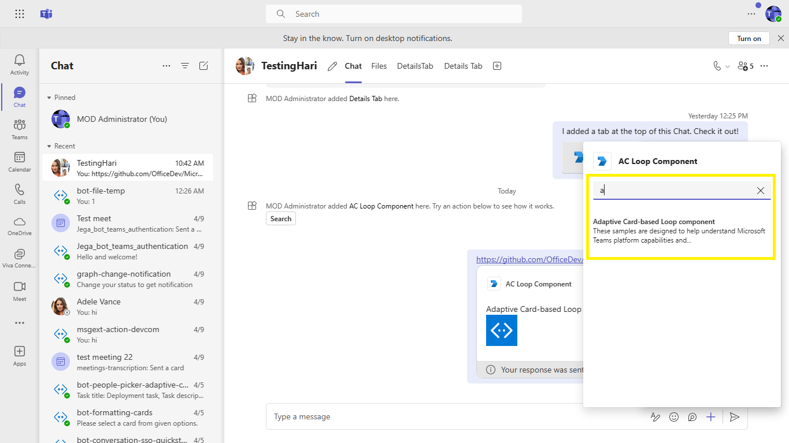
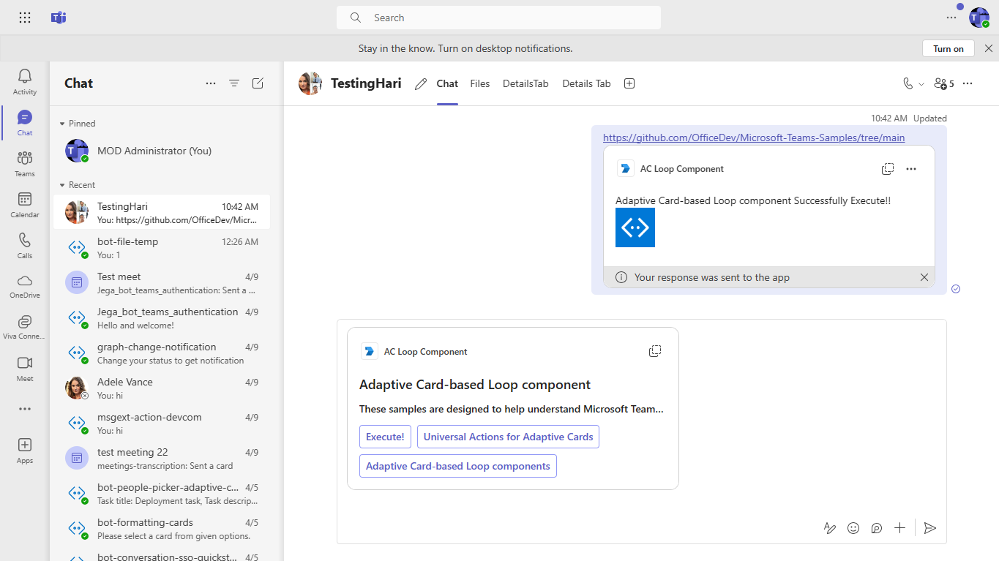
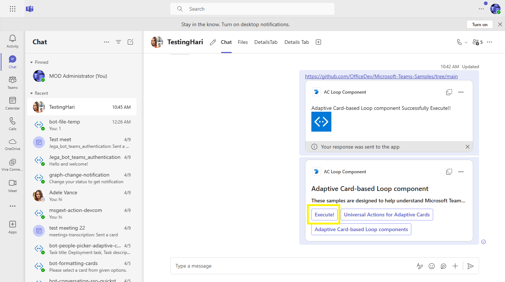
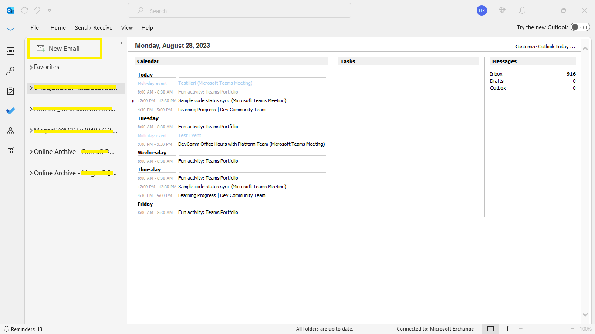
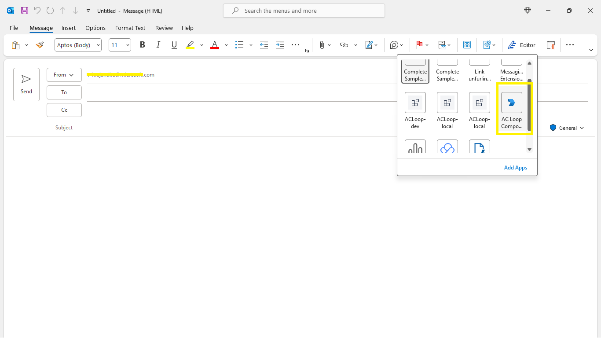
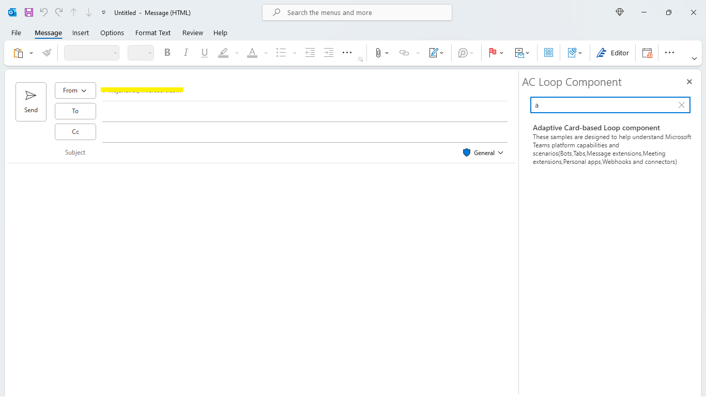
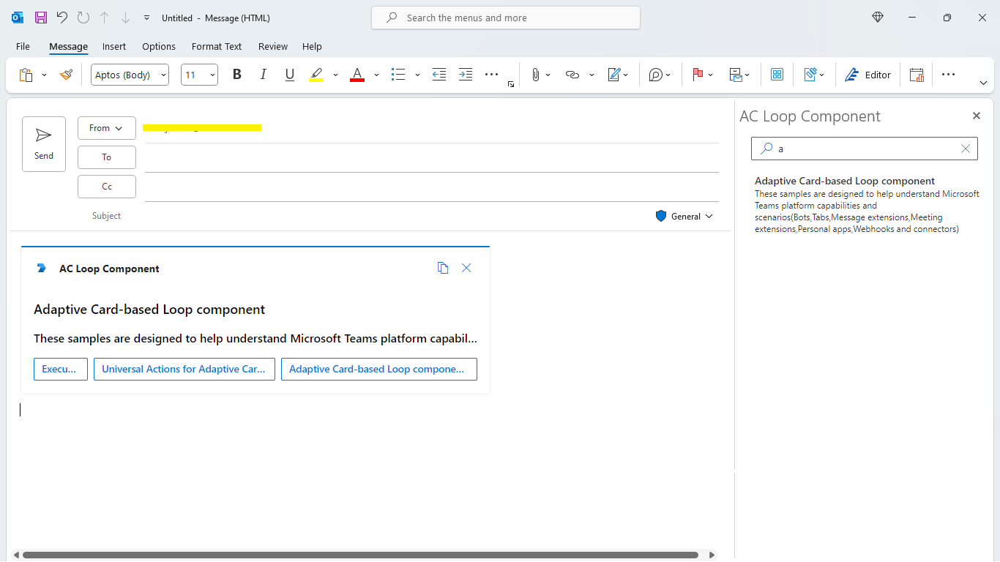
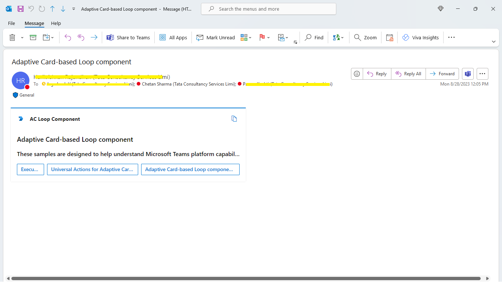

# Messaging Extension with Adaptive Card Loop Components

If you copy and paste a link from `https://github.com/OfficeDev/Microsoft-Teams-Samples/tree/main` or your ngrok base url, it wil unfurl inside compose area.

## Included Features
* Message Extensions
* Search Commands
* Link Unfurling
* Adaptive card based loop component

## Interaction with teams


## Try it yourself - experience the App in your Microsoft Teams client
Please find below demo manifest which is deployed on Microsoft Azure and you can try it yourself by uploading the app package (.zip file link below) to your teams and/or as a personal app. (Sideloading must be enabled for your tenant, [see steps here](https://docs.microsoft.com/microsoftteams/platform/concepts/build-and-test/prepare-your-o365-tenant#enable-custom-teams-apps-and-turn-on-custom-app-uploading)).

**Msgext-Unfurling-Adaptive-Card-Loop-Components:** [Manifest](/samples/msgext-unfurling-ac-loop-components/csharp/demo-manifest/msgext-unfurling-ac-loop-components.zip)

## Prerequisites

- Microsoft Teams is installed and you have an account
- [.NET SDK](https://dotnet.microsoft.com/download) version 6.0
- [dev tunnel](https://learn.microsoft.com/en-us/azure/developer/dev-tunnels/get-started?tabs=windows) or [ngrok](https://ngrok.com/) latest version or equivalent tunnelling solution

## Run the sample locally

### 1. Register you app with Azure AD

  1. Register a new application in the [Azure Active Directory – App Registrations](https://go.microsoft.com/fwlink/?linkid=2083908) portal.
  2. Select **New Registration** and on the *register an application page*, set following values:
      * Set **name** to your app name.
      * Choose the **supported account types** (any account type will work)
      * Leave **Redirect URI** empty.
      * Choose **Register**.
  3. On the overview page, copy and save the **Application (client) ID, Directory (tenant) ID**. You’ll need those later when updating your Teams application manifest and in the appsettings.json.
  4. Navigate to the **Certificates & secrets**. In the Client secrets section, click on "+ New client secret". Add a description(Name of the secret) for the secret and select “Never” for Expires. Click "Add". Once the client secret is created, copy its value, it need to be placed in the appsettings.json.
  5. In the **Authorized client applications** section, identify the applications that you want to authorize for your app’s web application. Each of the following IDs needs to be entered:
      * `1fec8e78-bce4-4aaf-ab1b-5451cc387264` (Teams mobile/desktop application)
      * `5e3ce6c0-2b1f-4285-8d4b-75ee78787346` (Teams web application)
**Note** If you want to test or extend your Teams apps across Outlook, kindly add below client application identifiers while doing Azure AD app registration in your tenant:
     * `bc59ab01-8403-45c6-8796-ac3ef710b3e3` (Outlook web)
     * `d3590ed6-52b3-4102-aeff-aad2292ab01c` (Outlook desktop)
         
### 2. Setup

1) Setup for Bot

   In Azure portal, create a [Azure Bot resource](https://docs.microsoft.com/azure/bot-service/bot-service-quickstart-registration).
    - For bot handle, make up a name.
    - Select "Use existing app registration" (Create the app registration in Azure Active Directory beforehand.)
    - __*If you don't have an Azure account*__ create an [Azure free account here](https://azure.microsoft.com/free/)
    
   In the new Azure Bot resource in the Portal, 
    - Ensure that you've [enabled the Teams Channel](https://learn.microsoft.com/azure/bot-service/channel-connect-teams?view=azure-bot-service-4.0)
    - Ensure that you've [enabled the Outlook Channel](https://learn.microsoft.com/en-us/azure/bot-service/bot-service-channel-connect-actionable-email?view=azure-bot-service-4.0)
  
    - In Settings/Configuration/Messaging endpoint, enter the current `https` URL you were given by running the tunnelling application. Append with the path `/api/messages`

> Note these instructions are for running the sample on your local machine, the tunnelling solution is required because
the Teams service needs to call into the bot.

1) Run ngrok - point to port 3978

    ```bash
    ngrok http 3978 --host-header="localhost:3978"
    ```
    Alternatively, you can also use the `dev tunnels`. Please follow [Create and host a dev tunnel](https://learn.microsoft.com/en-us/azure/developer/dev-tunnels/get-started?tabs=windows) and host the tunnel with anonymous user access command as shown below:

   ```bash
   devtunnel host -p 3978 --allow-anonymous
   ```

### 3. Setup for code
1) Clone the repository

    ```bash
    git clone https://github.com/OfficeDev/Microsoft-Teams-Samples.git
    ```

1) If you are using Visual Studio
   - Launch Visual Studio
   - File -> Open -> Project/Solution
   - Navigate to `samples/msgext-unfurling-ac-loop-components/csharp` folder
   - Select `TeamsMsgextUnfurlingAcLoopComponents.csproj` or `TeamsMsgextUnfurlingAcLoopComponents.sln`file

1)  Modify the `/appsettings.json` and fill in the following details:
  - `{{Microsoft-App-Type}}` -  (**Allowed values are: MultiTenant(default), SingleTenant, UserAssignedMSI**)
  - `{{Microsoft-App-Id}}` - Generated from Step 1 is the application app id
  - `{{Microsoft-App-Password}}` - Generated from Step 1, also referred to as Client secret
  - `{{Microsoft-App-TenantId}}` - Generated from Step 1 is the tenantId id
 
1) Run your bot, either from Visual Studio with `F5` or using `dotnet run` in the appropriate folder.

1) __*This step is specific to Teams.*__
    - **Edit** the `manifest.json` contained in the  `AppManifest` folder to replace your Microsoft App Id (that was created when you registered your bot earlier) *everywhere* you see the place holder string `{{Microsoft-App-Id}}` (depending on the scenario the Microsoft App Id may occur multiple times in the `manifest.json`)
    - **Edit** the `{{domain-name}}` with base Url domain. E.g. if you are using ngrok it would be `1234.ngrok-free.app` and if you are using dev tunnels then your domain will be `12345.devtunnels.ms`.
    - **Zip** up the contents of the `AppManifest` folder to create a `manifest.zip` (Make sure that zip file does not contains any subfolder otherwise you will get error while uploading your .zip package)
    - **Upload** the `manifest.zip` to Teams (In Teams Apps/Manage your apps click "Upload an app". Browse to and Open the .zip file. At the next dialog, click the Add button.)

**Note**: If you are facing any issue in your app, please uncomment [this](https://github.com/OfficeDev/Microsoft-Teams-Samples/blob/main/samples/msgext-unfurling-ac-loop-components/csharp/AdapterWithErrorHandler.cs#L25) line and put your debugger for local debug.

### 4. Running the sample

> Note the Teams `manifest.json` for this sample also includes a Search Query. This Messaging Extension is only introduced in order to enable installation, because there is no mechanism for installing a link unfurling feature in isolation.

**Install App:**


**Add to a chat:**


**Add to a group chat:**


**If you copy and paste a link from https://github.com/OfficeDev/Microsoft-Teams-Samples/tree/main into the compose message area the link will unfurl:**


**Search for actions and apps:**


**Search:**


**Search Results:**


**Adaptive Card Based Loop Components:**


**Click Execute:**


**Successfully Execute:**


## Outlook on the web

- To view your app in Outlook on the web.

- Go to [Outlook on the web](https://outlook.office.com/mail/)and sign in using your dev tenant account.

**After opening Outlook web, click the "New mail" button:**


**On the tool bar on top,select Apps icon. Your sideloaded app title appears among your installed apps:**


**Select your app icon:**


**Search for actions and apps:**


**Search Results:**


**Adaptive Card Based Loop Components:**


**Click Execute:**


**Successfully Execute:**


**If you copy and paste a link from https://github.com/OfficeDev/Microsoft-Teams-Samples/tree/main into the compose message area the link will unfurl:**


## Deploy the bot to Azure

To learn more about deploying a bot to Azure, see [Deploy your bot to Azure](https://aka.ms/azuredeployment) for a complete list of deployment instructions.

## Further reading

- [Adaptive Card-based Loop components](https://learn.microsoft.com/en-us/microsoftteams/platform/m365-apps/cards-loop-component?branch=pr-en-us-9230)
- [Build message extensions](https://learn.microsoft.com/en-us/microsoftteams/platform/messaging-extensions/what-are-messaging-extensions)
- [Azure Bot Service Introduction](https://learn.microsoft.com/en-us/microsoftteams/platform/messaging-extensions/how-to/link-unfurling)
- [Universal Actions for Adaptive Cards](https://learn.microsoft.com/en-us/microsoftteams/platform/task-modules-and-cards/cards/universal-actions-for-adaptive-cards/work-with-universal-actions-for-adaptive-cards)
- [Extend a Teams message extension across Microsoft 365](https://learn.microsoft.com/en-us/microsoftteams/platform/m365-apps/extend-m365-teams-message-extension)

