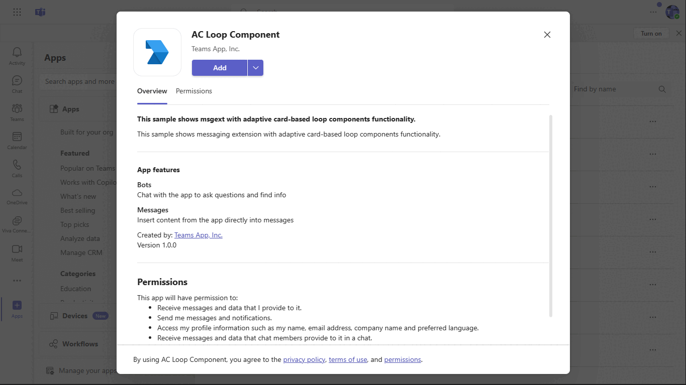

# Messaging Extension with Adaptive Card Loop Components

If you copy and paste a link from `https://github.com/OfficeDev/Microsoft-Teams-Samples/tree/main` or your ngrok base url, it wil unfurl inside compose area.

## Included Features
* Message Extensions
* Search Commands
* Link Unfurling
* Adaptive card based loop component

## Interaction with teams


## Prerequisites

- Microsoft Teams is installed and you have an account
- [NodeJS](https://nodejs.org/en/)
- [devtunnel](https://aka.ms/TunnelsCliDownload/win-x64) or [ngrok](https://ngrok.com/) latest version or equivalent tunneling solution
- [Teams Toolkit for VS Code](https://marketplace.visualstudio.com/items?itemName=TeamsDevApp.ms-teams-vscode-extension) or [TeamsFx CLI](https://learn.microsoft.com/microsoftteams/platform/toolkit/teamsfx-cli?pivots=version-one)

## Run the app (Using Teams Toolkit for Visual Studio Code)

The simplest way to run this sample in Teams is to use Teams Toolkit for Visual Studio Code.

1. Ensure you have downloaded and installed [Visual Studio Code](https://code.visualstudio.com/docs/setup/setup-overview)
1. Install the [Teams Toolkit extension](https://marketplace.visualstudio.com/items?itemName=TeamsDevApp.ms-teams-vscode-extension)
1. Select **File > Open Folder** in VS Code and choose this samples directory from the repo
1. Using the extension, sign in with your Microsoft 365 account where you have permissions to upload custom apps
1. Select **Debug > Start Debugging** or **F5** to run the app in a Teams web client.
1. In the browser that launches, select the **Add** button to install the app to Teams.
> If you do not have permission to upload custom apps (sideloading), Teams Toolkit will recommend creating and using a Microsoft 365 Developer Program account - a free program to get your own dev environment sandbox that includes Teams.

## Run the sample locally

### 1. Register you app with Azure AD

1. Register a new application in the [Azure Active Directory – App Registrations](https://go.microsoft.com/fwlink/?linkid=2083908) portal.
  2. Select **New Registration** and on the *register an application page*, set following values:
      * Set **name** to your app name.
      * Choose the **supported account types** (any account type will work)
      * Leave **Redirect URI** empty.
      * Choose **Register**.
  3. On the overview page, copy and save the **Application (client) ID, Directory (tenant) ID**. You’ll need those later when updating your Teams application manifest and in the .env.
  4.  Navigate to the **Certificates & secrets**. In the Client secrets section, click on "+ New client secret". Add a description(Name of the secret) for the secret and select “Never” for Expires. Click "Add". Once the client secret is created, copy its value, it need to be placed in the .env.

### 2. Setup

> Note these instructions are for running the sample on your local machine, the tunnelling solution is required because
the Teams service needs to call into the bot.

1) Run ngrok - point to port 3978

    ```bash
    ngrok http 3978 --host-header="localhost:3978"
    ```
    Alternatively, you can also use the `dev tunnel`. Please follow [Create and host a Dev tunnel](https://learn.microsoft.com/en-us/azure/developer/dev-tunnels/get-started?tabs=windows) and host the tunnel with anonymous user access command as shown below:

   ```bash
   devtunnel host -p 3978 --allow-anonymous
   ```

### 3. Setup for code
1) Clone the repository

    ```bash
    git clone https://github.com/OfficeDev/Microsoft-Teams-Samples.git
    ```

1) In a terminal, navigate to `samples/msgext-unfurling-ac-loop-components/nodejs`

1) Install modules

    ```bash
    npm install
    ```

1) Open .env file from this path folder `samples/msgext-unfurling-ac-loop-components/nodejs` and update 
   - `{{BOT_ID}}` - Generated from Step 1 (Application (client) ID)is the application app id
   - `{{BOT_PASSWORD}}` - Generated from Step 1.4, also referred to as Client secret

1) Run your bot at the command line:

    ```bash
    npm start
    ```

1) __*This step is specific to Teams.*__
    - **Edit** the `manifest.json` contained in the  `AppManifest` folder to replace your Microsoft App Id (that was created when you registered your bot earlier) *everywhere* you see the place holder string `{{BOT_ID}}` (depending on the scenario the Microsoft App Id may occur multiple times in the `manifest.json`)
    - **Edit** the `<<Your Tunnel Domain>>` - Your application's base url domain. E.g. for https://12345.ngrok-free.app the base url domain will be 12345.ngrok-free.app if you are using ngrok and if you are using dev tunnel then your domain will be like: `12345.devtunnels.ms`.
    - **Zip** up the contents of the `AppManifest` folder to create a `manifest.zip` (Make sure that zip file does not contains any subfolder otherwise you will get error while uploading your .zip package)
    - **Upload** the `manifest.zip` to Teams (In Teams Apps/Manage your apps click "Upload an app". Browse to and Open the .zip file. At the next dialog, click the Add button.)

**Note**: If you are facing any issue in your app, please uncomment [this](https://github.com/OfficeDev/Microsoft-Teams-Samples/blob/main/samples/msgext-unfurling-ac-loop-components/nodejs/index.js#L39) line and put your debugger for local debug.

### 4. Running the sample

> Note the Teams `manifest.json` for this sample also includes a Search Query. This Messaging Extension is only introduced in order to enable installation, because there is no mechanism for installing a link unfurling feature in isolation.

**Install App:**


**If you copy and paste a link from https://github.com/OfficeDev/Microsoft-Teams-Samples/tree/main into the compose message area the link will unfurl:**


**Search Result:**


**Adaptive Card Based Loop Components:**


## Deploy the bot to Azure

To learn more about deploying a bot to Azure, see [Deploy your bot to Azure](https://aka.ms/azuredeployment) for a complete list of deployment instructions.

## Further reading

- [Adaptive Card-based Loop components](https://microsoft.com/en-us/microsoftteams/platform/m365-apps/cards-loop-component?branch=pr-en-us-9230)
- [Build message extensions](https://microsoft.com/en-us/microsoftteams/platform/messaging-extensions/what-are-messaging-extensions)
- [Azure Bot Service Introduction](https://microsoft.com/en-us/microsoftteams/platform/messaging-extensions/how-to/link-unfurling)
- [Universal Actions for Adaptive Cards](https://microsoft.com/en-us/microsoftteams/platform/task-modules-and-cards/cards/universal-actions-for-adaptive-cards/work-with-universal-actions-for-adaptive-cards)
- [Extend a Teams message extension across Microsoft 365](https://microsoft.com/en-us/microsoftteams/platform/m365-apps/extend-m365-teams-message-extension)


