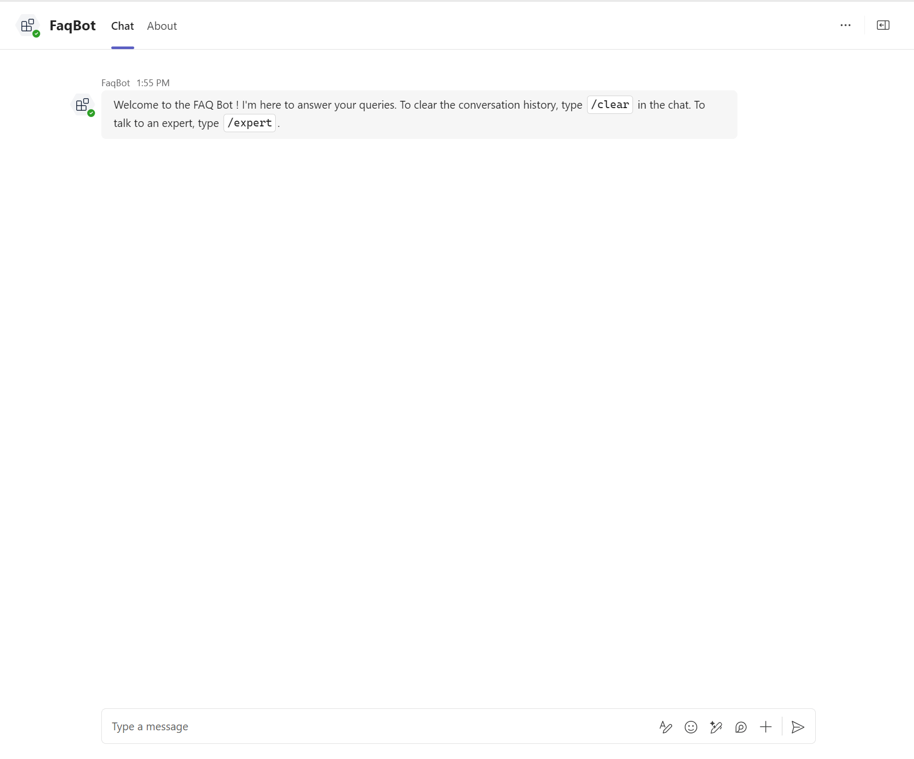
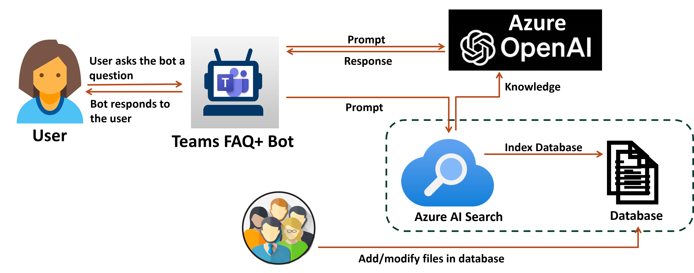
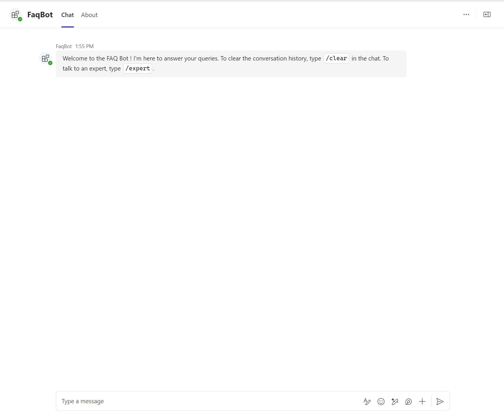
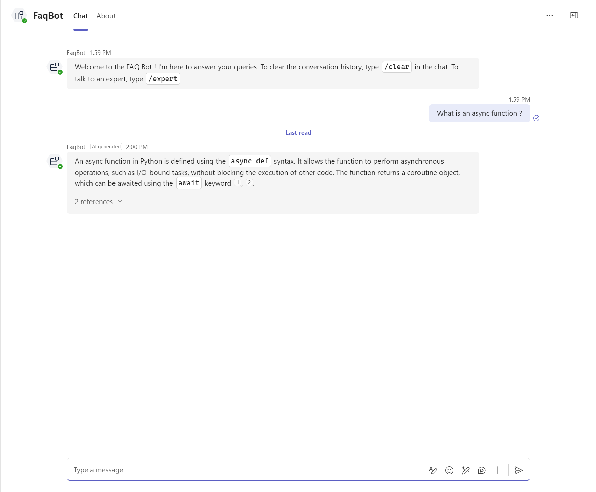
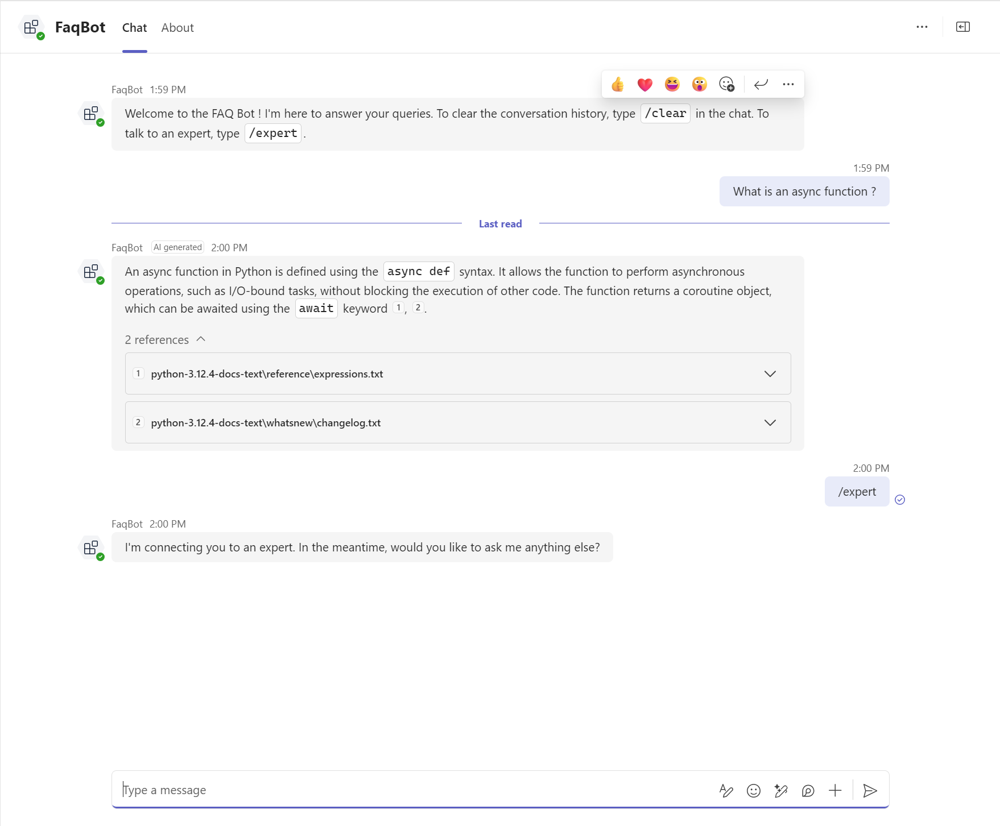
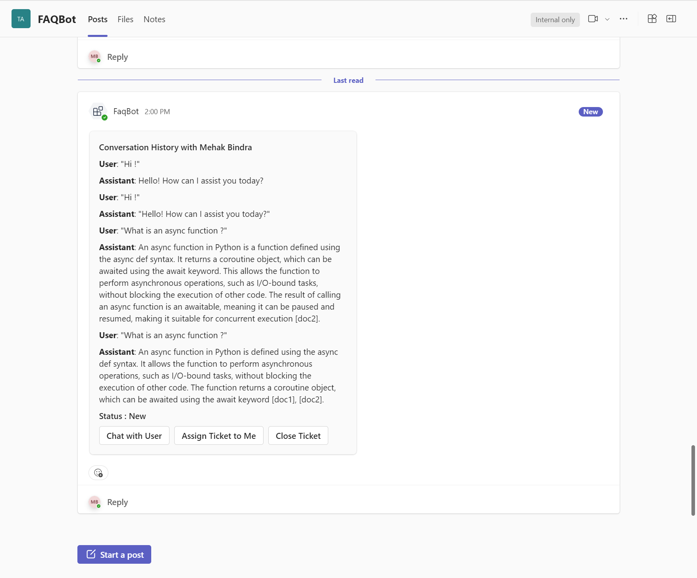
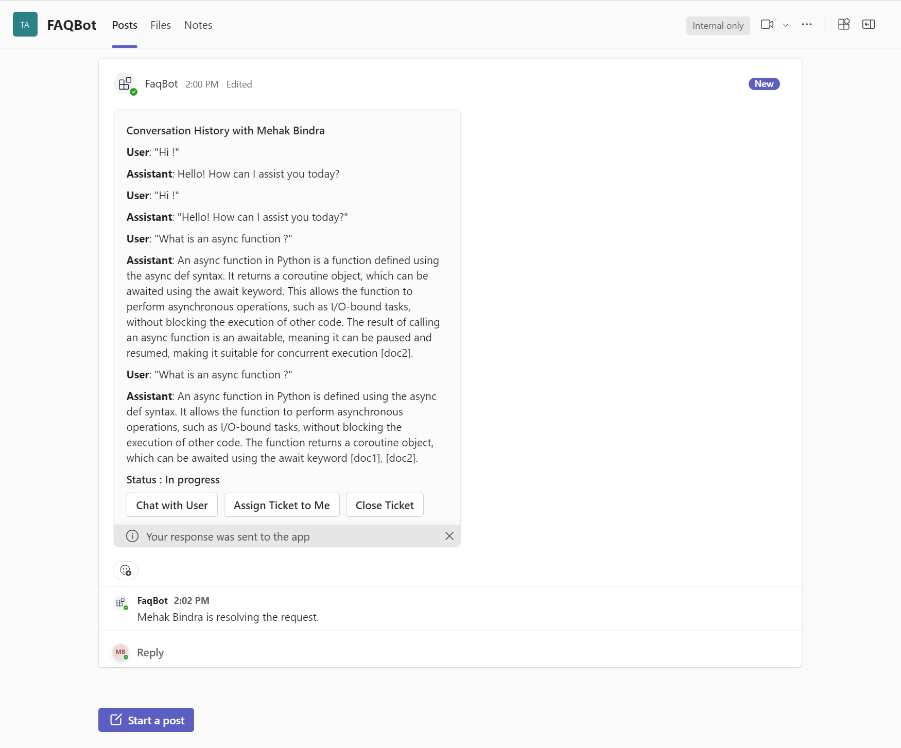
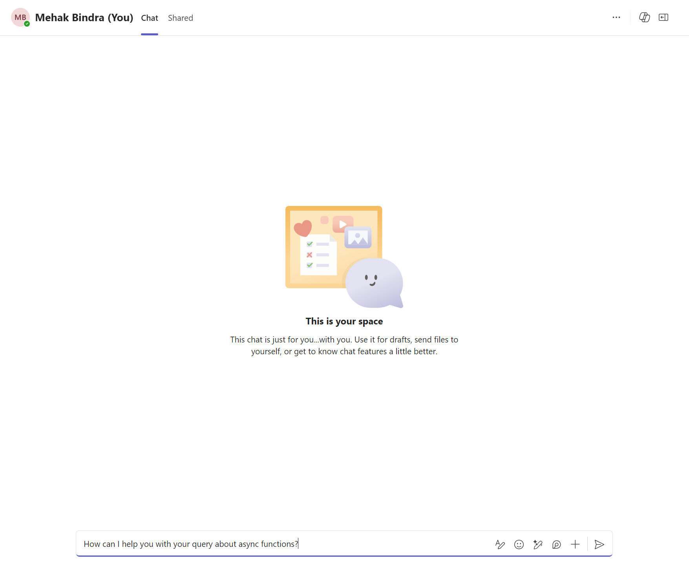
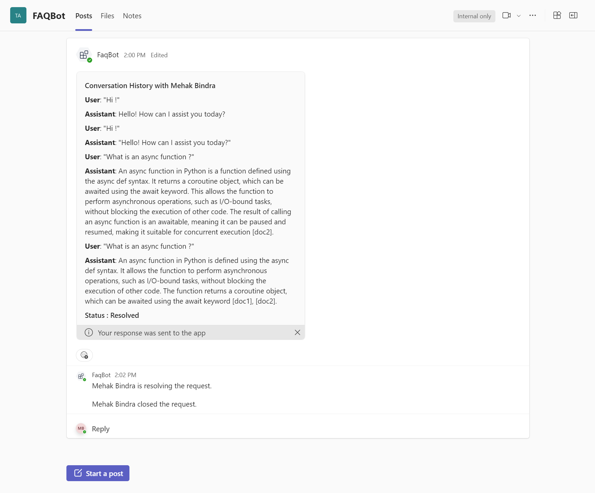
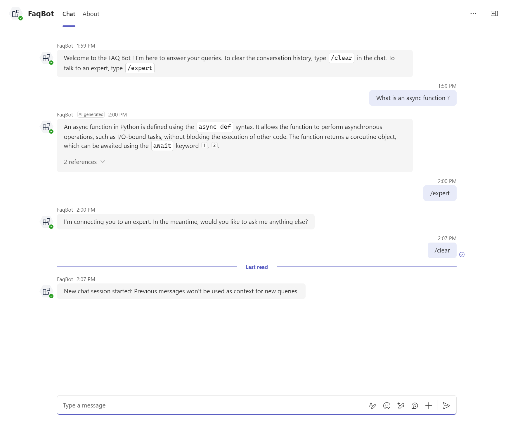

# FAQ+ Bot
[](https://github.com/codespaces/new?hide_repo_select=true&ref=main&repo=322043759&devcontainer_path=.devcontainer%2Fmsteams-FAQPlus%2Fdevcontainer.json&resume=1)

This sample implements a chatbot that answers queries based on a custom database using retrieval-augmented generation (RAG) with Azure OpenAI and Azure AI Search and escalates queries to a Teams channel when asked. 
- The user can set up a datasource such as Azure AI Search, Azure Blob Storage, URL/web address, Azure Cosmos DB for MongoDB vCore, uploaded files, or Elasticsearch.
- The user can then interact with the data through the bot.
- The bot sends an adaptive card using proactive messaging to a Teams Channel if asked.
- Experts can then engage with users and update the knowledge base dynamically.

## Included Features
* **Azure Open AI:** Azure OpenAI On Your Data leverages OpenAI's language models, like GPT-3.5 and GPT-4, augmented with RAG to provide a conversational interface for answering queries from your domain data using the chat completions API.
* **Azure AI Search:** Azure AI Search is utilized as a data source for Azure OpenAI's chat completions API.
* **Proactive Messaging:** Proactive messaging is used to send a message to the Teams channel by initiating a conversation.
* **Adaptive Cards:** Adaptive cards are used to send the conversation history to the Teams channel and allow for actions such as "chat with user" or "close ticket".

## Interaction with the bot
 

## How the knowledge base works

1. **User Query**:
    - The user asks the bot a question.
2. **Prompt Generation**:
    - The bot generates a prompt based on the user's question.
3. **Azure AI Search**:
    - The prompt is sent as a query to Azure AI Search to find relevant information.
    - The top ranked search results are sent to the LLM.
4. **Azure OpenAI**:
   - The promt is also sent to Azure OpenAI model to set the context and intent.
   - The model provides a generative response which is sent back to the user.

## Set up and run the app in Github Codespaces
1. Click **Open in GitHub Codespaces** badge above to create a codespace for the sample app. Wait for the codespace to be setup, it may take a couple of minutes.
2. Using the Teams Toolkit extension, sign in to your Microsoft 365 account and Azure account under ```ACCOUNTS```.
3. [Set up your knowledge base using Azure AI resources](#set-up-your-knowledge-base).
4. [Populate the environment files](#populate-the-environment-files).
5. Press **Ctrl+Shift+D** to open the ```Run and Debug``` menu. Select ```Debug``` and press ```F5``` or click on the play button.
6. Download the zip file ```appPackage/build/appPackage.local.zip``` and [sideload the app to Teams personal chat](#sideload-the-app-to-teams-personal-chat) and  [sideload the app to Teams Channel](#sideload-the-app-to-teams-channel)
7. You can now [interact with the app](#interact-with-the-app).
   
## Set up and run the app locally
### Prerequisites
- [Python 3.11](https://www.python.org/downloads/)
- [Node.js](https://nodejs.org/)
- [Rust](https://www.rust-lang.org/tools/install)
- [Poetry](https://python-poetry.org/docs/#installation)
- [Azure CLI](https://learn.microsoft.com/en-us/cli/azure/install-azure-cli)
- [Visual Studio Code](https://code.visualstudio.com/download)
- [Teams Toolkit Extension ](https://marketplace.visualstudio.com/items?itemName=TeamsDevApp.ms-teams-vscode-extension)
- [Python Extension](https://marketplace.visualstudio.com/items?itemName=ms-python.python)

1. Clone the repository
   ```git clone https://github.com/t-mbindra/chat-with-your-data.git```
2. Open the project folder(Microsoft-Teams-Samples/samples/msteams-chat-with-your-data) in VS Code.
3.  Run
   ```poetry install && poetry build```
4. Using the Teams Toolkit extension, sign in to your Microsoft 365 account and Azure account under ```ACCOUNTS```.
5. [Set up your knowledge base using Azure AI resources](#set-up-your-knowledge-base).
6. [Populate the environment files](#populate-the-environment-files).
7. Press **Ctrl+Shift+D** to open the ```Run and Debug``` menu. Press ```F5``` or click on the play button. Also, [sideload the app to Teams Channel](#sideload-the-app-to-teams-channel)
8. You can now [interact with the app](#interact-with-the-app).

>[!Note]
> Check the status of all your local(Debug/F5 flow) bots on [Microsoft Bot Framework](https://dev.botframework.com/bots).
> Check the status of all your Teams apps on [Teams Developer Portal](https://dev.teams.microsoft.com/apps).
> Teams toolkit will also generate an app registration along with a password which can be seen under **App Registrations** on the Azure portal.

## Set up your knowledge base
1. Run```sh deploy.sh``` in the terminal to deploy Azure Saerch and Azure OpenAI. You will be prompted to login to Azure and select a subscription.
2. Add all your files to the ```src/data``` folder and URLs to ```src/indexer/URL.txt``` and run ```python ./src/indexer/setup.py```.
3. To delete the exisiting index, run ```python .src/indexer/delete.py```.

## Populate the environment files
1. You need to populate the environment variables in ```env/.env.local.user``` if you are using the ```Debug``` or ```F5``` flow. Else, populate the environment variables in ```env/.env.dev.user``` if you are dpleoying the app on Azure.
2. Go to the the [Azure portal](https://ms.portal.azure.com/) and navigate to the resource group ```FaqBot```. 
3. To populate ```SECRET_AZURE_OPENAI_KEY, SECRET_AZURE_OPENAI_ENDPOINT``` variables:
   - Go to the ```faqbot-cognitive``` resource. Select the ```Keys and Endpoints``` tab under ```Resource Management```. Use ```Key 1``` and ```Endpoint```. 
4. To populate   ```SECRET_AZURE_SEARCH_ENDPOINT``` variable:
   - Go to the ```faqbot-search``` resource. Use the ```Url``` given.
5. To populate   ```SECRET_AZURE_SEARCH_KEY``` variable:
   - Go to the ```faqbot-search``` resource. Select the ```Keys``` tab under ```Settings```.  Use ```Primary admin key```.
6. Set the environment variable ```TEAMS_CHANNEL_ID``` from the link of the channel - https://teams.microsoft.com/l/channel/<teams_channel_id_string>/.  Remember to first decode the URL-encoded string.

## Sideload the app to Teams personal chat:
1. Go to your Teams app and click on the ```Apps``` icon. Select ```Manage your apps``` followed by ```Upload an app```.
2. Select ```Upload a custom app``` and open the relevant zip file. Click on ```Add``` when prompted.

## Sideload the app to Teams channel:
1. Go to the channel where you want to raise requests for help. Click on the ```Apps``` icon. Select ```Got more apps``` followed by ```Manage your apps```.
2. Click on ```Upload an app``` and open the relevant zip file.  Click on ```Add``` when prompted. Select the correct channel and click on ```Go```

> If you do not have permission to upload custom apps (sideloading), Teams Toolkit will recommend creating and using a Microsoft 365 Developer Program account - a free program to get your own dev environment sandbox that includes Teams.

## Interact with the app
1. The bot sends a welcome message.
 
2. User chats with the bot.
 
3. User wants to talk to an expert.
 
4. The query and brief conversation history is posted to the Teams channel.
 
5. Anyone on the Teams channel can assign the ticket to themselves.
 
6. Anyone on the Teams channel can chat with the user.
 
7. Anyone on the Teams channel can close the ticket.
 
8. User clears the chat history.
 

## Deploy/Host the app on Azure
Instead of the ```Debug``` or ```F5``` flow, you can deploy the app on Azure:
1. [Populate the environment files](#populate-the-environment-files).
2. Using the Teams Toolkit Extension tab, click on ```Provision``` followed by ```DEPLOY``` under ```LIFECYCLE```. You will be asked to select the subscription and resource group for provisioning.
3. Using the zip file ```appPackage/build/appPackage.dev.zip```, [sideload the app to Teams personal chat](#sideload-the-app-to-teams-personal-chat) and [sideload the app to Teams Channel](#sideload-the-app-to-teams-channel)

>[!Note]
> Check the status of your dev(hosted on Azure) bots on [Azure Portal](https://portal.azure.com/#home) by navigating to the relevant resource group.
> Check the status of all your Teams apps on [Teams Developer Portal](https://dev.teams.microsoft.com/apps).
> Teams toolkit will also generate an app registration along with a password which can be seen under **App Registrations** on the Azure portal.