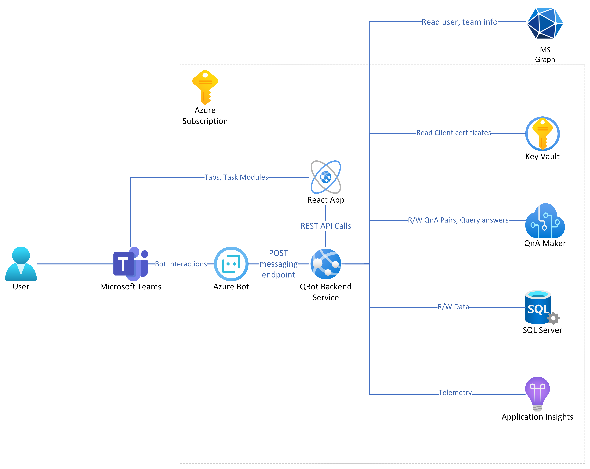
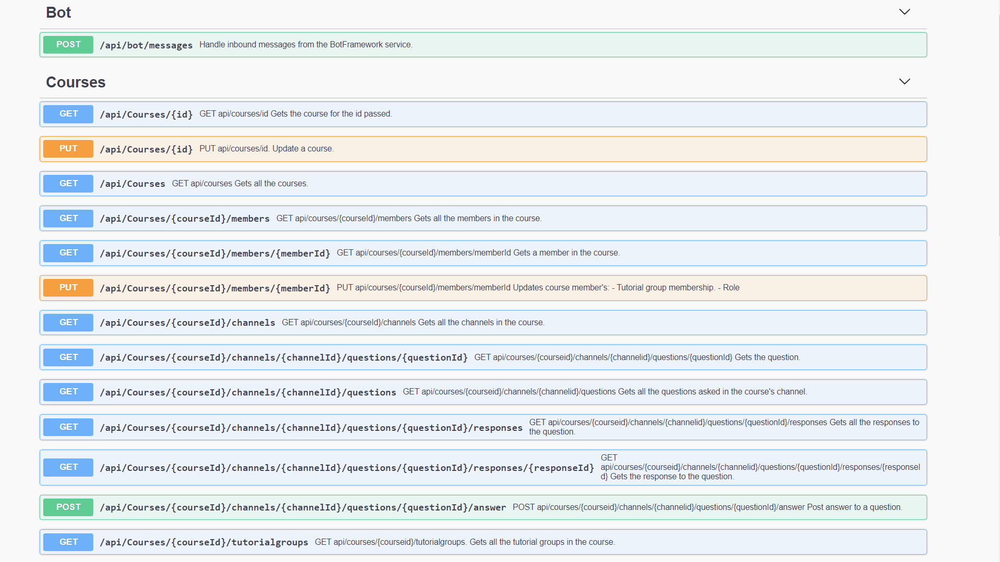
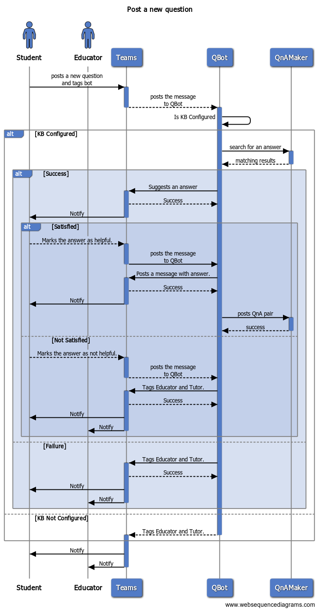
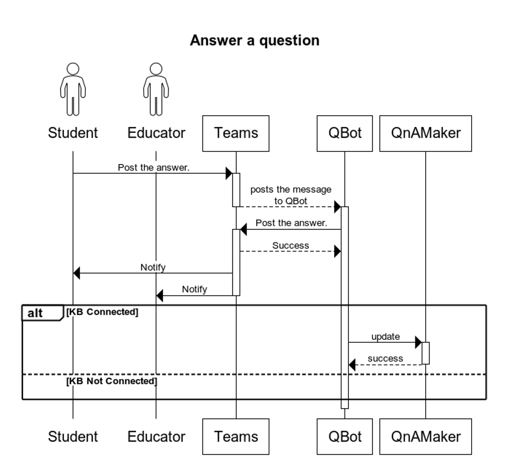

# Solution Overview

## Architecture
Refer to image below for high level architecture.

The following are the main components:

### QBot Backend Service
The Backend service is an ASP.NET Core 3.1 application for housing all the business logic for the QBot implementation. It acts as the message handler for the bot (under the /bot/message path) as well as the backend for the React application for the personal and shared app experiences (tabs, task modules).

### React App
Client application that powers personal, shared tab and task module experiences.

### Azure Bot
Bot channel registration. The messaging endpoint is set to QBot Backend service to handle bot interactions in Teams.

### QnA Maker
Azure Cognitive service to help intelligently answer questions. The backend service posts QnA Pairs in this service (KnowledgeBase) and queries it for answers when a new question is posted.

The solution creates 1 Knowledge Base resource and a unique metadata pair for every logical knowledge base that users creates in the application. [Learn more](https://docs.microsoft.com/en-us/azure/cognitive-services/qnamaker/how-to/query-knowledge-base-with-metadata).

### SQL Server
Stores course, course members, knowledge base, tutorial group, question and answer data entities. You will find all the data entities [here](../Source/Microsoft.Teams.Apps.QBot.Infrastructure/Data/Entities).

### Key Vault
QBot uses certificate credentials to authenticate to [Azure AD](https://docs.microsoft.com/en-us/azure/active-directory/develop/active-directory-certificate-credentials). The certificates are stored in Key Vault.

### Application Insights
Telemetry is sent to application insights service. This makes it easier to monitor application health and debug issues.

### Graph Service
The backend service consumes Graph services to read [User profile](https://docs.microsoft.com/en-us/graph/teams-send-activityfeednotifications), read Teams data ([messages in a channel](https://docs.microsoft.com/en-us/graph/api/chatmessage-get?view=graph-rest-1.0&tabs=http)) and [send notifications](https://docs.microsoft.com/en-us/graph/teams-send-activityfeednotifications) to users.

## Project Structure
* The application contains 3 projects
  * `Web` - Exposes REST APIs (including Bot messaging endpoint) for clients to integrate. Also contains React application logic.
  * `Domain` - Contains the core business logic to setup a course, QnA workflow, user roles etc.
  * `Infrastructure` - Fulfills `Domain`'s dependencies. Example - Connects to QnA Maker service, Teams and Graph services, Key Vault and R/W data from/to SQL Server. Each dependency can be replaced without affecting Domain logic.

### REST APIs
You may refer to the following image that covers all the APIs in this web application.

We have integrated Swagger UI in the project, once your deployment is completed, you can go to `https://qbot-<unique-name>-webapp.azurewebsites.net/swagger/index.html` to explore them.

### Authentication and Authorization
The application authenticates all the incoming requests, and it allows communication from one tenant only. (configurable via the `AzureAd::TenantId` app setting)

The following table describes user level control based on their role in a course:

| User Role |	Ask Question | Answer Question | Select an Answer | Manage user roles, tutorial groups | Initial set-up |
| --------- | ------------ | --------------- | ---------------- | ---------------------------------- | -------------- |
| Student |	Y | Y | Y* | N | N |
| Tutor | Y | Y | Y | N | N |
| Educator | Y | Y | Y | Y | Y |

*only for questions posted by the student.

There are several authorization policies in the web application to implement this, important ones are noted below:

| Policy Name | Description |
| ----------- | ----------- |
| CourseManagerPolicy | Authorization policy to authorize users who can manage a course. |
| CourseMemberPolicy | Authorization policy to authorize all members of a course. This makes sure that only members of a course have access to course data. |
| PostAnswerPolicy | Authorization policy to restrict who can post an answer to a question. This includes user who posted the original question, Educators and Tutors. |

You may view all the authorization policies [here](../Source/Microsoft.Teams.Apps.QBot.Web/Authorization/AuthZPolicy.cs)

### Permissions

The application consumes the following Graph and Resource Specific Consent permissions.

#### Graph Permissions

| Permission Name | Permission Type | Use case |
| --------------- | --------------- | -------- |
| TeamsActivity.Send | Application | Send activity feed notifications to users. [API](https://docs.microsoft.com/en-us/graph/teams-send-activityfeednotifications) |
| User.Read.All | Application | Read user's profile. [API](https://docs.microsoft.com/en-us/graph/api/user-get?view=graph-rest-1.0&tabs=http) |

#### Resource Specific Consent Permissions

| Permission Name | Permission Type | Use case |
| --------------- | --------------- | -------- |
| ChannelMessage.Read.Group | Application | Read all the replies to a question/conversation. |
| TeamMember.Read.Group | Application | Read a team member's profile |
| TeamSettings.Read.Group | Application | Read a team's profile picture | 

### Question and Answer workflows

The following image captures the events when a user posts a new question.

> Note: The application responds with an intelligent answer only when a knowledge base is configured for a course.

The following image captures the events when a user selects an anwer.

