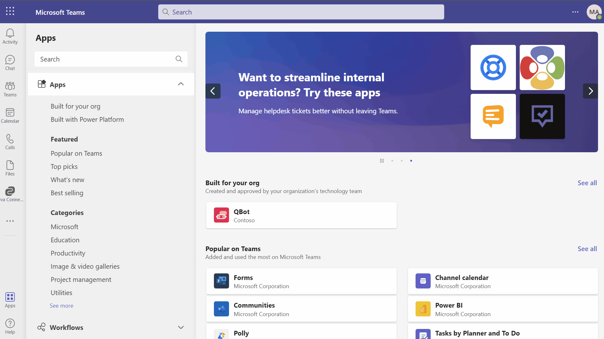
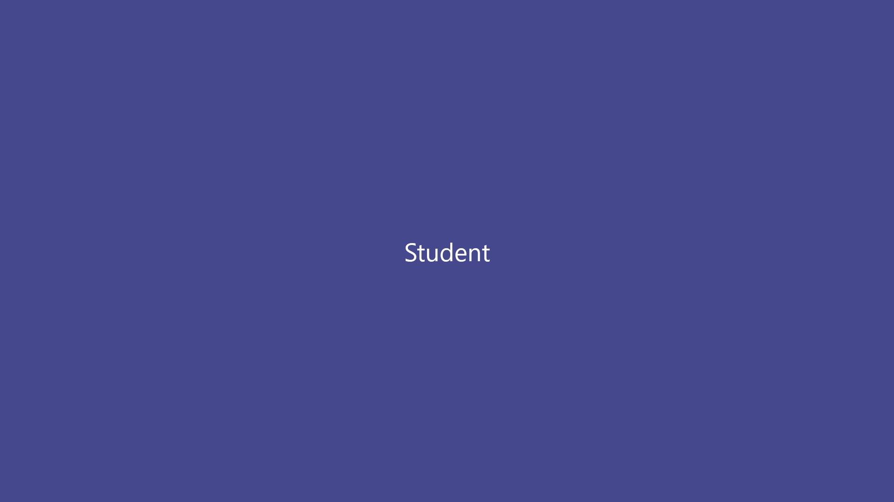
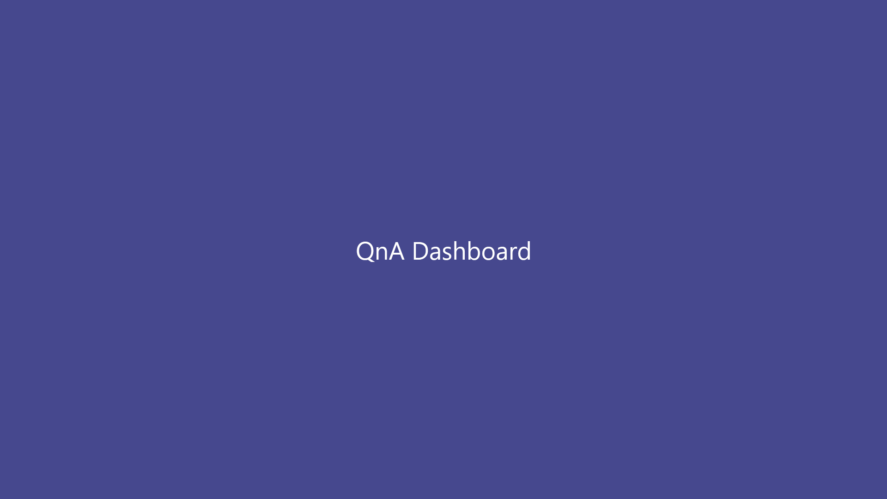
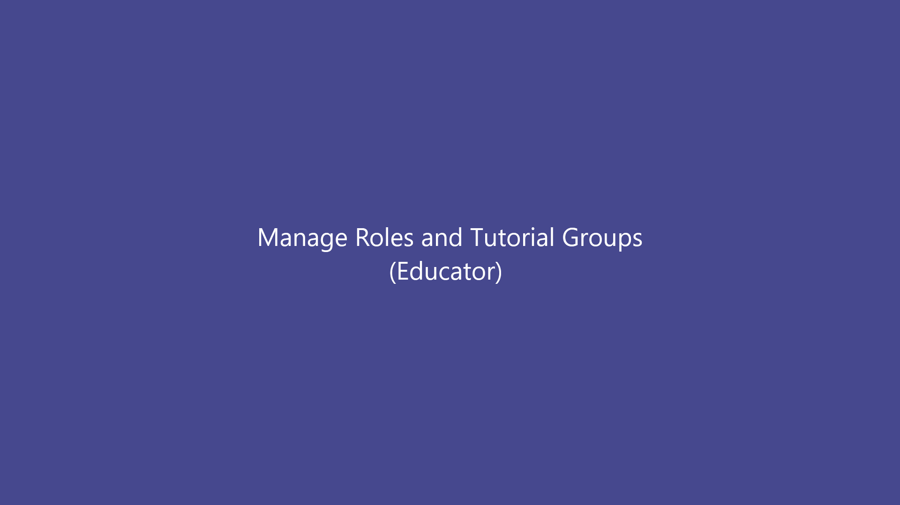

# QBot

| [Documentation](#contents) | [Deployment guide](Deployment/README.md) | [Solution Overview](Documentation/SolutionOverview.md) |
| ---- | ---- | ---- |

QBot is a solution designed for classroom teaching scenarios which allows teachers, tutors, and students to intelligently answer each other's questions within the Microsoft Teams collaboration platform. It leverages the power of Azure Cognitive Service - QnA Maker to achieve this.

## Contents
- [QBot](#app-title)
  - [Terminologies](#Terminologies)
  - [Personas](#Personas)
  - [Key Features](#key-features)
  - [Get Started](#get-started)
  - [Contributing](#contributing)

## Terminologies
- **Course** – an individual subject that typically lasts one academic term. This maps to a team in Microsoft Teams.
- **Channel** – a channel in a team.
- **Tutorial Group** – a group of students. A course may have zero or more tutorial groups. (Optional)
- **Knowledge Base** - a collection of Question-Answer pairs.

## Personas
- **Educator** responsible for managing a course.
- **Tutor/Teaching Assistant** responsible for managing a group of students in a tutorial group(s) for a course. (Optional role).
- **Student** A student may be part of one or more courses. In a course, a student could be part of a tutorial group if defined.

## Key Features
- **QnA**: All personas can post questions, suggest answers, and mark a correct answer. If a course is configured with a Knowledge base, then the bot will suggest answers to questions based on the previous answers.
- **QnA Dashboards** Educators, tutors and students can track all the questions (answered / unanswered) asked in a particular course or a channel.
- **Manage members in a course**: Educator may assign student, tutor, or educator role and assign tutorial group(s) to all the members of the team
- **Manage Knowledge Base**: Educators can manage Knowledge base for a course. They may choose a unique Knowledge base for every course or share a common Knowledge base for similar courses.

## Get Started

### Deployment
When you're ready to try out QBot, or to use it in your own organization, follow the steps in the [Deployment guide](Deployment/README.md) to deploy QBot.

### Initial Setup

After you deploy this sample and add the Teams app to your organization's app catalog, you can start using the application in Teams. Refer to gif below, here we setup a Mathematics course (Team) and go through the initial setup.

#### Workflow:
* Add the application to an existing Team / Course.
* Educators receive a notification to setup the course - configure a knowledge base.
> Note: The application assigns Educator role to Team owners, and Student role to all other members. It is recommended that you create Teams where Educators are owners.

* Educator creates a knowledge base and assigns it to the course.

> It is important to assign a knowledge base to a course, as otherwise the application will not be able to look-up for an answer or build a knowledge base. Once set, the application will learn and respond intelligently overtime as members discuss QnAs.

### QnA
Students can post questions in a channel. Make sure the application is tagged when a question is posted.

#### Scenario: A student posts a question after adding the application.

#### Workflow:
* Student posts a new question.
* Application tags educators to help.
* Educator responds to that question. (Other students can respond as well)
* Student who posted the question selects the response as answer.
* Application notifies educator that their response was selected as the answer.

> Note: Only Student who posted the question and educators can mark the answer. While selecting an answer, application gives an option to acknowledge the member who posted the reply (show answered by checkbox).

#### Scenario: Another student posts a similar question after sometime.

#### Workflow:
* Student posts a question that was previously asked in the course.
* Application responds back with an intelligent response, asking members to mark it as either helpful or not helpful.
>Note: Application also add confidence to the response. In this case 100%.

* Student marks it as helpful and the suggested answer is marked as the answer.

> Note: If a student marks the response as not helpful, application tags the educators to help.

### Dashboards
Any member can view all the answered / unanswered questions in the Teams they are part of.

#### Workflow:
* Member views all the questions in a channel. (Shared tab)
* Member switches between Unanswered / answered questions.
* Member seaches for questions, filters questions asked by a specific member.
* Member tracks all the courses in the personal app.

### Manage Roles and Tutorial groups.
Educators can manage roles and tutorial groups in a course. Example: they can create new tutorial groups or assign a tutor role to a member.

#### Workflow:
* Educator navigates to course settings (in Personal app experience)
* Assigns an Educator role to a member.
* Creates a new tutorial group.
* Assigns tutorial group to 3 members.

## Contributing

This project welcomes contributions and suggestions.  Most contributions require you to agree to a
Contributor License Agreement (CLA) declaring that you have the right to, and actually do, grant us
the rights to use your contribution. For details, visit https://cla.microsoft.com.

When you submit a pull request, a CLA-bot will automatically determine whether you need to provide
a CLA and decorate the PR appropriately (e.g., label, comment). Simply follow the instructions
provided by the bot. You will only need to do this once across all repos using our CLA.

This project has adopted the [Microsoft Open Source Code of Conduct](https://opensource.microsoft.com/codeofconduct/).
For more information see the [Code of Conduct FAQ](https://opensource.microsoft.com/codeofconduct/faq/) or
contact [opencode@microsoft.com](mailto:opencode@microsoft.com) with any additional questions or comments.

