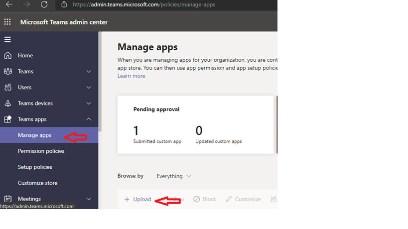
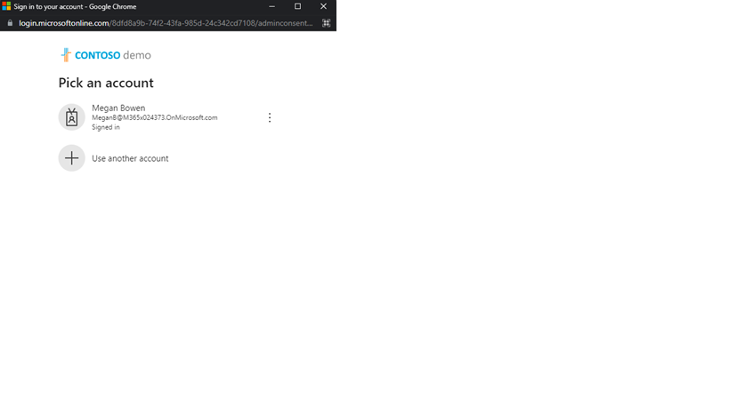

Resource Hub Application Deployment Guide
---
---

Deployment Guide to deploy MS Teams application for resource hub.

Prerequisites
-------------

To begin, you will need:

1.  An Azure subscription where you can create the following kind of
    resources:

    a.  App service

    b.  App service plan

    c.  Azure Bot service

    d.  Azure Monitor/Application Insights

    e.  Azure Key Vault

    f.  Azure blob storage

    g.  Azure Microsoft Bings API

2.  Tools and Software’s required:

    a.  Visual studio 2022 latest version (Community/Enterprise |
        [*https://visualstudio.microsoft.com/downloads/*](https://nam06.safelinks.protection.outlook.com/?url=https%3A%2F%2Fvisualstudio.microsoft.com%2Fdownloads%2F&data=04%7C01%7Cv-radixit%40microsoft.com%7Ca264194462154e84583d08d949db8fc0%7C72f988bf86f141af91ab2d7cd011db47%7C1%7C0%7C637622029669842618%7CUnknown%7CTWFpbGZsb3d8eyJWIjoiMC4wLjAwMDAiLCJQIjoiV2luMzIiLCJBTiI6Ik1haWwiLCJXVCI6Mn0%3D%7C1000&sdata=ldyq7TlnqgoDR6J6ZNtS2pGxnTI6NzjNKDKo12ZtEYw%3D&reserved=0)

    b.  Node.js ([*Download |
        Node.js (nodejs.org)*](https://nam06.safelinks.protection.outlook.com/?url=https%3A%2F%2Fnodejs.org%2Fen%2Fdownload%2F&data=04%7C01%7Cv-radixit%40microsoft.com%7Ca264194462154e84583d08d949db8fc0%7C72f988bf86f141af91ab2d7cd011db47%7C1%7C0%7C637622029669842618%7CUnknown%7CTWFpbGZsb3d8eyJWIjoiMC4wLjAwMDAiLCJQIjoiV2luMzIiLCJBTiI6Ik1haWwiLCJXVCI6Mn0%3D%7C1000&sdata=WW84SnIVs8g23JyaKv67LCW9F150m5sC%2BMSyLVUpAyM%3D&reserved=0)

Deployment Steps
----------------

Step 1. Register Azure AD application
-------------------------------------

Register Azure AD applications in your tenant's directory.

1.  Log in to the Azure Portal for your subscription and go to the App
    registrations blade.

2.  Click **New registration** to create an Azure AD application.

    -   **Name**: Name of your Teams App - if you are following the
        template for a default deployment.

    -   **Supported account types**: Select "Accounts in any
        organizational directory" (*refer image below*).

    -   Leave the "Redirect URI" field blank for now.

    -   

1.  Click **Register** to complete the registration.

2.  When the app is registered, you'll be taken to the app's
    "Overview" page. Copy the **Application (client) ID**; we will need
    it later. Verify that the "Supported account types" is set to
    **Multiple organizations**.

    

1.  On the side rail in the Manage section, navigate to the
    "Certificates & secrets" section. In the Client secrets section,
    click on "+ New client secret". Add a description for the secret and
    choose when the secret will expire. Click "Add".

     

1.  Once the client secret is created, copy its **Value**; we will need
    it later.

> At this point you should have the following 5 values:

i.  Application (client) ID for the Web application.

ii. Client secret for the Web application.

iii. Directory (tenant) ID.

> We recommend that you copy the values, we will need them later.

Step 2. Create Azure Bing Search Service
----------------------------------------

Follow the below steps to create Azure bing search API.

1.  Go to Azure portal where your azure resources are going to
    be hosted.

2.  Search for “Bing Resources”.

3.  Click on “Add”

4.  Select “Bing Search” from the dropdown menu.

    

5.  Fill details as shown in below and click on create button.

    

6.  Once resource get created go the resource and copy the value of Key1
    and endpoint from below mentioned section and copy it to
    some notepad.

    

Step 3. Create Azure resources
------------------------------

> Follow the below steps to create Azure Resources ARM Template
> (azuredeploy.json)

1.  Open the azuredeploy.json from the deployment folder.

2.  Go to Azure Portal.

3.  Search for “custom deployment”.

4.  Click to “Build your own template in editor”.

    

5.  Paste the content of azuredeploy.json in the text area.

    

6.  Click on “save”.

7.  Azure will ask you to fill in the template parameter.

8.  Select the subscription and resources group

-   We recommend, creating a new resource group

-   The resource group location MUST be in a data center that supports:
    Application Insights; For an up-to-date list, click
    [here](https://azure.microsoft.com/en-us/global-infrastructure/services/?products=logic-apps,cognitive-services,search,monitor),
    and select a region where the following services are available

-   Application insights.

1.  Enter a “Base resource name”, which the template uses to generate
    names for the other resource.

-   The app service name \[Base Resource Name\], must be available. For
    example, if you select demoapp as the base name, the names demoapp
    must be available (not taken); otherwise, the deployment will fail
    with a conflict error.

-   Remember the base resource name that you selected. We will need
    it later.

1.  Fill in the various IDs in the template:

-   **App Client ID**: The application (client) ID is registered in
    Step 1.

-   **App Client Secret**: The client secret registered in Step 1.

-   **Tenant Id:** The tenant ID registered in Step 1. If your Microsoft
    Teams tenant is the same as the Azure subscription tenant, then we
    would recommend keeping the default values.

-   **App Display Name:** The app (and bot) display name.

-   **App Description:** The app (and bot) description.

-   **Upn:** Specify the Admin user’s UPN ids in comma separated format.
    Shown as below

-   **Hosting Plan Name**: Specifies the name of the app service/hosting
    plan for web App.

-   **Hosting Plan SKU Size**: The pricing tier for the hosting plan.
    Default value is standard.

-   **Hosting Plan Size**: The hosting plan size. Default is 2.

-   **Storage Account name**: The name of Azure Storage Account to
    be deployed.

-   **Bot Name**: The name of the azure bot service to be deployed.

-   **Bot App Insights Name**: The name of app insights for web app to
    be deployed.

-   **Location**: Location for all resources.

-   **Key Vault Name**: Specifies the name of the key vault. Make sure
    that the values are copied as-is, with no extra spaces. The template
    checks that GUIDs are exactly 36 characters.

-   **Bing Search Subscription Key:** The value bing search service
    subscription key. „Key1“ value created in step 2.

-   **Bing Search Endpoint:** The bing search endpoint values, created
    in step 2.

1.  Click on Review + Create.

2.  Once the validation of resources is done, click on the
    create button.

3.  Once the deployment is completed you will be navigated to the
    deployment overview page.

4.  Click on the output tab in the left navigation menu and copy App ID,
    App domain.

Step 4: Set Up Authentication
--------------------------------------------------------------------------------------------------------------------------

1.  Go back to the "App Registrations" page
    [here](https://portal.azure.com/#blade/Microsoft_AAD_IAM/ActiveDirectoryMenuBlade/RegisteredApps)
    and select the App registration created as part of Step 2.

2.  Under the left menu, select **Authentication** under the
    **Manage** section.

3.  Select 'Accounts in any organizational directory (Any Azure AD
    directory - Multitenant)' under Supported account types and click
    "+Add a platform".

    

1.  Click on Web

2.  Add signin-simple-end under RedirectURLs and click Configure button.
    Ex: https://\[BaseResourceName\].azurewebsites.net/signin-simple-end

    

    

1.  Once the flyout menu closes, scroll bottom to section 'Implicit
    Grant' and select checkboxes "Access tokens" and "ID tokens" and
    click "Save" at the top bar.

    

1.  Under the left menu, select **Expose an API** under **Manage**.

    

1.  Select the **Set** link to generate the Application ID URI in the
    form of api://{BotID}. Insert your fully qualified domain name (with
    a forward slash "/" appended to the end) between the double forward
    slashes and the GUID. The entire ID should have the form of
    **api://{app-domain-name}/{BotID}** .BotID is same as app id during
    app registration.

    e.g.
    **api://\[BaseResourceName\].azurewebsites.net/c6c1f32b-5e55-xxxx-xxx-53cc1d563b7**

2.  Click on Save button.

3.  Select the **Add a scope** button. In the panel that opens, enter
    **access\_as\_user** as the **Scope name**.

4.  Set Who can consent? to "Admins and users".

5.  Fill in the fields for configuring the admin and user consent
    prompts with values that are appropriate for the
    **access\_as\_user** scope. Suggestions:

-   **Admin consent display name:** G&B Teams app

-   **Admin consent description**: Allows Teams to call the app’s web
    APIs as the current user.

-   **User consent display name**: Teams can access your user profile
    and make requests on your behalf

-   **User consent description:** Enable Teams to call this app’s APIs
    with the same rights that you have

1.  Ensure that **State** is set to **Enabled**

2.  Select **Add scope **

    Note: The domain part of the **Scope name** displayed just below the
    text field should automatically match the **Application ID** URI set
    in the previous step, with /access\_as\_user appended to the end;
    for example api://
    \[BaseResourceName\]..azurewebsites.net/c6c1f32b-5e55-xxxx-xxx-753cc1d563b7/access\_as\_user

3.  On the same page in the below section **Authorized client
    applications**, you identify the applications that you want to
    authorize to your app’s web application. Each of the following IDs
    needs to be entered. Click "+Add a client application" and
    copy-paste the below id and select checkbox "Authorized scopes".
    Repeat the step for the second GUID.

-   1fec8e78-bce4-4aaf-ab1b-5451cc387264 (Teams
    mobile/desktop application)

-   5e3ce6c0-2b1f-4285-8d4b-75ee78787346 (Teams web application)

1.  Under the left menu, navigate to **API Permissions**, and make sure
    to add the following permissions of Microsoft Graph API &gt;
    Delegated permissions:

2.  Click on the “Add a permission” button to add permission to your app
    as shown in Figure.

3.  Select “Microsoft Graph”, then select “Delegated Permissions” and
    check the following permissions by searching for:

<!-- -->

1.  offline\_access

2.  openid

3.  email

4.  profile

5.  User.Read (By default)

6.  Group.Read.All

    

    

1.  Click on “Add Permissions” to commit your changes.

2.  Again, Click on the “Add a permission” button to add permission to
    your app as shown in Figure.

3.  This time Select “Microsoft Graph”, then select “*Application
    Permissions*” and check the following permissions by searching for:

<!-- -->

1.  AppCatalog.Read.All

2.  TeamsAppInstallation.ReadWriteForUser.All

3.  TeamsAppInstallation.ReadWriteForTeam.All

4.  User.Read.All

    

1.  **If you are logged in as the Global Administrator else you can skip
    the step**, click on the “Grant admin consent for %tenant-name%”
    button to grant admin consent, else inform your Admin to do the same
    through the portal.

    

Step 5: Deploy the application code using Visual Studio.
-------------------------------------------------------------------------------------------------------------------------------------------------------------------------------------------------------------------------------------------------

1.  Go to [Azure Portal](https://portal.azure.com) and resource group
    where resources are created as part of the deployment in step 2.

2.  Click on the App service created as part of the deployment in Step 2
    and download the publish profile.

     

1.  Navigate to “Microsoft.Teams.SelfHelp.sln” in the downloaded code
    base and open solution with Visual studio 2022.

2.  Right-click on the project (Microsoft.Teams.SelfHelp) and build
    your code.

    

1.  Publish code to the above app service. It will open the window to
    browse the publish profile.

-   Right click on project \[Microsoft.Teams.SelfHelp\] from solution
    explorer &gt; select publish profile &gt; import the profile which
    was downloaded from previous step for &lt;&lt;base resource
    name&gt;&gt; app service

-   Select ‘Finish’. It will start deploying the code.
    

    

    

Step 6. Create the Teams app packages
-------------------------------------

1.  This step covers the Teams application package creation for Teams
    scope and make it ready to install in Teams. Create a Teams app
    package to be used by supplier in Team

2.  There are 3 Manifest that is required to work with this application.

    a.  Create a Teams app package to be used by users.

        i.  Open the Manifest\\manifest.json file in a text editor.

        ii. Change the placeholder fields in the manifest to values
            appropriate for your organization.

            1.  developer.name

            2.  developer.websiteUrl

            3.  developer.privacyUrl

            4.  Developer.termsOfUseUrl

        iii. Change the {bot Id} placeholder to your Azure AD
            application's ID from above. This is the same GUID that you
            entered in the template under "Bot Client ID".

        iv. Replace the {appDomain} with your Bot App Service's domain.
            This will be \[BaseResourceName\].azurewebsites.net.

        v.  Replace {App base URL} with App service base url e.g.
            https:// \[BaseResourceName\].azurewebsites.net.

        vi. In Valid domain section replace {app domain} with

        vii. In the "webApplicationInfo" section, replace the
            &lt;&lt;Bot ID&gt;&gt; with Client ID of the app created in
            Step 1. Also replace
            api://&lt;&lt;applicationurl&gt;&gt;/&lt;&lt;clientId&gt;&gt;
            with following Application URI appended with client id. This
            will be as follows for example
            api://resourcehub.azurewebsites.net/19c1102a-fffe-46c4-9a85-016bec13e0ab

            where resourcehub is the base resource URL used under valid
            domains and tabs and 19c1102a-fffe-46c4-9a85-016bec13e0ab is
            the client id.

3.  Create a ZIP package of all three manifest created above each having
    manifest.json,color.png, and outline.png. The two image files are
    the icons for your app in Teams.

4.  Make sure that the file top level of the ZIP package, with no
    nested folders.

  > **Name**        > **Maximum size (in characters)**
  ----------------- ------------------------------------
  > Name            > 32
  > websiteUrl      > 2048
  > privacyUrl      > 2048
  > termsOfUseUrl   > 2048

Step 7: Deploy the app in Microsoft Teams in the same tenant
---------------------------------------------------------------------------------------------------------------------------------------------------------

1.  Access the Teams admin portal through the [Admin
    Center](https://admin.teams.microsoft.com/).

2.  Use the Tenant Administrator account to log in.

3.  Navigate to Manage Apps under the left navigation panel.

4.  Click on the ‘Upload’ button and click on ‘Select a file’ under the
    Upload a custom app dialog box.

    

5.  Browse the Manifest zip file created in Step 5 and click Open. Once
    the manifest is successfully uploaded you will get the confirmation.

6.  Once upload successful, got to Permissions Tab and review and
    Approve permissions.

    
1.  Click on Review permissions and select admin credentials.

    

1.  Review and approve the permissions.

    

Setup policies by tenant admin 
---------------------------------------------------------------------------------------------------------------------------------------------------------------------------------

1.  Next, Navigate to ‘Setup Policies’ below the manage apps and Click
    on the ‘Add Apps’ button under Installed Apps.

2.  A new Right panel ‘Add installed apps’ will appear. Select “Global”
    from the first dropdown.

3.  Search for all three app by name (Resource hub) in the next text box
    and click on “Add”.

4.  Now scroll down to Pinned apps and click on “Add steps” to add the
    Bot under pinned app for the User’s Teams.

5.  A new Right panel ‘Add pinned apps ‘will appear. Select “Global”
    from the first dropdown.

6.  Search for the apps in the next text box and click on “Add” if not
    already selected.

7.  Scroll down to the Setup Policies page and click on the
    ‘Save’ button.

8.  A confirmation dialog will appear indicating successful
    updating.

Step 8: Running the bot app in user’s Teams
-------------------------------------------

1.  The end User of the Tenant will now proceed to Login into the
    Teams application.

2.  Upon successful login, Users can see the app under the pinned sites.

Step 9: Import sample data for learning content (To import sample data user need to use the app once to create the database table automatically at backend)
-------------------------------------------

1.  Download Microsoft Azure Storage Explorer. 
[*Download*](https://azure.microsoft.com/en-us/products/storage/storage-explorer/#overview)

2.  Open Azure Storage Explorer tool and loging with azure subscription as shown below,
     
     
     
3. Download sample data from here [Sample learning content](/samples/msteams-application-resourcehub/Data)
4. Select Azure Subscription 
    
5. Expand respective subscription and storage account and select "LearningEntity" table.
    
7. Select import option from menu shown below
    
    
    
 8. Once import completed update "TitleImageLink" column for all records started with "{App base URL}" shown in below with **BaseResourceName**.
 9. Replace the {{App base URL}} with your Bot App Service's domain.
    This will be \[BaseResourceName\].azurewebsites.net.

 10. Replace {App base URL} with App service base url e.g.
    https:// \[BaseResourceName\].azurewebsites.net.
 11. Right click on each record and select edit option
      
    
    
 12. Once replaced click on Update.
 13. Do it for all records started with "{App base URL}" as base URL.
