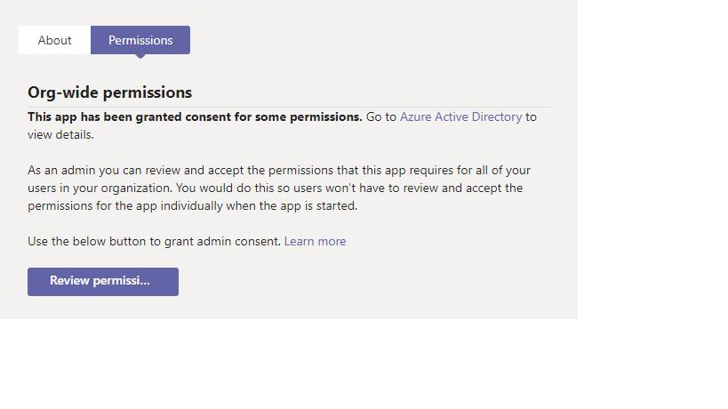
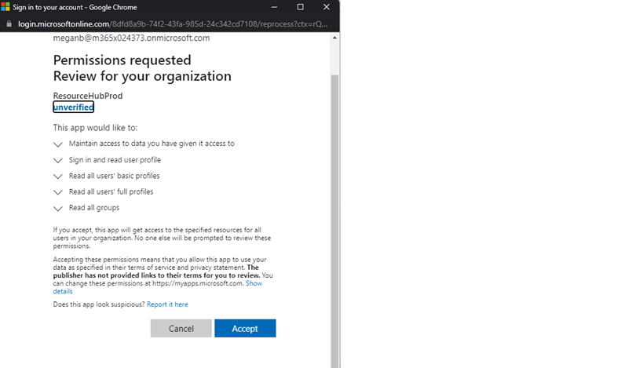

Introduction
=========================================================================================================

All the help you need to use Teams, all in one place. Get up and running
with just the basics, dive into popular topics, master features designed
for your work style or industry, get answers to frequently asked
questions, and see what’s new.

Resources HUB - One single point of view for Product information like
Features, What’s new, Scenarios, Apps. Available “at hand” to help
discover product potential in every moment of organization Teams journey
(onboard, adopt or transform) and tailor the message to their business
size/department/industry (filters available).

Initial Setup 
===============================================================================================================

Get latest manifest
------------------------------------------------------------------------------------------------------------------------

1.  Get the latest version of the manifest.

2.  Download the manifest and keep it on the desktop,

Install manifest
------------------------------------------------------------------------------------------------------------------

1.  Login to <https://admin.teams.microsoft.com/> with MS Teams
    admin credentials.

2.  Navigate to teams’ apps à manage apps à Upload new app

1.  Upload the manifest file that we have downloaded in the
    above step\#2.

2.  The app is uploaded and available under the table below

    

1.   Search for the app and select.

2.  Got to Permissions Tab and review and Approve permissions.

    

1.  Click on Review permissions and select admin credentials.

    

1.  Review and approve the permissions.

    

Setup policies by tenant admin 
----------------------------------------------------------------------------------------------------------------------------------

-   Navigate to set up policies

-   click on add apps for pairing the applications select user pinning
    as on

-   click on paint apps add icon

-   select global search based on the app permission policy search the
    name of application

-   Click add

-   arrange the application as per requirement this app will be binned
    and available on team’s menu bar

    
