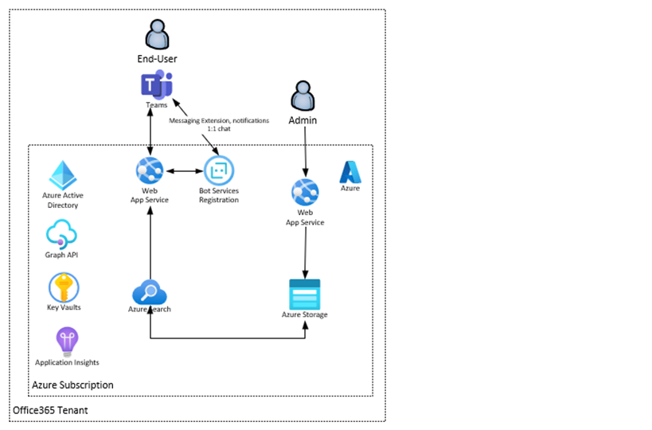
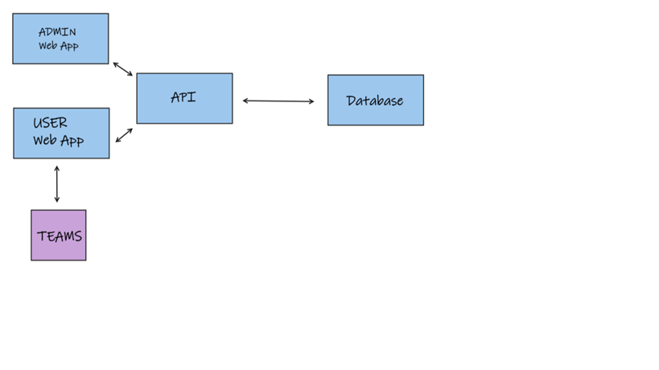
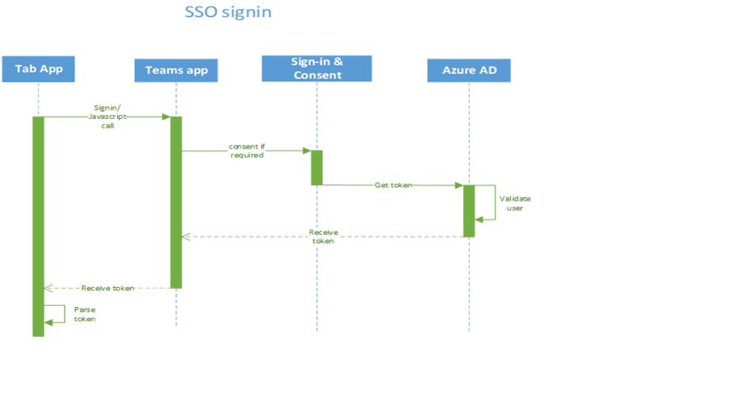
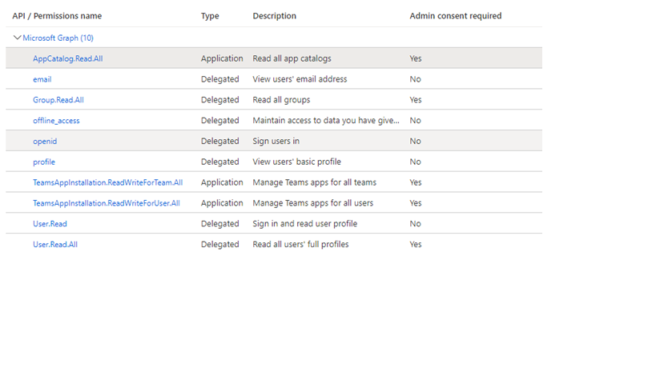
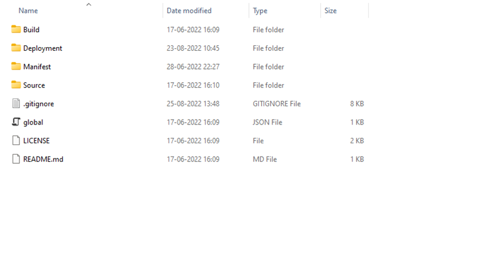

 Technical specification
=============
 Introduction
=============

The intent of this document is to describe a design of a solution to a
problem described in a solution discovery report. Completion of this
document means the proposed solution architecture is ready for
implementation, but not all user stories may be detailed or solved in
the first iteration (P1). 

 

Teams’ capabilities included are –

1.  Static tabs (Personal Tab)

2.  Bot

Scope –

1.  Personal

2.  Team

This document should contain everything needed for a developer to build
this solution. This may be the customer development team, or a partner
developer. Completion of this document is not a guarantee that this
solution will progress to the build phase.  

2.   Audience and Personas
    ======================

    1.  Personas 
        ---------

  -----------------------------------------------------------------------------------------------------------------------------------
  Persona       Responsibilities 
  ------------- ---------------------------------------------------------------------------------------------------------------------
  End user      -   As a user I want to search for help content.
                
                -   As a user I want to get What’s new in the product 
                
                -   As user I want to see the scenario-based content 
                
                -   As a User I want to notice new content 
                
                -   As a user I want to discover features in Teams 
                
                -   As a user I want to switch off/on the notification (subscribe /unsubscribe) 
                
                -   As user I want to give feedback to app 
                
                -   As a user I want to be able to share the article with a person or team 
                
                -   As a user I want to like a article/movie 
                
                -   As a user I want to configure the scenario/feature that I see in movie 
                
                -   As a user I want to discover the content based on categories/TAGS 
                
                -   As a user I want to be guided what I need to learn from product to learn the basics (plus comparison with org) 
                
                

  Admin user    -   As admin I want to add/change/remove new article.  
                
                -   As Admin I want to add/change/remove new Video 
                
                -   As Admin I want to add/change/remove new Tag 
                
                -   As admin I want to add/change/remove new what’s new
                
                -   As admin I want to add/change/remove new Learning Teams Path 
                
                -   As admin I want to push some of the content as notification 
                
                -   As admin I want to be notified when need feedback appear 
                
                
  -----------------------------------------------------------------------------------------------------------------------------------

-   Bot - BOT will be used to notify the user if any post is shared to
    teams channel.

-   Personal tab – Home page for all users to get all content, getting
    started, trending topics.

-   Team scope - The Teams channel scope will be used to post
    shared messages.

The expected max user load in a tenant is 700 users and the maximum
learning content to be created by app is 10-15 for large organization.

Usage pattern 
--------------

The application can be categorically divided based on the major feature
integration and the below usage pattern is defined in such a way:

End user
--------

  -----------------------------------------------------------------------------------
  User can                   Usage pattern
  -------------------------- --------------------------------------------------------
  End user in personal tab   High usage
                             
                             -   Search content from external / internal resources.
                             
                             -   Share learning contents
                             
                             

  Getting started            Medium
                             
                             -   Complete getting started learning content.
                             
                             
  -----------------------------------------------------------------------------------

Admin user
----------

  ----------------------------------------
  User can   Usage pattern
  ---------- -----------------------------
             High usage
             
             -   Adding new content
             
             -   Edit existing content
             
             

             Medium
             
             -   Delete existing content
             
             
  ----------------------------------------

Partners and Dependencies 
==========================

  --------------------------------------------------------------------------------------------------------------------------
  Partner/Dependent service   Dependency                                                      Owner/Contact
  --------------------------- --------------------------------------------------------------- ------------------------------
  Microsoft Graph APIs        Access user, their joined team and subordinates’ information.   Microsoft Graph team
                                                                                              
                              Read security groups, Teams channel details.                    

  Microsoft Azure             Provide hosting to azure resources                              Microsoft Azure support team
  --------------------------------------------------------------------------------------------------------------------------

Solution Overview
=================

**Store Manager**

 **Tables Entity**

  S.no.   Table Name           Description
  ------- -------------------- ---------------------------------------------------------------------------------------------------
  1.      LearningPathEntity   Contains the learning path details of each users.
  2.      LearningEntity       Contains the learning content(Article/Video) details added by admin user.
  3.      FeedbackEntity       Contains the feedback submitted by user.
  4.      UserEventLogs        Contains all user activity telemetry logs. E.g. view count of article/video, search key.
  5.      UserReactionEntity   Contains like /dislike response provided on learning content by users to identify trending topic.
  6.      UserEntity           Contains the use who have bot installed
  7.      TeamEntity           Contains teams details where bot is installed.
  8       AppSettings          Contains Bot Framework service base url to send notification to usrs.

**Tech stack**: .NET 6 using C\#, React JS with TypeScript, Node JS,
Fluent UI.

**Hosting environment**: Microsoft Azure

**External services**: Microsoft Graph API.

Azure resources:

1.  Azure App Service

2.  Azure Bot Service

3.  Azure Table Storage

4.  Azure Key Vault

5.  Azure Application Insights

6.  Azure Bing Search API.

    1.  Architecture
        ===========================================================================================================================================================================================================================================================================================================================================================================================================================================================================================================================================================================================================================================================================================================================================================================================================================

High level design to show the high-level data workflow and resources
proposed to be used in app.

#### Single Sign On authentication (SSO) 

App service 
============

-   App service plan will host one web app built on .NET 6 for running
    bot service and React web app. 

-   The app service implements the bot experience by providing end
    points for user communication. The app service hosts the react
    app for task dashboard. 

-   App endpoint is registered as messaging end point in bot
    registration portal and provides an endpoint /api/messages to
    process bot requests/response. 

-   App service hosts React application for tabs and provides custom
    APIs in back end for fetching and storing data securely. 

-   Single Sign On experience is implemented in React application for
    seamless user authentication.

>  

Azure bot service 
==================

-   Azure bot service is developed using BOT SDK v4.  Web app endpoint
    is registered as end point in bot registration portal.

    1.  Bing Search APIs
        ================

        The app leverage Microsoft Bing search APIs for getting external
        content. 

  S.no.   Use case      API                                                                             Delegated Permissions   Application Permission
  ------- ------------- ------------------------------------------------------------------------------- ----------------------- ------------------------
  1       Bing search   https://docs.microsoft.com/en-us/bing/search-apis/bing-custom-search/overview   NA                      NA

1.  Microsoft Graph APIs
    ====================

    The app leverage Microsoft Graph APIs for getting user [profile
    photo](https://docs.microsoft.com/en-us/graph/api/profilephoto-get?view=graph-rest-1.0)
    and getting [*user’s
    subordinates*](https://docs.microsoft.com/en-us/graph/api/user-list-directreports?view=graph-rest-1.0&tabs=http)
    etc. 

Internal APIs 
==============

  -----------------------------------------------------------------------------------------------------------------------------------------------------------------------------------------------------------------------------------------
  Call                                                         APIs                                            Type     Permission                    Payload                  Purpose
  ------------------------------------------------------------ ----------------------------------------------- -------- ----------------------------- ------------------------ ------------------------------------------------------------
  Get All learning content                                     /api/learning                                   GET      Must be a valid tenant user   NA                       Get list of all learning content for admin dashboard.

  Response:

  \[{

  id: string;

  sectionType: string;

  title: string;

  itemType: string;

  source: string;

  primaryTag: string;

  secondaryTag: string;

  itemlink: string;

  knowmoreLink: string

  tileImageLink: string;

  createdOn: Date;

  createdBy: string;

  },

  {

  ….

  }\]

  Response status code:

  -   200 for successful response

  -   404 no results found when entity is not found

  -   500 for any internal server error

  -   403 for forbidden when user is not valid tenant user

  Get learning content by learning content id                  /api/learning/\${learningId}                    GET      Must be a valid tenant user   NA                       Get learning content

  Response:

  {

  id: string;

  sectionType: string;

  title: string;

  itemType: string;

  source: string;

  primaryTag: string;

  secondaryTag: string;

  itemlink: string;

  knowmoreLink: string

  tileImageLink: string;

  createdOn: Date;

  createdBy: string;

  },

  {

  ….

  }

  Response status code:

  -   200 for successful response

  -   404 no results found when entity is not found

  -   500 for any internal server error

  -   403 for forbidden when user is not valid tenant user

  Get All trending topics content based on content type        /api/learning/selectiontype/\${selectiontype}   GET      Must be a valid tenant user   NA                       Get list of all content based on type. Trending topic/faq.

  Response:

  \[{

  id: string;

  sectionType: string;

  title: string;

  itemType: string;

  source: string;

  primaryTag: string;

  secondaryTag: string;

  itemlink: string;

  knowmoreLink: string

  tileImageLink: string;

  createdOn: Date;

  createdBy: string;

  },

  {

  ….

  }\]

  Response status code:

  -   201 for created successful response

  -   400 for bad request when wrong payload is passed

  -   500 for any internal server error

  -   403 for forbidden when user is not valid tenant user

  Get learning path of user                                    /api/learning/{useraadId}                       GET      Must be a valid tenant user   NA                       Get list of learning path of logged in user

  Response:

  \[{

  id: string;

  sectionType: string;

  title: string;

  itemType: string;

  source: string;

  primaryTag: string;

  secondaryTag: string;

  itemlink: string;

  knowmoreLink: string

  tileImageLink: string;

  createdOn: Date;

  createdBy: string;

  },

  {

  ….

  }\]

  Response status code:

  -   200 for successful response

  -   404 no results found when entity is not found

  -   500 for any internal server error

  -   403 for forbidden when user is not valid tenant user

  Get user role to verify admin user                           /api/userole                                    GET      Must be a valid tenant user   NA                       Verify a user role

  \[{

  isAdminUser: boolean;

  },

  {

  ….

  }\]

  Response status code:

  -   201 for created successful response

  -   400 for bad request when wrong payload is passed

  -   500 for any internal server error

  -   403 for forbidden when user is not valid tenant user

  Get search result                                            /api/search                                     POST     Valid tenant user             {                        List of bing/internal search result
                                                                                                                                                                               
                                                                                                                        Should                        searchText: string;      
                                                                                                                                                                               
                                                                                                                                                      requestedBy: string;     
                                                                                                                                                                               
                                                                                                                                                      }                        

  Response:

  \[{

  id: string;

  sectionType: string;

  title: string;

  itemType: string;

  source: string;

  primaryTag: string;

  secondaryTag: string;

  itemlink: string;

  knowmoreLink: string

  tileImageLink: string;

  createdOn: Date;

  createdBy: string;

  },

  {

  ….

  }\]

  Response status code:

  -   204 for no content

  -   400 for bad request when incoming payload is incorrect

  -   500 for any internal server error

  -   403 for forbidden when user is not valid tenant user

  Update user reaction link/dislike                            /api/reaction                                   POST     Valid tenant user             {                        Post user reaction
                                                                                                                                                                               
                                                                                                                        Should be                     postId: string;          
                                                                                                                                                                               
                                                                                                                                                      reactionState: string;   
                                                                                                                                                                               
                                                                                                                                                      }                        

  Response status code:

  -   200 for successful response

  -   404 no results found when entity is not found

  -   500 for any internal server error

  -   403 for forbidden when user is not valid tenant user

  Submit user feedback                                         /api/feedback                                   POST     Valid tenant user             {                        Add a new feedback
                                                                                                                                                                               
                                                                                                                                                      postId: string;          
                                                                                                                                                                               
                                                                                                                                                      helpfulStatus: string;   
                                                                                                                                                                               
                                                                                                                                                      IsHelpful: boolean;      
                                                                                                                                                                               
                                                                                                                                                      rating: number;          
                                                                                                                                                                               
                                                                                                                                                      feedback: string         
                                                                                                                                                                               
                                                                                                                                                      }                        

  Response status code:

  -   201 for created successful response

  -   400 for bad request when wrong payload is passed

  -   500 for any internal server error

  -   403 for forbidden when user is not valid tenant user

  Add new learning content                                     /api/learning                                   POST     Valid tenant user             {                        Add new learning content
                                                                                                                                                                               
                                                                                                                        must be a admin               id: string;              
                                                                                                                                                                               
                                                                                                                                                      sectionType: string;     
                                                                                                                                                                               
                                                                                                                                                      title: string;           
                                                                                                                                                                               
                                                                                                                                                      itemType: string;        
                                                                                                                                                                               
                                                                                                                                                      source: string;          
                                                                                                                                                                               
                                                                                                                                                      primaryTag: string;      
                                                                                                                                                                               
                                                                                                                                                      secondaryTag: string;    
                                                                                                                                                                               
                                                                                                                                                      itemlink: string;        
                                                                                                                                                                               
                                                                                                                                                      knowmoreLink: string     
                                                                                                                                                                               
                                                                                                                                                      tileImageLink: string;   
                                                                                                                                                                               
                                                                                                                                                      createdOn: Date;         
                                                                                                                                                                               
                                                                                                                                                      createdBy: string;       
                                                                                                                                                                               
                                                                                                                                                      },                       

  Response status code:

  -   204 for no content

  -   400 for bad request when incoming payload is incorrect

  -   500 for any internal server error

  -   403 for forbidden when user is not valid tenant user

  Update learning content                                      /api/ learning                                  PATCH    Valid tenant user             {                        Update a learning content
                                                                                                                                                                               
                                                                                                                        Should be a admin user        id: string;              
                                                                                                                                                                               
                                                                                                                                                      sectionType: string;     
                                                                                                                                                                               
                                                                                                                                                      title: string;           
                                                                                                                                                                               
                                                                                                                                                      itemType: string;        
                                                                                                                                                                               
                                                                                                                                                      source: string;          
                                                                                                                                                                               
                                                                                                                                                      primaryTag: string;      
                                                                                                                                                                               
                                                                                                                                                      secondaryTag: string;    
                                                                                                                                                                               
                                                                                                                                                      itemlink: string;        
                                                                                                                                                                               
                                                                                                                                                      knowmoreLink: string     
                                                                                                                                                                               
                                                                                                                                                      tileImageLink: string;   
                                                                                                                                                                               
                                                                                                                                                      createdOn: Date;         
                                                                                                                                                                               
                                                                                                                                                      createdBy: string;       
                                                                                                                                                                               
                                                                                                                                                      },                       

  Response status code:

  -   201 for created successful response

  -   400 for bad request when wrong payload is passed

  -   500 for any internal server error

  -   403 for forbidden when user is not valid tenant user

  Delete learning content                                      /api/learning/{postId}                          DELETE   Valid tenant user             NA                       Delete a learning content
                                                                                                                                                                               
                                                                                                                        Should be admin user                                   

  Response status code:

  -   200 for successful response

  -   404 no results found when entity is not found

  -   500 for any internal server error

  -   403 for forbidden when user is not valid tenant user

  Get all learning content for admin                           /api/learnings                                  GET      Valid tenant user             NA                       All learning content for admin
                                                                                                                                                                               
                                                                                                                        Should be admin user                                   

  \[{

  id: string;

  sectionType: string;

  title: string;

  itemType: string;

  source: string;

  primaryTag: string;

  secondaryTag: string;

  itemlink: string;

  knowmoreLink: string

  tileImageLink: string;

  createdOn: Date;

  createdBy: string;

  },

  \]

  Response status code:

  -   201 for created successful response

  -   400 for bad request when wrong payload is passed

  -   500 for any internal server error

  -   403 for forbidden when user is not valid tenant user

  Get learning content by id                                   /api/learning/{id}                              GET      Valid tenant user             NA                       Get learning content

  Response:

  {

  id: string;

  sectionType: string;

  title: string;

  itemType: string;

  source: string;

  primaryTag: string;

  secondaryTag: string;

  itemlink: string;

  knowmoreLink: string

  tileImageLink: string;

  createdOn: Date;

  createdBy: string;

  },

  Response status code:

  -   200 for successful response

  -   404 no results found when entity is not found

  -   500 for any internal server error

  -   403 for forbidden when user is not valid tenant user

  Export feedback                                              /api/feedback/export                            GET      Valid tenant user             NA                       Get all user feedback to export

  Response:

  \[{

  postId: string;

  helpfulStatus: string;

  IsHelpful: boolean;

  rating: number;

  feedback: string;

  submittedBy: string;

  submittedOn: Date

  }\]

  Response status code:

  -   201 for created successful response

  -   400 for bad request when wrong payload is passed

  -   500 for any internal server error

  -   403 for forbidden when user is not valid tenant user

  -----------------------------------------------------------------------------------------------------------------------------------------------------------------------------------------------------------------------------------------

Security and Privacy 
=====================

Security and privacy should cover -

1.  Authentication

-   App service authentication – Single Sign-On experience is
    implemented in React application for seamless user authentication.

1.  Authorization

-   End user/ admin will be identified based on the UPN based
    application settings.

    1.  Solution overview structure 
        ============================

The proposed solution structure will follow below project skeleton where
each azure app will be created as a separate web app. Common class
library will have additional repositories along with Bot builder.

1.  Tables Entity
    =============

    1.  Learning Path Entity
        ====================

  **Property Name**    **Type**    **Description ** 
  -------------------- ----------- ---------------------------------------------------
  PartitionKey         String      Partition key of the table
  RowKey               String      Runtime generated random GUID 
  LearningPathId       String      Unique ID of each record same as RowKey
  LearningContentId    String      Unique Id of the learning content (Article/Video)
  CompleteState        int         0 = not started, 1= in progress, 3 = completed  
  LastModifiedOn       Date        Last modified date time in UTC
  UserAadId            String      User azure active directory id 

Learning Entity
===============

  **Property Name**    **Type**    **Description ** 
  -------------------- ----------- ----------------------------------------------------------------------
  PartitionKey         String      Partition key of the table
  RowKey               String      Runtime generated random GUID 
  LearningId           String      Unique id of each learning content same as RowKey
  SectionType          int         0 = GettingStarted, 1= Scenarios, 3= Trending Now, 4 = Learning Path
  Title                String      Title of content
  Description          String      Description of learning content.
  ItemType             Int         0 = video, 1= Article
  Source               Int         0 = Internal, 1= external
  PrimaryTag           String      Primary tag of learning content.  
  SecondaryTag         string      Secondary tag of learning content.  
  ItemLink             String      Video/image URL. 
  KnowmoreLink         String      External web url in string to read the article.
  Length               Number      Length in minutes to read the article or to watch the video
  TileImageLink        string      Image link used in video/article thumbnail
  CreatedOn            DateTIme    Created on date time in UTC 
  CreatedBy            string      User AAD Id of admin who added the content.

FeedbackEntity
==============

  **Property Name**    **Type**    **Description ** 
  -------------------- ----------- ---------------------------------------------------
  PartitionKey         String      Partition key of the table
  RowKey               String      Runtime generated random GUID 
  FeedbackId           Stirring    Unique ID of each feedback same as RowKey
  FeedbackType         Int         0 = General, 1= LearningContent, 2 = LearningPath
  LearningContentId    String      GUID value of learning content
  HelpfulStatus        int         0 = Super, 1= medium, 2= Not Helpful
  IsHelpful            boolean     0 = Not helpful, 1= helpful  
  Rating               Int         Ratings 1 to 5
  Feedback             String      User provided text up to 500 characters
  CreatedBy            String      User AAD id
  CreatedOn            DateTime    Created on date in UTC

UserReactionEntity
==================

  **Property Name**    **Type**    **Description ** 
  -------------------- ----------- --------------------------------
  PartitionKey         String      Table partition key.
  RowKey               String      Runtime generated random GUID 
  ReactionID           String      Unique GUID id same as RowKey
  LearningContentId    String      Unique id of learning content.
  ReactionState        in          0 = Like . 1= dislike
  CreatedOn            DateTime    Created on date in UTC
  CreatedBy            String      User AAD id

User Entity
===========

  **Property Name**    **Type**    **Description ** 
  -------------------- ----------- -----------------------------------------------------
  PartitionKey         String      Table partition key.
  RowKey               String      Runtime generated random GUID 
  UserId               String      User AAD id
  ConversationId       String      Bot conversation id to send notification
  BotInstalledOn       String      Date time when bot installed for that user in UTC
  ServiceUrl           string      Teams base service URL , used to send card to user.
  TenantID             string      Tenant id of user
  Status               Boolean     User notification subscription status.
  CreatedOn            Datetime    Date time when bot was installed.

Team Entity
===========

  **Property Name**    **Type**    **Description ** 
  -------------------- ----------- -------------------------------------------------
  PartitionKey         String      Table partition key
  RowKey               String      Runtime generated random GUID 
  TeamId               String      Team unique id where bot in installed
  ChannelId            String      Teams channel id where notification to be sent.
  BotInstalledOn       String      Date time when bot installed

UserEventLogs
=============

  **Property Name**    **Type**    **Description ** 
  -------------------- ----------- ------------------------------------------------
  PartitionKey         String      Table partition key
  RowKey               String      Runtime generated random GUID 
  EventId              String      Unique Id of each event same as RowKey
  LearningContentId    String      Unique ID of learning content
  EventType            Int         0= Article, 1= Video,2 = search
  CreatedOn            Datetime    Timestamp of event.
  UserAadId            String      User AAD id.
  SearchKey            String      Bing search key text entered by user.
  TenantId             String      Tenant id of user
  SharedToUser         String      JSON format user AAD ids where article shared.
  SharedToTeam         String      JSON format teams IDs where article shared

Consideration & Assumptions:
============================

-   All tenet users will be considered as valid app users.

-   User who will be part of admin Security group will be considered as
    admin users.

>
