# Resource Hub 
All the help you need to use Teams, all in one place. Get up and running with just the basics, dive into popular topics, master features designed for your work style or industry, get answers to frequently asked questions, and see what’s new.
Resources HUB - One single point of view for Product information like Features, What’s new, Scenarios, Apps. Available “at hand” to help discover product potential in every moment of organization Teams journey (onboard, adopt or transform) and tailor the message to their business size/department/industry (filters available). 
Show users Art of Possible in Teams

## Quick links
[Solution Overview](/samples/msteams-application-resourcehub/Documentation/SolutionOverview.md)

[Deployment Guide](/samples/msteams-application-resourcehub/Documentation/DeploymentGuide.md)

[App Installation Guide](/samples/msteams-application-resourcehub/Documentation/InstallationGuide.md)

Teams’ app capabilities included are – 
1.	Custom Bing search
2.	Trouble shooting topics
3.	Getting started
4.	Essential features
5.	Trending Topics
6.	Admin Functionalities

#User Features
Users can access the home page by clicking on the app icon on the left menu bar where the application will open the home page of the application opens in Teams framework having home and activity tabs. 
As mentioned above there are two types of items videos and articles under different sections like FAQ, essential features for you trending topics and getting started are the combination of these two types of items. 
Users can click on the title of the item and can access the respective item from the home page.The video and article will open in their respective windows and will have some internal features namely like dislike share and feedback we will discuss these points in the document.

 
## 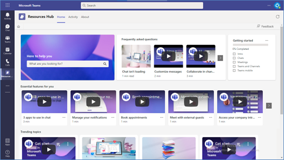

#Custom Bing search
Users can perform a search by entering the keywords and the result will be available on the result page of the application. This is a customized Bing search. This search will show results for internal and external content. The extrernal content is from the Bing search, the internal content as available within the app.

User can share the internal content only.

Users can view or read articles in a task module for internal content

The external content will be redirected to the respective web pages
 
## 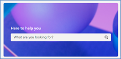
## 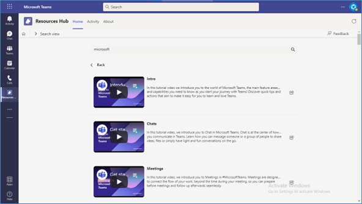

**Note**: If you are facing any issue in your app, [please uncomment this line](https://github.com/OfficeDev/Microsoft-Teams-Samples/blob/main/samples/msteams-application-resourcehub/Source/microsoft-teams-apps-selfhelp/Bot/AdapterWithErrorHandler.cs#L26) and put your debugger for local debug.

#Video
Click the title of video link a task module will open and have a video in the task module which user can play.

By clicking on the play button on the task module the videos start playing. User can close the task module by pressing X on the top right

Users can use like and dislike functionality to show that response. There is some other information available for telemetry and details purposes like tags and description

If there is more information available for the video Know more buttons will appear and redirect the user to the website where information has been shared

Using share functionality, the user can share the content with dear colleagues

 
## 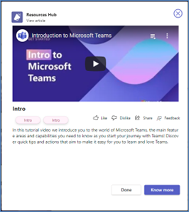
#Articles
Clicking on the article link for a stage view will open an end user can read the article.

Users can close the stage by clicking X button on top right

Users can use like and dislike functionality to show that response

There is some other information available for telemetry and detailed purposes like tags and description

If there is more information available for the article the know more buttons will appear and redirect the user to the website where information has been shared

 
## 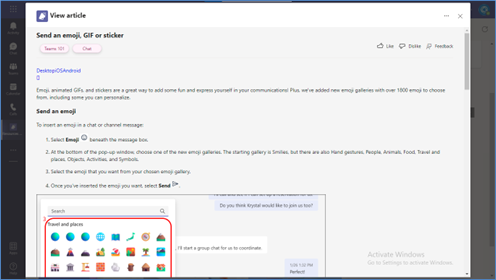
#Feedback form
Users can submit feedback on items or can provide common feedback using the available feedback form on the app.

There are three entry points for the feedback

 

## 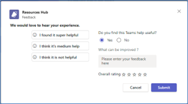

Common feedback form: this can be accessible from the home page of the app    
## 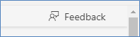
#Item feedback form: 
. this form is available along with the items
By filling in the feedback using item will be able to capture the item ID as well 
## 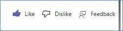

Getting started feedback form: two feedback forms available
1. Proactive feedback form: on completion of a learning path on achieving 100% our feedback form will pop up to capture user feedback as overall learning path
2. Reactive feedback form: a feedback form is available to user where they can provide feedback on the learning path, and it is available throughout the completion of learning path   ## ![FeedbackOnLearningPath](Documentation/FeedbackOnLearningPath.png
#New Tag
When admin adds a new item under Essentials for you section of the application the item will be tagged as new for 24 hours
 
## 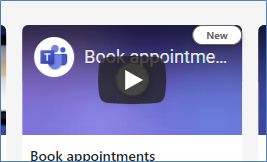
#Popular Tag
Trending topics we'll have A tag available on the tile showing the popularity of the item, this is the primary tag entered by admin at back end
 
## 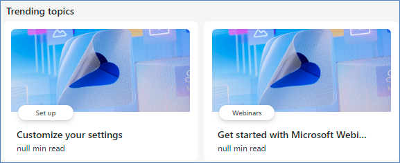
#Share
Users can share the content with their team members using MS Teams. User can click on the ‘…’ to view the share option. On Essential Features for you & Trending topics
## 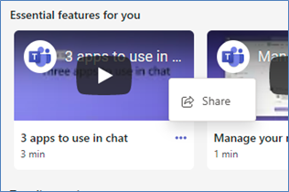                
## 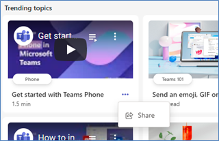
Users can share the content with their team members using MS Teams from the search items those are available in the app. User can click on the  button.
 
## 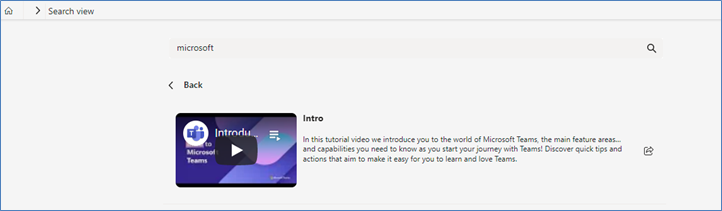
On Click of the share button from the above-mentioned options, a task module will open. Providing details in the task module will send an adaptive card to the respective team member in Personal/Teams scope.

User can select User or Teams

Based on the selection the list of Teams or users will populate in the dropdown

- Users type the message to share with the team members along with the Item.

- Click on the Share button to send the details to the other users.

 ## 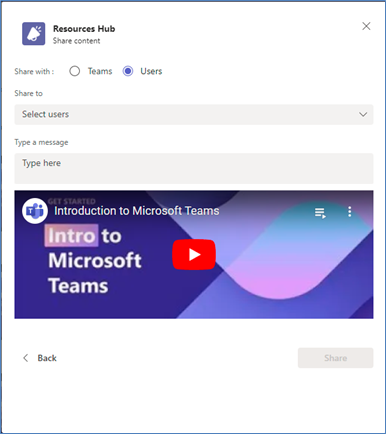

