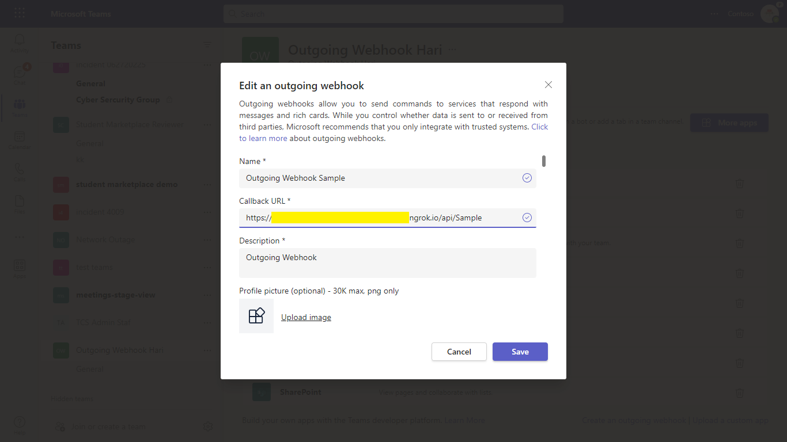
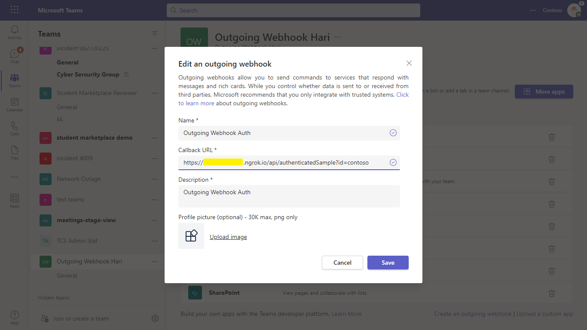
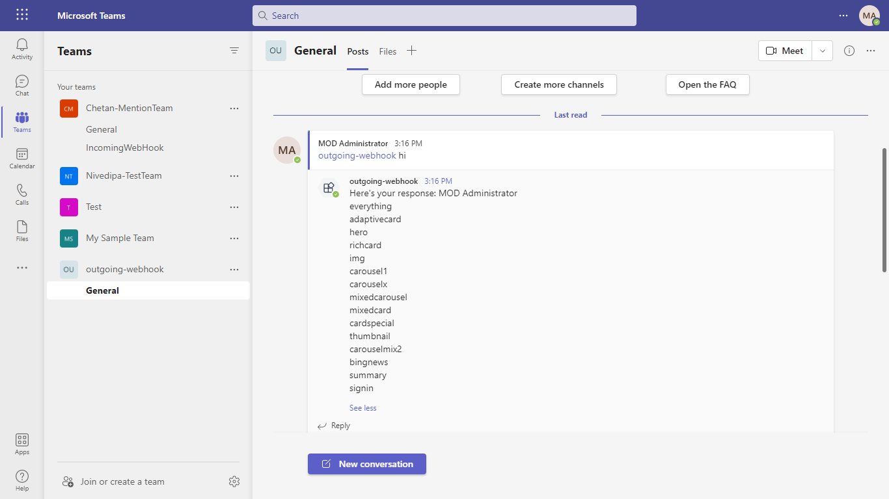
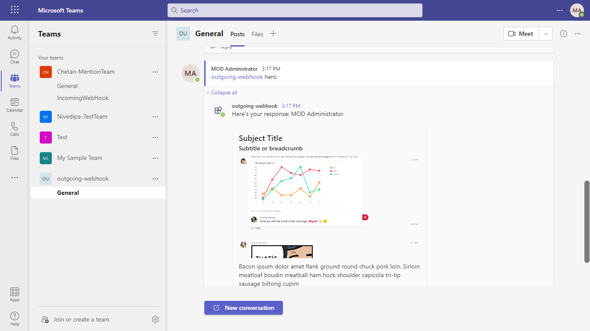

# Outgoing Webhook Sample C#

## Summary

Webhooks are a great way for Teams to integrate with external apps. A webhook is essentially a POST request sent to a callback URL. In Teams, outgoing webhooks provide a simple way to allow users to send messages to your web service without having to go through the full process of creating bots via the [Microsoft Bot Framework](https://dev.botframework.com/). Outgoing webhooks post data from Teams to any chosen service capable of accepting a JSON payload. Once an outgoing webhook is added to a team, it acts like bot, listening in channels for messages using @mention, sending notifications to external web services, and responding with rich messages that can include cards and images.

## Included Features
* Outgoing Webhooks

## Interaction with app


## Pre-requisites

- Microsoft Teams is installed and you have an account (not a guest account)
- [.NET Core SDK](https://dotnet.microsoft.com/download) version 6.0

  ```bash
  # determine dotnet version
  dotnet --version
  ```
- [ngrok](https://ngrok.com/download) or equivalent tunnelling solution

- Visual Studio

- Asp.net Core

## Setup

> Note these instructions are for running the sample on your local machine, the tunnelling solution is required because

1. Create an outgoing webhook.
    - Select the appropriate team and select Manage team from the (•••) drop-down menu.
    - Choose the Apps tab from the navigation bar.
    - From the window's lower right corner select Create an outgoing webhook.
    - In the resulting popup window complete the required fields:
    - Name - The webhook title and @mention tap.
    - Callback URL - The HTTPS endpoint that accepts JSON payloads and will receive POST requests from Teams.
    - **Test Scenarios 1** Callback URL should be like: <ngrokurl>/api/Sample or yourappsiteurl/api/Sample
      
    - **Test Scenarios 2** Callback URL should be like: <ngrokurl>/api/authenticatedSample?id=contoso or yourappsiteurl/api/authenticatedSample?id=contoso
         
    - Description - A detailed string that will appear in the profile card and the team-level App dashboard.
    - Profile Picture (optional) an app icon for your webhook.
    - Select the Create button from lower right corner of the pop-up window and the outgoing webhook will be added to the current team's channels.
    - The next dialog window will display an [Hash-based Message Authentication Code](https://security.stackexchange.com/questions/20129/how-and-when-do-i-use-hmac/20301) security token that will be used to authenticate calls between Teams and the designated outside service. This token in used in `AuthProvider.cs`.
    - If the URL is valid and the server and client authentication tokens are equal (i.e., an HMAC handshake), the outgoing webhook will be available to the team's users.

2. Setup NGROK
 - Run ngrok - point to port 3978

 ```bash
  ngrok http 3978 --host-header="localhost:3978"
 ```
3. Clone the repository
    git clone https://github.com/OfficeDev/Microsoft-Teams-Samples.git

4. If you are using Visual Studio
    - Launch Visual Studio
    - File -> Open -> Project/Solution
    - Navigate to `samples/outgoing-webhook/csharp` folder
    - Select `WebhookSampleBot.sln` file
    - Update the HMAC value for the Dictionary named `SigningKeyDictionary` in AuthProvider.cs file.
    - Press `F5` to run the project  


## Running the sample

Example screenshot to reply to any message:
 


Example screenshot to show Hero card (using type of card in message):
 


## Further Reading

[Outgoing webhook](https://learn.microsoft.com/en-us/microsoftteams/platform/webhooks-and-connectors/how-to/add-outgoing-webhook?tabs=urljsonpayload%2Cdotnet)


