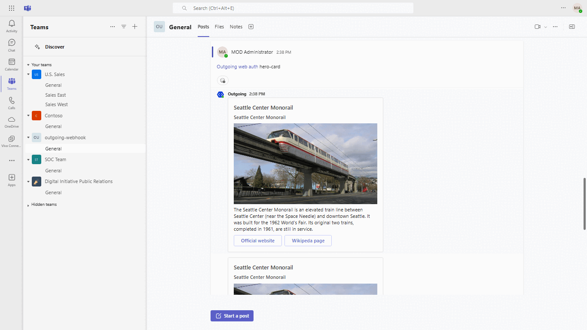
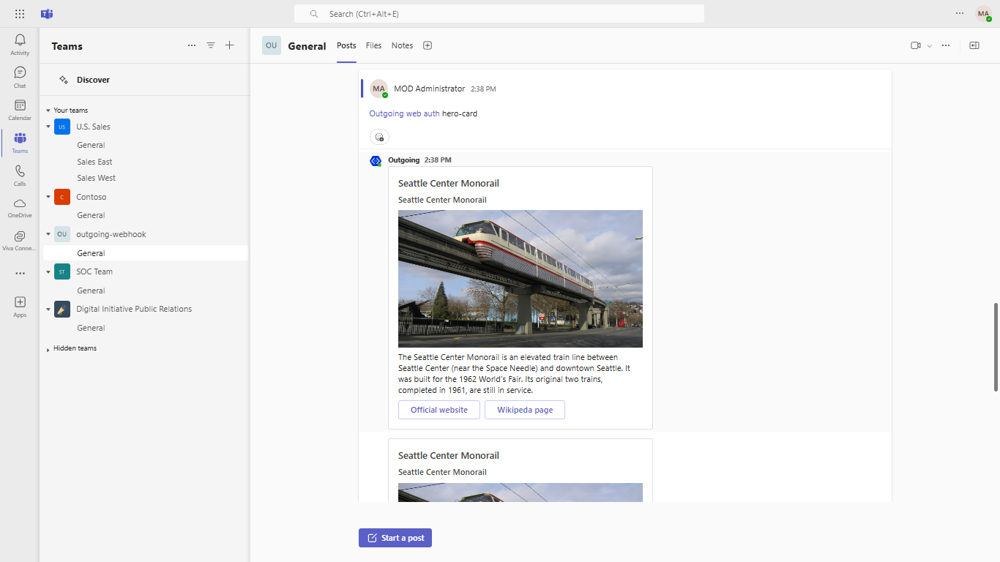
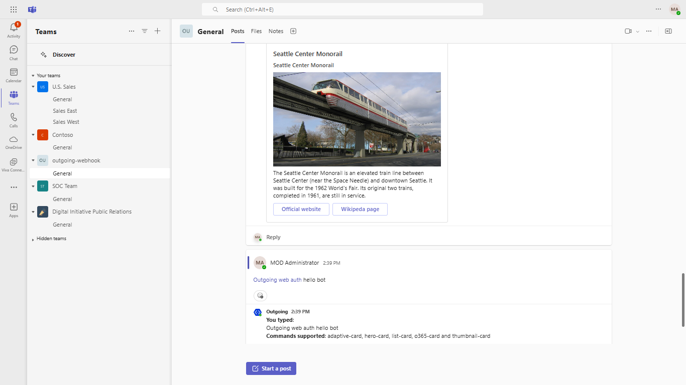

> [!IMPORTANT]
>
> The existing Microsoft 365 (previously called Office 365) connectors across all cloud platforms are nearing deprecation, and the creation of new Microsoft 365 connectors will soon be blocked. For more information on the schedule and how the Workflows app provides a more flexible and secure experience, see [retirement of Microsoft 365 connectors within Microsoft Teams](https://devblogs.microsoft.com/microsoft365dev/retirement-of-office-365-connectors-within-microsoft-teams/).

# Outgoing Webhook Sample Node.js

The Outgoing Webhook Sample Node.js project showcases a basic implementation of an Outgoing Webhook for Microsoft Teams, allowing seamless interaction with external applications. By verifying the identity of the sender, the webhook echoes messages back to the user and supports various card types, including adaptive and hero cards, facilitating dynamic responses within Teams channels. 

## Summary

This project is an implementation of a very simple [Outgoing Webhook](https://docs.microsoft.com/en-us/microsoftteams/platform/concepts/custom-bot) for Microsoft Teams. All it does is verify that what's sending messages matches the Outgoing Webhook that was created in Teams, and it echoes back whatever is sent to it.

## Interaction with app



## Prerequisites

- Microsoft Teams is installed and you have an account (not a guest account)
- [NodeJS](https://nodejs.org/en/)
- [dev tunnel](https://learn.microsoft.com/en-us/azure/developer/dev-tunnels/get-started?tabs=windows) or [ngrok](https://ngrok.com/) latest version or equivalent tunnelling solution
- [M365 developer account](https://docs.microsoft.com/en-us/microsoftteams/platform/concepts/build-and-test/prepare-your-o365-tenant) or access to a Teams account with the appropriate permissions to install an app.

## Setup

 
1. Create Webhook
  * Create the Outgoing Webhook in Teams using the instructions [here](https://docs.microsoft.com/en-us/microsoftteams/platform/concepts/custom-bot). Paste the tunneling service URL from the previous step into the "Callback URL" box. After you press the Create button, copy/paste the security token that Teams generates to the clipboard.

  * Paste the security token generated by Teams as the value of `sharedSecret` in `app.js`. When you're done, it should look something like this:

    ```javascript
    const sharedSecret = "+ZaRRMC8+mpnfGaGsBOmkIFt98bttL5YQRq3p2tXgcE=";  ```

  * In the directory in which you installed this project, type `node app.js`

  * In Microsoft Teams, in any channel in the team in which you created the Outgoing Webhook, you can type `@<botname> <card-type>` then it will respond back a card with specified card type.

    Supported <card type>: "adaptive-card", "hero-card", "list-card", "o365-card", "thumbnail-card"
    
 2. Setup NGROK
-  Run ngrok - point to port 3978

   ```bash
   ngrok http 3978 --host-header="localhost:3978"
   ```  

   Alternatively, you can also use the `dev tunnels`. Please follow [Create and host a dev tunnel](https://learn.microsoft.com/en-us/azure/developer/dev-tunnels/get-started?tabs=windows) and host the tunnel with anonymous user access command as shown below:

   ```bash
   devtunnel host -p 3978 --allow-anonymous
   ```

3. Setup Code

- In a terminal, navigate to `samples/outgoing-webhook/nodejs`

 - Install modules

    ```bash
    npm install
    ```
    
 - Install modules

    ```bash
    npm install
    ```
- Run your bot at the command line:

    ```bash
    npm start
    ```

## Running the sample

- Example screenshot to show Hero card:


* Supported <card type>: "adaptive-card", "hero-card", "list-card", "o365-card", "thumbnail-card"

* If you type anything else apart from above mentioned type, it will echo back what you typed.

- Example screenshot to show Echo message:



## Contributing

This project welcomes contributions and suggestions.  Most contributions require you to agree to a
Contributor License Agreement (CLA) declaring that you have the right to, and actually do, grant us
the rights to use your contribution. For details, visit https://cla.microsoft.com.

When you submit a pull request, a CLA-bot will automatically determine whether you need to provide
a CLA and decorate the PR appropriately (e.g., label, comment). Simply follow the instructions
provided by the bot. You will only need to do this once across all repos using our CLA.

This project has adopted the [Microsoft Open Source Code of Conduct](https://opensource.microsoft.com/codeofconduct/).
For more information see the [Code of Conduct FAQ](https://opensource.microsoft.com/codeofconduct/faq/) or
contact [opencode@microsoft.com](mailto:opencode@microsoft.com) with any additional questions or comments.


