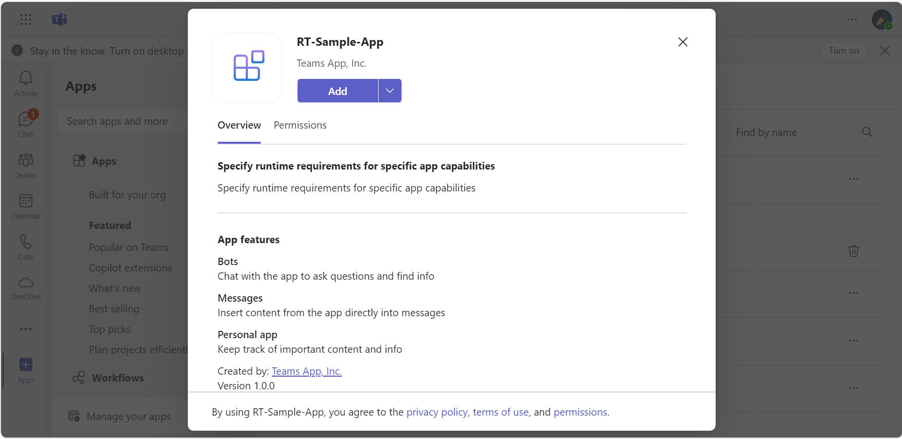
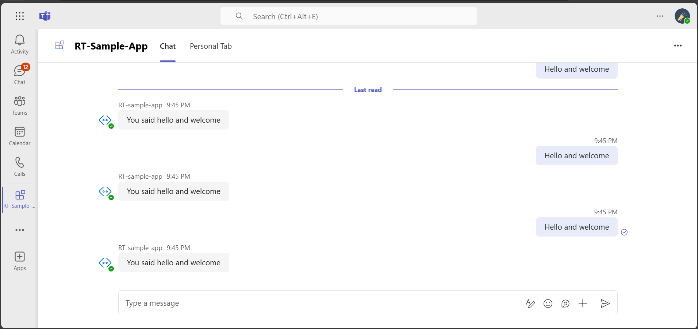
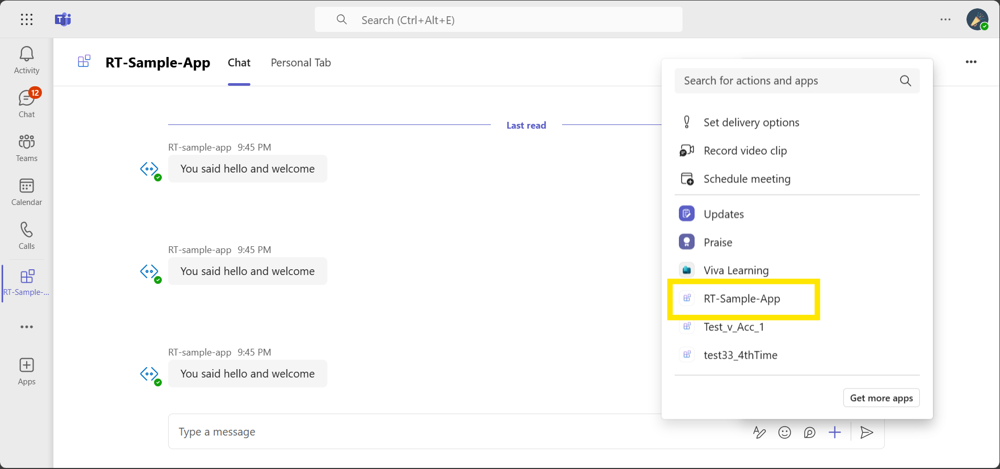
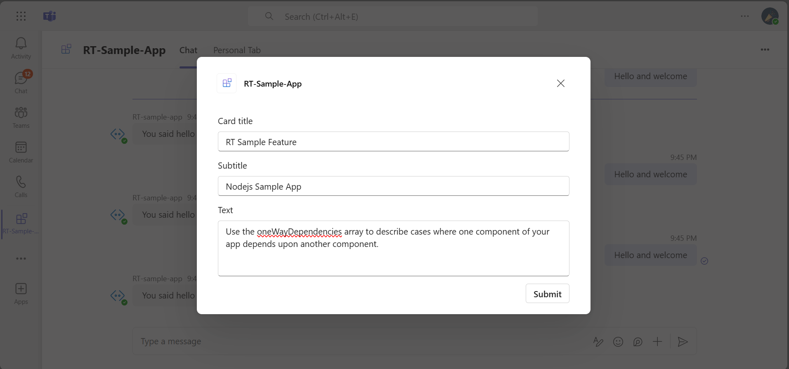
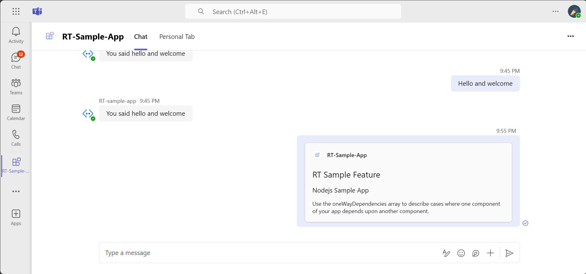
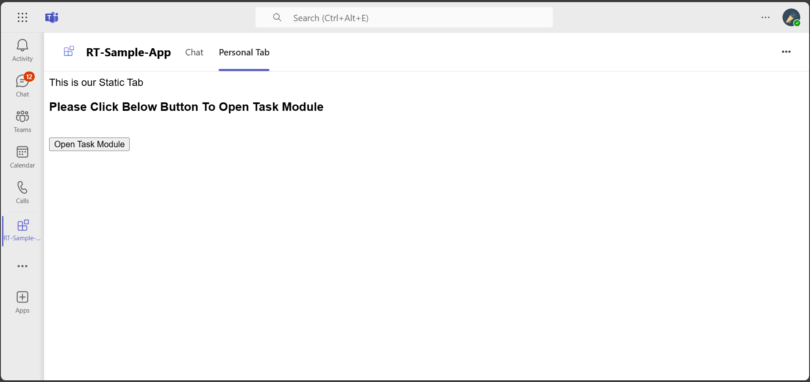
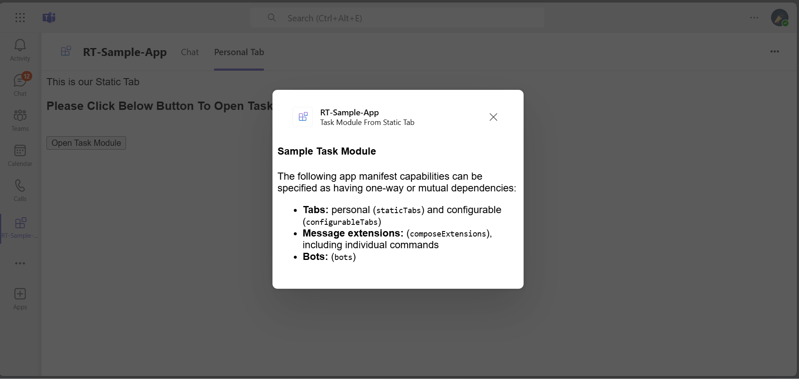
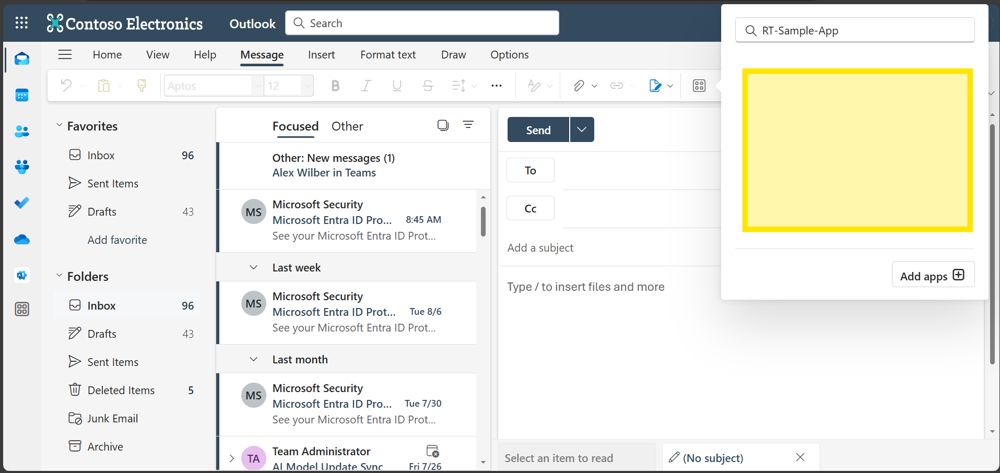
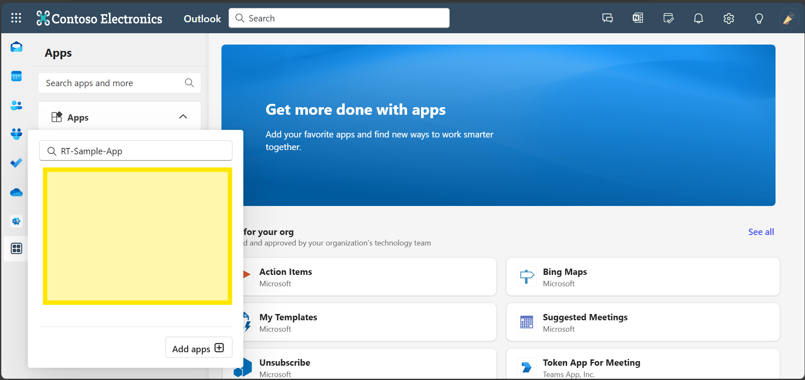

# Microsoft 365 RT Sample App Feature.

- The Microsoft 365 RT Sample App Feature is a Node.js application designed to illustrate mutual-dependency relationships between various capabilities within Microsoft Teams, such as bots, tabs, and message extensions. Leveraging the 'elementRelationshipSet' property in the app manifest, this sample enables developers to define and manage dependencies, ensuring a cohesive and integrated app experience that meets the specific requirements of users in Microsoft 365 environments.

## Included Features
* Tabs
* Bots
* Compose Extensions
* Element RelationShip Property
    * Mutual Dependency

## Interaction with app


## Prerequisites

-  Microsoft Teams is installed and you have an account (not a guest account)

-  To test locally, [NodeJS](https://nodejs.org/en/download/) must be installed on your development machine (version 16.14.2  or higher)

-  [dev tunnel](https://learn.microsoft.com/en-us/azure/developer/dev-tunnels/get-started?tabs=windows) or [ngrok](https://ngrok.com/) latest version or equivalent tunneling solution

-  [M365 developer account](https://docs.microsoft.com/microsoftteams/platform/concepts/build-and-test/prepare-your-o365-tenant) or access to a Teams account with the appropriate permissions to install an app.

- [Microsoft 365 Agents Toolkit for VS Code](https://marketplace.visualstudio.com/items?itemName=TeamsDevApp.ms-teams-vscode-extension) or [TeamsFx CLI](https://learn.microsoft.com/microsoftteams/platform/toolkit/teamsfx-cli?pivots=version-one)

## Run the app (Using Microsoft 365 Agents Toolkit for Visual Studio Code)

The simplest way to run this sample in Teams is to use Microsoft 365 Agents Toolkit for Visual Studio Code.

1. Ensure you have downloaded and installed [Visual Studio Code](https://code.visualstudio.com/docs/setup/setup-overview)
1. Install the [Microsoft 365 Agents Toolkit extension](https://marketplace.visualstudio.com/items?itemName=TeamsDevApp.ms-teams-vscode-extension)
1. Select **File > Open Folder** in VS Code and choose this samples directory from the repo
1. Using the extension, sign in with your Microsoft 365 account where you have permissions to upload custom apps
1. Select **Debug > Start Debugging** or **F5** to run the app in a Teams web client.
1. In the browser that launches, select the **Add** button to install the app to Teams.

> If you do not have permission to upload custom apps (uploading), Microsoft 365 Agents Toolkit will recommend creating and using a Microsoft 365 Developer Program account - a free program to get your own dev environment sandbox that includes Teams.

## Run the app (Manually Uploading to Teams)

> Note these instructions are for running the sample on your local machine, the tunnelling solution is required because
> the Teams service needs to call into the bot.

### 1. Setup for Bot
- In Azure portal, create a [Azure Bot resource](https://docs.microsoft.com/azure/bot-service/bot-builder-authentication?view=azure-bot-service-4.0&tabs=csharp%2Caadv2)

- Ensure that you've [enabled the Teams Channel](https://docs.microsoft.com/azure/bot-service/channel-connect-teams?view=azure-bot-service-4.0)

- While registering the bot, use `https://<your_tunnel_domain>/api/messages` as the messaging endpoint.
    > NOTE: When you create your bot you will create an App ID and App password - make sure you keep these for later.

### 2. Setup NGROK
1) Run ngrok - point to port 3978

    ```bash
    ngrok http 3978 --host-header="localhost:3978"
    ```
   Alternatively, you can also use the `dev tunnels`. Please follow [Create and host a dev tunnel](https://learn.microsoft.com/en-us/azure/developer/dev-tunnels/get-started?tabs=windows) and host the tunnel with anonymous user access command as shown below:

   ```bash
   devtunnel host -p 3978 --allow-anonymous
   ```

### 3. App Registration

#### Register your application with Azure AD

1. Register a new application in the [Microsoft Entra ID – App Registrations](https://go.microsoft.com/fwlink/?linkid=2083908) portal.
2. Select **New Registration** and on the *register an application page*, set following values:
    * Set **name** to your app name.
    * Choose the **supported account types** (any account type will work)
    * Leave **Redirect URI** empty.
    * Choose **Register**.
3. On the overview page, copy and save the **Application (client) ID, Directory (tenant) ID**. You'll need those later when updating your Teams application manifest and in the appsettings.json.
4. Navigate to **API Permissions**, and make sure to add the follow permissions:
    * Select Add a permission
    * Select Microsoft Graph -> Delegated permissions.
    * `User.Read` (enabled by default)
    * Click on Add permissions. Please make sure to grant the admin consent for the required permissions.

### 4. Setup for code
1) Clone the repository

    ```bash
    git clone https://github.com/OfficeDev/Microsoft-Teams-Samples.git
    ```
2) In a terminal, navigate to `samples/requirement-targeting-mutual-dependency`

3) Install modules

    ```bash
    npm install
    ```

4) Update the `custom-environment-variables` configuration for the bot to use the `MicrosoftAppId` and `MicrosoftAppPassword`, `BaseUrl` with application base url.

5) Update the `default` configuration for the bot to use the `appId` and `appPassword`.

5) Run your app

    ```bash
    npm start
    ```

## Microsoft 365 RT Sample App Feature
**This sample feature is to cover Mutual Dependency like Bot, Tab, ME depends on each other**
1) Static Tab + ME + BOT => the three mutually depends on each other

**JSON for Bot,Tab and ME**

```json

 "elementRelationshipSet": {
   "mutualDependencies": [
     [
       {
         "name": "staticTabs",
         "id": "staticTab_ID"
       },
       {
         "name": "composeExtensions",
         "id": "composeExt_ID"
       },
       {
         "name": "bots",
         "id": "${{BOT_ID}}"
       }
     ]
   ]
 },

``` 

## Running the sample

**Install App:**



**Mutual Dependency In Teams**













**Outlook**

**action command dependsOn bots, wehre as Message Extension Action won't showup in Outlook**


**Static Tab Depends On Message Extension Action, the Static tab won't showup in outlook**


## Deploy the bot to Azure

To learn more about deploying a bot to Azure, see [Deploy your bot to Azure](https://aka.ms/azuredeployment) for a complete list of deployment instructions.

## Further reading

- [Specify Microsoft 365 host runtime requirements in app manifest](https://review.learn.microsoft.com/en-us/microsoftteams/platform/m365-apps/specify-runtime-requirements?branch=pr-en-us-11018)
- [Extend Teams apps across Microsoft 365](https://learn.microsoft.com/en-us/microsoftteams/platform/m365-apps/overview)

