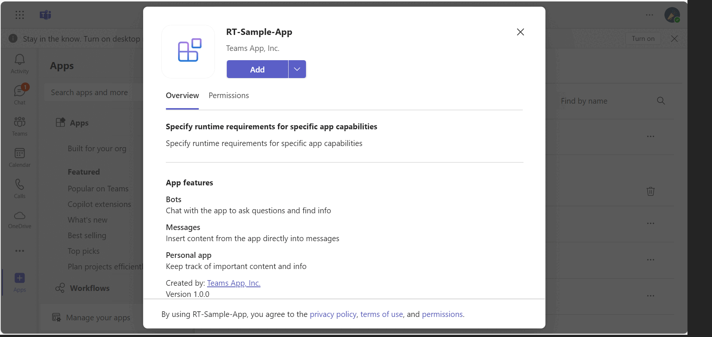
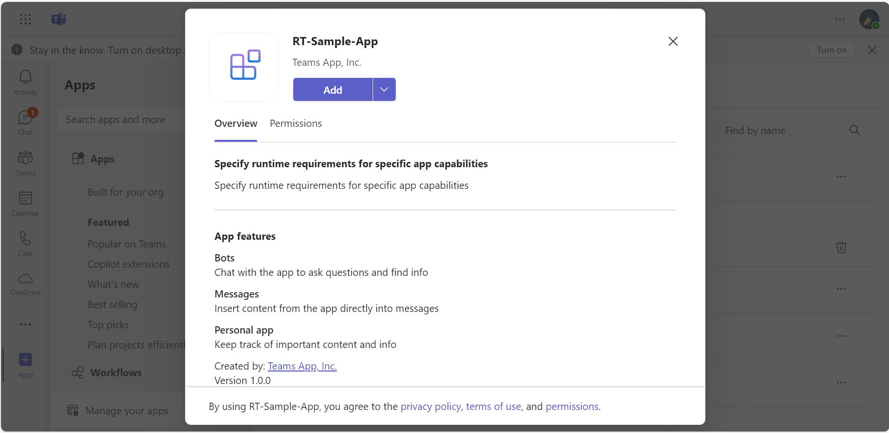
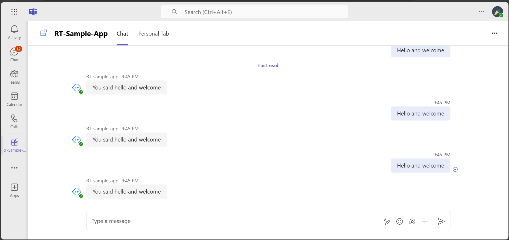
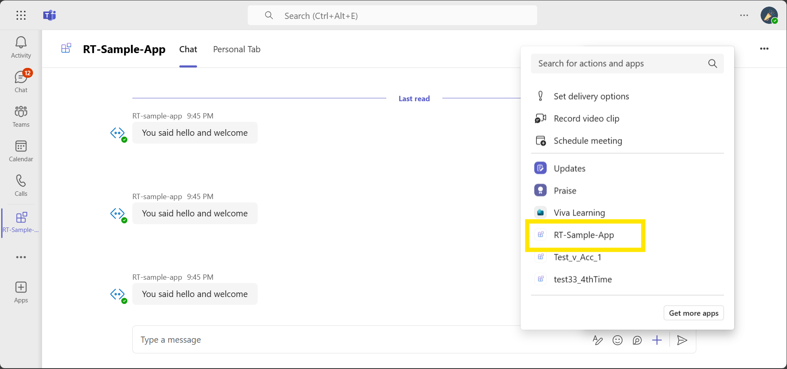
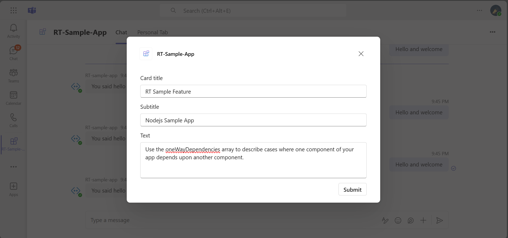
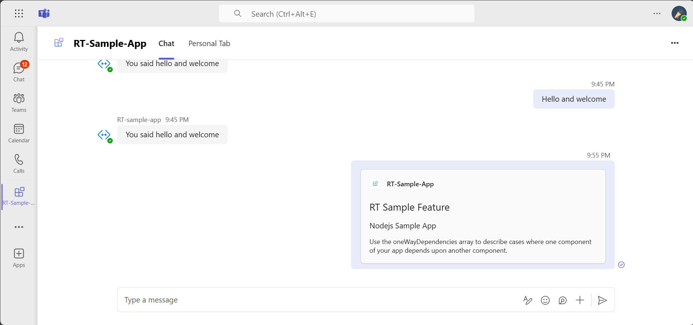
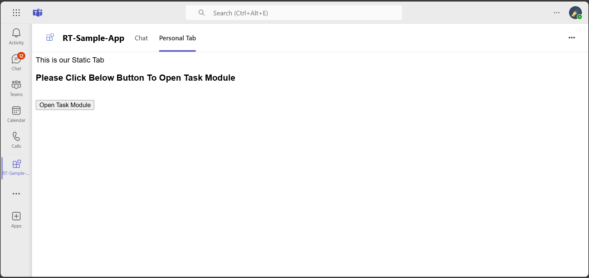
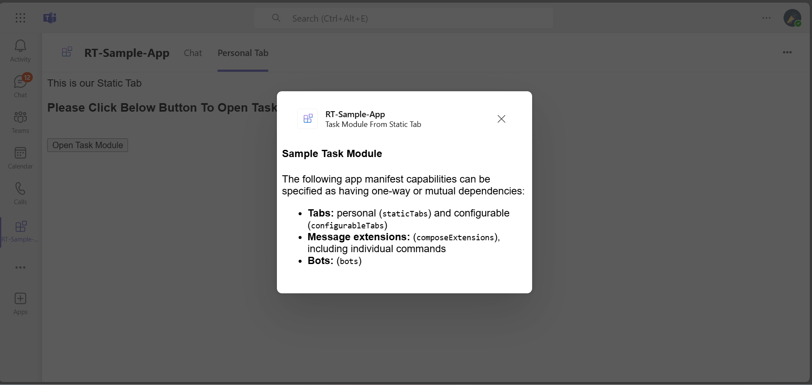
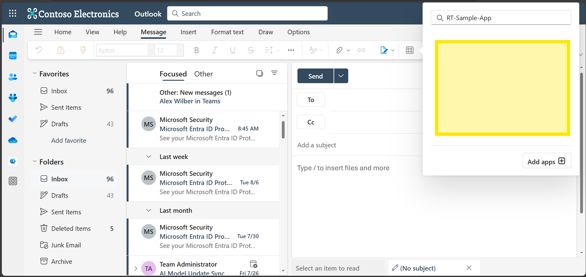
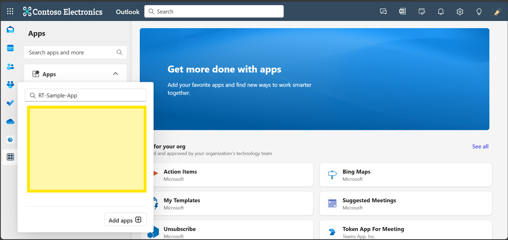

# Microsoft 365 RT Sample App Feature.

- Microsoft 365 RT sample app in Node.js which specify one-way-dependency relationships between app capabilities (using "elementRelationshipSet") and functionality requirements of a particular app capability (using "hostMustSupportFunctionalities").

## Included Features
* Tabs
* Bots
* Compose Extensions
* Element RelationShip Property
    * OneWay Dependency
    * Host Must Support Functionalities with dialogUrl

## Interaction with app



## Prerequisites

-  Microsoft 365, Teams is installed and you have an account (not a guest account)

-  To test locally, [NodeJS](https://nodejs.org/en/download/) must be installed on your development machine (version 16.14.2  or higher)

-  [dev tunnel](https://learn.microsoft.com/en-us/azure/developer/dev-tunnels/get-started?tabs=windows) or [ngrok](https://ngrok.com/) latest version or equivalent tunneling solution

-  [M365 developer account](https://docs.microsoft.com/microsoftteams/platform/concepts/build-and-test/prepare-your-o365-tenant) or access to a Teams account with the appropriate permissions to install an app.

- [Teams Toolkit for VS Code](https://marketplace.visualstudio.com/items?itemName=TeamsDevApp.ms-teams-vscode-extension) or [TeamsFx CLI](https://learn.microsoft.com/microsoftteams/platform/toolkit/teamsfx-cli?pivots=version-one)

## Run the app (Using Teams Toolkit for Visual Studio Code)

The simplest way to run this sample in Teams is to use Teams Toolkit for Visual Studio Code.

1. Ensure you have downloaded and installed [Visual Studio Code](https://code.visualstudio.com/docs/setup/setup-overview)
1. Install the [Teams Toolkit extension](https://marketplace.visualstudio.com/items?itemName=TeamsDevApp.ms-teams-vscode-extension)
1. Select **File > Open Folder** in VS Code and choose this samples directory from the repo
1. Using the extension, sign in with your Microsoft 365 account where you have permissions to upload custom apps
1. Select **Debug > Start Debugging** or **F5** to run the app in a Teams web client.
1. In the browser that launches, select the **Add** button to install the app to Teams.

> If you do not have permission to upload custom apps (sideloading), Teams Toolkit will recommend creating and using a Microsoft 365 Developer Program account - a free program to get your own dev environment sandbox that includes Teams.

## Run the app (Manually Uploading to Teams)

> Note these instructions are for running the sample on your local machine, the tunnelling solution is required because
> the Teams service needs to call into the bot.

### 1. Setup for Bot
- In Azure portal, create a [Azure Bot resource](https://docs.microsoft.com/azure/bot-service/bot-builder-authentication?view=azure-bot-service-4.0&tabs=csharp%2Caadv2)

- Ensure that you've [enabled the Teams Channel](https://docs.microsoft.com/azure/bot-service/channel-connect-teams?view=azure-bot-service-4.0)

- While registering the bot, use `https://<your_tunnel_domain>/api/messages` as the messaging endpoint.
    > NOTE: When you create your bot you will create an App ID and App password - make sure you keep these for later.

### 2. Setup NGROK
1) Run ngrok - point to port 3978

    ```bash
    ngrok http 3978 --host-header="localhost:3978"
    ```
   Alternatively, you can also use the `dev tunnels`. Please follow [Create and host a dev tunnel](https://learn.microsoft.com/en-us/azure/developer/dev-tunnels/get-started?tabs=windows) and host the tunnel with anonymous user access command as shown below:

   ```bash
   devtunnel host -p 3978 --allow-anonymous
   ```

### 3. Setup for code
1) Clone the repository

    ```bash
    git clone https://github.com/OfficeDev/Microsoft-Teams-Samples.git
    ```
2) In a terminal, navigate to `samples/requirement-targeting-oneway-dependency`

3) Install modules

    ```bash
    npm install
    ```

4) Update the `custom-environment-variables` configuration for the bot to use the `MicrosoftAppId` and `MicrosoftAppPassword`, `BaseUrl` with application base url.

5) Update the `default` configuration for the bot to use the `appId` and `appPassword`.

5) Run your app

    ```bash
    npm start
    ```

## Microsoft 365 RT Sample App Feature
**This sample app feature is to show oneway dependency**

| Manifests | Capabilities | Dependency |
|----------|----------|----------|
| 1.OneWay ME-DependsOn-Bot | Bot and Action-ME | Action-ME Depends on Bot |
| 2.OneWay Tab-DependsOn-Bot | Static-Tab and Bot | Static-Tab Depends on Bot |
| 3.StaticTab-With-DialogURL |Static-Tab with dialog URL | Host Support Functionalities |


1) This is to specify One-Way Dependency between actionME contains a bot-sent-card scenario and has to depend-on bot to work properly.

**JSON for ME-DependsOn-Bot**

```json
"elementRelationshipSet": {
        "oneWayDependencies": [
            {
                "element": {
                    "name": "composeExtensions",
                    "id": "composeExt_ID",
                    "commandIds": [
                        "createCard"
                    ]
                },
                "dependsOn": [
                    {
                        "name": "bots",
                        "id": "${{BOT_ID}}"
                    }
                ]
            }
        ]
    },
``` 

2) This is to specify One-Way Dependency between static tab and bot where the static tab dependsOn Bot

**JSON for Tab-DependsOn-Bot**

```json
"elementRelationshipSet": {
        "oneWayDependencies": [
            {
                "element": {
                    "name": "staticTabs",
                    "id": "staticTab_Id"
                },
                "dependsOn": [
                    {
                        "name": "bots",
                        "id": "${{BOT_ID}}"
                    }
                ]
            }
        ]
    },

```
3) This is to specify Static tab that contains a dialog using "hostMustSupportFunctionalities" 

**JSON for Static-Tab with dialog URL**
```json
 "staticTabs": [
        {
            "entityId": "staticTab_Id",
            "name": "Personal Tab",
            "contentUrl": "https://${{BOT_DOMAIN}}/tab",
            "websiteUrl": "https://${{BOT_DOMAIN}}/tab",
            "scopes": [
                "personal"
            ],
            "requirementSet": {
                "hostMustSupportFunctionalities": [
                    {
                        "name": "dialogUrl"
                    },
                    {
                        "name": "dialogUrlBot"
                    }
                ]
            }
        }
    ],
```

>Note: **Steps for manually uploading app manifests**:
1) The toolkit will automatically generate a `build` folder for each manifest inside the `appPackage` directory.
2) Go to the build folder, locate the package (e.g., `appPackage.local.zip`), and upload it to Teams. 

## Running the sample

**Install App:**



**Oneway Dependency In Teams**













**Outlook**

**actionME dependsOn bots, actionME won't show up in Outlook**


**Tab dependsOn bots, Tabs won't show up in Outlook**


## Deploy the bot to Azure

To learn more about deploying a bot to Azure, see [Deploy your bot to Azure](https://aka.ms/azuredeployment) for a complete list of deployment instructions.

## Further reading

- [Specify Microsoft 365 host runtime requirements in app manifest](https://review.learn.microsoft.com/en-us/microsoftteams/platform/m365-apps/specify-runtime-requirements?branch=pr-en-us-11018)
- [Extend Teams apps across Microsoft 365](https://learn.microsoft.com/en-us/microsoftteams/platform/m365-apps/overview)

