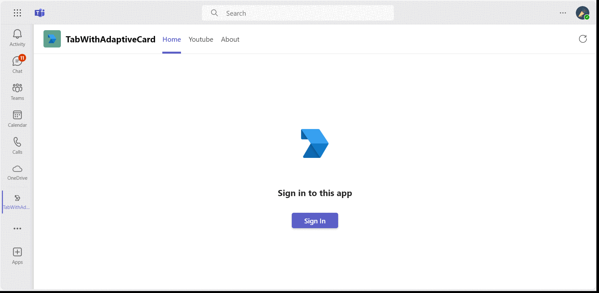
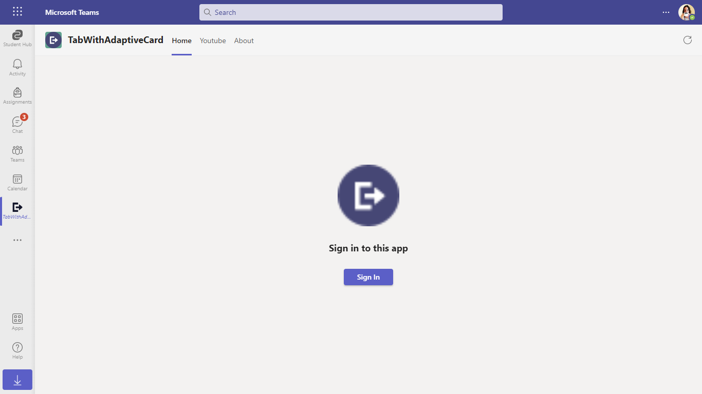
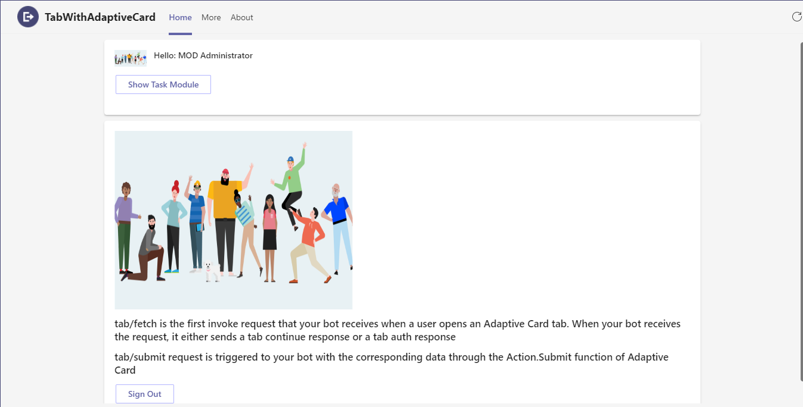
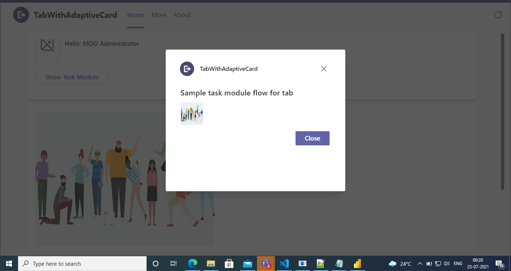
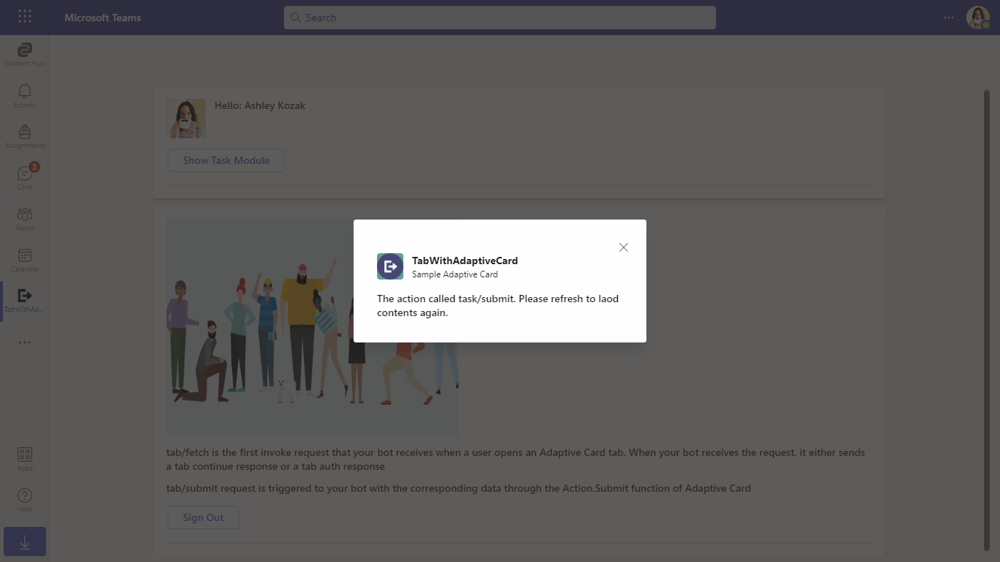
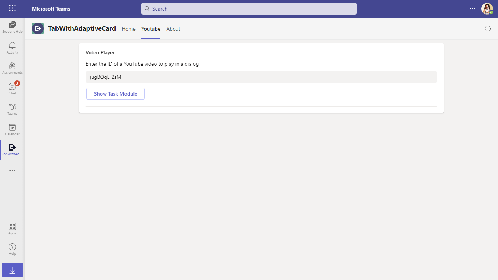
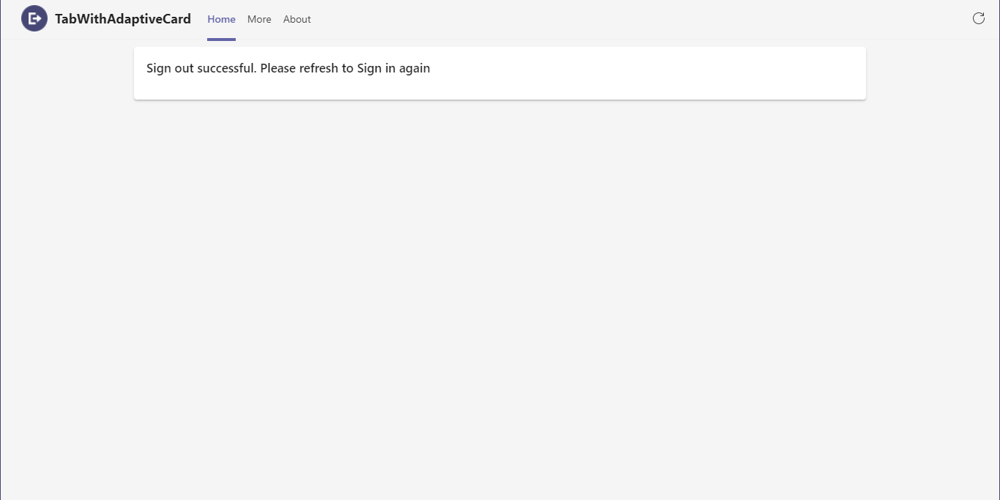

# Tabs with Adaptive Cards

This App talks about the Teams tab which displays Adaptive card with Node JS. For reference please check [Build tabs with Adaptive Cards](https://docs.microsoft.com/microsoftteams/platform/tabs/how-to/build-adaptive-card-tabs)

This bot has been created using [Bot Framework v4](https://dev.botframework.com), it shows how to create a simple bot that accepts Adaptive Cards V1.4 to render in Teams tab.

This feature shown in this sample is in Public Developer Preview and is supported in desktop and mobile.

> NOTE: Adaptive Card tabs will be deprecated in the new Microsoft Teams. Apps are expected to be available in the new Microsoft Teams by June 2023. If your app is using Adaptive Card tabs, it's recommended to rebuild the tab as a web-based tab. For more information, see [Build tabs for Teams](https://learn.microsoft.com/en-gb/microsoftteams/platform/tabs/what-are-tabs?tabs=desktop).

## Included Features
* Tabs
* Adaptive Cards (in tabs)

## Interaction with Adaptive Cards



## Try it yourself - experience the App in your Microsoft Teams client
Please find below demo manifest which is deployed on Microsoft Azure and you can try it yourself by uploading the app package (.zip file link below) to your teams and/or as a personal app. (Sideloading must be enabled for your tenant, [see steps here](https://docs.microsoft.com/microsoftteams/platform/concepts/build-and-test/prepare-your-o365-tenant#enable-custom-teams-apps-and-turn-on-custom-app-uploading)).

**Tabs with Adaptive Cards:** [Manifest](/samples/tab-adaptive-cards/csharp/demo-manifest/tab-adaptive-card.zip)

## Prerequisites

1. Office 365 tenant. You can get a free tenant for development use by signing up for the [Office 365 Developer Program](https://developer.microsoft.com/microsoft-365/dev-program).

2. To test locally, [NodeJS](https://nodejs.org/en/download/) must be installed on your development machine (version 16.14.2 or higher).

    ```bash
    # determine node version
    node --version
    ```

3. To test locally, you'll need [Ngrok](https://ngrok.com/) installed on your development machine.
Make sure you've downloaded and installed Ngrok on your local machine. ngrok will tunnel requests from the Internet to your local computer and terminate the SSL connection from Teams.

## Setup

> NOTE: The free ngrok plan will generate a new URL every time you run it, which requires you to update your Azure AD registration, the Teams app manifest, and the project configuration. A paid account with a permanent ngrok URL is recommended.

1) Setup for Bot
    - Register Azure AD application
    - Register a bot with Azure Bot Service, following the instructions [here](https://docs.microsoft.com/azure/bot-service/bot-service-quickstart-registration?view=azure-bot-service-3.0).
    - Ensure that you've [enabled the Teams Channel](https://docs.microsoft.com/azure/bot-service/channel-connect-teams?view=azure-bot-service-4.0)
    - While registering the bot, use `https://<your_ngrok_url>/api/messages` as the messaging endpoint.

    > NOTE: When you create your Azure AD application registration, you will create an App ID and App password - make sure you keep these for later.

    Setup [Azure Bot connection](https://github.com/OfficeDev/Microsoft-Teams-Samples/blob/368ef561bad496948b30ac0c23b38ad207adf891/samples/msgext-search-sso-config/nodejs/BotSSOSetup.md#3-setup-bot-service-connection-tokenstore)

2) Setup NGROK 
- Run ngrok - point to port `3978`

    ```bash
    ngrok http 3978 --host-header="localhost:3978"
    ```

3) Setup for code     
- Clone the repository

    ```bash
    git clone https://github.com/OfficeDev/Microsoft-Teams-Samples.git
    ```

- In a console, navigate to `samples/tab-adaptive-cards/nodejs`

- Install modules

    ```bash
    npm install
    ```

- Update the `.env` configuration for the bot to use the `MicrosoftAppId` (Microsoft App Id) and `MicrosoftAppPassword` (App Password) from the AAD app registration in Azure portal or from bot Framework registration. 
- Update the `BaseUrl` as per your application domain like if you are using ngrok, it would be `https://1234.ngrok-free.app` 
- Update the `ConnectionName` with Azure Bot Registration connection name configured in step 1.

> NOTE: the App Password is referred to as the `client secret` in the azure portal and you can always create a new client secret anytime.

- Run your bot at the command line:
    ```bash
    npm start
    ```
- Install modules & Run the NodeJS Server
  - Server will run on PORT: 3978
  - Open a terminal and navigate to project root directory

  ```bash
    npm run server
  ```
- This command is equivalent to: npm install > npm start

4) Setup Manifest for Teams (**This step is specific to Teams.**)

    - Edit the `manifest.json` contained in the `appPackage` folder to replace your Microsoft App Id (that was created when you registered your bot earlier) *everywhere* you see the place holder string `<<YOUR-MICROSOFT-APP-ID>>` (depending on the scenario the Microsoft App Id may occur multiple times in the `manifest.json`) 
    - Update the `<<DOMAIN-NAME>>` with base Url domain. E.g. if you are using ngrok it would be `https://1234.ngrok-free.app` then your domain-name will be `1234.ngrok-free.app`.
    - Zip up the contents of the `appPackage` folder to create a `manifest.zip`
    - Upload the `manifest.zip` to Teams (in the Apps view click "Upload a custom app")
         - Go to Microsoft Teams. From the lower left corner, select Apps
         - From the lower left corner, choose Upload a custom App
         - Go to your project directory, the ./appPackage folder, select the zip folder, and choose Open.
         - Select Add in the pop-up dialog box. Your tab is uploaded to Teams.

**Note**: If you are facing any issue in your app, please uncomment [this](https://github.com/OfficeDev/Microsoft-Teams-Samples/blob/main/samples/tab-adaptive-cards/nodejs/server/api/botController.js#L24) line and put your debugger for local debug.

## Running the sample

You can use this tab by following the below steps:
- In the navigation bar located at the far left in Teams, select the ellipses ●●● and choose your app from the list.

**Sign in card:**



**Home Page:**



**Task module:**



**Task module close:**



**Show Task module:**


**YouTube Tab:**



**Sign out card:**



## Deploy the bot to Azure

To learn more about deploying a bot to Azure, see [Deploy your bot to Azure](https://aka.ms/azuredeployment) for a complete list of deployment instructions.

## Further reading

- [Tab adaptive card](https://learn.microsoft.com/microsoftteams/platform/tabs/how-to/build-adaptive-card-tabs)
- [Bot Framework Documentation](https://docs.botframework.com)
- [Bot Basics](https://docs.microsoft.com/azure/bot-service/bot-builder-basics?view=azure-bot-service-4.0)
- [Azure Bot Service Introduction](https://docs.microsoft.com/azure/bot-service/bot-service-overview-introduction?view=azure-bot-service-4.0)
- [Azure Bot Service Documentation](https://docs.microsoft.com/azure/bot-service/?view=azure-bot-service-4.0)

