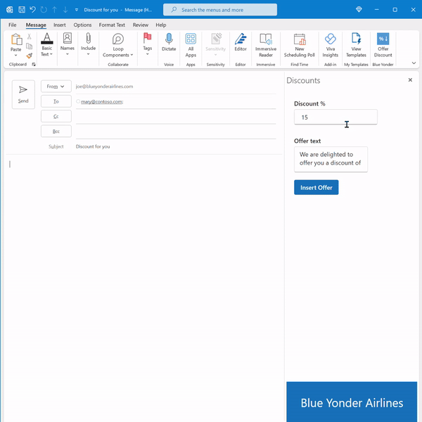
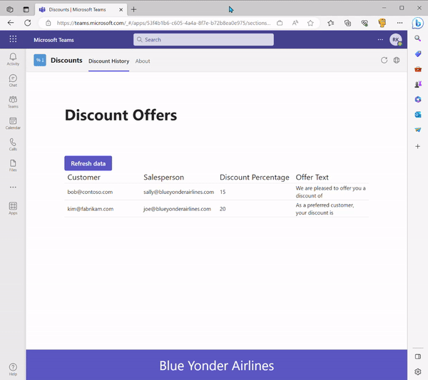
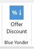
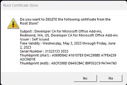
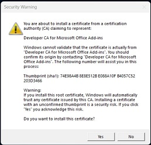
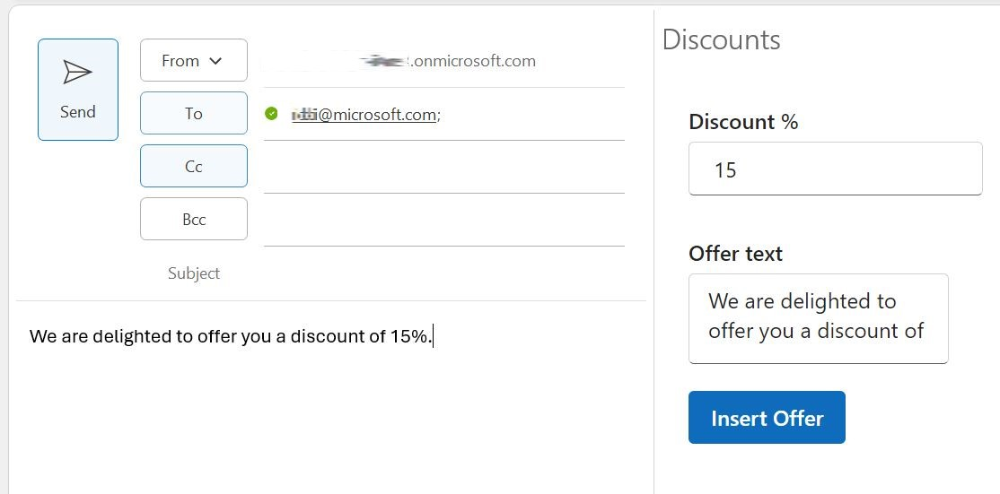

# Discount Offers

This sample combines, into a single app with a single manifest, an Outlook Add-in with a Teams Tab to make and manage discounts offers. The Outlook add-in is used to insert discount offers into e-mails. These offers are recorded in a mock customer relation management (CRM) system that is implemented with a simple JSON database. The aggregated data from the CRM is viewed in a Teams tab.

The sample illustrates a prime use case for combining a Teams Tab and an Office Add-in: Users take discrete actions on an Office document and analyze data about these discrete actions in a Teams tab.

**Note:** As of 1/13/2025, Teams apps that include an Office Add-in capability can run only on a Windows computer. You should be working on a Windows computer to run this sample.

## Included Features

- Tabs
- Office Add-ins

## Interaction with app

Interaction with the add-in:

   

Interaction with the tab:

   

## Try it yourself - experience the App in your Microsoft Teams client
Please find below demo manifest which is deployed on Microsoft Azure and you can try it yourself by uploading the app package (.zip file link below) to your teams and/or as a personal app. (Uploading must be enabled for your tenant, [see steps here](https://docs.microsoft.com/microsoftteams/platform/concepts/build-and-test/prepare-your-o365-tenant#enable-custom-teams-apps-and-turn-on-custom-app-uploading)).

**Tab-add-in-combined:** [Manifest](/samples/tab-add-in-combined/nodejs/demo-manifest/tab-add-in-combined.zip)

## Prerequisites

- [NodeJS](https://nodejs.org/en/), version 16.x.x or 18.x.x.
- [npm](https://www.npmjs.com/) (installed with NodeJS)

    **Note:** This sample was developed with NodeJS version 16.13.2 and npm version 8.1.2. It should work with most NodeJS versions in the 16.x.x, 18.x.x, 20.x.x, and 22.x.x ranges, but there are some exceptions to this. It does not work on NodeJS 16.16.0.

- [Teams](https://teams.microsoft.com) Microsoft Teams is installed and you have an account.
- [Visual Studio Code](https://code.visualstudio.com/)
- [Microsoft 365 Agents Toolkit extension for Visual Studio Code](https://learn.microsoft.com/microsoftteams/platform/toolkit/install-teams-toolkit?tabs=vscode)
- [M365 developer account](https://docs.microsoft.com/microsoftteams/platform/concepts/build-and-test/prepare-your-o365-tenant) or access to a Teams account with the appropriate permissions to install an app.
- Microsoft Office for Windows

    **Note:** The add-in capability in a Teams app is only supported on Windows computers.

- Your Microsoft 365 account has been added as an account in desktop Outlook. See [Add an email account to Outlook](https://support.microsoft.com/office/add-an-email-account-to-outlook-e9da47c4-9b89-4b49-b945-a204aeea6726)
- [Mockoon](https://mockoon.com/) or another database that can accept HTTP GET and POST requests with JSON payloads.

## Setup

2) App Registration

### Register your application with Azure AD

1. Register a new application in the [Microsoft Entra ID – App Registrations](https://go.microsoft.com/fwlink/?linkid=2083908) portal.
2. Select **New Registration** and on the *register an application page*, set following values:
    * Set **name** to your app name.
    * Choose the **supported account types** (any account type will work)
    * Leave **Redirect URI** empty.
    * Choose **Register**.
3. On the overview page, copy and save the **Application (client) ID, Directory (tenant) ID**. You'll need those later when updating your Teams application manifest and in the appsettings.json.
4. Navigate to **API Permissions**, and make sure to add the follow permissions:
    * Select Add a permission
    * Select Microsoft Graph -> Delegated permissions.
    * `User.Read` (enabled by default)
    * Click on Add permissions. Please make sure to grant the admin consent for the required permissions.

3. Setup the project.

   - Clone the repository:

    ```bash
    git clone https://github.com/OfficeDev/Microsoft-Teams-Samples.git
    ```

   - In a terminal, navigate to `samples/tab-add-in-combined/nodejs`.
   - Install modules:

    ```bash
    npm install
    ```

4. Install a mock customer relations management (CRM) system.

   - Instructions for installing and configuring a local Mockoon database are in: [Setup Mockoon Database](setup-mockoon.md).
   - If you prefer, you can use any database, either on localhost or remotely, that can (1) send a JSON payload in response to a GET request and (2) update in response to a POST request that contains a JSON payload. Read the article that is linked to in the preceding bullet to find out what CORS headers and starter data should be used. You can use any domain and port you like (except ports 3000 and 53000 which are used by other parts of the sample), but if you use anything other than `localhost:3001`, you will need to edit the calls of `fetch` in the following two files to pass the correct domain and/or port:

       - `samples/tab-add-in-combined/nodejs/add-in/src/taskpane/components/App.tsx`
       - `samples/tab-add-in-combined/nodejs/tab/src/components/App.tsx`

### Build for production

`npm run build`

## Running the sample

Be sure your mock CRM server is running.

Before running the Teams tab and Outlook add-in at the same time, it is best to run each separately so that certain "first run only" tasks are carried out.

### Run the Outlook add-in for the first time

1. Open the folder `samples/tab-add-in-combined/nodejs` in Visual Studio Code.
2. First, *make sure Outlook desktop is closed.*
3. In Visual Studio Code, open the Microsoft 365 Agents Toolkit.
4. In the **ACCOUNTS** section, verify that you're signed into Microsoft 365.
5. Select **View** | **Run** in Visual Studio Code. In the **RUN AND DEBUG** drop down menu, select the option **Launch Add-in Outlook Desktop (Edge Chromium)** and then press F5. The project builds and a Node dev-server window opens. This process may take a couple of minutes and then Outlook desktop opens.
6. You can now work with your add-in. If your Outlook application has more than one account, be sure you're working in the Inbox of your Microsoft 365 account identity.
7. Open an Outlook message compose window by either starting a new message or selecting **Reply** on a message.
8. Be sure there is an email address in the **To** and **From** lines.
9. Find the **Offer Discount** button on the ribbon and select it.

     

   If this is the first time that you've developed an Office add-in on your computer, or the first time in more than a month, you may see one or both of the following prompts. Select **Yes** for both. Doing so ensures that there is an SSL certificate for the localhost domain that hosts the add-in. You won't see these prompts again for another month.

     

     

   You will next see the following prompt. Select **OK** This prompt appears whenever the add-in is run in debugging mode.

     

   A **Discounts** task pane opens.

     

11. Optionally, edit the discount percentage and offer text. (The percentage will be appended to the end of the offer text.)
12. Click anywhere in the message body and then select the **Make Offer** button.
13. The offer text and discount percentage are entered in the email body. They are also added to a mock CRM database (see below).

     

14. To see the task pane match the current Office theme, [change the Office theme](https://support.microsoft.com/office/change-the-look-and-feel-of-microsoft-365-63e65e1c-08d4-4dea-820e-335f54672310). The following shows the task pane in the Office dark gray theme.

     

**IMPORTANT**: To end a localhost session with the add-in, open a command prompt, bash shell, or Visual Studio Code **TERMINAL**, and run the commamd `npm stop`. Closing the server window doesn't reliably stop the server and closing the Office application doesn't reliably cause Office to unacquire the add-in.

### Run the Teams tab for the first time

1. In Visual Studio Code, open the Microsoft 365 Agents Toolkit.
2. In the **ACCOUNTS** section, verify that you're signed into Microsoft 365 and that uploading is enabled.
3. Select **View** | **Run** in Visual Studio Code.
4. In the **RUN AND DEBUG** drop down menu, select the option, **Launch App Debug (Edge)**, and then press F5. The project will build and run. This process may take a couple of minutes. Eventually, Teams opens in a browser with a prompt to add the tab app.

     

5. Select **Add**
6. When the tab opens, data about discounts that have already been offered is fetched from the mock CRM database and displayed.

     ![The Discounts app open in Team, formatted with the standard Teams "light" theme. It has the app logo and name "Discounts". There are subtabs named "Discount History" and "About". The first of these is open. It has a title "Discount Offers". Below that is a button named "Refresh data". Below that is a grid with columns labelled "Customer", "Salesperson", "Discount Percentage", and "Offer Text". There are two data rows in the grid with fictional email addresses for customer and salesperson. The top row has 15 in the "Discount Percentage" column and "We are pleased to offer you a discount of" in the "Offer Text" column. The second row has 20 in the "Discount Percentage" column and "As a perferred customer, your discount is" in the "Offer Text" column. At the bottom of the tab is a footer bar containing the name "Blue Yonder Airlines".](Images/Discounts_tab.JPG)

7. If the Outlook add-in is open in Outlook desktop, create another discount in a message.
8. On the Teams tab, select the **Refresh Data** button. The new discount you created appears at the end of the grid.
9. To see the tab match the current Teams theme, [change the Teams theme](https://support.microsoft.com/office/customize-the-appearance-in-microsoft-teams-free-51f24f07-1209-4f9d-8788-c0da4d98aede). The tab appearance will automatically change to match. The following image shows the app in the Teams high contrast theme.

     ![The Discounts app open in Team, formatted with the high contrast Teams theme. It has the app logo and name "Discounts". There are subtabs named "Discount History" and "About". The first of these is open. It has a title "Discount Offers". Below that is a button named "Refresh data". Below that is a grid with columns labelled "Customer", "Salesperson", "Discount Percentage", and "Offer Text". There are two data rows in the grid with fictional email addresses for customer and salesperson. The top row has 15 in the "Discount Percentage" column and "We are pleased to offer you a discount of" in the "Offer Text" column. The second row has 20 in the "Discount Percentage" column and "As a perferred customer, your discount is" in the "Offer Text" column. At the bottom of the tab is a footer bar containing the name "Blue Yonder Airlines".](Images/Discounts_tab_high_contrast_theme.JPG)

**IMPORTANT**: To stop debugging and uninstall the app, select **Run** | **Stop Debugging** in Visual Studio Code.

### Run both the Teams tab and the Outlook add-in at the same time

1. First, *make sure Outlook desktop is closed.*
3. In Visual Studio Code, open the Microsoft 365 Agents Toolkit.
4. In the **ACCOUNTS** section, verify that you're signed into Microsoft 365.
5. Select **View** | **Run** in Visual Studio Code. In the **RUN AND DEBUG** drop down menu, select the option **Launch App and Add-in Outlook Desktop (Edge Chromium)** and then press F5. The project builds and a Node dev-server window opens to host the add-in. The tab app is hosted in the Visual Studio Code terminal. This process may take a couple of minutes. Eventually, both of the following will happen:

   - Teams opens in a browser with a prompt to add your tab app. *If Teams has not opened by the time Outlook desktop opens, then automatic uploading has failed. You can manually upload it to see both the app and the add-in running at the same time. For uploading instructions, see [Upload your app in Teams](https://learn.microsoft.com/microsoftteams/platform/concepts/deploy-and-publish/apps-upload).*
   - Outlook desktop opens.

6. In the Teams prompt, select **Add** and the tab will open.
7. In Outlook, open an Outlook message compose window by either starting a new message or selecting **Reply** on a message.
8. Be sure there is an email address in the **To** and **From** lines.
9. Find the **Offer Discount** button on the ribbon and select it. You will next see the following prompt. Select OK. This prompt appears whenever the add-in is run in debugging mode.

     

   A **Discounts** task pane opens.

10. Create another discount in a message.
11. On the Teams tab, select the **Refresh data** button. The new discount you created appears at the end of the grid.

## Further Reading

- [Extend Teams apps across Microsoft 365](https://learn.microsoft.com/microsoftteams/platform/m365-apps/overview)
- [Tabs](https://learn.microsoft.com/microsoftteams/platform/tabs/what-are-tabs)


