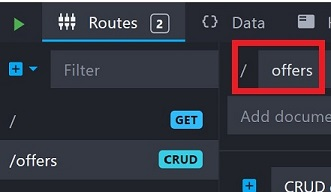

# Setup a mock CRM system with Mockoon

**Note**: If you are not using Mockoon for your mock CRM, see step 7 for information about starter data and step 8 for information about the CORS headers that you need to enable on your mock service.

1. Install Mockoon from [Download Mockoon](https://mockoon.com/download/). There are versions for various operating systems, but as of 5/29/2023, this sample only works on Windows so you need to be working on a Windows computer.
2. Open Mockoon and select the **New environment** button.

   

3. In the navigation dialog that opens, accept the default path and specify `mock-crm.json` as the file name.

   

4. In the Mocktoon app, make sure the **Mock crm** environment is selected, click the **Routes** drop down and then select **CRUD route**.

   

5. Make sure the new CRUD route is selected and type "offers" in the path box.

   

6. Select the **Data** and when it opens click the **Add data** button. Set the databucket name to "Offers".
7. Paste the following JSON data into the large text area. This starter data represents two customers who have been offered discounts in Outlook email messages.

   ```json
   [
      {
        "id": "fe8cae38-278b-4b56-a8b8-e5a58e565436",
        "customer" : "bob@contoso.com",
        "salesperson": "sally@blueyonderairlines.com",
        "discountPercentage": 15,
        "offerText": "We are pleased to offer you a discount of "
      },
      {
        "id": "d6d0fc50-4715-4fdf-82f2-4bf90d6320c4",
        "customer" : "kim@fabrikam.com",
        "salesperson": "joe@blueyonderairlines.com",
        "discountPercentage": 20,
        "offerText": "As a preferred customer, your discount is "
      }
   ]
   ```

   

8. Select the **Headers** tab, and then click **add CORS headers**. When the process completes, the **Headers** tab should look like the following:

   

9. Select the **Routes** tab again. In the lower right pane of the tab, select the subtab **Data**. In the **Select a databucket ...** drop down, select **Offers**.

   

10. The mock database server is now configured. When you are ready to use the sample application, click the green **Start server** arrowhead button to the left of the **Routes** tab. The button becomes a red square which indicates that the server is running. To stop the server, click the red square **Stop server** button.

       

**Note**: When you add data to the databucket with POST requests, the data is added to only an in memory copy of the data. When you stop the server, this added data is lost and the database has only the starter data that you added in step 7.
