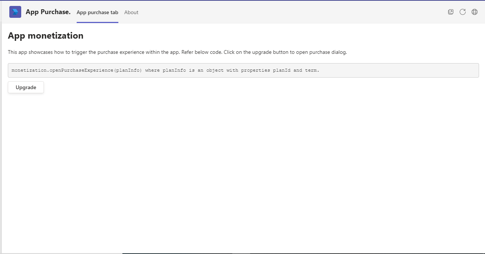
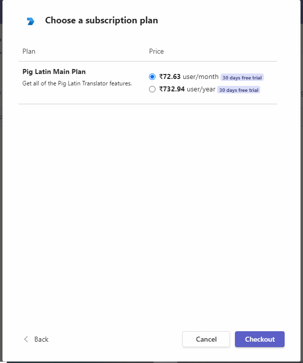

# App monetization in tab

This sample shows how to open purchase dialog and trigger purchase flow using teams-js sdk.





## Prerequisites

- [NodeJS](https://nodejs.org/en/)
- [ngrok](https://ngrok.com/) or equivalent tunnelling solution
- [Teams](https://teams.microsoft.com) Microsoft Teams is installed and you have an account
- [Publish an offer to marketplace](https://docs.microsoft.com/en-us/microsoftteams/platform/concepts/deploy-and-publish/appsource/prepare/include-saas-offer)


## To try this sample

1) Register a SAAS offer in market place and generate an plan id for it [Create SAAS Offer](https://docs.microsoft.com/en-us/microsoftteams/platform/concepts/deploy-and-publish/appsource/prepare/include-saas-offer)

2) Clone the repository
   ```bash
   git clone https://github.com/OfficeDev/Microsoft-Teams-Samples.git
   ```
3) Install node modules

   Inside node js folder,  navigate to `samples/tab-app-monetization/nodejs/ClientApp` open your local terminal and run the below command to install node modules. You can do the same in Visual Studio code terminal by opening the project in Visual Studio code.

    ```bash
    npm install

4) Run the solution from the same path terminal using below command.

    ```
    npm start
    ```
5) Modify the `manifest.json` in the `/AppPackage` folder and replace the following details
   - `{{Manifest-id}}` with some unique GUID.
   - `{{Domain Name}}` with your application's base url, e.g. https://1234.ngrok.io
   - `{{Plan-id}}` with plan id generated in step 1.

6) Zip the contents of `AppPackage` folder into a `manifest.zip`, and use the `manifest.zip` to deploy in app store or add to Teams.
    
7) Upload the manifest.zip to Teams (in the Apps view click "Upload a custom app")
   - Go to Microsoft Teams. From the lower left corner, select Apps
   - From the lower left corner, choose Apps -> Manage your apps -> Upload an app.
   - Go to your project directory, the ./AppPackage folder, select the zip folder, and choose Open.
   - Select Add in the pop-up dialog box. Your app is uploaded to Teams.
   
8) Add the tab in personal scope.

## Features of the sample

- Add the tab in personal scope.
- On click of upgrade button will trigger the purchase flow.

## Further reading

- [Tab Basics](https://docs.microsoft.com/en-us/microsoftteams/platform/tabs/how-to/create-channel-group-tab?pivots=node-java-script)
- [Azure Portal](https://portal.azure.com)
- [Inapp Purchases](https://docs.microsoft.com/en-us/microsoftteams/platform/concepts/deploy-and-publish/appsource/prepare/in-app-purchase-flow)
