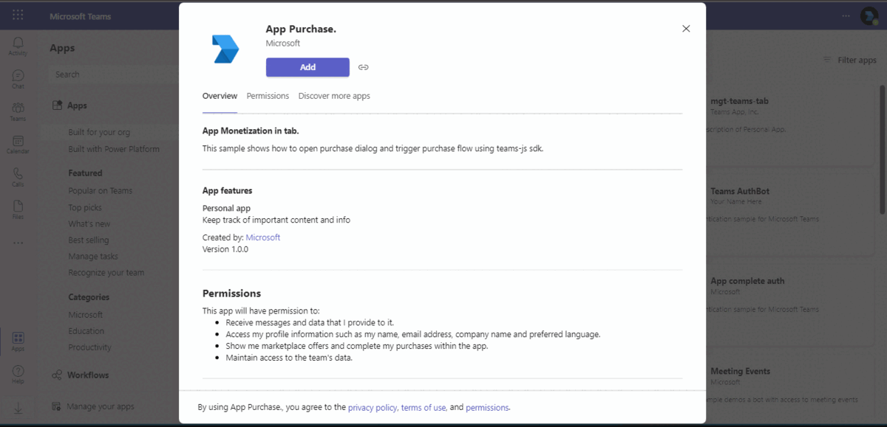

# App monetization in tab

Explore a sample Teams tab application that illustrates how to implement app monetization by opening a purchase dialog and initiating a purchase flow using the Teams JS SDK. This solution provides a clear example of integrating monetization capabilities directly into your Teams applications, enhancing user engagement and revenue opportunities.

## Included Features
* Tabs
* App Monetization

## Interaction with tab


## Try it yourself - experience the App in your Microsoft Teams client
Please find below demo manifest which is deployed on Microsoft Azure and you can try it yourself by uploading the app package (.zip file link below) to your teams and/or as a personal app. (Uploading must be enabled for your tenant, [see steps here](https://docs.microsoft.com/microsoftteams/platform/concepts/build-and-test/prepare-your-o365-tenant#enable-custom-teams-apps-and-turn-on-custom-app-uploading)).

**App monetization in tab:** [Manifest](/samples/tab-app-monetization/nodejs/demo-manifest/tab-app-monetization.zip)

## Prerequisites

- [NodeJS](https://nodejs.org/en/)
- [dev tunnel](https://learn.microsoft.com/en-us/azure/developer/dev-tunnels/get-started?tabs=windows) or [ngrok](https://ngrok.com/) latest version or equivalent tunnelling solution
- [Teams](https://teams.microsoft.com) Microsoft Teams is installed and you have an account
- [Publish an offer to marketplace](https://docs.microsoft.com/microsoftteams/platform/concepts/deploy-and-publish/appsource/prepare/include-saas-offer)
- [Microsoft 365 Agents Toolkit for VS Code](https://marketplace.visualstudio.com/items?itemName=TeamsDevApp.ms-teams-vscode-extension) or [TeamsFx CLI](https://learn.microsoft.com/microsoftteams/platform/toolkit/teamsfx-cli?pivots=version-one)


## Run the app (Using Microsoft 365 Agents Toolkit for Visual Studio Code)

The simplest way to run this sample in Teams is to use Microsoft 365 Agents Toolkit for Visual Studio Code.

1. Ensure you have downloaded and installed [Visual Studio Code](https://code.visualstudio.com/docs/setup/setup-overview)
1. Install the [Microsoft 365 Agents Toolkit extension](https://marketplace.visualstudio.com/items?itemName=TeamsDevApp.ms-teams-vscode-extension)
1. Select **File > Open Folder** in VS Code and choose this samples directory from the repo
1. Using the extension, sign in with your Microsoft 365 account where you have permissions to upload custom apps
1. Select **Debug > Start Debugging** or **F5** to run the app in a Teams web client.
1. In the browser that launches, select the **Add** button to install the app to Teams.


2) App Registration

### Register your application with Azure AD

1. Register a new application in the [Microsoft Entra ID – App Registrations](https://go.microsoft.com/fwlink/?linkid=2083908) portal.
2. Select **New Registration** and on the *register an application page*, set following values:
   * Set **name** to your app name.
   * Choose the **supported account types** (any account type will work)
   * Leave **Redirect URI** empty.
   * Choose **Register**.
3. On the overview page, copy and save the **Application (client) ID, Directory (tenant) ID**. You'll need those later when updating your Teams application manifest and in the appsettings.json.
4. Navigate to **API Permissions**, and make sure to add the follow permissions:
   * Select Add a permission
   * Select Microsoft Graph -> Delegated permissions.
   * `User.Read` (enabled by default)
   * Click on Add permissions. Please make sure to grant the admin consent for the required permissions.

## 2) Setup for SAAS offer
1) Register a SAAS offer in market place and generate an plan id for it [Create SAAS Offer](https://docs.microsoft.com/microsoftteams/platform/concepts/deploy-and-publish/appsource/prepare/include-saas-offer)

###  3) Setup NGROK
1) Run ngrok - point to port 3978

   ```bash
   ngrok http 3978 --host-header="localhost:3978"
   ```  

   Alternatively, you can also use the `dev tunnels`. Please follow [Create and host a dev tunnel](https://learn.microsoft.com/en-us/azure/developer/dev-tunnels/get-started?tabs=windows) and host the tunnel with anonymous user access command as shown below:

   ```bash
   devtunnel host -p 3978 --allow-anonymous
   ```

## 4) Setup for code
1) Clone the repository
   ```bash
   git clone https://github.com/OfficeDev/Microsoft-Teams-Samples.git
   ```
2) Install node modules

   Inside node js folder,  navigate to `samples/tab-app-monetization/nodejs/ClientApp` open your local terminal and run the below command to install node modules. You can do the same in Visual Studio code terminal by opening the project in Visual Studio code.

    ```bash
    npm install
    ```
   **_Note_** - Navigate to `samples/tab-app-monetization/nodejs/ClientApp/src/components/tab.tsx` and update the planId and term on line 14 and 15 with plan details created in step 2

3) Run the solution from the same path terminal using below command.

    ```
    npm start
    ```

###  5) Setup Manifest for Teams
1. Modify the `manifest.json` in the `/appManifest` folder and replace the following details
   - `{{App-id}}` with your application id created in step 1.
   - `{{Domain-Name}}` with your application's base url domain, e.g. For https://1234.ngrok-free.app the Domain Name will be 1234.ngrok-free.app and if you are using dev tunnels then your domain will be `12345.devtunnels.ms`.
   - `{{Plan-id}}` with plan id generated in step 2.

2. Zip the contents of `appManifest` folder into a `manifest.zip`, and use the `manifest.zip` to deploy in app store or add to Teams.
    
3. Upload the manifest.zip to Teams (in the Apps view click "Upload a custom app")
   - Go to Microsoft Teams. From the lower left corner, select Apps
   - From the lower left corner, choose Apps -> Manage your apps -> Upload an app.
   - Go to your project directory, the ./appManifest folder, select the zip folder, and choose Open.
   - Select Add in the pop-up dialog box. Your app is uploaded to Teams.
   
4. Add the tab in personal scope.

## 6) Features of the sample

- Add the tab in personal scope.


- On click of upgrade button will trigger the purchase flow.


## Further reading

- [Inapp Purchases](https://docs.microsoft.com/microsoftteams/platform/concepts/deploy-and-publish/appsource/prepare/in-app-purchase-flow)
- [Tab Basics](https://docs.microsoft.com/microsoftteams/platform/tabs/how-to/create-channel-group-tab?pivots=node-java-script)
- [Azure Portal](https://portal.azure.com)

