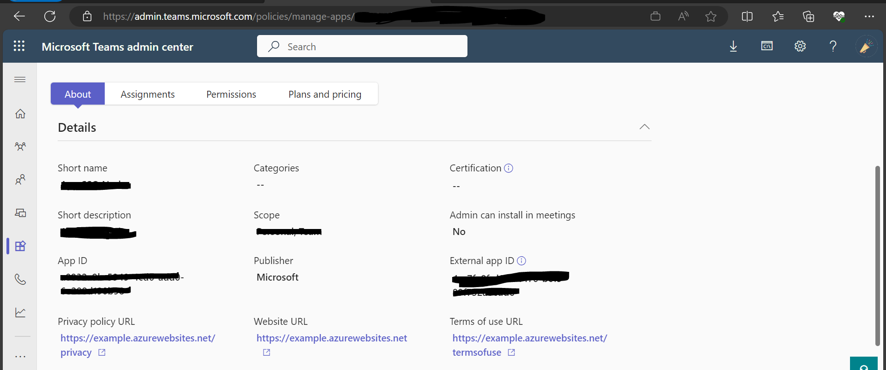
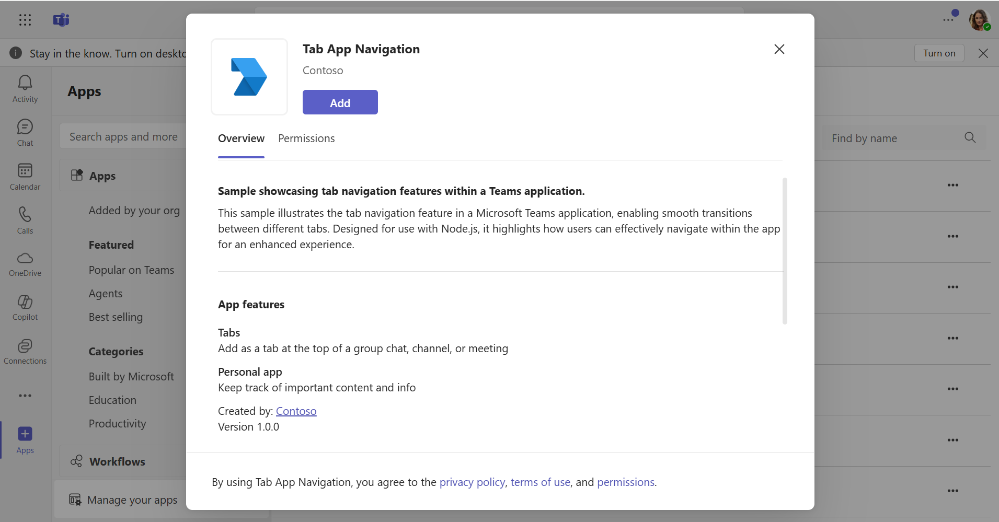
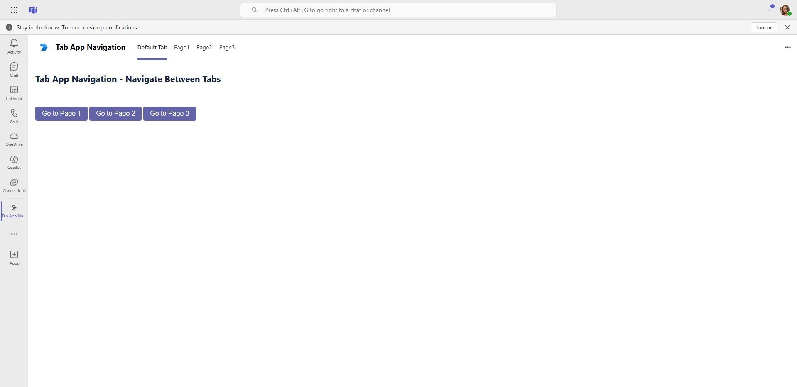
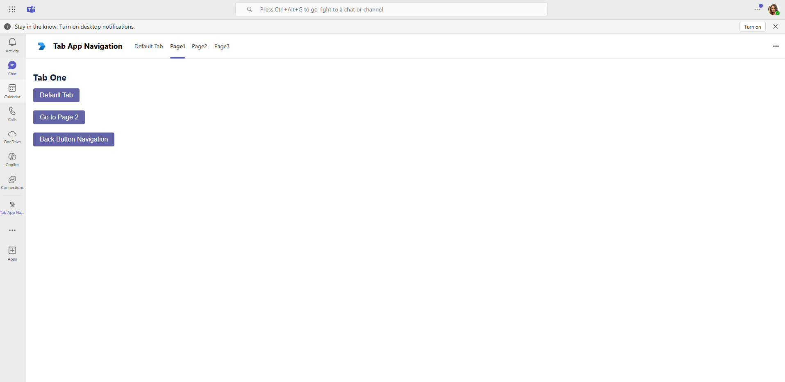
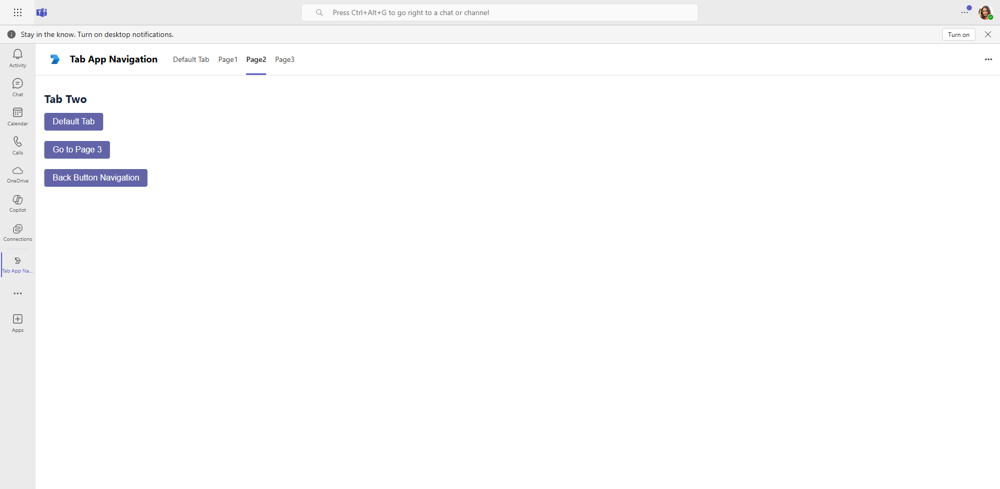
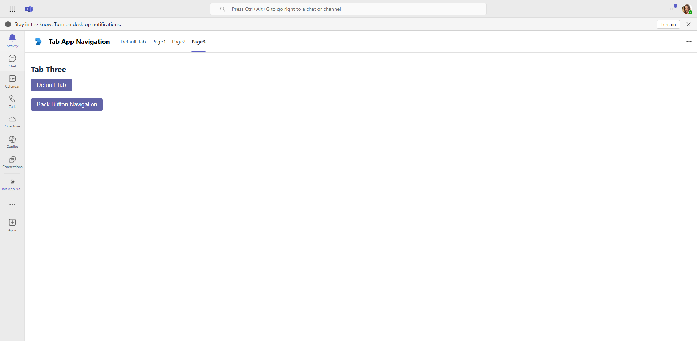

## Tab App Navigation

Explore a sample Microsoft Teams application that showcases tab navigation capabilities using C#/.NET, allowing users to seamlessly move between various tabs within the app. Built with .NET, this example provides insights into creating intuitive navigation flows that enhance user engagement and improve overall app functionality.

## Included Features
* Tab Navigation


**Interaction with App**


## Prerequisites
- Microsoft Teams is installed and you have an account (not a guest account)
- [.NET Core SDK](https://dotnet.microsoft.com/download) version 6.0

  ```bash
  # determine dotnet version
  dotnet --version
  ```
- [dev tunnel](https://learn.microsoft.com/en-us/azure/developer/dev-tunnels/get-started?tabs=windows) or [ngrok](https://ngrok.com/) latest version or equivalent tunneling solution
- [M365 developer account](https://docs.microsoft.com/microsoftteams/platform/concepts/build-and-test/prepare-your-o365-tenant) or access to a Teams account with the appropriate permissions for uploading custom apps
- [Microsoft 365 Agents Toolkit for Visual Studio](https://learn.microsoft.com/en-us/microsoftteams/platform/toolkit/toolkit-v4/install-teams-toolkit-vs?pivots=visual-studio-v17-7)

- **Note** This feature `(Tab App Navigation)` is only supported in new Teams `T2.1`.

## Run the app (Using Microsoft 365 Agents Toolkit for Visual Studio)

The simplest way to run this sample in Teams is to use Microsoft 365 Agents Toolkit for Visual Studio.
1. Install Visual Studio 2022 **Version 17.14 or higher** [Visual Studio](https://visualstudio.microsoft.com/downloads/)
1. Install Microsoft 365 Agents Toolkit for Visual Studio [Microsoft 365 Agents Toolkit extension](https://learn.microsoft.com/en-us/microsoftteams/platform/toolkit/toolkit-v4/install-teams-toolkit-vs?pivots=visual-studio-v17-7)
1. **Update Placeholder For External App ID**
    - Get the external app id from teams admin portal.(https://admin.teams.microsoft.com/policies/manage-apps)
    - Navigate to the appropriate C# file in your project where the external app id is referenced and replace placeholder `<<External-App-Id>>` with your actual external app id which you can get from teams admin portal.

    

1. In the debug dropdown menu of Visual Studio, select Dev Tunnels > Create A Tunnel (set authentication type to Public) or select an existing public dev tunnel.
1. Right-click the 'M365Agent' project in Solution Explorer and select **Microsoft 365 Agents Toolkit > Select Microsoft 365 Account**
1. Sign in to Microsoft 365 Agents Toolkit with a **Microsoft 365 work or school account**
1. Set `Startup Item` as `Microsoft Teams (browser)`.
1. Press F5, or select Debug > Start Debugging menu in Visual Studio to start your app
</br>
1. In the opened web browser, select Add button to install the app in Teams
> If you do not have permission to upload custom apps (uploading), Microsoft 365 Agents Toolkit will recommend creating and using a Microsoft 365 Developer Program account - a free program to get your own dev environment sandbox that includes Teams.

### Setup
> Note these instructions are for running the sample on your local machine.

1) Register a new application in the [Microsoft Entra ID – App Registrations](https://go.microsoft.com/fwlink/?linkid=2083908) portal.
**NOTE:** When you create app registration, you will create an App ID and App password - make sure you keep these for later.

2) Setup NGROK
 - Run ngrok - point to port 5000

    ```bash
    ngrok http 5000 --host-header="localhost:5000"
    ```
   Alternatively, you can also use the `dev tunnels`. Please follow [Create and host a dev tunnel](https://learn.microsoft.com/en-us/azure/developer/dev-tunnels/get-started?tabs=windows) and host the tunnel with anonymous user access command as shown below:

   ```bash
   devtunnel host -p 5000 --allow-anonymous
   ```

3) Setup for code
- Clone the repository

    ```bash
    git clone https://github.com/OfficeDev/Microsoft-Teams-Samples.git
    ```
- In a terminal, navigate to `samples/tab-app-navigation/csharp`

- **Update Placeholder For External App ID**
    - Get the external app id from teams admin portal (https://admin.teams.microsoft.com/policies/manage-apps)
    - Navigate to the appropriate C# file in your project where the external app id is referenced and replace placeholder `<<External-App-Id>>` with your actual external app id which you can get from teams admin portal.

- Modify the `/appsettings.json` and fill in the following details:
  - `{{Microsoft-App-Id}}` - Generated from Step 1 is the application app id
  - `{{ Microsoft-App-Password}}` - Generated from Step 1, also referred to as Client secret
  - `{{ Application Base Url }}` - Your application's base url. E.g. https://12345.ngrok-free.app if you are using ngrok and if you are using dev tunnels, your URL will be https://12345.devtunnels.ms.

- Run the app from a terminal or from Visual Studio:

  i- From a terminal, navigate to `Microsoft.Teams.Samples.TabAppNavigation.Web`

  ```bash
  # run the app
  dotnet run
  ```

  ii- Or from Visual Studio

  - Launch Visual Studio
  - File -> Open -> Project/Solution
  - Navigate to `Microsoft.Teams.Samples.TabAppNavigation.Web` folder
  - Select `Microsoft.Teams.Samples.TabAppNavigation.Web.csproj` file
  - Press `F5` to run the project   

4) __*This step is specific to Teams.*__
    - **Edit** the `manifest.json` contained in the  `appManifest` folder to replace your `{{Microsoft-App-Id}}` (that was created in step1 and is the same value of MicrosoftAppId) *everywhere* you see the place holder string `{{Microsoft-App-Id}}` (depending on the scenario the Microsoft App Id may occur multiple times in the `manifest.json`)
    - **Edit** the `manifest.json` for `validDomains` and replace `{{domain-name}}` with base Url of your domain. E.g. if you are using ngrok it would be `https://1234.ngrok-free.app` then your domain-name will be `1234.ngrok-free.app` and if you are using dev tunnels then your domain will be like: `12345.devtunnels.ms`.
    - **Zip** up the contents of the `appManifest` folder to create a `manifest.zip` (Make sure that zip file does not contains any subfolder otherwise you will get error while uploading your .zip package)
    - **Upload** the `manifest.zip` to Teams (In Teams Apps/Manage your apps click "Upload an app". Browse to and Open the .zip file. At the next dialog, click the Add button.)
    - Upload the app in `Teams Scope` (Supported scopes: Teams)

  **Note:** If you want to test your app across multi hub like: Outlook/Office.com, please update the `manifest.json` in the `/AppManifest_Hub` folder with the required values.

## Deploy to Teams
Start debugging the project by hitting the `F5` key or click the debug icon in Visual Studio and click the `Start Debugging` green arrow button.

### NOTE: First time debug step
On the first time running and debugging your app you need allow the localhost certificate. After starting debugging when the browser is launched and you have installed your app it will fail to load.

- Open a new tab `in the same browser window that was opened`
- Navigate to `https://localhost:5000/tab` (or your configured port)
- Click the `Advanced` button
- Select the `Continue to localhost`

### NOTE: Debugging
Ensure you have the appropriate debugging tools configured in Visual Studio for .NET development.

## Running the sample

**Add Application To Teams**


**Tab Default To Navigate**


**Navigated Within Apps** 


**Navigated Within Apps** 


**Navigated Within Apps** 



## Deploy the app to Azure

To learn more about deploying an app to Azure, see [Deploy your app to Azure](https://aka.ms/azuredeployment) for a complete list of deployment instructions.

## Further reading

- [Navigate within a tab app](https://learn.microsoft.com/en-us/microsoftteams/platform/tabs/how-to/tab-navigation#navigate-between-tabs)
- [Extend Teams apps across Microsoft 365](https://learn.microsoft.com/en-us/microsoftteams/platform/m365-apps/overview)

