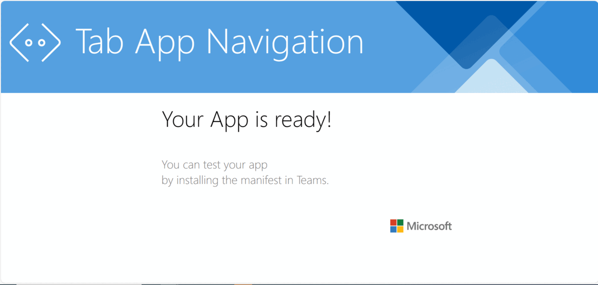
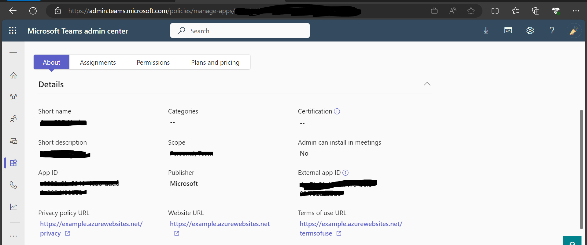
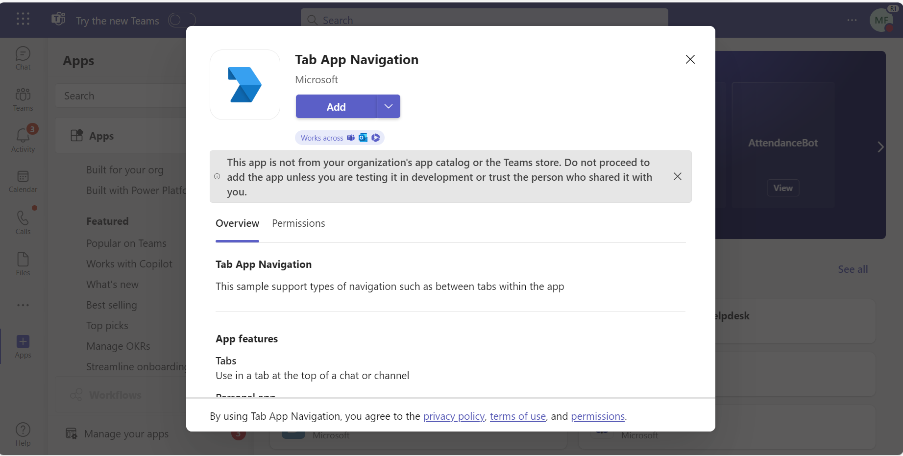
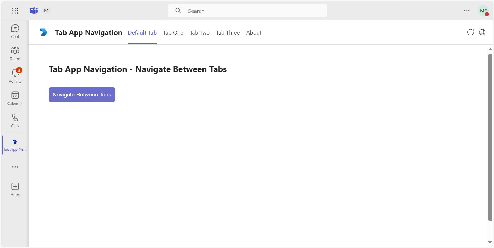
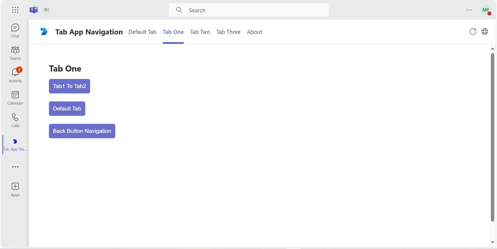
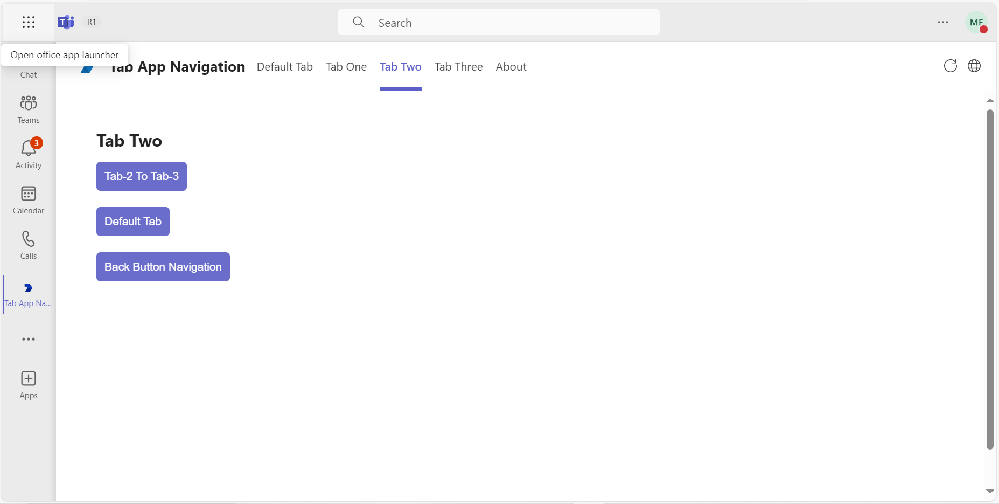
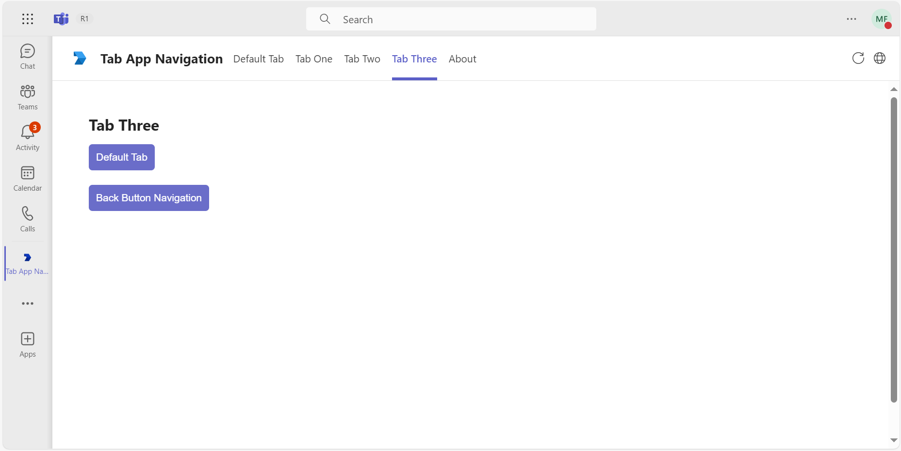

## Tab App Navigation

Explore a sample Microsoft Teams application that showcases tab navigation capabilities, allowing users to seamlessly move between various tabs within the app. Built with Node.js, this example provides insights into creating intuitive navigation flows that enhance user engagement and improve overall app functionality.

**Interaction with App**
  
 
## Prerequisites

- [NodeJS](https://nodejs.org/en/)
- [ngrok](https://ngrok.com/) or equivalent tunnelling solution
- [Microsoft 365 Agents Toolkit for VS Code](https://marketplace.visualstudio.com/items?itemName=TeamsDevApp.ms-teams-vscode-extension) or [TeamsFx CLI](https://learn.microsoft.com/microsoftteams/platform/toolkit/teamsfx-cli?pivots=version-one)

- **Note**  This feature `(Tab App Navigation)` is only supported in new Teams `T2.1`.

## Run the app (Using Microsoft 365 Agents Toolkit for Visual Studio Code)

The simplest way to run this sample in Teams is to use Microsoft 365 Agents Toolkit for Visual Studio Code.

1. Ensure you have downloaded and installed [Visual Studio Code](https://code.visualstudio.com/docs/setup/setup-overview)
1. Install the [Microsoft 365 Agents Toolkit extension](https://marketplace.visualstudio.com/items?itemName=TeamsDevApp.ms-teams-vscode-extension)
1. Select **File > Open Folder** in VS Code and choose this samples directory from the repo.
2. **Update Placeholder For External App ID**
    - Get the external app id from teams admin portal.(https://admin.teams.microsoft.com/policies/manage-apps)
    - Navigate to `src/components/tabAppNavigation.tsx` file at line number `13` replace placeholder `<<External-App-Id>>` with your actual external app id which you can get from teams admin portal.

1. Using the extension, sign in with your Microsoft 365 account where you have permissions to upload custom apps
1. Select **Debug > Start Debugging** or **F5** to run the app in a Teams web client.
1. In the browser that launches, select the **Add** button to install the app to Teams.

> If you do not have permission to upload custom apps (uploading), Microsoft 365 Agents Toolkit will recommend creating and using a Microsoft 365 Developer Program account - a free program to get your own dev environment sandbox that includes Teams.

### Setup 
> Note these instructions are for running the sample on your local machine.

1) Run ngrok - point to port 3978

    ```bash
    ngrok http 3978 --host-header="localhost:3978"
    ```
    
  Alternatively, you can also use the `dev tunnels`. Please follow [Create and host a dev tunnel](https://learn.microsoft.com/en-us/azure/developer/dev-tunnels/get-started?tabs=windows) and host the tunnel with anonymous user access command as shown below:

   ```bash
   devtunnel host -p 3978 --allow-anonymous
   ```

2) App Registration

### Register your application with Azure AD

1. Register a new application in the [Microsoft Entra ID – App Registrations](https://go.microsoft.com/fwlink/?linkid=2083908) portal.
2. Select **New Registration** and on the *register an application page*, set following values:
    * Set **name** to your app name.
    * Choose the **supported account types** (any account type will work)
    * Leave **Redirect URI** empty.
    * Choose **Register**.
3. On the overview page, copy and save the **Application (client) ID, Directory (tenant) ID**. You'll need those later when updating your Teams application manifest and in the appsettings.json.
4. Navigate to **API Permissions**, and make sure to add the follow permissions:
    * Select Add a permission
    * Select Microsoft Graph -> Delegated permissions.
    * `User.Read` (enabled by default)
    * Click on Add permissions. Please make sure to grant the admin consent for the required permissions.

3) Clone the repository

    ```bash
    git clone https://github.com/OfficeDev/Microsoft-Teams-Samples.git
    ```

   **Open your project in Visual Studio Code (Optional Step)**

    - Launch Visual Studio code
    - File -> Open Folder
    - Navigate to `samples/tab-app-navigation` folder
    - Select `nodejs` folder and open it

   Install node modules (Either open any local terminal inside your `nodejs` folder or open Visual Studio Code terminal by opening the project in Visual Studio Code)

    ```bash
    npm install
    ```
    **Update Placeholder For External App ID**
    - Get the external app id from teams admin portal (https://admin.teams.microsoft.com/policies/manage-apps)
    - Navigate to 'src/components/tabAppNavigation.tsx file at line number `13` replace placeholder `<<External-App-Id>>` with your     actual external app id which you can get from teams admin portal.

    
  

3) Run your app (Either from any local terminal or from Visual Studio Code terminal)

    ```bash
    npm start
    ```

    - Your App will start running on 3978 PORT.

4) __*This step is specific to Teams.*__
    - **Edit** the `manifest.json` contained in the  `appManifest` folder to replace your `<<TEAMS_APP_ID>>`, You can use any GUID Id in place of `<<TEAMS_APP_ID>>` or [Generate Guid](https://guidgenerator.com/)
    - **Edit** the `manifest.json` for `<<TAB_DOMAIN>>` with base Url domain. E.g. if you are using ngrok it would be `https://1234.ngrok-free.app` then your domain-name will be `1234.ngrok-free.app`. Replace it at all the places in your manifest.json.
    - **Zip** up the contents of the `appManifest` folder to create a `manifest.zip` (Make sure that zip file does not contains any subfolder otherwise you will get error while uploading your .zip package)
    - **Upload** the `manifest.zip` to Teams (In Teams Apps/Manage your apps click "Upload an app". Browse to and Open the .zip file. At the next dialog, click the Add button.)
    - Upload the app in `Teams Scope` (Supported scopes: Teams)
     
## Running the sample

**Add Application To Teams**


**Tab Default To Navigate**


**Navigated With-in Apps** 


**Navigated With-in Apps** 


**Navigated With-in Apps** 



## Further reading
[Navigate within a tab app](https://learn.microsoft.com/en-us/microsoftteams/platform/tabs/how-to/tab-navigation#navigate-between-tabs)


