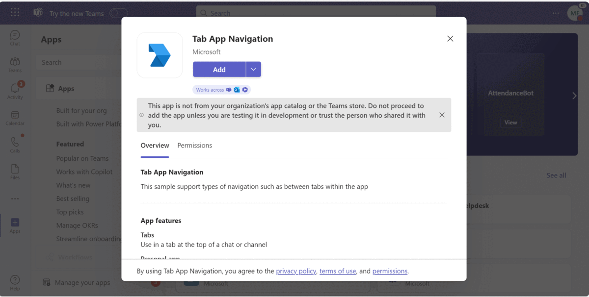

## Tab App Navigation

This sample support types of navigation such as between tabs within the app.

**Interaction with App**
  
 
## Prerequisites

- [NodeJS](https://nodejs.org/en/)
- [ngrok](https://ngrok.com/) or equivalent tunnelling solution
- [Teams Toolkit for VS Code](https://marketplace.visualstudio.com/items?itemName=TeamsDevApp.ms-teams-vscode-extension) or [TeamsFx CLI](https://learn.microsoft.com/microsoftteams/platform/toolkit/teamsfx-cli?pivots=version-one)

## Run the app (Using Teams Toolkit for Visual Studio Code)

The simplest way to run this sample in Teams is to use Teams Toolkit for Visual Studio Code.

1. Ensure you have downloaded and installed [Visual Studio Code](https://code.visualstudio.com/docs/setup/setup-overview)
1. Install the [Teams Toolkit extension](https://marketplace.visualstudio.com/items?itemName=TeamsDevApp.ms-teams-vscode-extension)
1. Select **File > Open Folder** in VS Code and choose this samples directory from the repo
1. Using the extension, sign in with your Microsoft 365 account where you have permissions to upload custom apps
1. Select **Debug > Start Debugging** or **F5** to run the app in a Teams web client.
1. In the browser that launches, select the **Add** button to install the app to Teams.

> If you do not have permission to upload custom apps (sideloading), Teams Toolkit will recommend creating and using a Microsoft 365 Developer Program account - a free program to get your own dev environment sandbox that includes Teams.

### Setup 
> Note these instructions are for running the sample on your local machine.

1) Run ngrok - point to port 3978

    ```bash
    ngrok http 3978 --host-header="localhost:3978"
    ```

2) Clone the repository

    ```bash
    git clone https://github.com/OfficeDev/Microsoft-Teams-Samples.git
    ```

   **Open your project in Visual Studio Code (Optional Step)**

    - Launch Visual Studio code
    - File -> Open Folder
    - Navigate to `samples/tab-app-navigation` folder
    - Select `nodejs` folder and open it

   Install node modules (Either open any local terminal inside your `nodejs` folder or open Visual Studio Code terminal by opening the project in Visual Studio Code)

    ```bash
    npm install
    ```

3) Run your app (Either from any local terminal or from Visual Studio Code terminal)

    ```bash
    npm start
    ```

    - Your App will start running on 3978 PORT.

4) __*This step is specific to Teams.*__
    - **Edit** the `manifest.json` contained in the  `appPackage` folder to replace your `<<MANIFEST-ID>>`, You can use any GUID Id in place of `<<Manifest-ID>>` or [Generate Guid](https://guidgenerator.com/)
    - **Edit** the `manifest.json` for `<<Valid_Domain>>` with base Url domain. E.g. if you are using ngrok it would be `https://1234.ngrok-free.app` then your domain-name will be `1234.ngrok-free.app`. Replace it at all the places in your manifest.json.
    - **Zip** up the contents of the `appPackage` folder to create a `manifest.zip` (Make sure that zip file does not contains any subfolder otherwise you will get error while uploading your .zip package)
    - **Upload** the `manifest.zip` to Teams (In Teams Apps/Manage your apps click "Upload an app". Browse to and Open the .zip file. At the next dialog, click the Add button.)
    - Sideload the app In meetings (Supported scopes)
     
## Running the sample

**Add the App in Teams**.


**Tab Menu To Navigate:**


**Navigated To Personal Tab App:** 


**Return to focus forward highlights the search bar:** 


**Return to focus backwards highlights the app bar :** 


**Back Button Navigation :** 


## Further reading
[Navigate within a tab app](https://learn.microsoft.com/en-us/microsoftteams/platform/tabs/how-to/tab-navigation#navigate-between-tabs)


