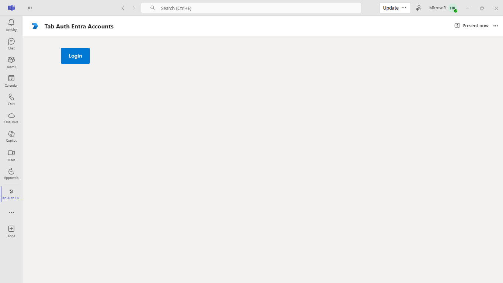

# Sign in using a different Microsoft Entra account - C#

This Microsoft Teams sample app illustrates how to integrate Microsoft Entra ID (Azure AD) authentication in a Teams tab. It enables users to sign in and switch between different Entra accounts, providing secure and flexible access. The sample showcases best practices for implementing authentication and account switching in Teams tab applications.

## Included Features
* External Auth
* Tabs

## Interaction with app


- [.NET Core SDK](https://dotnet.microsoft.com/download) version 6.0

  determine dotnet version
  ```bash
  dotnet --version
  ```
- [dev tunnel](https://learn.microsoft.com/en-us/azure/developer/dev-tunnels/get-started?tabs=windows) or [Ngrok](https://ngrok.com/download) (For local environment testing) latest version (any other tunneling software can also be used)
  
- [Teams](https://teams.microsoft.com) Microsoft Teams is installed and you have an account

- [Microsoft 365 Agents Toolkit for Visual Studio](https://learn.microsoft.com/en-us/microsoftteams/platform/toolkit/toolkit-v4/install-teams-toolkit-vs?pivots=visual-studio-v17-7)

## Run the app (Using Microsoft 365 Agents Toolkit for Visual Studio)

The simplest way to run this sample in Teams is to use Microsoft 365 Agents Toolkit for Visual Studio.
1. Install Visual Studio 2022 **Version 17.14 or higher** [Visual Studio](https://visualstudio.microsoft.com/downloads/)
1. Install Microsoft 365 Agents Toolkit for Visual Studio [Microsoft 365 Agents Toolkit extension](https://learn.microsoft.com/en-us/microsoftteams/platform/toolkit/toolkit-v4/install-teams-toolkit-vs?pivots=visual-studio-v17-7)
1. In the debug dropdown menu of Visual Studio, select Dev Tunnels > Create A Tunnel (set authentication type to Public) or select an existing public dev tunnel.
1. Right-click the 'M365Agent' project in Solution Explorer and select **Microsoft 365 Agents Toolkit > Select Microsoft 365 Account**
1. Sign in to Microsoft 365 Agents Toolkit with a **Microsoft 365 work or school account**
1. Set `Startup Item` as `Microsoft Teams (browser)`.
1. Press F5, or select Debug > Start Debugging menu in Visual Studio to start your app
</br>
1. In the opened web browser, select Add button to install the app in Teams
> If you do not have permission to upload custom apps (uploading), Microsoft 365 Agents Toolkit will recommend creating and using a Microsoft 365 Developer Program account - a free program to get your own dev environment sandbox that includes Teams.

## Setup
1. Register a new application in the [Microsoft Entra ID – App Registrations](https://go.microsoft.com/fwlink/?linkid=2083908) portal.

  - Select **New Registration** and on the *register an application page*, set following values:
     * Set **name** to your app name.
     * Choose the **supported account types** (any account type will work)
     * Leave **Redirect URI** empty.
     * Choose **Register**.
  - On the overview page, copy and save the **Application (client) ID, Directory (tenant) ID**. You’ll need those later when updating your Teams application manifest and in the appsettings.json.
  - Navigate to **Authentication**
    If an app hasn't been granted IT admin consent, users will have to provide consent the first time they use an app.
    Set a redirect URI:
    * Select **Add a platform**.
    * Select **web**.
    * Enter the **redirect URI** for the app in the following format: 
         * https://<your_tunnel_domain>/Auth/AuthEnd, 
         * https://<your_tunnel_domain>/Auth/AuthStart. 
      This will be the page where a successful implicit grant flow will redirect the user.
    Enable implicit grant by checking the following boxes:  
    ✔ ID Token  
    ✔ Access Token  
  - Navigate to the **Certificates & secrets**. In the Client secrets section, click on "+ New client secret". Add a description      (Name of the secret) for the secret and select “Never” for Expires. Click "Add". Once the client secret is created, copy its value, it need to be placed in the appsettings.json.

2. Setup NGROK
- Run ngrok - point to port 3978

```bash
   ngrok http 3978 --host-header="localhost:3978"
   ```  

   Alternatively, you can also use the `dev tunnel`. Please follow [Create and host a Dev tunnel](https://learn.microsoft.com/en-us/azure/developer/dev-tunnels/get-started?tabs=windows) and host the tunnel with anonymous user access command as shown below:

   ```bash
   devtunnel host -p 3978 --allow-anonymous
   ```

3. Setup for code

- Clone the repository

    ```bash
    git clone https://github.com/OfficeDev/Microsoft-Teams-Samples.git
    ```

- Modify the `/appsettings.json` and fill in the following details:
  - `{{AzureAd: ClientId}}` - Generated from Step 1 while doing Microsoft Entra ID app registration in Azure portal.
  - `{{AzureAd: ClientSecret}}` - Generated from Step 1, also referred to as Client secret
  - `{{AzureAd: RedirectUri }}` - Your Redirect URI.  ex: `https://%ngrokDomain%.ngrok-free.app/Auth/AuthEnd`

 - If you are using Visual Studio
  - Launch Visual Studio
  - File -> Open -> Project/Solution
  - Navigate to `/samples/tab-auth-entra-account/csharp/TabAuthEntraAccount` folder
  - Select `TabAuthEntraAccount.csproj` file


4. Setup Manifest for App
    - **Edit** the `manifest.json` contained in the ./appPackage folder to replace placeholder `{{GUID-ID}}` with any guid id.
    - **Edit** the `manifest.json` for `validDomains` and replace `{{domain-name}}` with base Url of your domain. E.g. if you are using ngrok it would be `https://1234.ngrok-free.app` then your domain-name will be `1234.ngrok-free.app`. And if you are using dev tunnel, your URL will be https://12345.devtunnels.ms.
    - **Zip** up the contents of the `Manifest` folder to create a `Manifest.zip`  (Make sure that zip file does not contains any subfolder otherwise you will get error while uploading your .zip package)

- Upload the manifest.zip to Teams (in the Apps view click "Upload a custom app")
   - Go to Microsoft Teams. From the lower left corner, select Apps
   - From the lower left corner, choose Upload a custom App
   - Go to your project directory, the ./Manifest folder, select the zip folder, and choose Open.
   - Select Add in the pop-up dialog box. Your app is uploaded to Teams.
    
## Running the sample

**Note:** 
* Supported Platforms:
Microsoft Teams, Outlook, and Office – Desktop and Web

* Not Supported:
Microsoft Teams, Outlook, and Office – Mobile

## Microsoft Teams





## Microsoft Outlook

- To view your app in Outlook on the desktop.


## Microsoft Office

- To preview your app running in Office on the desktop.


## Further Reading.
[External-auth](https://learn.microsoft.com/microsoftteams/platform/tabs/how-to/authentication/auth-oauth-provider#add-authentication-to-external-browsers)


