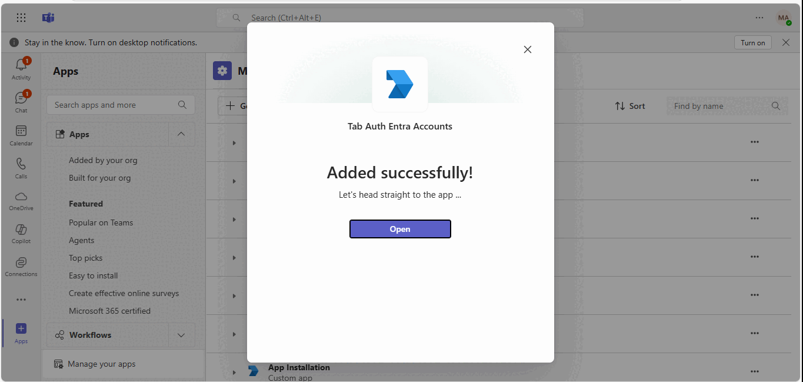
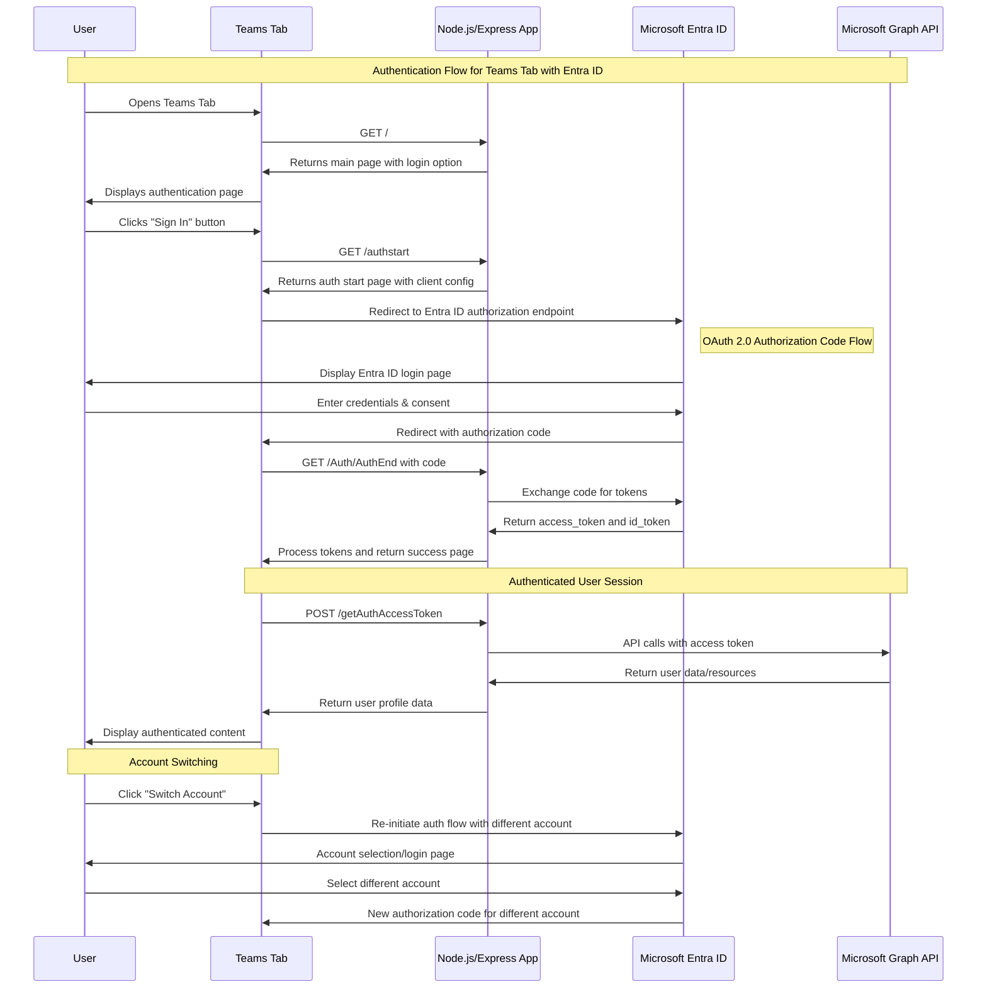
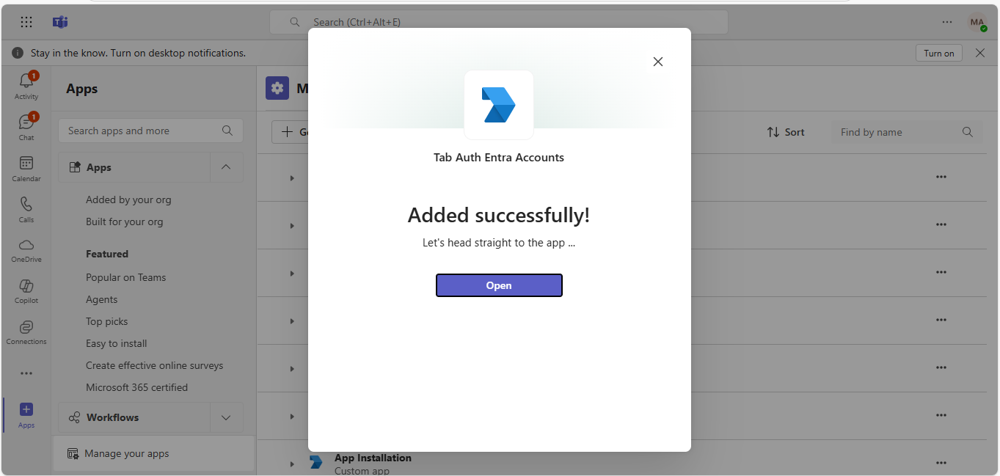
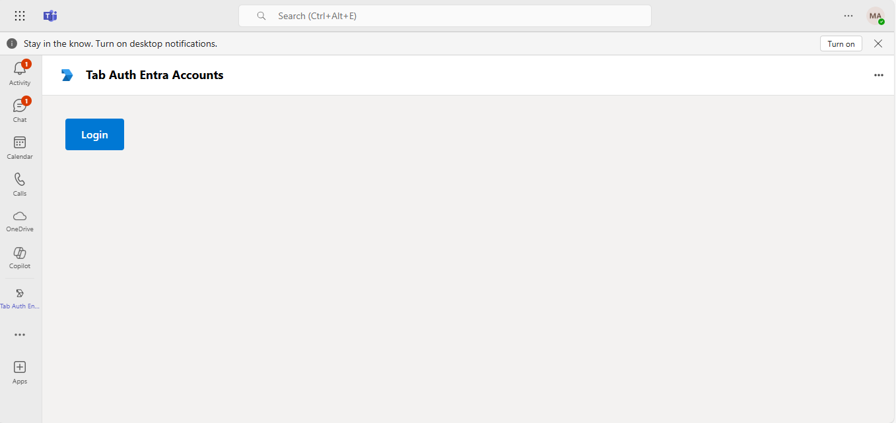
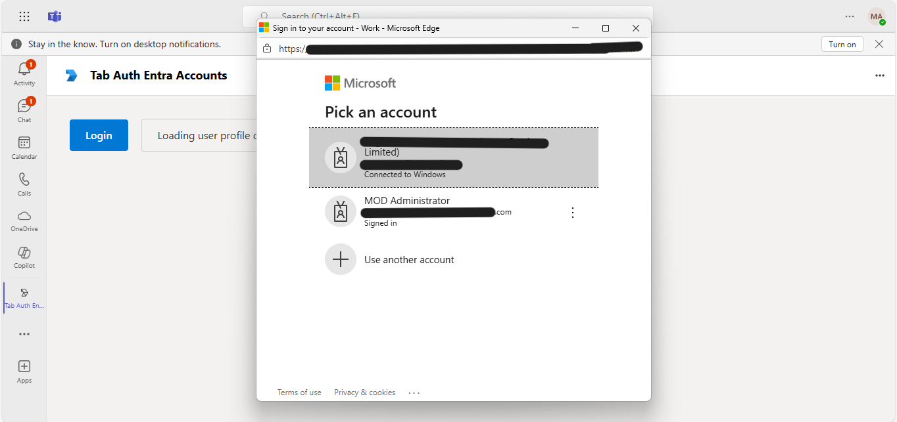
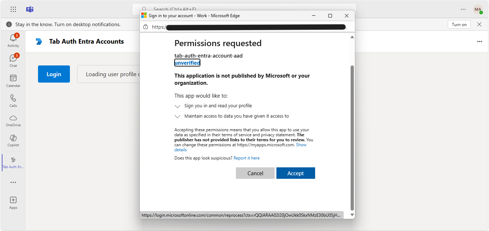
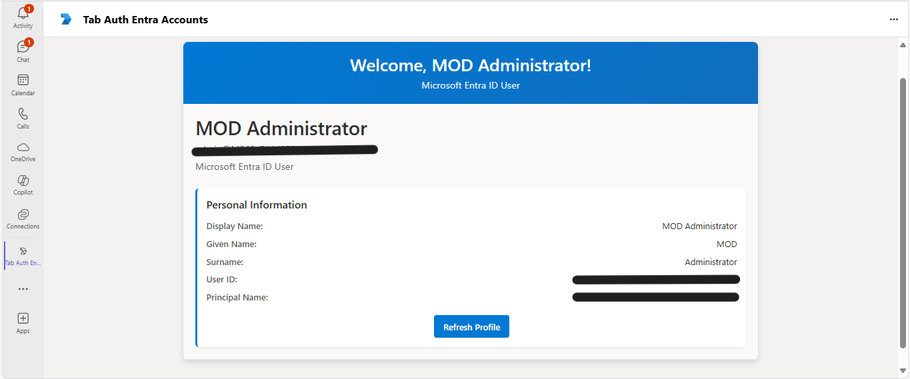

# Sign in using a different Microsoft Entra account - Python

This Microsoft Teams sample app illustrates how to integrate Microsoft Entra ID (Azure AD) authentication in a Teams tab using Python and Flask. It enables users to sign in and switch between different Entra accounts, providing secure and flexible access. The sample showcases best practices for implementing authentication and account switching in Teams tab applications.

## Included Features
* External Auth
* Tabs
* Microsoft Entra ID Integration
* Account Switching
* Cross-platform Support (Teams, Outlook, Office)

## Interaction with app



## Authentication Flow Diagram

The following diagram illustrates the Microsoft Entra ID authentication flow in this Teams tab application:



## Prerequisites

- [Python](https://python.org) version 3.8 or higher

  To determine your Python version:
  ```bash
  python --version
  ```
- [dev tunnel](https://learn.microsoft.com/en-us/azure/developer/dev-tunnels/get-started?tabs=windows) or [Ngrok](https://ngrok.com/download) (For local environment testing) latest version (any other tunneling software can also be used)
  
- [Teams](https://teams.microsoft.com) Microsoft Teams is installed and you have an account

- [Microsoft 365 Agents Toolkit for VS Code](https://learn.microsoft.com/en-us/microsoftteams/platform/toolkit/teams-toolkit-fundamentals)

## Setup
1. Register a new application in the [Microsoft Entra ID – App Registrations](https://go.microsoft.com/fwlink/?linkid=2083908) portal.

  - Select **New Registration** and on the *register an application page*, set following values:
     * Set **name** to your app name.
     * Choose the **supported account types** (any account type will work)
     * Leave **Redirect URI** empty.
     * Choose **Register**.
  - On the overview page, copy and save the **Application (client) ID, Directory (tenant) ID**. You'll need those later when updating your Teams application manifest and in the .env file.
  - Navigate to **Authentication**
    If an app hasn't been granted IT admin consent, users will have to provide consent the first time they use an app.
    Set a redirect URI:
    * Select **Add a platform**.
    * Select **web**.
    * Enter the **redirect URI** for the app in the following format: 
         * https://<your_tunnel_domain>/Auth/AuthEnd
      This will be the page where a successful authorization code flow will redirect the user.
    Enable implicit grant by checking the following boxes:  
    ✔ ID Token  
    ✔ Access Token  
  - Navigate to the **Certificates & secrets**. In the Client secrets section, click on "+ New client secret". Add a description      (Name of the secret) for the secret and select "Never" for Expires. Click "Add". Once the client secret is created, copy its value, it need to be placed in the .env file.

2. Setup Development Tunnel (NGROK or Dev Tunnel)
- Run ngrok - point to port 3978

```bash
   ngrok http 3978 --host-header="localhost:3978"
   ```  

   Alternatively, you can also use the `dev tunnel`. Please follow [Create and host a Dev tunnel](https://learn.microsoft.com/en-us/azure/developer/dev-tunnels/get-started?tabs=windows) and host the tunnel with anonymous user access command as shown below:

   ```bash
   devtunnel host -p 3978 --allow-anonymous
   ```

3. Setup for code

- Clone the repository

    ```bash
    git clone https://github.com/OfficeDev/Microsoft-Teams-Samples.git
    ```

- Navigate to the sample directory
    ```bash
    cd samples/tab-auth-entra-account/python
    ```

- Create and activate a virtual environment (recommended)
    ```bash
    python -m venv .venv
    # On Windows:
    .venv\Scripts\activate
    # On macOS/Linux:
    source .venv/bin/activate
    ```

- Install dependencies
    ```bash
    pip install -r requirements.txt
    ```

- Open `.env` file in the root directory and fill in the following details:
  ```env
  ClientId={{CLIENT_ID_FROM_STEP_1}}
  ClientSecret={{CLIENT_SECRET_FROM_STEP_1}}
  REDIRECT_URI=https://{{YOUR_TUNNEL_DOMAIN}}/Auth/AuthEnd
  PORT=3978
  ```

- Start the application
    ```bash
    python app.py
    ```

4. Setup Manifest for Teams App
    - **Edit** the `appManifest/manifest.json` contained in the ./appManifest folder to replace placeholder `{{BOT_DOMAIN}}` with your tunnel domain. E.g. if you are using ngrok it would be `1234.ngrok-free.app` and if you are using dev tunnel, your domain will be `12345.devtunnels.ms`.
    - **Edit** the `manifest.json` for `validDomains` and replace `{{domain-name}}` with base Url of your domain. E.g. if you are using ngrok it would be `https://1234.ngrok-free.app` then your domain-name will be `1234.ngrok-free.app`. And if you are using dev tunnel, your URL will be https://12345.devtunnels.ms.
    - **Zip** up the contents of the `appManifest` folder to create a `manifest.zip` (Make sure that zip file does not contains any subfolder otherwise you will get error while uploading your .zip package)

- Upload the manifest.zip to Teams (in the Apps view click "Upload a custom app")
   - Go to Microsoft Teams. From the lower left corner, select Apps
   - From the lower left corner, choose Upload a custom App
   - Go to your project directory, the ./appManifest folder, select the zip folder, and choose Open.
   - Select Add in the pop-up dialog box. Your app is uploaded to Teams.
    
## Running the sample

**Note:** 
* **Supported Platforms:**
  - Microsoft Teams – Desktop and Web
  - Microsoft Outlook – Desktop and Web  
  - Microsoft Office – Desktop and Web

* **Not Supported:**
  - Microsoft Teams, Outlook, and Office – Mobile applications

## Microsoft Teams

#### Step 1: Installing the tab authentication app in Microsoft Teams desktop client


#### Step 2: The initial authentication page displayed when accessing the app in Teams


#### Step 3: User selecting their Microsoft Entra ID account for authentication


#### Step 4: User granting permissions to the application


#### Step 5: Successfully authenticated user's profile information displayed in the Teams tab


## Microsoft Outlook

- To view your app in Outlook on the desktop, follow the same authentication flow as demonstrated in the Microsoft Teams section above. The authentication process remains consistent across all Microsoft 365 applications.

## Microsoft Office

- To preview your app running in Office on the desktop, the authentication workflow follows the same pattern as shown in the Microsoft Teams examples above.

## Further Reading

#### Authentication and Microsoft Entra ID
- [External authentication in Microsoft Teams](https://learn.microsoft.com/microsoftteams/platform/tabs/how-to/authentication/auth-oauth-provider#add-authentication-to-external-browsers)
- [Microsoft Entra ID authentication in Teams apps](https://learn.microsoft.com/en-us/microsoftteams/platform/tabs/how-to/authentication/auth-aad-sso)
- [OAuth 2.0 authorization code flow](https://learn.microsoft.com/en-us/azure/active-directory/develop/v2-oauth2-auth-code-flow)

#### Microsoft Teams Development
- [Teams app manifest schema](https://learn.microsoft.com/en-us/microsoftteams/platform/resources/schema/manifest-schema)
- [Teams JavaScript SDK](https://learn.microsoft.com/en-us/microsoftteams/platform/tabs/how-to/using-teams-client-sdk)
- [Teams Toolkit for VS Code](https://learn.microsoft.com/en-us/microsoftteams/platform/toolkit/teams-toolkit-fundamentals)

#### Node.js and Express Development
- [Express.js authentication](https://expressjs.com/en/guide/using-middleware.html)
- [Node.js session management](https://www.npmjs.com/package/express-session)
- [EJS templating engine](https://ejs.co/)
- [Deploy Node.js to Azure App Service](https://learn.microsoft.com/en-us/azure/app-service/quickstart-nodejs)

