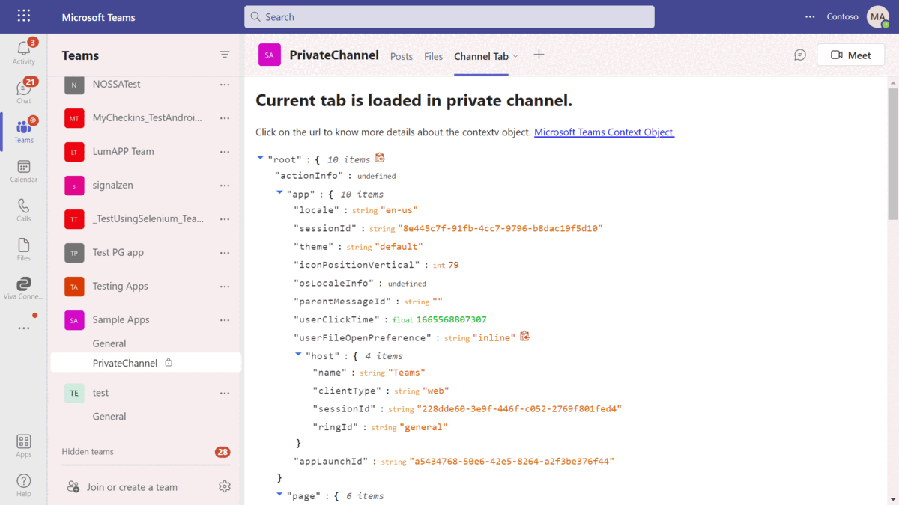
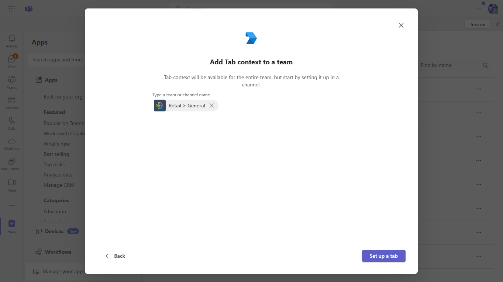
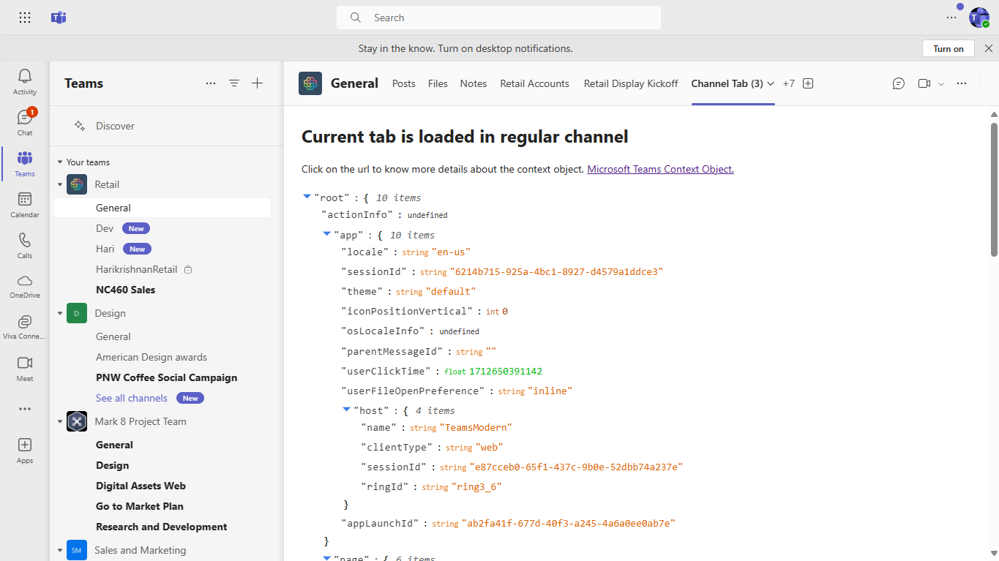
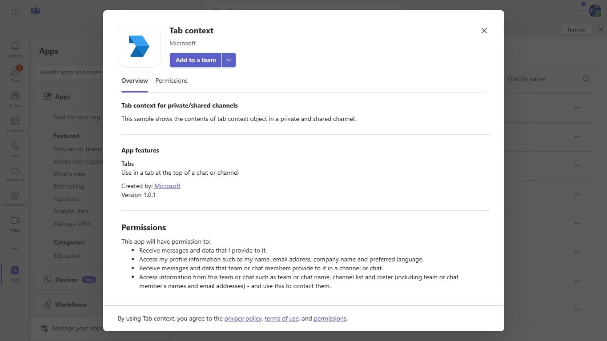
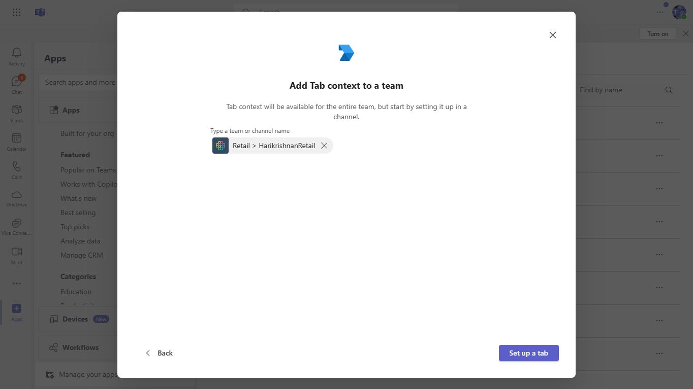
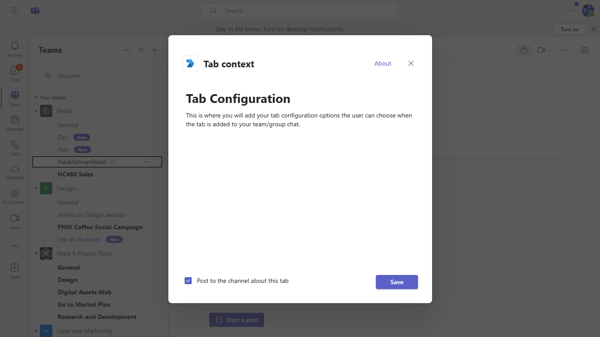
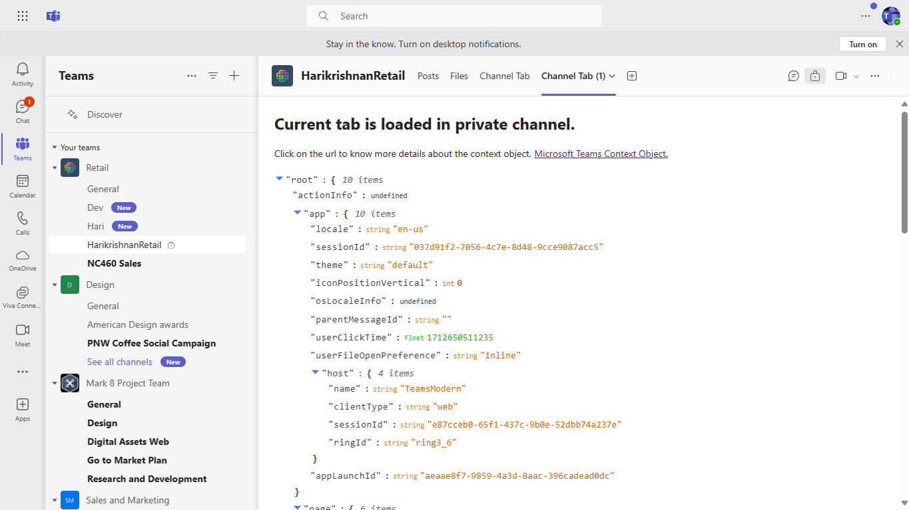

## Prerequisites

- [NodeJS](https://nodejs.org/en/)
- [dev tunnel](https://learn.microsoft.com/en-us/azure/developer/dev-tunnels/get-started?tabs=windows) or [ngrok](https://ngrok.com/) latest version or equivalent tunnelling solution
- [Teams](https://teams.microsoft.com) Microsoft Teams is installed and you have an account
- [Create a private/shared channel](https://support.microsoft.com/en-gb/office/create-a-standard-or-private-channel-in-teams-fda0b75e-5b90-4fb8-8857-7e102b014525) Priave/Shared channel in team
- [Microsoft 365 Agents Toolkit for VS Code](https://marketplace.visualstudio.com/items?itemName=TeamsDevApp.ms-teams-vscode-extension) or [TeamsFx CLI](https://learn.microsoft.com/microsoftteams/platform/toolkit/teamsfx-cli?pivots=version-one)

# Tab context in channel

Explore a sample Microsoft Teams tab application that reveals the contents of the tab context object in both private and shared channels. Designed with Node.js, this application allows users to interact with and manipulate the context object, offering features like JSON expansion and copying for enhanced usability in collaborative environments.

## Included Features
* Tabs

## Run the app (Using Microsoft 365 Agents Toolkit for Visual Studio Code)

The simplest way to run this sample in Teams is to use Microsoft 365 Agents Toolkit for Visual Studio Code.

1. Ensure you have downloaded and installed [Visual Studio Code](https://code.visualstudio.com/docs/setup/setup-overview)
1. Install the [Microsoft 365 Agents Toolkit extension](https://marketplace.visualstudio.com/items?itemName=TeamsDevApp.ms-teams-vscode-extension)
1. Select **File > Open Folder** in VS Code and choose this samples directory from the repo
1. Using the extension, sign in with your Microsoft 365 account where you have permissions to upload custom apps
1. Select **Debug > Start Debugging** or **F5** to run the app in a Teams web client.
1. In the browser that launches, select the **Add** button to install the app to Teams.

> If you do not have permission to upload custom apps (uploading), Microsoft 365 Agents Toolkit will recommend creating and using a Microsoft 365 Developer Program account - a free program to get your own dev environment sandbox that includes Teams.

## Interaction with app



## Setup

1) Setup NGROK
   Run ngrok - point to port 3978

   ```bash
   ngrok http 3978 --host-header="localhost:3978"
   ```  

   Alternatively, you can also use the `dev tunnels`. Please follow [Create and host a dev tunnel](https://learn.microsoft.com/en-us/azure/developer/dev-tunnels/get-started?tabs=windows) and host the tunnel with anonymous user access command as shown below:

   ```bash
   devtunnel host -p 3978 --allow-anonymous
   ```

2) App Registration

### Register your application with Azure AD

1. Register a new application in the [Microsoft Entra ID – App Registrations](https://go.microsoft.com/fwlink/?linkid=2083908) portal.
2. Select **New Registration** and on the *register an application page*, set following values:
    * Set **name** to your app name.
    * Choose the **supported account types** (any account type will work)
    * Leave **Redirect URI** empty.
    * Choose **Register**.
3. On the overview page, copy and save the **Application (client) ID, Directory (tenant) ID**. You'll need those later when updating your Teams application manifest and in the appsettings.json.
4. Navigate to **API Permissions**, and make sure to add the follow permissions:
    * Select Add a permission
    * Select Microsoft Graph -> Delegated permissions.
    * `User.Read` (enabled by default)
    * Click on Add permissions. Please make sure to grant the admin consent for the required permissions.

3) Clone the repository
   ```bash
   git clone https://github.com/OfficeDev/Microsoft-Teams-Samples.git
   ```

4) Install node modules

   Inside node js folder,  navigate to `samples/tab-channel-context/nodejs` open your local terminal and run the below command to install node modules. You can do the same in Visual Studio code terminal by opening the project in Visual Studio code.

    ```bash
    npm install

5) Run the solution from the same path terminal using below command.

    ```
    npm start
    ```

6) Modify the `manifest.json` in the `/appManifest` folder and replace the following details
   - `{{Manifest-id}}` with some unique GUID. Refer [GUID generator](https://guidgenerator.com/)
   - `{{base-url}}` with base Url domain. E.g. if you are using ngrok it would be `https://1234.ngrok-free.app` and if you are using dev tunnels, your URL will be like: https://12345.devtunnels.ms.
   - `<<Domain Name>>` with base Url domain. E.g. if you are using ngrok it would be `https://1234.ngrok-free.app` then your domain-name will be `1234.ngrok-free.app` and if you are using dev tunnels then your domain will be like: `12345.devtunnels.ms`.

7) Zip the contents of `appManifest` folder into a `manifest.zip`, and use the `manifest.zip` to deploy in app store or add to Teams.

8) Upload the manifest.zip to Teams (in the Apps view click "Upload a custom app")
   - Go to Microsoft Teams. From the lower left corner, select Apps
   - From the lower left corner, choose Apps -> Manage your apps -> Upload an app.
   - Go to your project directory, the ./appManifest folder, select the zip folder, and choose Open.
   - Select Add in the pop-up dialog box. Your app is uploaded to Teams.
   
9) Add the tab in private/shared channel.

 **NOTE:** Only accounts with admin access can create private/shared channels in team.

# Running the sample
1) Configure in Regular channel







2) Configure in Private channel









**Features of the sample**

- Add the tab in private/shared channel.
- The details of the context object will be shown on tab based on channel type.
- You can expand/reduce the JSON for the context object and can also copy a particular object slice.

## Further reading

- [Tab Basics](https://docs.microsoft.com/en-us/microsoftteams/platform/tabs/how-to/create-channel-group-tab?pivots=node-java-script)
- [Azure Portal](https://portal.azure.com)
- [Get-context-for-tabs](https://docs.microsoft.com/en-us/microsoftteams/platform/tabs/how-to/access-teams-context#retrieve-context-in-private-channels)
- [Shared Channels](https://docs.microsoft.com/en-us/MicrosoftTeams/shared-channels)
- [Private Channels](https://docs.microsoft.com/en-us/MicrosoftTeams/private-channels)


