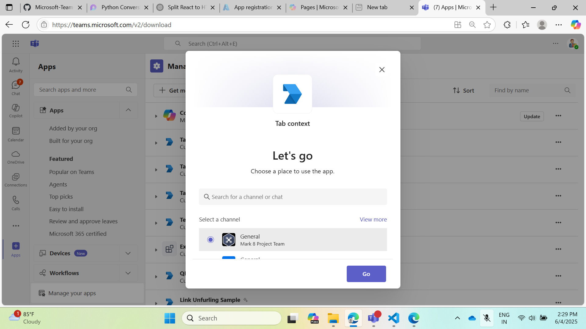
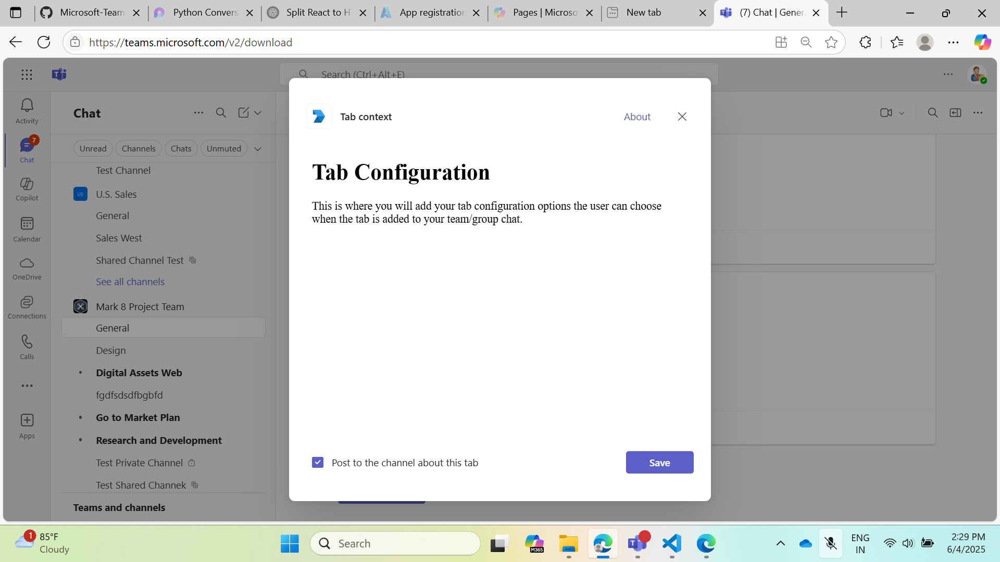
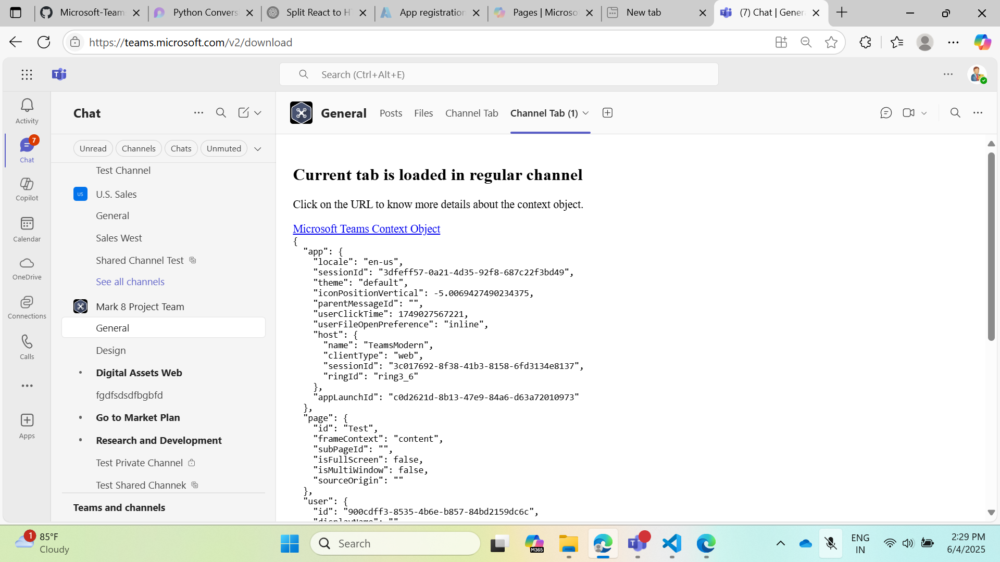

# Microsoft Teams Tab Channel Context Sample (Python)

This sample demonstrates how to build a Microsoft Teams tab using Python (Flask) that reads and displays the channel context. It is a great starting point for developers looking to build Teams tabs that are context-aware.

## Included Features

* Tabs (channel context)
* Teams SDK integration

## Try it yourself - experience the App in your Microsoft Teams client

You can try this sample by uploading the app package (.zip file) to your Teams client as a personal or channel tab. (Sideloading must be enabled for your tenant, [see steps here](https://docs.microsoft.com/microsoftteams/platform/concepts/build-and-test/prepare-your-o365-tenant#enable-custom-teams-apps-and-turn-on-custom-app-uploading)).

**Microsoft Teams Tab Channel Context Sample:** [Manifest](/samples/tab-channel-context/python/appManifest/app-channel-context.zip)

## Prerequisites

- Microsoft Teams is installed and you have an account
- [Python SDK](https://www.python.org/downloads/) min version 3.8
- [dev tunnel](https://learn.microsoft.com/en-us/azure/developer/dev-tunnels/get-started?tabs=windows) or [ngrok](https://ngrok.com/) latest version or equivalent tunneling solution
- [M365 developer account](https://docs.microsoft.com/microsoftteams/platform/concepts/build-and-test/prepare-your-o365-tenant) or access to a Teams account with the appropriate permissions to install an app.
- [Microsoft 365 Agents Toolkit for VS Code](https://marketplace.visualstudio.com/items?itemName=TeamsDevApp.ms-teams-vscode-extension) or [TeamsFx CLI](https://learn.microsoft.com/microsoftteams/platform/toolkit/teamsfx-cli?pivots=version-one)

## Run the app (Using Microsoft 365 Agents Toolkit for Visual Studio Code)

1. Ensure you have downloaded and installed [Visual Studio Code](https://code.visualstudio.com/docs/setup/setup-overview)
2. Install the [Microsoft 365 Agents Toolkit extension](https://marketplace.visualstudio.com/items?itemName=TeamsDevApp.ms-teams-vscode-extension) and [Python Extension](https://marketplace.visualstudio.com/items?itemName=ms-python.python)
3. Select **File > Open Folder** in VS Code and choose this sample's directory from the repo
4. Press **CTRL+Shift+P** and enter **Python: Create Environment** to create and activate your virtual environment. Select `requirements.txt` as dependencies to install.
5. Using the extension, sign in with your Microsoft 365 account where you have permissions to upload custom apps
6. Select **Debug > Start Debugging** or **F5** to run the app in a Teams web client.
7. In the browser that launches, select the **Add** button to install the app to Teams.

> If you do not have permission to upload custom apps (sideloading), Microsoft 365 Agents Toolkit will recommend creating and using a Microsoft 365 Developer Program account.

## Run the app (Manually Uploading to Teams)

> Note: These instructions are for running the sample on your local machine. The tunneling solution is required because Teams needs to call into your tab.

1. Clone the repository

    ```bash
    git clone https://github.com/OfficeDev/Microsoft-Teams-Samples.git
    ```

2. Run ngrok - point to port 3978 (or your Flask port)

    ```bash
    ngrok http 3978 --host-header="localhost:3978"
    ```

    Or use dev tunnels:

    ```bash
    devtunnel host -p 3978 --allow-anonymous
    ```

2) App Registration

### Register your application with Azure AD

1. Register a new application in the [Microsoft Entra ID – App Registrations](https://go.microsoft.com/fwlink/?linkid=2083908) portal.
2. Select **New Registration** and on the *register an application page*, set following values:
    * Set **name** to your app name.
    * Choose the **supported account types** (any account type will work)
    * Leave **Redirect URI** empty.
    * Choose **Register**.
3. On the overview page, copy and save the **Application (client) ID, Directory (tenant) ID**. You'll need those later when updating your Teams application manifest and in the appsettings.json.
4. Navigate to **API Permissions**, and make sure to add the follow permissions:
    * Select Add a permission
    * Select Microsoft Graph -> Delegated permissions.
    * `User.Read` (enabled by default)
    * Click on Add permissions. Please make sure to grant the admin consent for the required permissions.

3. In a terminal, go to `samples/tab-channel-context/python`

4. Activate your desired virtual environment

5. Install dependencies:

    ```bash
    pip install -r requirements.txt
    ```

6. Update the `config.py` file with your Teams app registration details if required.

7. Run your app:

    ```bash
    python app.py
    ```

### Setup Manifest for Teams

- **Edit** the `manifest.json` in the `tab-channel-context/python/appManifest` folder to replace your Microsoft App Id everywhere you see `<<Your Microsoft App Id>>`.
- **Edit** the `manifest.json` for `validDomains`. Replace `{{domain-name}}` with your base URL domain (e.g., `1234.ngrok-free.app` or `12345.devtunnels.ms`).
- **Zip** the contents of the `appManifest` folder to create a `manifest.zip` (do not include subfolders).
- **Upload** the `manifest.zip` to Teams (In Teams Apps/Manage your apps click "Upload an app". Browse to and open the .zip file. Click the Add button).
- Add the app to a channel to test channel context.

## Running the sample

**Add Tab in Channel or Groupchat:**



**Tab in Channel:**





## Deploy the app to Azure

To learn more about deploying a Python web app to Azure, see [Deploy Python apps to Azure App Service](https://learn.microsoft.com/en-us/azure/app-service/quickstart-python?tabs=cmd%2Cbrowser).

## Further reading

- [Teams Tab Documentation](https://learn.microsoft.com/microsoftteams/platform/tabs/what-are-tabs)
- [Teams JavaScript SDK](https://learn.microsoft.com/javascript/api/@microsoft/teams-js/)
- [Bot Framework Documentation](https://docs.botframework.com)
- [Azure Bot Service Documentation](https://docs.microsoft.com/azure/bot-service/?view=azure-bot-service-4.0)

