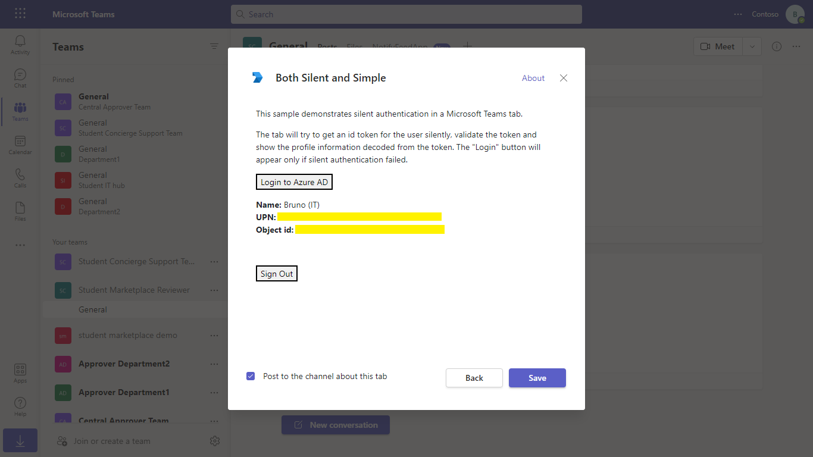
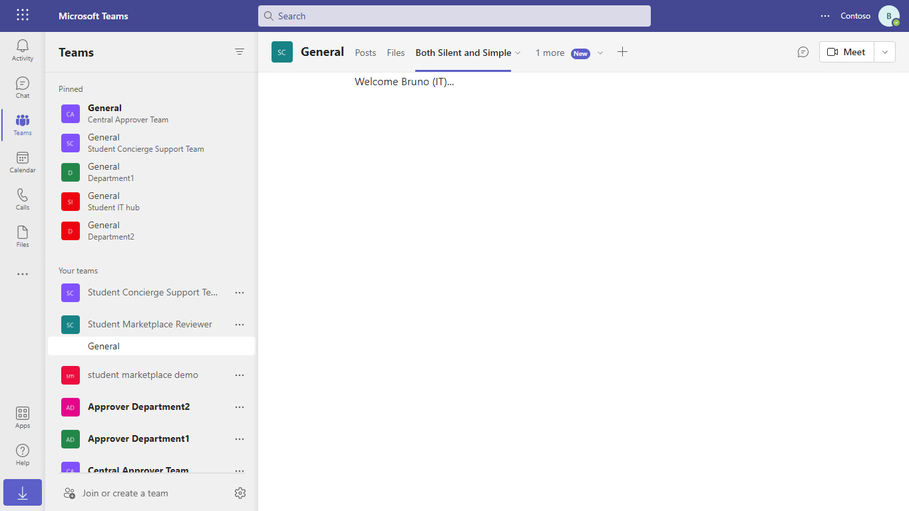

# Config Tab Authentication

## Summary

There are many services that you may wish to consume inside your Teams app, and most of those services require authentication and authorization to get access to the service. Services include Facebook, Twitter, and of course Teams. Users of Teams have user profile information stored in Azure Active Directory (Azure AD) using Microsoft Graph and this article will focus on authentication using Azure AD to get access to this information.

OAuth 2.0 is an open standard for authentication used by Azure AD and many other service providers. Understanding OAuth 2.0 is a prerequisite for working with authentication in Teams and Azure AD. The examples below use the OAuth 2.0 Implicit Grant flow with the goal of eventually reading the user's profile information from Azure AD and Microsoft Graph.

## Interaction with app


## Try it yourself - experience the App in your Microsoft Teams client
Please find below demo manifest which is deployed on Microsoft Azure and you can try it yourself by uploading the app package (.zip file link below) to your teams and/or as a personal app. (Sideloading must be enabled for your tenant, [see steps here](https://docs.microsoft.com/microsoftteams/platform/concepts/build-and-test/prepare-your-o365-tenant#enable-custom-teams-apps-and-turn-on-custom-app-uploading)).

**Config Tab Authentication:** [Manifest](/samples/tab-channel-group-config-page-auth/csharp/demo-manifest/tab-channel-group-config-page-auth.zip)

## Initiate Silent and Simple Authentication ConfigurableTab using AAD

Authentication flow should be triggered by a user action. You should not open the authentication pop-up automatically because this is likely to trigger the browser's pop-up blocker as well as confuse the user.

Add a button to your [configuration](https://docs.microsoft.com/microsoftteams/platform/tabs/how-to/create-tab-pages/configuration-page) or [content](https://docs.microsoft.com/microsoftteams/platform/tabs/how-to/create-tab-pages/content-page) page to enable the user to sign in when needed. This can be done in the tab configuration page or any content page.

Azure AD, like most identity providers, does not allow its content to be placed in an iframe. This means that you will need to add a pop-up page to host the identity provider. In the following example this page is /tab-auth/simple-start. Use the microsoftTeams.authenticate() function of the Microsoft Teams client SDK to launch this page when your button is selected.

## Pre-requisites

- [.NET Core SDK](https://dotnet.microsoft.com/download) version 6.0

  determine dotnet version
  ```bash
  dotnet --version
  ```
- [Ngrok](https://ngrok.com/download) (For local environment testing) Latest (any other tunneling software can also be used)
  
- [Teams](https://teams.microsoft.com) Microsoft Teams is installed and you have an account

## Setup

1. Register a new application in the [Azure Active Directory – App Registrations](https://go.microsoft.com/fwlink/?linkid=2083908) portal.
  - Your tab needs to run as a registered Azure AD application in order to obtain an access token from Azure AD. In this step you'll register the app in your tenant and give Teams   permission to obtain access tokens on its behalf.

  - Create an [AAD application](https://docs.microsoft.com/microsoftteams/platform/tabs/how-to/authentication/auth-aad-sso#1-create-your-aad-application-in-azure) in           Azure. You can do this by visiting the "Azure AD app registration" portal in Azure.

 - Set your application URI to the same URI you've created in Ngrok.
   - Ex: api://contoso.ngrok-free.app/{appId} using the application ID that was assigned to your app
                    
 - Setup a client secret. You will need this when you exchange the token for more API permissions from your backend.
   - Visit Manage > Certificates & secrets
   - Create a new client secret.
          
- Setup your API permissions. This is what your application is allowed to request permission to access.
   - Visit Manage > API Permissions
   - Make sure you have the following Graph permissions enabled: email, offline_access, openid, profile, and User.Read.

- Set Redirect URIs. Navigate to Authentication from left pane.
    - Click on Add Platform select *Web*.
    - Add URI as https://<<BASE-URI>>/SilentAuthEnd it will look like https://contoso.ngrok-free.app/SilentAuthEnd
    - Make sure to check *Access tokens* and *ID tokens* checkbox
    - Add one more URI as https://<<BASE-URI>>/SimpleAuthEnd
    - Again, Click on Add Platform and this time select *Single-page application*
    - Enter URI as https://<<BASE-URI>>/AuthEnd


2. Setup NGROK
- Run ngrok - point to port 3978

```bash
 ngrok http 3978 --host-header="localhost:3978"
```

3. Setup for code

- Clone the repository

    ```bash
    git clone https://github.com/OfficeDev/Microsoft-Teams-Samples.git
    ```
 - Update the `appsettings.json` configuration for the tab to use the <<YOUR-MICROSOFT-APP-ID>> get from the step 1 Mircosoft App Id in TabAuthentication folder update
 
- If you are using Visual Studio
    - Launch Visual Studio
    - File -> Open -> Project/Solution
    - Navigate to `tab-channel-group-config-page-auth` folder
    - Select `TabAuthentication.csproj` file
    - Press `F5` to run the project

4. Setup Manifest for Teams
- __*This step is specific to Teams.*__
    - **Edit** the `manifest.json` contained in the ./Manifest folder to replace your Microsoft App Id (that was created when you registered your app registration earlier) *everywhere* you see the place holder string `{{Microsoft-App-Id}}` (depending on the scenario the Microsoft App Id may occur multiple times in the `manifest.json`)
    - **Edit** the `manifest.json` for `validDomains` and replace `{{domain-name}}` with base Url of your domain. E.g. if you are using ngrok it would be `https://1234.ngrok-free.app` then your domain-name will be `1234.ngrok-free.app`.
  - **Edit** the `manifest.json` for `webApplicationInfo` resource `"api://<<BASE-URI>>/<<YOUR-MICROSOFT-APP-ID>>"` with MicrosoftAppId. E.g. `""api://1235.ngrok-free.app/0000000000-0000000-000000""`.
    - **Zip** up the contents of the `Manifest` folder to create a `manifest.zip` (Make sure that zip file does not contains any subfolder otherwise you will get error while uploading your .zip package)

- Upload the manifest.zip to Teams (in the Apps view click "Upload a custom app")
   - Go to Microsoft Teams. From the lower left corner, select Apps
   - From the lower left corner, choose Upload a custom App
   - Go to your project directory, the ./Manifest folder, select the zip folder, and choose Open.
   - Select Add in the pop-up dialog box. Your app is uploaded to Teams.

5) Run your tab, either from Visual Studio with `F5` or using `dotnet run` in the appropriate folder.

## Running the sample






## Further reading

[Tab-Channel-Group-config-auth](https://learn.microsoft.com/microsoftteams/platform/tabs/how-to/create-channel-group-tab?pivots=node-java-script)

